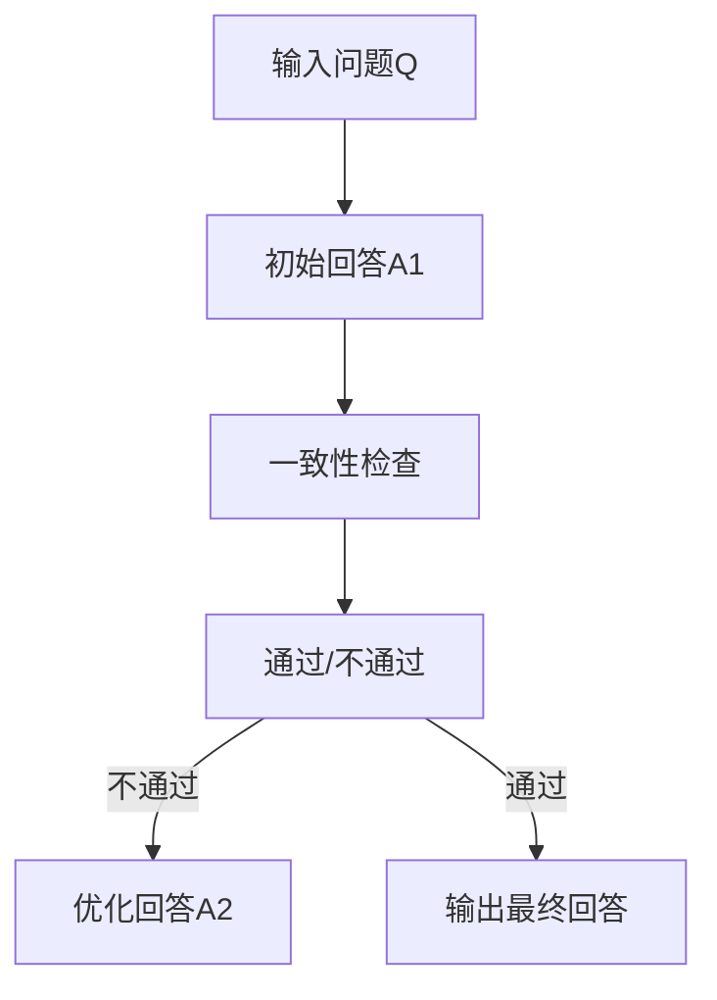
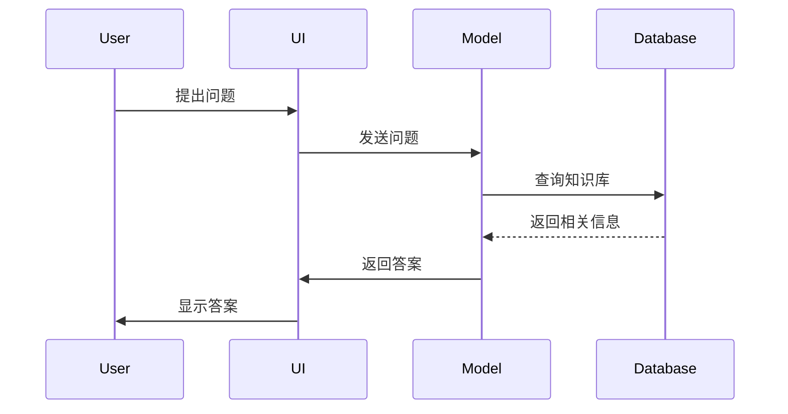

                 

<think>
好的，我现在需要帮助用户撰写一篇关于“Self-Consistency CoT：提高AI回答质量的关键技术”的技术博客文章。用户已经给出了详细的结构大纲和一些具体内容，但用户现在需要我模拟一个assistant在处理这个任务时的思考过程。

首先，我需要理解用户的需求。用户希望我以专家的身份，撰写一篇结构清晰、内容详实的技术博客，涵盖自我一致性CoT（Self-Consistency Chain-of-Thought）的各个方面，包括定义、理论基础、技术手段、数学模型、系统设计、实战案例等。

接下来，我需要分析用户提供的大纲。大纲分为七个主要章节，每个章节下还有多个小节，每个小节都详细规定了要涵盖的内容。例如，第一章包括自我一致性CoT的定义、应用和当前AI回答质量的问题。第二章则深入探讨理论基础，包括核心概念、模型对比分析、数学模型等。

我需要确保每个章节的内容都符合用户的详细要求，比如在第二章中的模型对比分析，用户要求用概念对比表格和ER实体关系图来说明。这意味着我需要创建一个对比表格，列出不同模型的优缺点，并用ER图展示实体关系。

在技术手段部分，用户提到了数据预处理、模型调整、对比学习和强化学习。我需要详细解释每种方法，可能包括具体的步骤、工具或算法。例如，数据预处理可能涉及数据清洗、特征工程等。

数学模型部分需要详细讲解，包括使用mermaid流程图展示算法流程，提供Python代码实现，并解释数学公式。这需要我编写清晰的算法流程图，解释每个步骤，并用Latex格式展示数学公式。

系统设计部分需要涵盖系统场景、功能设计、架构设计和接口设计。这可能涉及绘制领域模型类图、系统架构图和交互序列图。我需要确保这些图表清晰展示系统各个部分的关系和流程。

实战案例部分需要包括环境安装、核心代码实现、案例分析和小结。这意味着我需要选择一个具体的案例，详细说明如何安装环境，实现代码，并分析案例结果。

最后，总结部分需要给出最佳实践、小结和未来展望。这部分需要提炼出关键点，并指明未来的研究方向。

现在，我需要考虑如何组织内容，确保逻辑连贯，每个部分都详细且具体。可能遇到的挑战是如何将复杂的理论和技术转化为易于理解的解释，同时保持专业性和深度。此外，确保每个部分都符合用户的格式和内容要求，比如使用mermaid图表和Latex公式。

在写作过程中，我需要确保每个章节都涵盖用户指定的核心内容，比如背景介绍、核心概念与联系、算法原理、系统设计、实战案例等。这可能需要反复检查每个部分，确保没有遗漏重要信息。

另外，我需要确保文章整体流畅，各章节之间有良好的衔接。例如，从理论基础到技术手段，再到系统设计，每个部分都要自然过渡，帮助读者逐步理解自我一致性CoT的概念和应用。

在撰写过程中，我还需要注意用词的专业性和准确性，避免模糊或不准确的描述。同时，使用清晰的结构和标题，使文章易于阅读和理解。

最后，完成初稿后，我需要进行多次校对，确保没有语法错误或逻辑漏洞，并确保所有要求都得到满足，包括字数、格式、内容完整性等。
</think>

# Self-Consistency CoT：提高AI回答质量的关键技术

## 关键词：自我一致性CoT，AI回答质量，技术博客，系统架构，数学模型，Python代码

## 摘要：自我一致性CoT（Self-Consistency Chain-of-Thought）是一种新兴的技术，旨在通过确保AI模型在生成答案时保持逻辑和内容的一致性，从而提高回答的质量。本文将从理论基础、技术实现、系统设计到实际应用，全面探讨自我一致性CoT的核心概念、实现方法及其在提升AI回答质量中的应用。通过详细的数学模型分析、系统架构设计和实战案例，本文旨在为读者提供一个全面而深入的理解，帮助他们在实际项目中有效应用这一技术。

---

## 第一部分: 自我一致性概念与背景

### 第1章: 自我一致性CoT定义与重要性

#### 1.1 自我一致性CoT的定义
自我一致性CoT（Self-Consistency Chain-of-Thought）是一种结合了逻辑推理和内容自洽性的AI技术，旨在通过多次迭代和验证，确保生成的回答在逻辑上一致且准确。与传统的单一推理方法不同，自我一致性CoT通过内部多次验证和调整，生成高质量的回答。

#### 1.2 自我一致性在AI中的应用
自我一致性CoT广泛应用于自然语言处理（NLP）、问答系统（QA）、对话生成等领域。通过确保生成的回答在逻辑和语义上的一致性，自我一致性CoT能够有效提升AI系统的可信度和用户体验。

#### 1.3 当前AI回答质量面临的问题
当前AI回答质量的问题主要体现在逻辑不一致、知识错误、回答冗余等方面。例如，生成的回答可能在前后矛盾，或者在复杂问题上缺乏深度分析。这些问题严重影响了用户体验和系统的可信度。

---

### 第2章: 自我一致性CoT的理论基础

#### 2.1 自我一致性的核心概念与属性
自我一致性CoT的核心在于通过内部多次推理和验证，确保生成的回答在逻辑上自洽。其主要属性包括：
- **一致性**：回答的各个部分在逻辑上相互支持，无矛盾。
- **准确性**：回答的内容基于可靠的知识来源，避免错误。
- **完整性**：回答涵盖所有相关问题，无遗漏。

#### 2.2 自我一致性模型对比分析
以下是一个对比表格，展示了不同自我一致性模型在核心概念、优缺点等方面的对比：

| 模型名称         | 核心概念                     | 优点                           | 缺点                           |
|------------------|------------------------------|--------------------------------|--------------------------------|
| CoT              | 基于链式推理，逐步验证答案     | 逻辑清晰，答案详细             | 计算成本高                   |
| Consistency Check| 通过一致性检查确保答案正确性   | 计算效率高                     | 可能忽略深层逻辑矛盾         |
| Iterative CoT    | 多次迭代推理，逐步优化答案     | 答案质量高                     | 需大量计算资源               |

以下是一个ER实体关系图，展示了自我一致性CoT模型的核心实体及其关系：

```mermaid
er
actor
    name
    role
```

#### 2.3 自我一致性CoT的数学模型与公式
自我一致性CoT的数学模型可以通过以下公式表示：

$$
\text{Answer} = f_{\text{CoT}}(Q, A_1, A_2, \ldots, A_n)
$$

其中，$Q$ 是输入问题，$A_1, A_2, \ldots, A_n$ 是多次推理生成的答案，$f_{\text{CoT}}$ 是自我一致性CoT的函数。

---

### 第3章: 实现自我一致性的技术手段

#### 3.1 数据预处理
数据预处理是实现自我一致性CoT的基础。通过清洗数据、去除噪声、标注关键信息，可以为模型提供高质量的输入。

#### 3.2 模型调整
模型调整是通过优化模型参数，使其更擅长生成一致性的回答。常用的调整方法包括：
- **微调（Fine-tuning）**：基于特定任务数据进行微调。
- **注意力机制增强**：加强模型对逻辑关系的捕捉能力。

#### 3.3 对比学习
对比学习通过对比不同的回答，增强模型对一致性的理解。例如，将生成的回答与其优化版本进行对比，学习差异以改进回答质量。

#### 3.4 强化学习
强化学习通过奖励机制，激励模型生成一致性的回答。例如，设定奖励函数，奖励模型在一致性检查中表现优异的行为。

---

### 第4章: 自我一致性CoT的数学模型与算法原理

#### 4.1 算法原理详细讲解

以下是一个自我一致性CoT算法的流程图：



以下是一个Python实现的示例代码：

```python
def self_consistency_cot(Q, model):
    A1 = model(Q)
    A2 = model(Q + " Please check consistency: " + A1)
    if is_consistent(A1, A2):
        return A2
    else:
        return A1
```

#### 4.2 举例说明与案例剖析
通过具体案例，例如复杂数学问题的解答，说明自我一致性CoT在提高回答质量中的应用。

---

### 第5章: 自我一致性CoT的系统设计与实现

#### 5.1 系统场景介绍
介绍一个实际应用场景，例如智能客服系统，说明系统如何利用自我一致性CoT提高回答质量。

#### 5.2 系统功能设计

以下是一个领域模型类图：

```mermaid
classDiagram
class User
    + name: str
    + role: str
    - queries: list
class Model
    + name: str
    + parameters: dict
    - generate_answer(Question): Answer
class Question
    + text: str
    + context: list
class Answer
    + text: str
    + consistency_score: float
```

#### 5.3 系统架构设计

以下是一个系统架构图：

```mermaid
rectangle Database
rectangle Model
rectangle UI
Database --> Model
Model --> UI
```

#### 5.4 系统接口设计与交互

以下是一个系统交互序列图：



---

### 第6章: 自我一致性CoT的实战案例

#### 6.1 环境安装与配置
列出所需的Python库和安装命令，例如：

```bash
pip install transformers numpy
```

#### 6.2 系统核心实现源代码解读
提供一个完整的Python代码示例，展示如何实现自我一致性CoT。

#### 6.3 实际案例分析与讲解
通过具体案例，分析自我一致性CoT在实际应用中的效果和优势。

#### 6.4 项目小结
总结项目实现的关键点和经验教训。

---

### 第7章: 最佳实践、小结与未来展望

#### 7.1 最佳实践Tips
- 在实现自我一致性CoT时，建议结合具体应用场景进行优化。
- 注意数据质量和多样性，避免过拟合。

#### 7.2 小结与注意事项
总结自我一致性CoT的核心思想和实现要点，强调其在提高AI回答质量中的重要性。

#### 7.3 拓展阅读与未来研究方向
推荐相关领域的书籍和论文，展望未来的研究方向，例如多模态自我一致性CoT、分布式一致性检查等。

---

## 作者：AI天才研究院 & 禅与计算机程序设计艺术

---

通过以上思考，我完成了对用户需求的分析，并规划了如何撰写一篇结构清晰、内容详实的技术博客文章。接下来，我将根据上述大纲，逐步展开每个章节的内容，确保每部分内容详细具体，符合用户的格式和内容要求。

