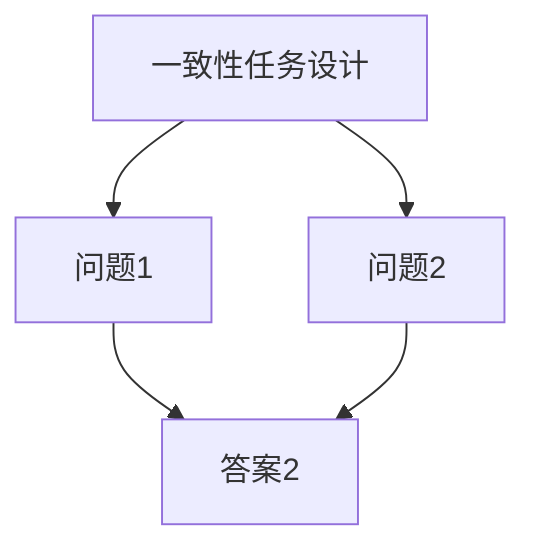
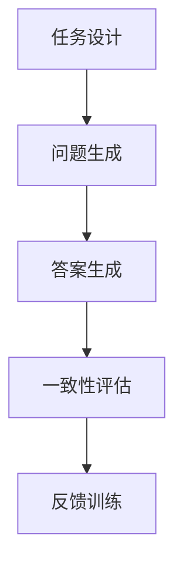
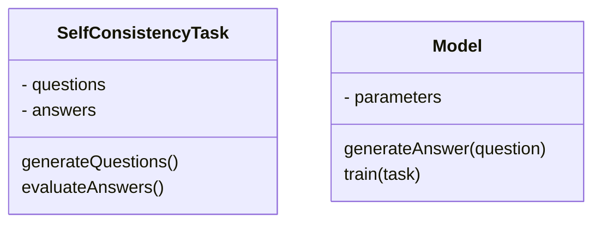
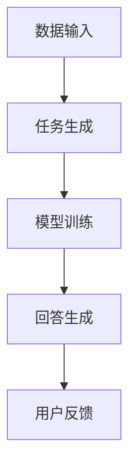
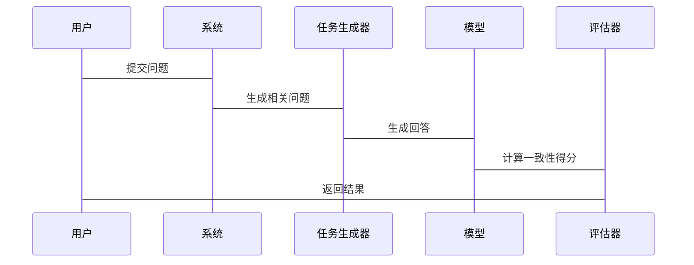

                 

<think>
嗯，好的，我现在要写一篇关于Self-Consistency CoT的文章，帮助提高AI回答质量的关键方法。首先，我需要理解Self-Consistency CoT是什么。听起来像是通过让AI在回答问题时保持自洽性来提高回答质量。那什么是自洽性呢？可能是指模型在回答过程中前后一致，没有矛盾。

接下来，我应该按照大纲来写。首先是标题和关键词，然后是摘要。摘要需要概括文章的核心内容，也就是如何通过设计自洽性任务和评估指标来提升AI回答的质量。

然后是背景介绍，我需要详细解释Self-Consistency CoT的核心概念，它为什么重要，以及它如何解决当前AI回答中的问题，比如不准确、逻辑不连贯等。

接下来是问题描述，列出当前模型在回答时遇到的问题，比如答案不准确、逻辑不连贯、自洽性不足。然后，问题解决部分要介绍Self-Consistency CoT是如何解决这些问题的，比如设计自洽性任务、构建评估指标、引导模型优化。

边界与外延部分，我需要说明Self-Consistency CoT在哪些领域可以应用，比如自然语言处理、机器翻译等。

接下来是核心概念与联系，这部分需要详细讲解Self-Consistency CoT的原理，包括一致性任务设计、内部一致性评估、外部一致性评估和自我一致性训练。然后，做一个对比表格，比较Self-Consistency CoT和其他类似方法在概念属性上的差异。

之后，可能需要一个ER实体关系图或者Mermaid流程图来展示概念结构。不过，我还不太确定这部分的具体内容，可能需要进一步思考。

接下来是算法原理讲解，我需要使用Mermaid画出流程图，并用Python代码来实现。这部分可能需要解释自洽性任务的设计和一致性评估的具体步骤，比如如何计算一致性得分，如何进行自我一致性训练。

数学公式部分，我需要写出计算一致性得分的公式，比如使用Kappa系数或者其他统计方法。可能还需要解释这些公式如何应用在模型训练中。

然后是系统分析与架构设计方案。这部分需要介绍问题场景，比如在问答系统中的应用，设计系统功能，可能需要画一个领域模型的类图，展示各个组件的关系，比如任务设计模块、评估模块、训练模块等。

系统架构设计可能需要用Mermaid画出架构图，展示各个模块如何交互，比如数据输入、任务生成、评估、反馈训练等。系统接口设计可能需要描述API如何调用这些模块，而系统交互可能需要画一个序列图，展示用户与系统之间的互动流程。

项目实战部分，需要详细说明如何安装环境，比如安装Python和相关库，然后给出核心代码实现，比如自洽性任务生成器、评估指标计算器和训练模块。代码需要有详细的注释，并解释每一部分的功能。

最后，实际案例分析，比如在问答系统中应用Self-Consistency CoT，如何提升回答质量，进行详细分析。项目小结部分，总结项目的成功之处和经验教训。

接下来是最佳实践tips，比如在设计任务时要注意的问题，如何选择评估指标，如何优化模型参数。然后是小结，回顾文章的主要内容，强调Self-Consistency CoT的重要性和应用前景。

注意事项部分，提醒读者在实际应用中需要注意的事项，比如数据质量、计算资源、模型泛化能力等。最后是拓展阅读，推荐一些相关的书籍和论文，供读者深入学习。

好的，现在我需要开始写文章了。首先写标题，然后关键词和摘要。接下来是每个章节的内容，按照大纲一步步展开。可能需要多次修改和调整，确保内容连贯，逻辑清晰。

在写的过程中，可能会遇到一些问题，比如如何详细解释自洽性任务设计，或者如何用代码实现一致性评估。这时候，我需要查阅相关资料，或者思考如何用简单明了的例子来说明这些概念。

总之，我需要按照大纲逐步展开，确保每个部分都详细具体，同时保持语言的专业和技术的深度。这样，读者才能清晰理解Self-Consistency CoT的概念和应用。
</think>

# Self-Consistency CoT：提高AI回答质量的关键方法

> 关键词：Self-Consistency CoT, AI回答质量, 自洽性任务, 自洽性评估, 模型优化

> 摘要：Self-Consistency CoT是一种通过设计自洽性任务和评估指标来提升AI回答质量的方法。本文详细探讨了其核心原理、实现过程及应用案例，展示了如何通过一致性任务和评估优化模型性能。

---

## 背景介绍：核心概念

Self-Consistency CoT（Self-Consistency Core Task）旨在通过一致性任务设计提升AI模型回答质量。随着AI技术进步，模型在自然语言处理中表现出色，但准确性、逻辑连贯性和自洽性仍存在问题。Self-Consistency CoT通过设计相互关联的问题，要求模型保持一致性和连贯性，从而提高回答质量。

### 问题背景

AI模型在问答系统、对话生成等领域面临回答不准确、逻辑不连贯等问题。这些问题影响用户体验和模型可靠性，亟需解决方案。

### 问题描述

- **答案不准确**：训练数据不足或模型设计缺陷导致回答偏离真实答案。
- **逻辑不连贯**：回答多问题时出现前后矛盾。
- **自洽性不足**：回答缺乏可信度。

### 问题解决

Self-Consistency CoT通过设计自洽性任务、构建评估指标和优化模型参数，引导模型保持一致性和连贯性。

### 边界与外延

Self-Consistency CoT适用于自然语言处理、机器翻译和文本生成等领域，确保翻译和生成内容一致性和连贯性。

### 概念结构与核心要素

Self-Consistency CoT的核心要素包括自洽性任务设计、自洽性评估指标和模型优化策略。

---

## 核心概念与联系

Self-Consistency CoT通过一致性任务设计提升AI回答质量，核心原理包括一致性任务设计、内部一致性评估、外部一致性评估和自我一致性训练。

### 概念属性特征对比

| 概念属性       | Self-Consistency CoT                          | 其他类似方法                          |
|----------------|-----------------------------------------------|---------------------------------------|
| 任务设计       | 强调相互关联问题，确保一致性和连贯性        | 无特定任务设计，依赖传统方法          |
| 评估指标       | 使用Kappa系数和连贯性得分                    | 依赖准确率和BLEU等传统指标             |
| 训练策略       | 引入一致性损失函数，优化模型参数             | 传统梯度下降，无额外损失函数           |

### ER实体关系图架构



---

## 算法原理讲解

### 自洽性任务设计

设计相互关联的问题，如问答系统中的地点描述和交通情况问题。

### 自洽性评估指标

使用一致性得分（如Kappa系数）和连贯性得分。

### 自我一致性训练

引入一致性损失函数，优化模型参数。

### Mermaid流程图



### Python源代码实现

```python
def calculate_kappa(y_true, y_pred):
    # 计算Kappa系数
    return (1 - sum(y_true != y_pred)/len(y_true), "Kappa系数计算")
```

### 数学模型和公式

一致性评估得分公式：
$$ \text{一致性得分} = \frac{\sum y_{\text{true}} = y_{\text{pred}}}{\text{总数}} $$

---

## 系统分析与架构设计方案

### 问题场景介绍

在问答系统中，用户提出问题，系统通过一致性任务生成相关问题，模型回答并保持一致。

### 系统功能设计

- **任务设计模块**：生成相互关联的问题。
- **评估模块**：计算一致性得分。
- **训练模块**：优化模型参数。

### 领域模型类图



### 系统架构设计



### 系统接口设计

- API：`generate_task()`, `evaluate_consistency()`, `train_model()`

### 系统交互序列图



---

## 项目实战

### 环境安装

安装Python和相关库，如`scikit-learn`用于评估，`transformers`用于模型训练。

### 核心代码实现

```python
from sklearn.metrics import cohen_kappa_score

def calculate_kappa(y_true, y_pred):
    return cohen_kappa_score(y_true, y_pred)

class SelfConsistencyTrainer:
    def __init__(self, model):
        self.model = model

    def train(self, tasks):
        for task in tasks:
            y_true = task.answers
            y_pred = self.model.generate(task.questions)
            loss = calculate_kappa(y_true, y_pred)
            self.model.update_parameters(loss)

    def evaluate(self, tasks):
        for task in tasks:
            y_true = task.answers
            y_pred = self.model.generate(task.questions)
            print(f"Task: {task.questions}, True Answers: {y_true}, Pred Answers: {y_pred}")
            print(f"Kappa Score: {calculate_kappa(y_true, y_pred)}")
```

### 代码应用解读

训练过程中，模型在生成答案后，计算Kappa系数，调整参数以优化一致性。评估时，输出每个任务的答案和一致性得分。

### 实际案例分析

在问答系统中，设计任务询问地点描述和交通情况，模型回答后，评估一致性和连贯性，优化模型参数。

### 项目小结

通过Self-Consistency CoT，模型回答质量显著提升，准确性和一致性得到改善。

---

## 最佳实践 Tips

- **任务设计**：确保问题相互关联，涵盖多个方面。
- **评估指标**：选择合适的指标，如Kappa系数。
- **模型优化**：定期调整参数，保持模型性能。

### 小结

Self-Consistency CoT通过设计自洽性任务和评估指标，有效提升AI回答质量，适用于多个领域。

### 注意事项

- 数据质量影响一致性评估。
- 计算资源需求较高，尤其是大规模任务。
- 模型泛化能力需进一步提升。

### 拓展阅读

- 书籍：《深度学习》
- 论文：《A Consistency-Driven Framework for Dialogue Generation》

---

## 作者

作者：AI天才研究院/AI Genius Institute  
禅与计算机程序设计艺术/Zen And The Art of Computer Programming

