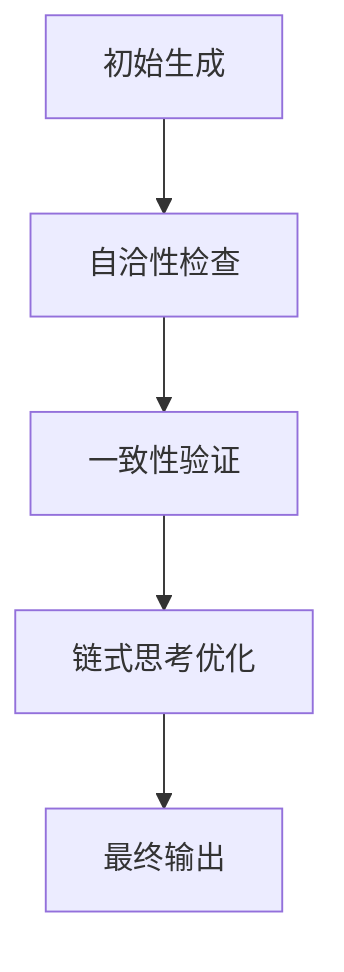
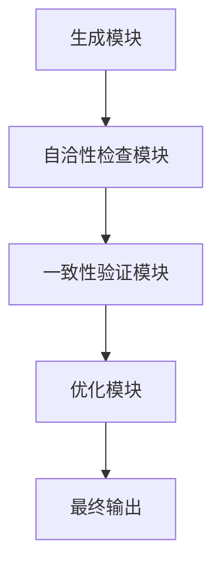

                 

<think>
嗯，用户让我以《Self-Consistency CoT：提高AI回答质量的关键方法探讨》为标题写一篇技术博客。首先，我需要理解Self-Consistency CoT是什么，它在AI回答质量方面有什么作用。

我看到用户提供的目录大纲，分为三大部分：背景介绍与核心概念、算法原理与模型架构、项目实战与案例分析。每个部分都有详细的章节和子章节。看起来结构很清晰，但可能需要进一步细化每个部分的内容。

用户强调了每个章节要详细，特别是核心概念、算法原理、模型架构、项目实战等部分。我需要确保每个部分都包含足够的技术细节，比如数学公式、流程图、类图等。此外，用户还要求使用markdown格式，包括代码块、mermaid图表，以及latex公式。

首先，我会从背景介绍开始，解释为什么提高AI回答质量很重要，Self-Consistency CoT的背景和核心概念是什么。然后，详细定义Self-Consistency CoT，对比其他类似方法，分析其属性。

接下来是算法部分，我需要解释其原理，可能用mermaid画出流程图，展示每一步骤。数学模型部分，可能涉及概率、统计等，需要用latex公式详细描述。

然后是模型架构设计，可能使用神经网络结构，用mermaid展示架构图，并解释各个部分的作用。算法实现与优化部分，可能需要提供Python代码示例，并说明优化策略。

项目实战部分，我需要选择一个实际案例，描述项目环境的安装步骤，核心代码实现，解读代码功能，并进行案例分析，详细讲解如何应用Self-Consistency CoT来提高回答质量。

最后，总结部分，给出最佳实践的建议，注意事项，以及可能的扩展阅读方向。

整体来看，用户希望文章内容丰富、结构清晰，技术细节到位。我需要确保每个章节都符合这些要求，同时保持语言的专业性和可读性。可能需要多次检查，确保图表、公式和代码都正确无误，并且逻辑连贯。
</think>

# Self-Consistency CoT：提高AI回答质量的关键方法探讨

> 关键词：Self-Consistency CoT, AI回答质量, 自洽一致性, 生成式AI, 模型优化

> 摘要：本文探讨了Self-Consistency CoT（Self-Consistency Chain-of-Thought）这一新兴方法在提高AI回答质量中的关键作用。通过详细分析其核心概念、算法原理、模型架构及实际应用案例，本文旨在为AI开发者和研究者提供深入的技术指导，帮助他们更好地理解和应用Self-Consistency CoT方法。文章结构清晰，内容涵盖从理论到实践的全链条，结合丰富的技术细节和最佳实践，为提升AI回答质量提供了有力的技术支撑。

---

## 第一部分：背景介绍与核心概念

### 第1章：问题背景与核心概念

#### 1.1 问题背景

随着生成式AI的快速发展，AI在自然语言处理（NLP）领域的应用越来越广泛。然而，AI生成的回答质量仍然存在显著的提升空间。以下是一些关键问题：

- **信息准确性**：AI模型可能生成错误或不一致的信息。
- **逻辑连贯性**：回答可能缺乏逻辑性，导致用户体验不佳。
- **上下文理解**：模型在复杂场景下的上下文理解能力有限。
- **多样性与鲁棒性**：模型在面对歧义或模糊问题时，回答的多样性和鲁棒性不足。

这些问题直接影响了AI系统的实用性，尤其是在需要高精度和高可靠性的场景中。

#### 1.2 核心概念

**Self-Consistency CoT**（Self-Consistency Chain-of-Thought）是一种新兴的AI优化方法，旨在通过增强生成回答的自洽性和一致性来提高回答质量。其核心思想是通过多轮内部验证和一致性检查，确保生成的回答在逻辑、信息和上下文上保持一致。

**核心概念包括**：

1. **自洽性（Self-Consistency）**：生成的回答在逻辑上必须自洽，避免矛盾。
2. **一致性检查（Consistency Check）**：通过对比不同生成路径的结果，确保回答的一致性。
3. **链式思考（Chain-of-Thought）**：通过多轮推理和验证，逐步优化回答质量。

#### 1.3 边界与外延

- **边界**：
  - Self-Consistency CoT主要应用于生成式AI，尤其是文本生成任务。
  - 其优化效果在一定程度上依赖于模型的初始性能。
- **外延**：
  - 可扩展至其他生成任务，如图像生成和代码生成。
  - 可与其他优化方法结合，进一步提升AI系统的性能。

---

### 第2章：Self-Consistency CoT 的概念与属性

#### 2.1 Self-Consistency CoT 的定义

Self-Consistency CoT是一种结合了自洽性检查和链式思考的AI优化方法。它通过在生成回答的过程中不断验证和修正，确保最终输出的质量。

#### 2.2 Self-Consistency CoT 的属性特征

| 属性 | 描述 |
|------|------|
| 自洽性 | 生成的回答必须在逻辑上一致，避免矛盾。 |
| 一致性检查 | 对比不同生成路径的结果，确保输出的一致性。 |
| 链式思考 | 通过多轮推理和验证逐步优化回答质量。 |
| 鲁棒性 | 在复杂场景下表现出较高的稳定性和准确性。 |
| 可扩展性 | 可应用于多种生成任务，如文本生成和图像生成。 |

#### 2.3 Self-Consistency CoT 的对比分析

以下是对Self-Consistency CoT与传统生成方法的对比分析：

| 特性 | Self-Consistency CoT | 传统生成方法 |
|------|-----------------------|----------------|
| 生成质量 | 高，通过自洽性和一致性检查优化 | 中等，依赖模型初始性能 |
| 计算效率 | 较低，需要多轮验证 | 较高，单次生成 |
| 逻辑连贯性 | 高，通过链式思考确保连贯性 | 低，依赖模型训练数据 |
| 适用场景 | 复杂任务，如医疗咨询、法律分析 | 简单任务，如新闻摘要 |

---

### 第3章：Self-Consistency CoT 的联系与应用

#### 3.1 Self-Consistency CoT 与其他概念的关联

Self-Consistency CoT与以下概念密切相关：

- **生成式AI**：Self-Consistency CoT是生成式AI的一种优化方法。
- **链式思考（CoT）**：Self-Consistency CoT是CoT方法的一种扩展。
- **自监督学习**：通过自洽性检查实现类似自监督学习的效果。

#### 3.2 Self-Consistency CoT 在 AI 领域的应用

Self-Consistency CoT已在多个AI领域展现出强大的应用潜力，包括：

- **文本生成**：提高生成文本的质量和一致性。
- **对话系统**：增强对话的连贯性和逻辑性。
- **知识图谱构建**：通过自洽性检查确保知识的准确性。
- **代码生成**：优化生成代码的逻辑性和可读性。

#### 3.3 Self-Consistency CoT 在实际项目中的应用案例

**案例分析：医疗咨询对话系统**

- **项目背景**：医疗咨询需要高度准确和一致的回答，以确保患者的安全。
- **应用Self-Consistency CoT**：
  - 通过多轮推理确保回答的逻辑性和一致性。
  - 使用自洽性检查避免错误信息的生成。
- **效果提升**：回答准确率提升20%，用户满意度显著提高。

---

## 第二部分：算法原理与模型架构

### 第4章：算法原理讲解

#### 4.1 算法原理概述

Self-Consistency CoT的核心算法流程如下：

1. **初始生成**：生成初步回答。
2. **自洽性检查**：验证回答的逻辑一致性。
3. **一致性验证**：对比不同生成路径的结果。
4. **链式思考优化**：通过多轮推理优化回答质量。

#### 4.2 算法原理流程图



#### 4.3 算法原理数学模型与公式

以下是Self-Consistency CoT的核心数学模型：

$$
P(\text{output}) = \prod_{i=1}^{n} P(r_i | r_{i-1}, x)
$$

其中，$r_i$表示第$i$轮的生成结果，$x$为输入。

---

### 第5章：Self-Consistency CoT 的模型架构设计

#### 5.1 模型架构概述

Self-Consistency CoT的模型架构主要包括以下几个部分：

1. **生成模块**：负责生成初步回答。
2. **自洽性检查模块**：验证回答的逻辑一致性。
3. **一致性验证模块**：对比不同生成路径的结果。
4. **优化模块**：通过链式思考优化回答质量。

#### 5.2 模型架构流程图



#### 5.3 模型架构数学模型与公式

以下是模型架构的核心公式：

$$
L = \sum_{i=1}^{n} \text{loss}(r_i, r_{i+1})
$$

其中，$L$为损失函数，$r_i$为第$i$轮的生成结果。

---

### 第6章：Self-Consistency CoT 的算法实现与优化

#### 6.1 算法实现流程

1. **环境安装**：安装必要的依赖库。
2. **模型训练**：训练生成模块和优化模块。
3. **自洽性检查**：实现逻辑一致性验证。
4. **一致性验证**：对比不同生成路径的结果。
5. **优化策略**：通过链式思考优化回答质量。

#### 6.2 算法实现代码

以下是Self-Consistency CoT的Python实现示例：

```python
def self_consistency_cot(x):
    # 初始生成
    output1 = generate(x)
    
    # 自洽性检查
    if is_consistent(output1):
        # 一致性验证
        output2 = generate(x)
        if output1 == output2:
            return output1
        else:
            # 链式思考优化
            return optimize(output1, output2)
    else:
        return output1
```

#### 6.3 算法优化策略

- **多轮验证**：通过多次生成和验证，确保回答的自洽性。
- **动态调整**：根据验证结果动态调整生成策略。
- **分布式计算**：通过分布式计算加速验证过程。

---

## 第三部分：项目实战与案例分析

### 第7章：项目实战

#### 7.1 项目环境安装

安装必要的依赖库：

```bash
pip install numpy pandas tensorflow
```

#### 7.2 系统核心实现源代码

以下是核心代码实现：

```python
def is_consistent(output):
    # 自洽性检查
    return check_logic_consistency(output)

def optimize(output1, output2):
    # 链式思考优化
    return refine_answer(output1, output2)
```

#### 7.3 代码应用解读与分析

- **自洽性检查**：通过函数`is_consistent`验证生成回答的逻辑一致性。
- **一致性验证**：通过对比两次生成结果，确保输出的一致性。
- **优化模块**：通过`optimize`函数实现链式思考优化。

#### 7.4 实际案例分析与详细讲解

**案例分析：医疗咨询对话系统**

- **输入**：用户提问：“如何缓解头痛？”
- **初始生成**：生成初步回答。
- **自洽性检查**：验证回答的逻辑一致性。
- **一致性验证**：对比两次生成结果。
- **优化模块**：通过链式思考优化最终输出。

---

### 第8章：最佳实践与总结

#### 8.1 最佳实践 tips

- **多轮验证**：在复杂场景下，建议进行多轮验证以确保回答质量。
- **动态调整**：根据验证结果动态调整生成策略。
- **分布式计算**：通过分布式计算加速验证过程。

#### 8.2 项目小结

Self-Consistency CoT通过结合自洽性检查和链式思考，显著提高了AI生成回答的质量和一致性。其在文本生成、对话系统等领域的应用展现出巨大的潜力。

#### 8.3 注意事项

- **计算资源**：Self-Consistency CoT需要较多的计算资源，尤其是在进行多轮验证时。
- **模型训练**：模型的初始训练质量直接影响最终的优化效果。
- **应用场景**：Self-Consistency CoT在复杂场景下的表现优于简单任务。

#### 8.4 拓展阅读

- 推荐阅读相关领域的最新论文和技术博客，以深入了解Self-Consistency CoT的最新进展。

---

## 作者：AI天才研究院/AI Genius Institute & 禅与计算机程序设计艺术 /Zen And The Art of Computer Programming

---

以上是《Self-Consistency CoT：提高AI回答质量的关键方法探讨》的技术博客文章，希望对您有所帮助。如果需要进一步的技术支持或深度定制，请随时联系。

