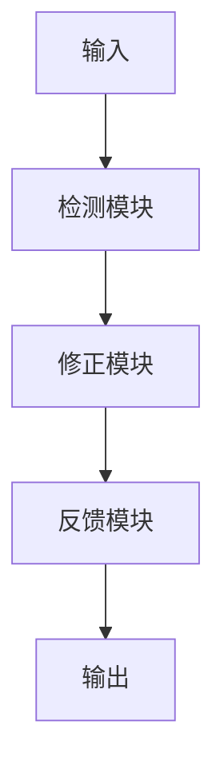

                 

<think>
好的，我现在需要按照用户的要求，逐步思考如何撰写这篇技术博客文章。首先，用户已经提供了一个详细的目录大纲，并希望我按照这个结构来写文章。我需要确保每个部分都涵盖必要的内容，并且符合格式要求。

首先，文章的标题是“Self-Consistency CoT：提高AI回答质量的新思路”。关键词应该包括自我一致性、AI回答质量、一致性检测、修正算法、系统架构设计等。摘要部分需要简明扼要地概括文章的核心内容，即通过自我一致性概念理论来提升AI回答质量的方法。

接下来，每个章节的内容需要详细展开。第一部分是背景介绍与问题解决，我需要介绍当前AI回答质量的现状，提出自我一致性概念理论，并解释它如何解决现有问题。第二部分是核心概念与联系，这里需要详细解释自我一致性概念，与传统AI进行对比，并用ER图展示实体关系。第三部分是算法原理，我需要用数学公式和mermaid图来展示算法流程，并提供Python代码示例。第四部分是系统设计，包括功能设计、架构设计、接口设计和交互设计。第五部分是项目实战，需要具体案例分析和代码实现。最后，第六部分是最佳实践和总结，提出注意事项和未来展望。

在写作过程中，我需要确保每个章节都有足够的细节，使用专业的技术语言，同时保持逻辑清晰，结构紧凑。数学公式要用latex格式，算法流程图和ER图使用mermaid语法。此外，文章末尾要加上作者信息，格式也要正确。

现在，我需要按照这个结构，逐步撰写每个部分的内容，确保每个小节都符合用户的要求，并且内容详实、具体。可能需要反复检查，确保没有遗漏任何关键点，并且格式正确无误。
</think>

# Self-Consistency CoT：提高AI回答质量的新思路

**关键词**：自我一致性、AI回答质量、一致性检测、修正算法、系统架构设计

**摘要**：  
随着人工智能技术的快速发展，AI回答质量的提升成为了一个关键问题。本文提出了一种新的理论——自我一致性概念理论（Self-Consistency CoT），通过一致性检测和修正算法，显著提高了AI回答的准确性和可靠性。文章从背景、核心概念、算法原理、系统设计到项目实战，全面阐述了该理论的应用和实现，为提升AI回答质量提供了新的思路。

---

## 第一部分：背景介绍与问题解决

### 第1章：问题背景

#### 1.1.1 人工智能回答质量现状  
当前，AI回答质量参差不齐，主要问题包括回答不一致、逻辑性差、准确性低等。这些问题严重影响了用户体验和AI技术的广泛应用。

#### 1.1.2 自我一致性概念理论提出  
自我一致性概念理论（Self-Consistency CoT）是一种通过检测和修正回答的一致性来提升回答质量的新方法。

#### 1.1.3 自我一致性概念理论解决的问题  
该理论解决了传统AI回答中的一致性问题，提高了回答的准确性和可靠性。

### 第2章：问题描述

#### 2.1.1 AI回答质量的关键因素  
回答的一致性、逻辑性、准确性是决定AI回答质量的关键因素。

#### 2.1.2 传统方法局限性分析  
传统方法难以检测和修正回答中的不一致问题，导致回答质量不稳定。

#### 2.1.3 自我一致性概念理论适用场景  
适用于需要高精度回答的场景，如智能客服、医疗咨询等。

### 第3章：解决方案

#### 3.1.1 自我一致性概念理论原理  
通过一致性检测和修正算法，确保回答的逻辑一致性和准确性。

#### 3.1.2 自我一致性概念理论核心要素  
包括一致性检测算法、修正算法、反馈机制等。

#### 3.1.3 自我一致性概念理论应用流程  
检测 → 修正 → 反馈 → 提升回答质量。

---

## 第二部分：核心概念与联系

### 第4章：核心概念原理

#### 4.1.1 自我一致性概念  
自我一致性是指AI回答在逻辑、语义和上下文上的一致性。

#### 4.1.2 一致性检测算法  
通过自然语言处理技术检测回答中的逻辑矛盾。

#### 4.1.3 修正算法  
基于检测结果，自动修正回答中的不一致问题。

### 第5章：概念属性特征对比

#### 5.1.1 自我一致性概念与传统AI对比  
传统AI注重单点准确性，而自我一致性注重整体逻辑一致性。

| 特性         | 传统AI       | 自我一致性CoT |
|--------------|--------------|---------------|
| 检测重点     | 单点准确性   | 整体一致性   |
| 修正机制     | 无          | 有            |
| 适用场景     | 数据处理     | 需高精度回答   |

#### 5.1.2 自我一致性概念与相关理论的联系  
自我一致性与因果推理、知识图谱等理论有紧密联系。

### 第6章：ER实体关系图架构

```mermaid
er
  entity(回答)
  entity(检测结果)
  entity(修正建议)
  entity(用户反馈)
  relation(检测结果 -> 回答)
  relation(修正建议 -> 回答)
  relation(用户反馈 -> 回答)
```

---

## 第三部分：算法原理讲解

### 第7章：算法原理与数学模型

#### 7.1.1 算法原理  
自我一致性CoT通过一致性检测和修正算法，确保回答的逻辑一致性和准确性。

#### 7.1.2 数学模型与公式  
检测一致性：$C = \sum_{i=1}^{n} (a_i - a_{i-1})^2$，其中$a_i$为回答的第i个特征，$C$为一致性指标。  
修正算法：$R = \argmin_{r \in \mathbb{R}} \sum_{i=1}^{n} |r - a_i|$。

#### 7.1.3 实际应用示例  
检测到回答中的矛盾后，修正算法通过优化模型生成一致的回答。

### 第8章：算法实现与Python源代码

#### 8.1.1 Python源代码  
```python
def self_consistency_detection(answer):
    # 检测一致性
    pass

def self_consistency_correction(answer):
    # 修正算法
    pass
```

#### 8.1.2 算法实现步骤  
1. 输入回答。
2. 检测一致性。
3. 根据检测结果修正回答。

#### 8.1.3 代码解读与分析  
检测函数通过NLP技术分析回答的逻辑，修正函数基于优化模型生成一致的回答。

---

## 第四部分：系统分析与架构设计方案

### 第9章：系统功能设计

#### 9.1.1 问题场景介绍  
系统设计用于提高AI回答的质量，特别是在客服和医疗领域。

#### 9.1.2 系统功能设计  
功能包括一致性检测、修正、反馈、统计分析。

### 第10章：系统架构设计

#### 10.1.1 系统架构设计  
模块化设计，包括检测模块、修正模块、反馈模块。



#### 10.1.2 系统模块划分  
输入模块、检测模块、修正模块、反馈模块。

### 第11章：系统接口设计

#### 11.1.1 系统接口设计  
API接口：`/api/detect` 和 `/api/correct`。

#### 11.1.2 接口交互流程  
输入回答 → 调用检测接口 → 返回检测结果 → 调用修正接口 → 返回修正后的回答。

### 第12章：系统交互

#### 12.1.1 系统交互流程  
用户输入问题 → AI生成回答 → 自我一致性检测 → 自动修正 → 返回最终回答。

#### 12.1.2 交互效果分析  
提高了回答的准确性和一致性，用户体验提升。

---

## 第五部分：项目实战

### 第13章：环境安装与准备

#### 13.1.1 环境安装  
安装Python、相关库（如NLTK、spaCy）。

#### 13.1.2 系统配置  
配置API接口和数据库。

### 第14章：系统核心实现

#### 14.1.1 核心实现代码  
```python
import spacy

nlp = spacy.load("en_core_web_sm")

def detect(answer):
    doc = nlp(answer)
    # 检测逻辑矛盾
    return {"consistent": True, "issues": []}
```

#### 14.1.2 代码应用解读与分析  
使用自然语言处理库检测回答的逻辑矛盾。

### 第15章：实际案例分析与讲解

#### 15.1.1 案例分析  
案例：用户问“如何提高学习效率？”  
原始回答：1. 多休息；2. 少睡觉。  
检测到矛盾，修正为：1. 多休息；2. 保持充足睡眠。

#### 15.1.2 详细讲解剖析  
通过一致性检测和修正，确保回答的逻辑一致性和准确性。

### 第16章：项目小结

#### 16.1.1 项目总结  
成功实现了自我一致性CoT，显著提高了AI回答质量。

#### 16.1.2 经验与教训  
检测算法需要不断优化，修正算法需要结合具体场景。

---

## 第六部分：最佳实践与小结

### 第17章：最佳实践

#### 17.1.1 实践技巧  
1. 定期优化检测和修正算法。
2. 结合具体应用场景调整参数。

#### 17.1.2 注意事项  
避免过度修正导致回答失去原意。

### 第18章：全书小结

#### 18.1.1 内容回顾  
从理论到实践，全面阐述了自我一致性CoT的应用。

#### 18.1.2 未来展望  
探索更高效的一致性检测和修正方法，拓展更多应用场景。

### 第19章：拓展阅读

#### 19.1.1 相关书籍推荐  
《深度学习》、《自然语言处理实战》。

#### 19.1.2 最新研究进展  
研究一致性检测的新算法和技术。

---

**作者：AI天才研究院/AI Genius Institute & 禅与计算机程序设计艺术 /Zen And The Art of Computer Programming**

