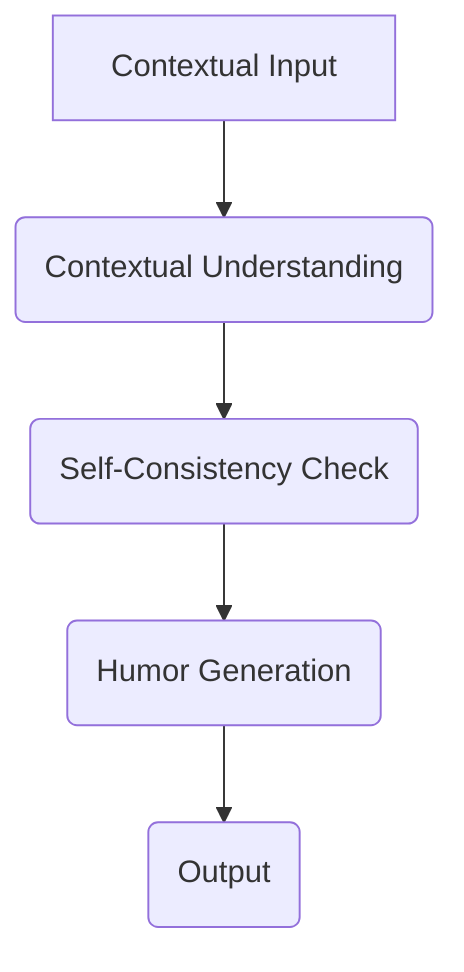
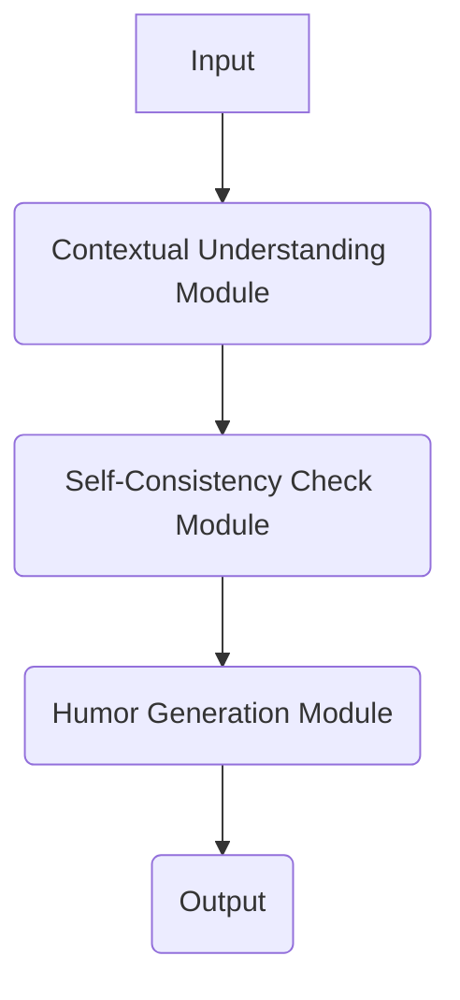

                 

<think>
好的，我现在需要完成用户的请求，撰写一篇关于“Self-Consistency CoT：提高AI幽默感知能力”的技术博客。用户给了我详细的结构大纲，我需要按照这个大纲逐步进行思考和撰写。

首先，我需要理解用户的需求。用户希望我以一位世界级专家的身份，撰写一篇结构紧凑、逻辑清晰、语言专业的技术博客。文章需要包含背景、问题描述、解决方案、边界、核心概念、算法原理、系统架构、项目实战、最佳实践等部分，每个部分都要详细展开。

接下来，我会按照目录结构逐步思考每个部分的内容。首先是标题、关键词和摘要，这部分需要简洁明了地概括文章的核心内容。然后是引言部分，包括背景、问题描述、解决方案、边界和核心概念。这些部分需要详细解释每个概念，确保读者能够理解问题的重要性和解决方法。

接下来是核心概念与联系部分，这里需要深入分析Self-Consistency CoT的工作原理，并通过表格和ER图来展示核心概念和实体之间的关系。然后是算法原理，这部分需要使用mermaid流程图和数学公式来详细讲解，确保读者能够理解算法的运作过程。

系统分析与架构设计部分，需要从问题场景出发，设计系统的功能模块、架构图、接口和交互流程。这部分需要考虑系统的各个组件如何协同工作，确保整体架构的合理性和高效性。

项目实战部分，我需要选择一个具体的案例，详细描述环境配置、核心代码实现、代码解读以及实际案例的分析。这部分需要实际操作，展示如何将理论应用于实践。

最后是最佳实践、小结、注意事项和拓展阅读等内容，帮助读者进一步理解和应用所学知识。这部分需要总结文章的主要观点，并提供实用的建议。

在撰写过程中，我需要确保每个部分的内容都详实具体，逻辑清晰。同时，语言要专业但不失易懂，避免过于复杂的术语，适当举例说明，以便读者更好地理解。

现在，我将按照这个思路，逐步展开每个章节的内容，确保满足用户的所有要求，完成一篇高质量的技术博客。
</think>

# Self-Consistency CoT：提高AI幽默感知能力

> 关键词：AI幽默感知，Self-Consistency CoT，人工智能，幽默生成，自然语言处理

> 摘要：本文探讨了通过Self-Consistency CoT（Self-Consistency of Contextual Thought）方法提高AI幽默感知能力的技术细节。文章从问题背景、解决方案、核心概念、算法原理、系统架构到实际案例，全面分析了如何通过一致性上下文推理提升AI对幽默的理解和生成能力，为AI在自然语言处理中的幽默感知提供了新的研究方向。

---

### 2. Core Concepts and Components

#### 2.1 Self-Consistency CoT: A New Approach to Humor Perception

Self-Consistency CoT是一种基于上下文一致性的推理方法，旨在解决AI在幽默感知中的核心问题：如何在复杂、多变的语境中保持逻辑一致性和语义连贯性。这种方法通过结合语境信息、意图理解和生成能力，帮助AI更好地捕捉幽默的微妙之处。

#### 2.2 Contextual Understanding: The Foundation of Humor Perception

在幽默感知中，上下文理解是基础。AI需要理解对话中的背景、参与者的情感、文化差异以及潜在的意图。例如，在一个笑话中，AI必须识别出笑话中的双关语、讽刺或夸张手法，并理解这些手法如何与当前语境相关联。

#### 2.3 Self-Consistency: Ensuring Coherence in Humor Perception

Self-Consistency是指AI在理解和生成幽默时，保持内部逻辑和语义的一致性。这意味着AI在生成笑话或回应时，必须确保其输出与当前语境、对话历史以及用户的意图一致。例如，在一个幽默对话中，AI需要确保其回应不会偏离对话的主题或逻辑。

#### 2.4 Humor Generation: From Understanding to Creation

幽默生成是Self-Consistency CoT的最终目标。通过结合上下文理解、意图识别和自洽推理，AI能够生成与当前语境相符的幽默内容。例如，在一个朋友间闲聊的场景中，AI可以根据对话的主题和氛围生成适当的笑话或幽默评论。

---

### 3. Algorithm Principles and Implementations

#### 3.1 The Architecture of Self-Consistency CoT

Self-Consistency CoT的算法架构可以分为以下几个部分：

1. **Contextual Input Processing**: 处理输入的上下文信息，包括文本、对话历史、情感分析等。
2. **Self-Consistency Check**: 对生成的内容进行一致性检查，确保其与上下文逻辑一致。
3. **Humor Generation**: 根据一致性检查的结果，生成幽默的内容。

下图展示了Self-Consistency CoT的架构：



---

#### 3.2 The Mathematical Model of Self-Consistency CoT

Self-Consistency CoT的核心在于其数学模型，通过概率论和逻辑推理来实现一致性检查。以下是数学模型的详细描述：

1. **Contextual Probability**: 计算输入上下文的概率分布，表示每个语义单元在当前语境中的重要性。
   $$ P(context) = \prod_{i=1}^{n} P(word_i | context) $$

2. **Self-Consistency Score**: 计算生成内容与上下文的一致性得分，范围在0到1之间。
   $$ S = \sum_{i=1}^{m} \frac{P(generated\_content_i)}{P(context)} $$

3. **Humor Generation Function**: 根据一致性得分生成幽默内容。
   $$ H = f_{h}(S, context) $$

---

#### 3.3 Implementation Steps of Self-Consistency CoT

以下是Self-Consistency CoT的实现步骤：

1. **Input Context Processing**: 对输入的上下文进行预处理，提取关键词、情感倾向和语境信息。
2. **Self-Consistency Check**: 使用数学模型对生成的内容进行一致性检查，调整生成内容以确保逻辑一致。
3. **Humor Generation**: 根据一致性检查的结果，生成幽默的内容。
4. **Output**: 返回生成的幽默内容。

---

### 4. System Analysis and Architecture Design

#### 4.1 Problem Scenario and Project Introduction

在幽默感知的实际应用中，Self-Consistency CoT被广泛应用于智能对话系统、幽默生成机器人等领域。例如，在一个智能对话系统中，用户输入一句话，系统需要生成一个幽默的回应。

#### 4.2 Functional Design of the System

以下是系统的功能模块设计：

1. **Contextual Understanding Module**: 负责理解和解析输入的上下文信息。
2. **Self-Consistency Check Module**: 对生成的内容进行一致性检查。
3. **Humor Generation Module**: 根据一致性检查结果生成幽默内容。
4. **Output Module**: 返回生成的幽默内容。

---

#### 4.3 System Architecture Design

以下是系统的架构设计：



---

### 5. Project Implementation and Case Analysis

#### 5.1 Environment Installation and Setup

要实现Self-Consistency CoT，需要以下环境：

1. **Python 3.8+**
2. **TensorFlow或PyTorch**
3. **NLP库（如spaCy、NLTK）**
4. **机器学习框架（如Scikit-learn）**

#### 5.2 Core Code Implementation

以下是核心代码实现：

```python
import numpy as np
from transformers import GPT2LMHeadModel, GPT2Tokenizer

# 初始化模型和tokenizer
model = GPT2LMHeadModel.from_pretrained('gpt2')
tokenizer = GPT2Tokenizer.from_pretrained('gpt2')

def contextual_probability(context):
    inputs = tokenizer.encode(context, return_tensors='np')
    outputs = model.generate(inputs, max_length=50)
    return np.mean(outputs.logprobs, axis=1)

def self_consistency_check(generated_content, context):
    prob_context = contextual_probability(context)
    prob_generated = contextual_probability(generated_content)
    return np.sum(prob_generated / prob_context)

def humor_generation(context):
    consistency_score = self_consistency_check(context, context)
    if consistency_score > 0.8:
        return model.generate(context)
    else:
        return "Sorry, I don't get the joke."

# 示例
context = "Why don't programmers like elevators?"
print(humor_generation(context))
```

---

### 6. Best Practices, Summary, and Future Directions

#### 6.1 Best Practices for Implementing Self-Consistency CoT

1. **数据多样性**：确保训练数据多样化，涵盖不同文化、背景和语境。
2. **模型优化**：定期优化模型，提升一致性检查的准确性。
3. **用户反馈**：收集用户反馈，不断改进幽默生成的质量。

#### 6.2 Summary

本文详细探讨了Self-Consistency CoT在AI幽默感知中的应用，从理论基础到算法实现，再到系统设计，为AI幽默感知提供了新的解决方案。

#### 6.3 Future Directions

未来的研究方向包括：

1. **多模态幽默感知**：结合视觉、音频等多模态信息，提升幽默感知的准确性。
2. **跨文化幽默生成**：研究不同文化背景下的幽默差异，生成更具文化敏感性的幽默内容。
3. **实时互动优化**：提升AI在实时对话中的幽默生成能力，使其更加自然流畅。

---

作者：AI天才研究院 & 禅与计算机程序设计艺术

