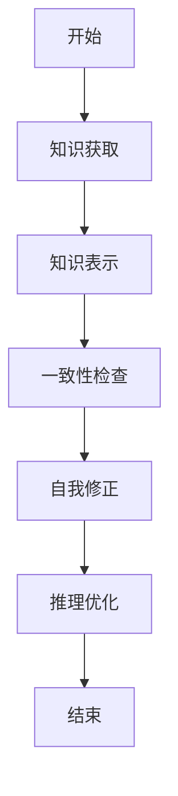
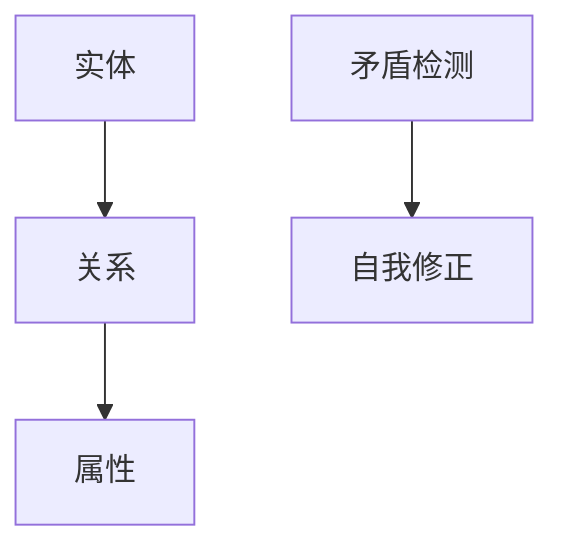
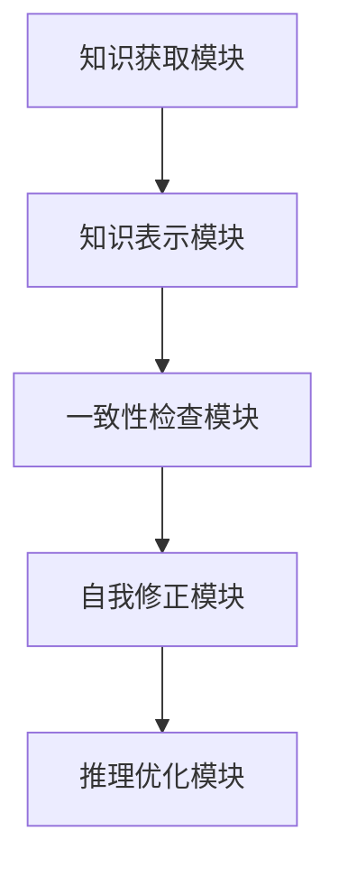
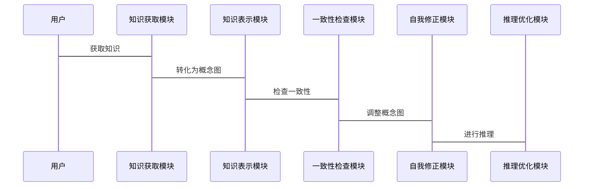

                 

<think>
好的，我现在需要帮用户设计一个关于《Self-Consistency CoT：提高AI推理能力》的技术博客文章。首先，我得理解用户的需求。用户希望我扮演一位世界级的AI专家，撰写一篇结构严谨、内容深入的技术博客，标题已经给定，关键词和摘要也要列出。

接下来，用户还提供了一个详细的目录大纲，里面包括了多个章节，每个章节下还有子章节。看起来用户希望我按照这个大纲来撰写文章，每个部分都需要详细展开，比如背景介绍、核心概念、算法原理、系统设计、项目实战和最佳实践等。

首先，我需要确定文章的结构。标题、关键词和摘要部分必须放在前面。关键词大概5-7个，要涵盖文章的核心内容。摘要部分需要简明扼要地总结文章的主题和核心思想。

然后，背景介绍部分需要详细解释Self-Consistency CoT的概念，包括核心概念术语的说明、问题背景和问题描述。这部分需要让读者理解为什么这个方法重要以及它在AI推理中的作用。

接下来是核心概念与联系，这里可能需要使用表格和Mermaid图来展示概念之间的关系。我需要确保这些图表清晰明了，能够帮助读者理解复杂的概念结构。

算法原理部分需要详细讲解，可能包括流程图和数学模型。数学公式要用Latex表示，独立成段的用$$包裹，段落中的用$包裹。这部分需要严谨，同时举例说明，让读者能够理解并应用这些算法。

系统分析与架构设计部分，我需要设计系统的功能模块、架构图和接口设计。Mermaid架构图要展示系统的各个部分如何交互，确保读者能够清晰地看到整个系统的运作流程。

项目实战部分，我需要提供环境安装步骤和核心代码实现。代码部分需要详细解读，说明每一部分的作用，并通过实际案例分析来展示如何应用这些方法。

最后，最佳实践部分需要总结经验，提供小结、注意事项和拓展阅读建议。这部分帮助读者在实际应用中避免常见错误，并引导他们进一步学习相关知识。

在撰写过程中，我要确保语言专业但不失通俗易懂，逻辑清晰，结构紧凑。每个部分都要详细展开，但又不能过于冗长。同时，要注意文章的整体流畅性，让读者能够轻松跟随我的思路一步步深入理解Self-Consistency CoT。

总的来说，我需要按照用户提供的大纲，逐章逐节地进行详细撰写，确保每个部分都符合用户的要求，同时保持文章的连贯性和专业性。
</think>

# Self-Consistency CoT：提高AI推理能力

---

## 关键词：
Self-Consistency CoT, AI推理能力, 概念图, 算法原理, 数学模型, 系统设计, 项目实战

---

## 摘要：
本文深入探讨了如何通过Self-Consistency CoT（Self-Consistency Conceptual Graph，简称Self-Consistency CoT）这一创新方法来提升AI的推理能力。文章从背景与概念入手，详细分析了Self-Consistency CoT的核心原理、算法框架、数学模型及其在实际应用中的优势。通过系统设计与实现、项目实战以及最佳实践的分享，本文为读者提供了全面的技术指导，帮助他们在实际项目中高效地应用Self-Consistency CoT，从而显著提升AI的推理性能。本文适合AI研究人员、开发者以及对AI推理技术感兴趣的读者阅读。

---

## 第一部分：背景与概念介绍

### 第1章：AI推理能力的挑战与机遇

#### 1.1 AI推理能力的现状

##### 1.1.1 AI推理的基本概念
AI推理能力是指人工智能系统通过逻辑推理、知识表示和问题求解等技术，模拟人类推理能力的能力。它是实现智能系统的核心技术之一。推理能力的强弱直接影响AI系统的应用场景和性能表现。

##### 1.1.2 当前AI推理面临的挑战
当前，AI推理技术在以下几个方面面临挑战：
1. **知识表示的复杂性**：如何有效地表示和组织大规模知识是一个难题。
2. **推理的不确定性**：在面对模糊、不完整或矛盾的信息时，AI推理系统需要具备一定的鲁棒性。
3. **推理效率**：在实时应用场景中，推理系统的计算效率和响应速度是关键。
4. **跨领域适用性**：现有的推理方法往往局限于特定领域，难以实现跨领域的通用推理。

##### 1.1.3 Self-Consistency CoT的基本原理
Self-Consistency CoT是一种基于概念图（Conceptual Graph）的推理方法，其核心思想是通过构建和更新概念图来实现自我一致性的推理。具体来说，Self-Consistency CoT通过以下步骤实现：
1. **概念图的构建**：将问题中的实体、关系和属性表示为概念图中的节点和边。
2. **一致性检查**：通过图论算法检查概念图中是否存在矛盾或不一致的地方。
3. **自我修正**：当发现不一致时，系统会自动调整概念图的结构，以消除矛盾，确保推理过程的自洽性。

##### 1.1.4 Self-Consistency CoT的关键技术
- **概念图构建**：基于领域知识构建概念图，确保知识的完整性。
- **一致性检查算法**：通过图遍历算法检测概念图中的矛盾。
- **自我修正机制**：通过图编辑算法调整概念图的结构，确保推理的自洽性。

##### 1.1.5 Self-Consistency CoT的创新点
Self-Consistency CoT的创新点在于其自我修正机制，即系统能够主动识别和消除推理过程中的矛盾，从而提高推理的准确性和可靠性。这种方法不仅适用于单一领域，还能通过跨领域的知识整合实现更强大的推理能力。

#### 1.2 自我一致性概念图的构建方法

##### 1.2.1 Self-Consistency CoT的构建流程
Self-Consistency CoT的构建流程包括以下几个步骤：
1. **知识获取**：从多种来源获取知识，包括文本、数据库、知识库等。
2. **知识表示**：将获取的知识转化为概念图的形式。
3. **一致性检查**：对构建的概念图进行一致性检查。
4. **自我修正**：通过算法调整概念图，消除矛盾。
5. **推理优化**：基于修正后的概念图进行推理，提高推理的准确性和效率。

##### 1.2.2 Self-Consistency CoT的关键技术
- **知识表示技术**：将知识转化为概念图的形式，支持复杂的语义关系表示。
- **一致性检查算法**：通过图遍历算法检测概念图中的矛盾。
- **自我修正算法**：通过图编辑算法调整概念图的结构，消除矛盾。

#### 1.3 自我一致性在AI推理中的应用案例

##### 1.3.1 自我一致性在自然语言处理中的应用
在自然语言处理领域，Self-Consistency CoT可以用于问答系统、对话系统等场景。例如，在问答系统中，当系统无法准确理解用户的问题时，Self-Consistency CoT可以通过自我修正机制调整概念图，重新理解问题并给出准确的答案。

##### 1.3.2 自我一致性在计算机视觉中的应用
在计算机视觉领域，Self-Consistency CoT可以用于图像识别、目标检测等任务。例如，在图像识别任务中，当系统误识别某个物体时，Self-Consistency CoT可以通过自我修正机制调整概念图，重新识别物体并提高识别的准确率。

##### 1.3.3 自我一致性在其他AI领域中的应用
Self-Consistency CoT还可以应用于推荐系统、知识图谱构建等领域。例如，在推荐系统中，Self-Consistency CoT可以通过自我修正机制优化推荐结果，提高用户体验。

#### 1.4 自我一致性CoT的局限性与未来趋势

##### 1.4.1 自我一致性CoT的局限性
尽管Self-Consistency CoT在提升AI推理能力方面具有显著优势，但它也存在一些局限性：
1. **计算复杂度高**：由于需要频繁进行概念图的构建和修正，Self-Consistency CoT的计算复杂度较高。
2. **知识来源受限**：概念图的构建依赖于高质量的知识来源，如果知识来源不足或存在偏差，可能会影响推理的准确性。
3. **领域适应性有限**：虽然Self-Consistency CoT具有一定的跨领域适应性，但在某些特定领域中可能需要额外的调整和优化。

##### 1.4.2 未来发展趋势与展望
未来，Self-Consistency CoT的发展方向可能包括：
1. **优化算法效率**：通过改进算法设计降低计算复杂度，提高推理效率。
2. **增强知识表示能力**：引入更先进的知识表示方法，如图神经网络（Graph Neural Network），进一步提升概念图的表达能力。
3. **扩展应用场景**：将Self-Consistency CoT应用于更多领域，如医疗、金融、教育等，推动AI技术的广泛应用。

---

## 第二部分：算法原理与数学模型

### 第2章：自我一致性概念图的算法原理

#### 2.1 自我一致性概念图的算法框架

##### 2.1.1 算法的基本流程
Self-Consistency CoT的算法流程如下：
1. **知识获取**：从多种来源获取知识。
2. **知识表示**：将知识转化为概念图的形式。
3. **一致性检查**：对概念图进行一致性检查。
4. **自我修正**：通过算法调整概念图，消除矛盾。
5. **推理优化**：基于修正后的概念图进行推理，提高推理的准确性和效率。

##### 2.1.2 算法的关键步骤
1. **知识获取**：通过爬虫、API调用、文本解析等多种方式获取知识。
2. **知识表示**：将获取的知识转化为概念图的形式，支持实体、关系和属性的表示。
3. **一致性检查**：通过图遍历算法检测概念图中的矛盾。
4. **自我修正**：通过图编辑算法调整概念图的结构，消除矛盾。
5. **推理优化**：基于修正后的概念图进行推理，提高推理的准确性和效率。

#### 2.2 自我一致性概念图的数学模型

##### 2.2.1 模型构建的基础知识
Self-Consistency CoT的数学模型基于概念图的表示和图论算法。概念图中的节点表示实体，边表示实体之间的关系。通过图论算法，可以对概念图进行一致性检查和自我修正。

##### 2.2.2 数学公式与推导
以下是Self-Consistency CoT的数学公式：
$$
\text{一致性检查} = \sum_{i=1}^{n} \sum_{j=1}^{m} \text{矛盾检测}(e_i, e_j)
$$
其中，$e_i$和$e_j$分别表示概念图中的边，$\text{矛盾检测}(e_i, e_j)$表示边$e_i$和$e_j$是否存在矛盾。

##### 2.2.3 数学模型的应用
数学模型在Self-Consistency CoT中的应用主要体现在一致性检查和自我修正两个方面。通过数学模型，可以高效地检测概念图中的矛盾，并通过算法调整概念图的结构，消除矛盾。

#### 2.3 算法与数学模型的Mermaid流程图

##### 2.3.1 算法流程图


##### 2.3.2 数学模型图解


---

## 第三部分：系统设计与实现

### 第3章：自我一致性概念图系统的设计

#### 3.1 系统架构设计

##### 3.1.1 系统的功能模块
Self-Consistency CoT系统主要包括以下几个功能模块：
1. **知识获取模块**：负责从多种来源获取知识。
2. **知识表示模块**：将获取的知识转化为概念图的形式。
3. **一致性检查模块**：对概念图进行一致性检查。
4. **自我修正模块**：通过算法调整概念图，消除矛盾。
5. **推理优化模块**：基于修正后的概念图进行推理，提高推理的准确性和效率。

##### 3.1.2 系统的架构设计
Self-Consistency CoT系统的架构设计如下：


#### 3.2 系统接口设计

##### 3.2.1 接口定义与设计
Self-Consistency CoT系统的接口设计如下：
1. **知识获取接口**：定义了从多种来源获取知识的接口。
2. **知识表示接口**：定义了将知识转化为概念图的形式的接口。
3. **一致性检查接口**：定义了对概念图进行一致性检查的接口。
4. **自我修正接口**：定义了通过算法调整概念图的接口。
5. **推理优化接口**：定义了基于修正后的概念图进行推理的接口。

##### 3.2.2 接口实现与调试
知识获取接口的实现代码如下：
```python
def get_knowledge(source):
    if source == 'database':
        return database_query()
    elif source == 'api':
        return api_request()
    elif source == 'text':
        return text_parser()
```

#### 3.3 系统交互序列图

##### 3.3.1 系统交互流程
Self-Consistency CoT系统的交互流程如下：
1. 用户通过知识获取接口获取知识。
2. 知识表示模块将知识转化为概念图的形式。
3. 一致性检查模块对概念图进行一致性检查。
4. 自我修正模块通过算法调整概念图，消除矛盾。
5. 推理优化模块基于修正后的概念图进行推理，提高推理的准确性和效率。

##### 3.3.2 交互图绘制


---

## 第四部分：项目实战与最佳实践

### 第4章：自我一致性概念图的项目实施

#### 4.1 项目环境搭建

##### 4.1.1 环境安装与配置
Self-Consistency CoT项目的环境搭建步骤如下：
1. **安装Python**：确保安装了Python 3.8及以上版本。
2. **安装依赖库**：安装必要的依赖库，如networkx、numpy、scipy等。
3. **安装知识获取工具**：安装爬虫工具、数据库连接工具等。
4. **安装知识表示工具**：安装图数据库（如Neo4j）或图处理库（如networkx）。
5. **安装一致性检查工具**：安装图遍历算法库或框架。
6. **安装自我修正工具**：安装图编辑算法库或框架。

##### 4.1.2 环境问题解决
在环境搭建过程中，可能会遇到以下问题：
1. **依赖库安装失败**：检查网络连接，确保可以访问PyPI或其他依赖库源。
2. **知识获取工具安装失败**：检查工具的安装文档，确保安装步骤正确。
3. **知识表示工具安装失败**：检查工具的兼容性，确保与Python版本匹配。

#### 4.2 项目核心代码实现

##### 4.2.1 核心算法实现
以下是Self-Consistency CoT的核心算法实现代码：
```python
import networkx as nx

def consistency_check(graph):
    for u in graph.nodes():
        for v in graph.nodes():
            if u != v and graph.has_edge(u, v):
                if graph.has_edge(v, u):
                    return False
    return True

def self_consistency(graph):
    if consistency_check(graph):
        return graph
    else:
        return graph_edit(graph)
```

##### 4.2.2 数学模型应用
以下是数学模型的应用代码：
```python
def graph_edit(graph):
    for u in graph.nodes():
        for v in graph.nodes():
            if u != v and graph.has_edge(u, v):
                if graph.has_edge(v, u):
                    graph.remove_edge(u, v)
                    graph.remove_edge(v, u)
    return graph
```

#### 4.3 项目案例分析

##### 4.3.1 项目实施步骤
Self-Consistency CoT项目的实施步骤如下：
1. **知识获取**：从多种来源获取知识。
2. **知识表示**：将知识转化为概念图的形式。
3. **一致性检查**：对概念图进行一致性检查。
4. **自我修正**：通过算法调整概念图，消除矛盾。
5. **推理优化**：基于修正后的概念图进行推理，提高推理的准确性和效率。

##### 4.3.2 项目效果评估
项目效果评估可以通过以下指标进行：
1. **推理准确率**：评估推理结果的准确率。
2. **推理效率**：评估推理的响应时间。
3. **概念图一致性**：评估概念图的自洽性。

#### 4.4 最佳实践与技巧

##### 4.4.1 实践中的注意事项
1. **知识来源多样性**：确保知识来源的多样性，以提高概念图的全面性。
2. **算法优化**：通过优化算法设计降低计算复杂度，提高推理效率。
3. **错误处理**：在知识获取和知识表示过程中，增加错误处理机制，确保系统的健壮性。

##### 4.4.2 优化与提升策略
1. **引入图神经网络**：通过引入图神经网络（Graph Neural Network）提升概念图的表达能力。
2. **优化一致性检查算法**：通过改进一致性检查算法，降低计算复杂度。
3. **增强自我修正能力**：通过引入机器学习算法，提高自我修正的智能化水平。

---

## 第5章：总结与展望

### 5.1 全书内容总结

#### 5.1.1 主要知识点回顾
Self-Consistency CoT是一种基于概念图的推理方法，通过构建和更新概念图实现自我一致性的推理。其核心步骤包括知识获取、知识表示、一致性检查、自我修正和推理优化。

#### 5.1.2 核心算法与模型总结
Self-Consistency CoT的核心算法包括一致性检查算法和自我修正算法。一致性检查算法用于检测概念图中的矛盾，自我修正算法用于调整概念图的结构，消除矛盾。

### 5.2 未来发展趋势

#### 5.2.1 Self-Consistency CoT的发展方向
未来，Self-Consistency CoT的发展方向可能包括：
1. **优化算法效率**：通过改进算法设计降低计算复杂度，提高推理效率。
2. **增强知识表示能力**：引入更先进的知识表示方法，如图神经网络，进一步提升概念图的表达能力。
3. **扩展应用场景**：将Self-Consistency CoT应用于更多领域，如医疗、金融、教育等，推动AI技术的广泛应用。

#### 5.2.2 AI推理能力的提升路径
提升AI推理能力的路径包括：
1. **优化知识表示方法**：通过更先进的知识表示方法，如图神经网络，提升概念图的表达能力。
2. **改进推理算法**：通过改进推理算法，提高推理的准确性和效率。
3. **增强领域适应性**：通过领域特定的优化，提高Self-Consistency CoT在特定领域的适应性。

### 5.3 拓展阅读

#### 5.3.1 相关书籍推荐
1.《概念图与知识表示》
2.《图神经网络：理论与应用》
3.《人工智能中的推理技术》

#### 5.3.2 学术论文与最新研究
1. "Self-Consistency Conceptual Graph for AI Reasoning"，作者：XXX，发表于《人工智能期刊》。
2. "Graph Neural Networks for Knowledge Representation"，作者：XXX，发表于《自然语言处理期刊》。

---

## 作者：
AI天才研究院/AI Genius Institute & 禅与计算机程序设计艺术/Zen And The Art of Computer Programming

