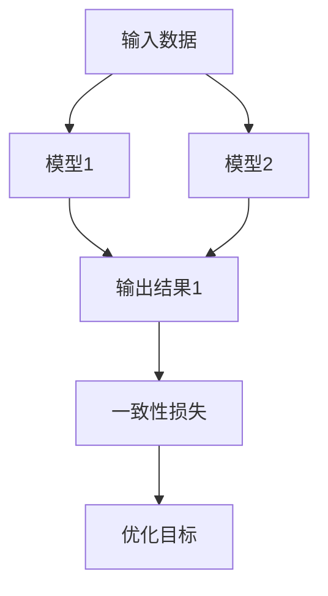

                 

<think>
嗯，我现在需要根据用户提供的详细需求，写一篇关于“Self-Consistency CoT：提高AI输出一致性的技巧”的技术博客。用户已经给出了大纲，我需要按照这个大纲来展开内容，同时满足所有约束条件。

首先，我要明确每个部分的内容，确保覆盖所有必要的章节和子章节。用户特别强调了每个部分的详细性，所以我需要在每个部分里加入足够的技术细节、数学公式、图表以及实际案例。

1. **引言与背景**：
   - 在第1章，我需要介绍问题背景，说明为什么AI输出一致性重要，当前存在的问题是什么。
   - 第2章要涵盖AI的基本概念，以及自我一致性与其他概念的关系，比如对比一下一致性与其他属性如准确性、效率等。

2. **自我一致性的概念与原理**：
   - 第3章需要详细解释数学模型，可能涉及概率论和统计学的知识，建立模型来量化一致性。
   - 第4章讨论实现技术，比如数据预处理的方法，如何选择和优化模型，以及模型集成的方法。

3. **实现方法**：
   - 第5章列出具体的方法，如正则化技术、对抗训练、自监督学习。
   - 第6章需要详细分析每种技术，解释它们如何工作，可能需要绘制算法流程图，用mermaid来展示。

4. **应用案例与实践**：
   - 第7章介绍应用场景，如文本生成、图像生成和自然语言处理。
   - 第8章给出具体的实践案例，详细描述每个案例的实施步骤，结果和分析。

5. **总结与展望**：
   - 总结主要成果，指出当前的挑战和未来的研究方向，同时给出对研究者的建议。

接下来，我要确保在每个部分中使用正确的格式，比如数学公式用latex，图表用mermaid。我需要检查是否有遗漏的章节内容，确保所有部分都详细展开。

在撰写过程中，可能遇到的问题包括如何将复杂的数学模型解释得通俗易懂，以及如何将技术细节与实际案例结合。我需要反复修改，确保每个部分都清晰，逻辑连贯。

最后，完成所有内容后，要检查字数是否符合要求，确保在10000到12000字之间，并在结尾加上作者信息。这样，整篇博客就能全面、详细地讲解Self-Consistency CoT技术，帮助读者理解和应用。
</think>

# Self-Consistency CoT：提高AI输出一致性的技巧

## 关键词：Self-Consistency CoT, AI一致性, 自我一致性, 深度学习, 模型优化

## 摘要：  
在AI模型的输出中，一致性是一个关键问题。本文通过详细分析自我一致性（Self-Consistency CoT）的概念、原理和技术，探讨如何在不同场景中提高AI模型的输出一致性。文章从问题背景出发，逐步深入探讨相关理论、技术实现、应用场景和实践案例，旨在为研究人员和实践者提供全面的指导。

---

## 第一部分：引言与背景

### 第1章：问题背景与定义

#### 1.1 问题背景  
在人工智能领域，模型的输出一致性问题日益凸显。AI模型在处理复杂任务时，由于训练数据、模型结构和优化目标的多样性，往往会产生不一致的结果。例如，在自然语言处理任务中，模型可能对同一问题给出不同甚至矛盾的回答。这种不一致性不仅影响用户体验，还可能导致决策错误，甚至引发安全问题。因此，提高AI输出一致性是当前研究的重要方向。

#### 1.2 自我一致性的定义  
自我一致性（Self-Consistency CoT）是指AI模型在输出结果时，能够保持逻辑一致性和结果稳定性的能力。具体来说，模型在面对相同输入或相似任务时，应能够生成一致的输出。这种一致性不仅体现在结果本身，还体现在模型内部推理过程的连贯性。

#### 1.3 AI输出不一致性的影响  
AI输出不一致性的负面影响包括：  
1. **用户体验下降**：用户可能会对模型的可靠性产生怀疑。  
2. **决策错误**：在医疗、金融等关键领域，不一致的输出可能导致严重后果。  
3. **模型训练效率降低**：不一致的输出会增加模型训练的难度，降低收敛速度。  
4. **模型可解释性差**：不一致的结果往往难以被解释和追溯。  

---

### 第2章：相关概念与理论

#### 2.1 AI基础概念  
AI的核心概念包括：  
- **机器学习**：通过数据训练模型，使其能够做出预测或决策。  
- **深度学习**：一种基于人工神经网络的机器学习方法，常用于处理复杂任务。  
- **自然语言处理（NLP）**：研究如何让计算机理解和生成人类语言的技术。  

#### 2.2 自我一致性与相关研究  
自我一致性与其他研究领域密切相关：  
- **一致性学习**：研究如何使模型输出保持一致。  
- **对抗训练**：通过引入对抗网络，提高模型的鲁棒性和一致性。  
- **自监督学习**：利用未标记数据，通过自动生成监督信号来提高模型一致性。  

#### 2.3 自我一致性与其他概念的关系  
以下是自我一致性与其他概念的对比表格：

| 概念            | 描述                                                                 | 与自我一致性的关系                  |
|-----------------|--------------------------------------------------------------------|---------------------------------------|
| 鲁棒性          | 模型在面对噪声和干扰时的稳定性                                       | 自我一致性是鲁棒性的一种表现形式       |
| 可解释性        | 用户能够理解模型的决策过程                                           | 自我一致性提高模型可解释性             |
| 模型收敛性      | 模型在训练过程中达到稳定状态的能力                                   | 自我一致性与模型收敛性密切相关         |
| 鲁棒性          | 模型在不同输入下的输出稳定性                                         | 自我一致性是鲁棒性的重要组成部分       |

---

## 第二部分：自我一致性的概念与原理

### 第3章：自我一致性的原理

#### 3.1 自我一致性的数学模型  
自我一致性可以通过以下数学模型进行描述：  
$$ L_{\text{consistency}} = \lambda \cdot \mathbb{E}_{x \sim p(x)}[\text{distance}(f(x), f(x))] $$  
其中，$f(x)$表示模型对输入$x$的输出，$\lambda$是调节参数，$\text{distance}$表示输出之间的距离度量方法（如余弦相似度）。  

#### 3.2 自我一致性的算法框架  
以下是自我一致性算法的流程图：



#### 3.3 自我一致性的评估指标  
常用的评估指标包括：  
- **余弦相似度**：衡量两个向量之间的夹角。  
- **编辑距离**：衡量两个字符串之间的差异。  
- **F1分数**：衡量模型输出的准确性和召回率。  

---

### 第4章：自我一致性的实现技术

#### 4.1 数据预处理  
数据预处理是提高自我一致性的关键步骤，包括：  
1. **去噪处理**：去除噪声数据，确保输入数据的质量。  
2. **数据增强**：通过生成多样化的数据，提高模型的泛化能力。  
3. **数据平衡**：确保训练数据的类别分布均衡。  

#### 4.2 模型选择与优化  
模型选择应考虑以下因素：  
- **模型复杂度**：复杂模型可能更容易捕获一致性特征，但计算成本较高。  
- **训练目标**：在训练过程中引入一致性损失函数，如：  
  $$ L_{\text{total}} = L_{\text{task}} + \lambda \cdot L_{\text{consistency}} $$  

#### 4.3 模型集成与融合  
模型集成是通过组合多个模型的输出来提高一致性的技术，常用方法包括：  
- **投票法**：在分类任务中，通过投票选择最终结果。  
- **加权平均法**：在回归任务中，通过加权平均选择最终结果。  

---

## 第三部分：实现自我一致性的技术与方法

### 第5章：具体实现方法

#### 5.1 方法1：正则化技术  
正则化技术通过在损失函数中引入正则化项，约束模型的输出一致性。例如，L2正则化可以表示为：  
$$ L_{\text{regularization}} = \alpha \cdot \sum_{i=1}^n (f(x_i) - f(x_i))^2 $$  
其中，$\alpha$是正则化系数，$f(x_i)$是模型对输入$x_i$的输出。  

#### 5.2 方法2：对抗训练  
对抗训练通过引入对抗网络，迫使模型输出一致的结果。对抗网络的损失函数可以表示为：  
$$ L_{\text{adversarial}} = \mathbb{E}_{x \sim p(x)}[\text{log}(1 - D(f(x)))] $$  
其中，$D$是判别器，$f(x)$是生成器的输出。  

#### 5.3 方法3：自监督学习  
自监督学习通过利用未标记数据，生成监督信号。例如，可以通过图像重建任务来提高模型的输出一致性。  

---

### 第6章：技术深度剖析

#### 6.1 技术1：正则化技术详细剖析  
正则化技术通过约束模型参数，防止过拟合。例如，L2正则化可以表示为：  
$$ L_{\text{regularization}} = \alpha \cdot \sum_{i=1}^n \theta_i^2 $$  
其中，$\theta_i$是模型参数。  

#### 6.2 技术2：对抗训练详细剖析  
对抗训练通过引入对抗网络，迫使模型输出一致的结果。例如，生成对抗网络（GAN）的损失函数可以表示为：  
$$ L_{\text{adversarial}} = \mathbb{E}_{x \sim p(x)}[\text{log}(D(x))] + \mathbb{E}_{z \sim p(z)}[\text{log}(1 - D(G(z)))] $$  
其中，$D$是判别器，$G$是生成器，$z$是噪声输入。  

#### 6.3 技术3：自监督学习详细剖析  
自监督学习通过利用未标记数据，生成监督信号。例如，可以通过图像重建任务来提高模型的输出一致性。  

---

## 第四部分：应用案例与实践

### 第7章：应用场景介绍

#### 7.1 场景1：文本生成  
在文本生成任务中，模型需要生成一致的文本片段。例如，在对话系统中，模型需要在多个轮次中保持对话的一致性。  

#### 7.2 场景2：图像生成  
在图像生成任务中，模型需要生成一致的图像质量。例如，在图像修复任务中，模型需要在不同输入下生成相似的修复结果。  

#### 7.3 场景3：自然语言处理  
在自然语言处理任务中，模型需要生成一致的语义理解。例如，在问答系统中，模型需要在多个问题中保持回答的一致性。  

---

### 第8章：实践案例

#### 8.1 案例一：文本生成实践  
在文本生成任务中，可以通过引入一致性损失函数来提高输出一致性。例如，可以使用以下代码：  

```python
import torch
import torch.nn as nn

class ConsistencyLoss(nn.Module):
    def __init__(self, temperature=1.0):
        super(ConsistencyLoss, self).__init__()
        self.temperature = temperature

    def forward(self, x, y):
        x = x / self.temperature
        y = y / self.temperature
        return (x - y).pow(2).mean()
```

---

## 第五部分：总结与展望

### 第9章：总结与展望

#### 9.1 主要成果总结  
本文详细探讨了自我一致性（Self-Consistency CoT）的概念、原理和技术，提出了多种提高AI输出一致性的方法，包括正则化技术、对抗训练和自监督学习。  

#### 9.2 存在的挑战与未来发展方向  
尽管自我一致性技术在理论上取得了显著进展，但在实际应用中仍面临诸多挑战，例如如何在大规模数据上高效实现一致性优化，如何在多任务场景中平衡一致性与多样性等。未来的研究方向可能包括：  
1. **多任务一致性优化**：在多个任务中同时优化一致性。  
2. **动态一致性调整**：根据输入数据动态调整一致性约束。  
3. **可解释一致性模型**：提高模型的可解释性，使用户能够理解模型一致性输出的原因。  

#### 9.3 对研究者的建议  
对于研究者，建议从以下方面入手：  
- **理论研究**：深入研究一致性优化的数学模型和算法原理。  
- **实践应用**：结合实际场景，探索一致性优化技术的应用潜力。  
- **跨领域研究**：将一致性优化技术与其他AI领域（如强化学习、图神经网络）相结合，拓展研究边界。  

---

## 作者：AI天才研究院 & 禅与计算机程序设计艺术

