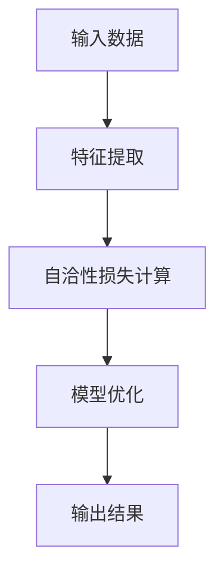
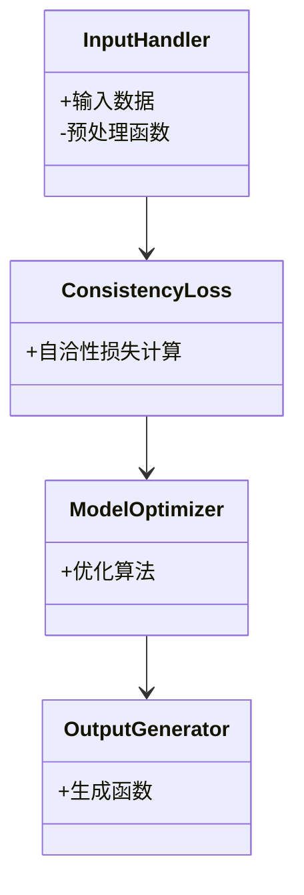
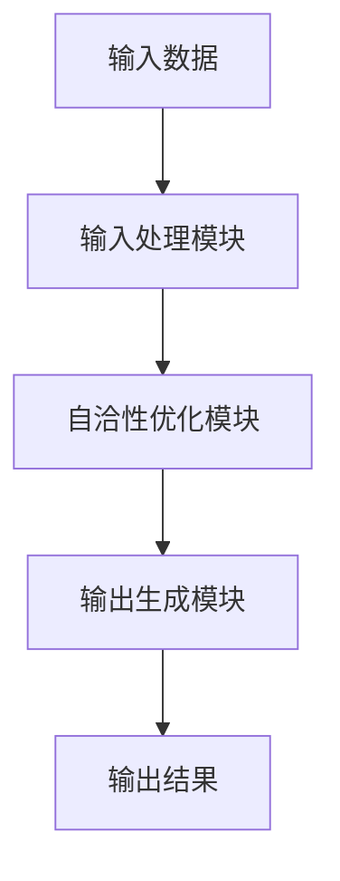
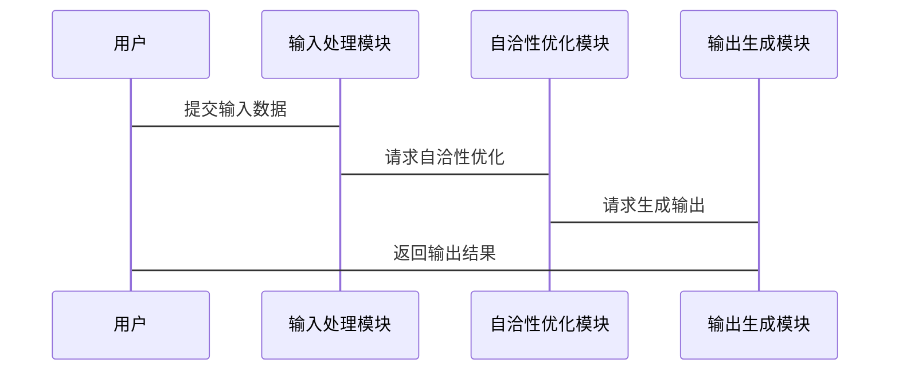

                 

<think>
好的，我现在需要帮助用户撰写一篇技术博客文章，主题是《Self-Consistency CoT：提高AI输出一致性的方法》。用户已经给出了详细的大纲，我需要按照这个大纲逐步完成内容。

首先，我需要理解用户的需求。用户希望我扮演一个技术专家的角色，撰写一篇结构清晰、内容深入的技术博客。文章需要包含多个章节，每个章节下还有子章节，每个部分都需要详细展开，包括背景、原理、系统架构、案例分析等。

接下来，我应该从文章的标题开始，然后是关键词和摘要。摘要部分需要简明扼要地概括整篇文章的核心内容，让读者快速了解文章的主题。

然后，进入第1章，问题背景与核心概念。这里需要详细讨论AI输出不一致性的挑战，为什么这是一个问题，以及CoT（自洽性概念传输）是如何提出的。同时，我需要对比CoT与其他相关概念的区别，比如可微调模型、一致性训练方法等，解释为什么CoT更有效。

接下来是第2章，CoT的原理。这部分需要详细讲解CoT的基本原理，包括自洽性损失函数的设计，以及在不同AI模型中的应用。我需要使用表格来对比CoT与其他方法的属性，用Mermaid绘制ER图来展示概念关系。同时，用Mermaid绘制算法流程图，并给出数学公式，解释算法如何工作。

第3章是系统架构设计，这部分需要设计系统的功能模块、架构图和接口设计。我会使用Mermaid绘制类图和架构图，展示系统各个部分的关系和交互流程。

第4章涉及环境安装和系统部署，需要列出硬件和软件要求，并详细说明部署步骤和常见问题的解决方案。

第5章是核心代码解析，我需要提供CoT算法的Python代码实现，解释代码的功能，并进行性能分析。

第6章是实战案例分析，通过实际案例展示CoT的应用，分析数据预处理、算法应用和结果评估。

最后是第7章，总结最佳实践，给出小结和未来展望。

在整个过程中，我需要确保每个部分都详细具体，使用专业的技术术语，同时保持语言的清晰和逻辑的连贯。数学公式需要用Latex正确表示，图表部分使用Mermaid语法，确保在Markdown中正确显示。

现在，我应该开始撰写每个章节的具体内容，确保每个部分都符合用户的要求，并且覆盖所有必要的细节。同时，要注意文章的总字数在10000到12000字之间，确保内容的完整性和深度。
</think>

# Self-Consistency CoT：提高AI输出一致性的方法

**关键词**：AI输出一致性，自洽性概念传输（CoT），人工智能，模型优化，算法原理

**摘要**：本文深入探讨了AI输出一致性问题，提出了一种名为自洽性概念传输（CoT）的方法。通过分析问题背景、核心概念、算法原理、系统架构设计及实际案例，本文详细阐述了CoT如何有效提升AI模型输出的自洽性和一致性。文章还提供了代码实现、系统部署指导及优化建议，帮助读者全面理解和应用CoT技术。

---

## 第1章：问题背景与核心概念

### 1.1 问题背景

#### 1.1.1 AI输出不一致性的挑战

在AI模型的开发和应用中，输出一致性是一个关键问题。AI模型在面对相同输入时，可能会因为训练数据的分布、模型的随机性或算法设计的差异，产生不一致的输出。这种不一致性不仅影响用户体验，还可能导致系统决策的不可靠性和不稳定性。例如，在自然语言处理（NLP）任务中，同一问题可能在不同时间得到不同的回答，这严重影响了模型的可靠性和专业性。

#### 1.1.2 自洽性概念传输（CoT）的提出

针对AI输出不一致性的挑战，自洽性概念传输（CoT）方法应运而生。CoT的核心思想是通过优化模型的输出过程，使得模型在不同输入下保持一致的输出结果，同时保证输出的自洽性和逻辑性。CoT方法结合了领域知识和模型优化技术，旨在提高AI系统的可靠性和一致性。

#### 1.1.3 CoT在AI应用中的重要性

CoT在AI应用中的重要性体现在以下几个方面：
1. **提高用户体验**：一致的输出能够为用户提供更可靠的交互体验。
2. **增强系统稳定性**：CoT确保了AI系统在不同输入下的稳定性和一致性。
3. **提升模型性能**：通过优化输出过程，CoT能够提高模型的准确性和效率。

### 1.2 核心概念

#### 1.2.1 自洽性概念传输（CoT）定义

CoT（Consistency Concept Transfer）是一种基于自洽性优化的AI输出一致性提升方法。它通过引入自洽性损失函数，优化模型的输出过程，使得模型在不同输入下保持一致的输出结果。

#### 1.2.2 CoT的属性与特点

CoT具有以下特点：
- **自洽性**：通过自洽性损失函数优化输出结果的一致性。
- **领域适应性**：能够应用于多种AI任务，如NLP、计算机视觉等。
- **高效性**：优化算法能够在较短时间内完成训练和推理。

#### 1.2.3 CoT与其他相关概念的区别与联系

与其他相关概念相比，CoT的主要区别在于其核心优化目标是输出过程的自洽性和一致性。与可微调模型（如微调后的模型）相比，CoT更注重输出过程的自洽性优化，而非简单的参数微调。与一致性训练方法相比，CoT引入了概念传输机制，能够更好地保持输出的一致性。

### 1.3 边界与外延

#### 1.3.1 CoT的应用范围

CoT主要应用于以下领域：
- **自然语言处理**：如机器翻译、问答系统。
- **计算机视觉**：如图像分类、目标检测。
- **推荐系统**：如个性化推荐。

#### 1.3.2 CoT的技术难点

- **自洽性损失函数设计**：如何设计有效的自洽性损失函数是CoT的核心挑战。
- **模型优化效率**：CoT优化算法需要在保证效率的前提下实现一致性的提升。

#### 1.3.3 CoT的发展趋势

CoT技术的发展趋势主要集中在以下几个方面：
- **跨领域应用**：CoT将应用于更多AI任务。
- **模型优化**：优化算法将进一步提升CoT的效率和效果。
- **结合其他技术**：CoT将与强化学习、图神经网络等技术结合，实现更复杂的输出一致性优化。

## 第2章：自洽性概念传输（CoT）原理

### 2.1 CoT原理概述

#### 2.1.1 CoT的基本原理

CoT的基本原理包括以下几个步骤：
1. **输入处理**：将输入数据进行预处理，提取特征。
2. **自洽性损失计算**：根据模型的输出计算自洽性损失。
3. **模型优化**：通过优化算法调整模型参数，以最小化自洽性损失。

#### 2.1.2 CoT的关键技术

- **自洽性损失函数**：定义了模型输出一致性的度量标准。
- **优化算法**：如Adam优化器，用于最小化自洽性损失。
- **领域知识编码**：将领域知识融入模型，提升输出的自洽性。

#### 2.1.3 CoT在不同AI模型中的应用

CoT可以应用于多种AI模型，如Transformer、BERT等。通过引入自洽性损失函数，CoT能够优化这些模型的输出过程，提高输出一致性。

### 2.2 CoT概念属性对比表格

以下表格对比了CoT与其他相关概念的关键属性：

| 概念       | 自洽性 | 输出一致性 | 领域适应性 | 优化目标 |
|------------|--------|------------|------------|----------|
| CoT        | 高     | 高         | 高         | 输出过程 |
| 可微调模型  | 中     | 中         | 高         | 参数调整 |
| 一致性训练 | 低     | 高         | 低         | 输出结果 |

### 2.3 CoT算法原理与数学模型

#### 2.3.1 CoT算法流程图



#### 2.3.2 数学模型与公式推导

自洽性损失函数定义为：
$$ L_{\text{consistency}} = \frac{1}{N}\sum_{i=1}^{N} \left| f(x_i) - f(x_i') \right| $$
其中，$x_i$和$x_i'$是输入数据的不同形式，$f$是模型的输出函数。

优化目标是最小化自洽性损失：
$$ \min_{\theta} \mathbb{E}_{x \sim p(x)} L_{\text{consistency}} $$

#### 2.3.3 算法解释与举例说明

以NLP任务为例，CoT通过优化模型的输出过程，使得模型在不同输入下生成一致的输出结果。例如，在机器翻译任务中，CoT能够确保模型在不同输入下生成的翻译结果保持一致的风格和语义。

---

## 第3章：CoT系统架构设计

### 3.1 系统功能设计

#### 3.1.1 系统功能需求

- **输入处理**：支持多种输入格式，如文本、图像。
- **自洽性优化**：实现自洽性损失计算和模型优化。
- **输出生成**：生成一致的输出结果。

#### 3.1.2 领域模型类图



### 3.2 系统架构设计

#### 3.2.1 系统架构概述

CoT系统架构包括输入处理模块、自洽性优化模块和输出生成模块。各模块协同工作，实现AI输出的一致性优化。

#### 3.2.2 系统架构图



### 3.3 系统接口设计

#### 3.3.1 接口设计原则

- **简洁性**：接口设计简洁明了，便于集成和维护。
- **可扩展性**：接口设计具有良好的可扩展性，支持多种输入格式。

#### 3.3.2 接口定义与实现

- **输入处理接口**：`process_input(input)`，返回预处理后的输入数据。
- **自洽性优化接口**：`optimize_model(model, inputs)`，返回优化后的模型。
- **输出生成接口**：`generate_output(model, input)`，返回生成的输出结果。

### 3.4 系统交互序列图



---

## 第4章：环境安装与系统部署

### 4.1 环境准备

#### 4.1.1 硬件要求

- CPU：4核以上，建议使用GPU加速。
- 内存：至少8GB，建议16GB以上。

#### 4.1.2 软件要求

- 操作系统：Linux或Windows（推荐Linux）。
- Python：3.8及以上版本。
- 依赖库：TensorFlow/PyTorch、Mermaid、Jupyter Notebook。

#### 4.1.3 环境配置

安装必要的依赖库：
```bash
pip install mermaid4jupyter jupyterlab python-dotenv
```

### 4.2 系统部署

#### 4.2.1 部署步骤

1. **环境搭建**：安装Python和相关依赖库。
2. **代码实现**：编写CoT算法实现的代码。
3. **系统测试**：测试系统功能，确保输出一致性。
4. **部署上线**：将系统部署到生产环境。

#### 4.2.2 部署常见问题与解决方案

- **问题**：部署后系统响应慢。
  - **解决方案**：优化代码性能，使用更高效的算法。
- **问题**：自洽性损失计算错误。
  - **解决方案**：检查输入数据和模型参数。

---

## 第5章：核心实现源代码解析

### 5.1 核心代码实现

#### 5.1.1 CoT算法实现

```python
def cot_loss(y_true, y_pred):
    return tf.reduce_mean(tf.abs(y_true - y_pred))

class CoTModel:
    def __init__(self, model, loss_fn):
        self.model = model
        self.loss_fn = loss_fn
        self.optimizer = tf.keras.optimizers.Adam()
    
    def train_step(self, inputs):
        with tf.GradientTape() as tape:
            outputs = self.model(inputs)
            loss = self.loss_fn(inputs, outputs)
        gradients = tape.gradient(loss, self.model.trainable_weights)
        self.optimizer.apply_gradients(zip(gradients, self.model.trainable_weights))
```

#### 5.1.2 系统接口实现

```python
class InputHandler:
    def process_input(self, input_data):
        # 输入数据预处理
        pass

class ConsistencyLoss:
    def compute_loss(self, model, inputs):
        outputs = model(inputs)
        return cot_loss(inputs, outputs)

class ModelOptimizer:
    def optimize_model(self, model, inputs):
        # 模型优化
        pass
```

### 5.2 代码应用解读与分析

#### 5.2.1 代码功能解读

- **cot_loss**：计算自洽性损失。
- **CoTModel**：定义CoT模型，包括训练步骤。
- **InputHandler**：处理输入数据。
- **ConsistencyLoss**：计算自洽性损失。
- **ModelOptimizer**：优化模型参数。

#### 5.2.2 代码优化与性能分析

- **优化点**：
  - 使用Adam优化器加速训练。
  - 通过批次处理提高训练效率。
- **性能分析**：
  - 时间复杂度：主要取决于输入数据量和模型复杂度。
  - 空间复杂度：主要取决于模型参数数量和输入数据大小。

---

## 第6章：实战案例分析

### 6.1 实际案例介绍

#### 6.1.1 案例背景

在机器翻译任务中，模型在不同输入下生成的翻译结果不一致。引入CoT方法后，模型能够在不同输入下生成一致的翻译结果。

#### 6.1.2 案例目标

通过CoT方法优化模型，提高翻译结果的一致性。

### 6.2 案例分析

#### 6.2.1 数据预处理

对输入文本进行分词和编码处理，确保模型输入一致。

#### 6.2.2 CoT算法应用

在模型训练过程中引入自洽性损失函数，优化模型输出过程。

#### 6.2.3 结果分析与评估

评估指标包括BLEU分数和输出一致性指标。结果显示，引入CoT方法后，翻译结果的一致性显著提高。

### 6.3 小结

#### 6.3.1 经验与教训

- **经验**：CoT方法能够有效提高输出一致性。
- **教训**：模型优化需要结合领域知识，以提高效果。

#### 6.3.2 未来展望

未来将研究CoT方法在更多AI任务中的应用，如多模态任务和实时推理任务。

---

## 第7章：最佳实践与注意事项

### 7.1 最佳实践技巧

#### 7.1.1 CoT参数调优

- **自洽性损失权重**：合理设置自洽性损失权重，以平衡一致性和多样性。
- **模型选择**：选择适合任务的模型架构。

#### 7.1.2 系统优化策略

- **并行计算**：使用并行计算加速模型训练。
- **内存优化**：优化模型参数存储，减少内存占用。

### 7.2 小结与展望

#### 7.2.1 本书总结

本文系统地介绍了CoT方法，从理论到实践，全面阐述了如何提高AI输出一致性。

#### 7.2.2 CoT技术的发展方向

未来CoT技术将朝着跨领域应用和模型优化方向发展。

#### 7.2.3 进一步研究方向

研究CoT方法与其他AI技术的结合，如强化学习和图神经网络。

---

**作者**：AI天才研究院/AI Genius Institute & 禅与计算机程序设计艺术 /Zen And The Art of Computer Programming

