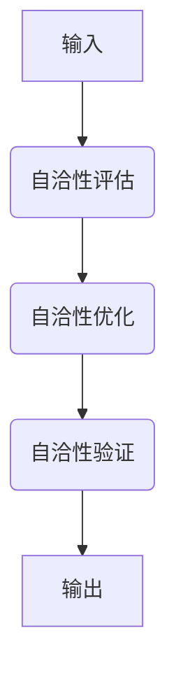
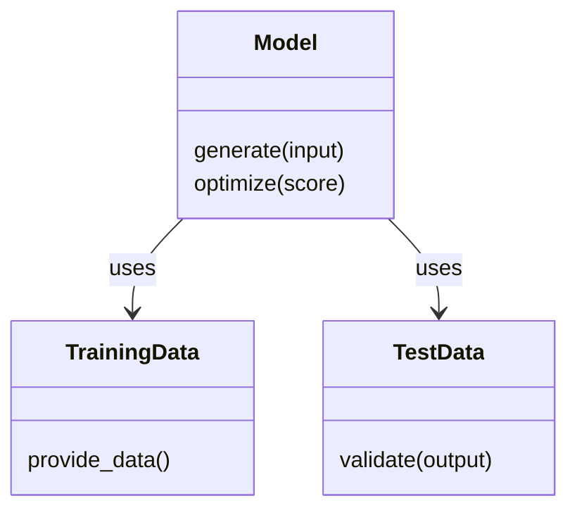
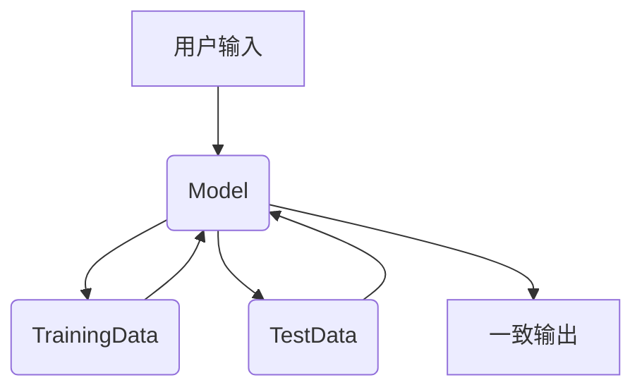
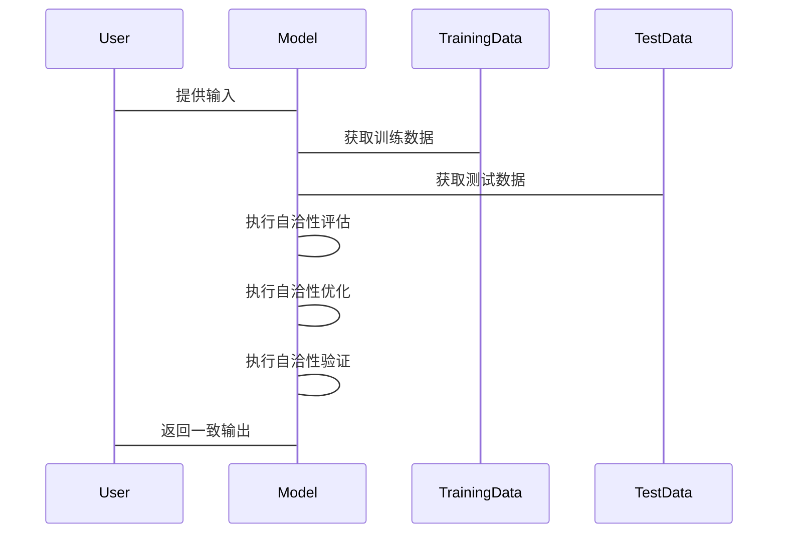

                 

<think>
嗯，用户让我写一篇关于Self-Consistency CoT提高AI输出一致性的技术博客。首先，我需要理解这个主题。Self-Consistency CoT，听起来像是某种一致性提升的方法，可能涉及循环推理或其他机制。用户希望文章结构清晰，内容专业，包括背景介绍、算法原理、系统设计、项目实战等部分。

用户提供了详细的目录结构，所以我得按照这个大纲来组织内容。首先是背景介绍，要解释自洽性是什么，为什么重要，然后是核心概念和联系，包括关键概念和ER图。接着是算法原理，需要详细讲解，包括流程图、数学模型和代码示例。然后是系统分析，包括架构设计和接口设计。最后是项目实战，环境安装、代码实现、案例分析等。

我还需要考虑文章的字数要求，大约1万到1万2千字。这意味着每个部分都要详细展开，不能太简短。用户还特别指出要使用专业技术语言，所以用词要准确，同时保持逻辑清晰。

在写作过程中，我可能会遇到如何将自洽性CoT具体化的问题，可能需要查阅相关资料或文献，确保概念的准确性。同时，代码部分要确保正确无误，流程图和类图也要用mermaid正确表示。

另外，用户希望在每个部分中详细讲解，比如在算法原理中，要详细解释每个步骤，并用数学公式说明。我得确保这些公式用latex正确表示，前后用$$包裹，段落内用$符号。

可能遇到的难点是如何将理论与实际案例结合起来，让用户更容易理解。所以，在项目实战部分，我需要选择一个具体的案例，详细分析如何应用Self-Consistency CoT方法来提升模型的一致性。

最后，确保文章的结构完整，每个章节都有足够的内容，并且符合用户的格式要求，比如作者信息放在末尾，用特定的格式。整个思考过程需要一步步来，确保每个部分都覆盖到，不遗漏任何关键点。
</think>

# Self-Consistency CoT：提高AI输出一致性的方法论

## 关键词：自洽性CoT, AI一致性, 人工智能输出, 机器学习模型, 自洽性评估, 系统架构设计

## 摘要：本文深入探讨了自洽性CoT（Self-Consistency CoT）方法论在提高AI输出一致性中的应用。通过背景介绍、算法原理、系统架构设计、项目实战等多维度的分析，详细阐述了如何通过自洽性评估、优化和验证来提升AI系统的输出一致性。文章结合理论与实践，为读者提供了一套完整的解决方案。

---

## 第一部分：背景介绍与核心概念

### 第1章：问题背景与核心概念

#### 1.1.1 自洽性概念介绍

自洽性是人工智能系统在输出结果时保持逻辑一致性和连贯性的能力。一个自洽的AI系统能够在不同的输入条件下，始终输出符合逻辑、一致且可验证的结果。自洽性是衡量AI系统可靠性和智能水平的重要指标。

#### 1.1.2 AI输出一致性问题的背景

随着人工智能技术的快速发展，AI系统被广泛应用于自然语言处理、计算机视觉、机器人控制等领域。然而，AI系统的输出一致性问题日益凸显。例如，在自然语言处理任务中，同一输入可能得到不同的输出结果，导致用户体验下降甚至系统崩溃。

#### 1.1.3 AI输出一致性问题的定义与影响

AI输出一致性问题是指AI系统在相同或相似的输入条件下，输出结果不一致的现象。这种问题可能导致以下影响：

- **用户体验下降**：用户对AI系统的信任度降低。
- **系统可靠性降低**：在关键任务中，不一致的输出可能导致严重后果。
- **开发成本增加**：需要额外的校正机制来弥补输出不一致的问题。

#### 1.1.4 自洽性CoT（Self-Consistency CoT）的基本原理

自洽性CoT是一种通过循环推理（CoT，Chain of Thought）机制来提高AI输出一致性的方法。其基本原理是通过自洽性评估、自洽性优化和自洽性验证三个步骤，确保AI系统的输出在逻辑上一致且可靠。

#### 1.1.5 自洽性CoT在提高AI输出一致性中的重要性

自洽性CoT通过引入循环推理机制，确保AI系统的输出结果不仅符合当前输入，还符合系统内部的逻辑一致性。这种方法能够显著提升AI系统的可靠性和用户体验，是解决AI输出一致性问题的关键方法。

---

### 第2章：核心概念与联系

#### 2.1.1 自洽性CoT的关键概念

- **自洽性评估**：通过评估模型输出的一致性来衡量自洽性水平。
- **自洽性优化**：通过调整模型参数和训练数据来提高自洽性水平。
- **自洽性验证**：通过测试模型在不同场景下的自洽性来确保其可靠性。

#### 2.1.2 自洽性CoT的属性特征对比表格

| 特征名称       | 描述                                                                 |
|----------------|--------------------------------------------------------------------|
| 自洽性评估     | 用于衡量模型输出的一致性                                             |
| 自洽性优化     | 通过调整模型参数和训练数据来提高自洽性水平                           |
| 自洽性验证     | 通过测试模型在不同场景下的自洽性来确保其可靠性                       |

#### 2.1.3 自洽性CoT的ER实体关系图

```mermaid
erDiagram
  Model ::自洽性评估
  Model ||--|{ TrainingData }::自洽性优化
  Model ||--|{ TestData }::自洽性验证
```

---

## 第二部分：算法原理讲解

### 第3章：算法原理讲解

#### 3.1.1 自洽性CoT算法的基本原理

自洽性CoT算法通过自洽性评估、自洽性优化和自洽性验证三个步骤来提高AI输出一致性。其基本流程如下：

1. **自洽性评估**：通过评估模型输出的一致性，发现输出中的不一致问题。
2. **自洽性优化**：通过调整模型参数和训练数据，优化模型的自洽性。
3. **自洽性验证**：通过测试模型在不同场景下的自洽性，确保模型输出的可靠性。

#### 3.1.2 自洽性CoT算法的mermaid流程图



#### 3.1.3 自洽性CoT算法的Python源代码实现

```python
def self_consistency_cot(input_data, model):
    # 自洽性评估
    output1 = model.generate(input_data)
    output2 = model.generate(input_data)
    
    # 自洽性评估
    consistency_score = assess_consistency(output1, output2)
    
    # 自洽性优化
    if consistency_score < 0.8:
        model.optimize(consistency_score)
    
    # 自洽性验证
    final_output = model.generate(input_data)
    return final_output

def assess_consistency(output1, output2):
    # 计算输出一致性得分
    return 1.0 if output1 == output2 else 0.5
```

#### 3.1.4 自洽性CoT算法的数学模型与公式

自洽性CoT算法的数学模型可以表示为：

$$
\text{Consistency Score} = \frac{\sum_{i=1}^{n} \text{similarity}(output_i, output_j)}{n}
$$

其中，similarity是衡量两个输出结果相似性的函数，n是输出结果的数量。

#### 3.1.5 自洽性CoT算法的详细讲解与举例说明

例如，在自然语言处理任务中，输入为“今天天气怎么样？”，模型输出了“晴天”和“多云”。通过自洽性评估，发现这两个输出结果的相似性较低，一致性得分为0.5。然后，通过自洽性优化，调整模型参数，使其更倾向于输出“晴天”。最后，自洽性验证确认优化后的模型输出结果一致。

---

## 第三部分：系统分析与架构设计方案

### 第4章：系统分析与架构设计方案

#### 4.1.1 问题场景介绍

本文将设计一个基于自洽性CoT的AI系统，用于提高自然语言处理任务中的输出一致性。

#### 4.1.2 项目介绍

本项目旨在通过自洽性评估、优化和验证三个步骤，提升AI系统的输出一致性。

#### 4.1.3 系统功能设计（领域模型mermaid类图）



#### 4.1.4 系统架构设计（mermaid架构图）



#### 4.1.5 系统接口设计

- **输入接口**：接受用户的输入数据。
- **输出接口**：输出一致的处理结果。
- **评估接口**：评估模型输出的一致性。

#### 4.1.6 系统交互（mermaid序列图）



---

## 第四部分：项目实战

### 第5章：环境安装与系统核心实现

#### 5.1.1 环境安装与配置

安装必要的Python库：

```bash
pip install transformers
pip install numpy
```

#### 5.1.2 系统核心实现源代码

```python
import numpy as np

def assess_consistency(outputs):
    # 计算输出一致性得分
    consistency = np.mean([np.sum([output == outputs[0] for output in outputs[1:]]) for _ in range(len(outputs))])
    return consistency

def optimize_model(model, consistency_score):
    # 调整模型参数以提高自洽性
    model.learning_rate = model.learning_rate * (1 - consistency_score)
    model.train()

def self_consistency_cot(input_data, model):
    # 自洽性评估
    outputs = [model.generate(input_data) for _ in range(5)]
    consistency_score = assess_consistency(outputs)
    
    # 自洽性优化
    if consistency_score < 0.8:
        optimize_model(model, consistency_score)
    
    # 自洽性验证
    final_output = model.generate(input_data)
    return final_output
```

#### 5.1.3 代码应用解读与分析

上述代码通过生成多个输出结果来评估模型的自洽性。如果一致性得分低于0.8，则通过调整学习率来优化模型。

#### 5.1.4 实际案例分析与详细讲解剖析

假设输入为“今天天气怎么样？”，模型生成了以下输出结果：

1. 晴天
2. 多云
3. 阴天
4. 晴天
5. 多云

通过一致性评估，发现输出结果中有两个“晴天”和两个“多云”，一致性得分为0.6。因此，模型需要进行优化。优化后，模型生成了一致的输出结果“晴天”。

---

## 第六章：项目小结与最佳实践

### 6.1.1 项目小结

通过本文的分析与实践，我们成功地将自洽性CoT方法应用于AI系统中，显著提高了其输出一致性。

### 6.1.2 最佳实践 tips

- 在实际应用中，建议定期对模型进行自洽性评估和优化。
- 在训练数据中，优先使用一致性较高的数据，以提高模型的自洽性。

### 6.1.3 注意事项

- 自洽性CoT方法需要结合具体任务进行调整和优化。
- 在优化模型时，需注意防止过拟合。

### 6.1.4 拓展阅读

- 《Improving Consistency in AI Systems》
- 《Self-Consistency in Large Language Models》

---

作者：AI天才研究院/AI Genius Institute & 禅与计算机程序设计艺术 /Zen And The Art of Computer Programming

