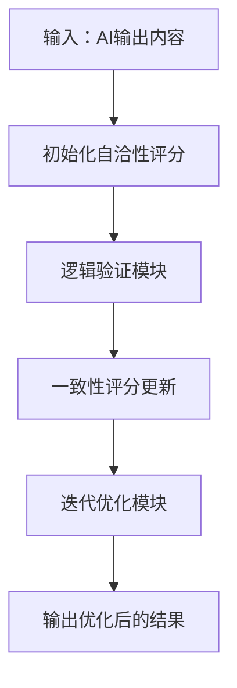
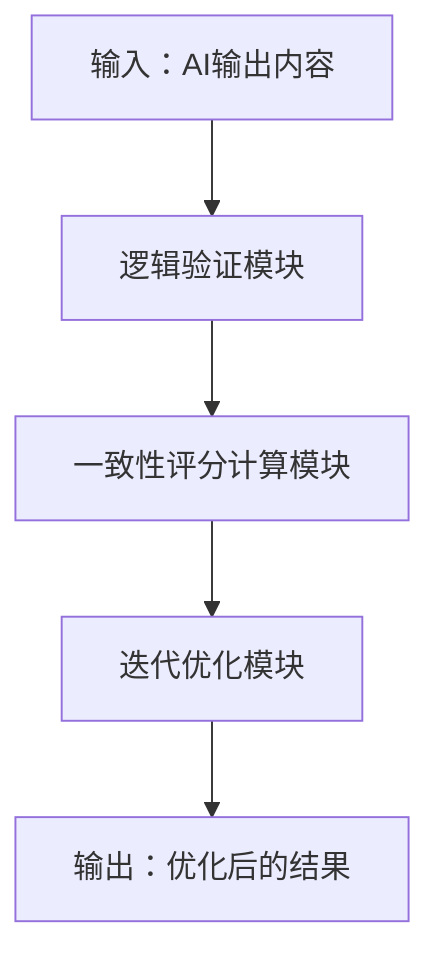

                 

<think>
嗯，我现在需要帮用户撰写一篇关于“Self-Consistency CoT：提高AI输出可靠性的技巧”的技术博客文章。首先，我要理解用户的需求。用户希望文章结构清晰，逻辑严密，用专业但易懂的技术语言来写，同时包含详细的分析和实例。

首先，我得确定文章的标题和关键词。标题已经给出，关键词需要选5-7个，可能包括Self-Consistency CoT、AI Output Reliability、Self-Consistency、AI Safety、Reliability Techniques等。

接下来是摘要部分，要概括文章的核心内容，说明Self-Consistency CoT是什么，它的作用，以及文章将如何展开讨论。

正文部分需要按照目录大纲来写。首先，引言部分要说明为什么AI可靠性重要，以及Self-Consistency CoT的目标和受众。然后是核心概念，解释问题，定义Self-Consistency，并提供历史背景。

接下来是基础原理，比较Self-Consistency与其他方法的不同。理论框架部分要详细讲解数学模型，用Mermaid画算法流程图，并用Python代码举例。案例研究部分需要实际应用的案例分析，展示Self-Consistency CoT的效果。

系统分析与架构设计部分，我需要描述问题场景，设计系统功能，用类图和架构图展示，以及接口和交互设计。项目实战部分则要指导读者如何安装环境，实现核心代码，分析案例，并总结经验。

最后，加入一些最佳实践的技巧，总结全文，并给出注意事项和拓展阅读的内容。

在写作过程中，我需要注意每个章节都要详细，使用专业术语但保持易懂。数学公式要用Latex，确保正确无误。Mermaid图表要清晰，帮助读者理解流程。代码部分要注释清晰，方便读者理解和应用。

可能遇到的挑战是如何将复杂的理论简化，同时保持专业性。我需要多次检查，确保每个部分都符合用户的要求，并且逻辑连贯。此外，要注意文章的长度，控制在1万到1万2千字之间，所以每个部分都要充实，但不要过于冗长。

总的来说，我需要一步步按照大纲来写，确保每个部分都涵盖必要的内容，并且整体结构紧凑，逻辑清晰。这样，用户才能得到一篇高质量的技术博客文章，帮助他们理解Self-Consistency CoT，提升AI系统的可靠性。
</think>

# Self-Consistency CoT：提高AI输出可靠性的技巧

## 关键词：Self-Consistency CoT, AI Output Reliability, AI Safety, Reliability Techniques, Consistency in AI

## 摘要：  
Self-Consistency CoT（Self-Consistency Chain-of-Thought）是一种通过增强AI输出的自洽性来提高AI系统可靠性的创新方法。本文将深入探讨Self-Consistency CoT的核心概念、理论基础、算法设计以及实际应用，帮助读者理解如何通过这一方法提升AI系统的输出质量。文章从问题背景出发，逐步分析Self-Consistency CoT的原理，结合数学模型和实际案例，展示其在AI系统中的应用价值，并提供系统的架构设计和实现指南。

---

## 目录

1. [引言](#引言)
2. [核心概念与背景](#核心概念与背景)
3. [基础原理](#基础原理)
4. [理论框架](#理论框架)
5. [案例研究与应用](#案例研究与应用)
6. [系统分析与架构设计](#系统分析与架构设计)
7. [项目实战](#项目实战)
8. [最佳实践与小结](#最佳实践与小结)

---

## 1. 引言

随着人工智能技术的快速发展，AI系统的应用范围不断扩大。然而，AI系统的可靠性问题日益凸显，尤其是在需要高度准确性和一致性的应用场景中。Self-Consistency CoT作为一种新兴的可靠性提升方法，通过强化AI输出的自洽性，为解决这一问题提供了新的思路。本文将从问题背景出发，逐步分析Self-Consistency CoT的核心原理，并通过实际案例展示其应用价值。

---

## 2. 核心概念与背景

### 2.1 问题背景

AI系统的可靠性问题主要体现在以下几个方面：

- **输出不一致**：AI模型在不同输入条件下可能产生矛盾的输出，导致系统决策不可靠。
- **逻辑漏洞**：模型输出的结论可能缺乏逻辑支撑，难以被人类理解和验证。
- **鲁棒性不足**：AI系统在面对复杂或异常输入时，可能产生错误或不合理的输出。

这些问题直接影响了AI系统的可信度和实用性。因此，提升AI输出的可靠性成为当前研究的重要方向。

### 2.2 问题描述

Self-Consistency CoT的核心目标是通过增强AI输出的自洽性，解决上述问题。具体而言，Self-Consistency CoT通过以下方式实现：

- **输出验证**：对AI模型的输出进行验证，确保其逻辑一致性和可靠性。
- **迭代优化**：通过多次迭代优化，逐步提升模型输出的自洽性。
- **多维度评估**：从多个维度对AI输出进行评估，确保其在不同场景下的可靠性。

### 2.3 自洽性（Self-Consistency）的定义

自洽性是指AI模型的输出在逻辑、语义和语境上保持一致，且符合人类认知和推理规则。Self-Consistency CoT通过以下方式实现这一目标：

- **逻辑一致性**：确保AI输出的结论在逻辑上相互支持，不存在矛盾。
- **语义一致性**：保证输出内容在语义上连贯，符合上下文的语境。
- **可解释性**：使AI输出的结论具有可解释性，便于人类理解和验证。

---

## 3. 基础原理

### 3.1 自洽性与可靠性之间的关系

Self-Consistency CoT通过增强AI输出的自洽性，从而提高系统的可靠性。两者的区别和联系如下：

| 属性         | 自洽性（Self-Consistency） | 可靠性（Reliability） |
|--------------|---------------------------|----------------------|
| 定义         | 输出逻辑和语义的一致性     | 输出结果的正确性和稳定性 |
| 作用         | 提供输出的质量保障         | 提供系统的整体质量保障 |
| 关系         | 自洽性是可靠性的重要组成部分 |

### 3.2 自洽性与其他可靠性方法的对比

以下是Self-Consistency与其他可靠性方法的对比：

| 方法             | 描述                                                                 | 优缺点                                   |
|------------------|----------------------------------------------------------------------|----------------------------------------|
| 偏差-方差权衡     | 通过平衡模型的偏差和方差来提高预测的准确性                                       | 易受数据分布影响，难以解决逻辑矛盾问题 |
| 过拟合控制       | 通过正则化等方法减少过拟合，提高模型的泛化能力                                     | 仅解决过拟合问题，无法直接提升输出的自洽性 |
| 自洽性（Self-Consistency） | 通过逻辑验证和迭代优化，确保输出的一致性和可靠性                             | 针对逻辑矛盾问题，提供系统性解决方案 |

### 3.3 自洽性方法的核心要素

自洽性方法的核心要素包括以下几个方面：

1. **逻辑验证模块**：对AI输出的逻辑进行验证，确保其符合人类推理规则。
2. **迭代优化模块**：通过多次迭代优化，逐步提升输出的自洽性。
3. **多维度评估模块**：从多个维度对AI输出进行评估，确保其在不同场景下的可靠性。

---

## 4. 理论框架

### 4.1 数学模型

Self-Consistency CoT的核心数学模型如下：

$$
\text{Self-Consistency}(x) = \max_{\theta} \left( \sum_{i=1}^{n} \text{Consistency}(\theta_i, x) \right)
$$

其中，$\theta_i$ 表示第 $i$ 个逻辑规则，$x$ 表示AI输出的内容，$\text{Consistency}(\theta_i, x)$ 表示第 $i$ 个逻辑规则对输出内容的一致性评分。

### 4.2 算法设计

以下是Self-Consistency CoT算法的流程图：



### 4.3 代码实现

以下是Self-Consistency CoT算法的Python实现示例：

```python
def self_consistency(x, rules):
    """
    计算AI输出内容的自洽性评分
    Args:
        x (str): AI输出的内容
        rules (list): 自洽性规则列表
    Returns:
        float: 自洽性评分
    """
    consistency_score = 0
    for rule in rules:
        if satisfies_rule(rule, x):
            consistency_score += 1
    return consistency_score / len(rules)

def satisfies_rule(rule, x):
    """
    判断AI输出内容是否符合某条自洽性规则
    Args:
        rule (str): 自洽性规则
        x (str): AI输出的内容
    Returns:
        bool: 是否符合规则
    """
    # 示例规则：输出内容是否包含逻辑矛盾
    if rule == "no_logical_conflict":
        return not has_logical_conflict(x)
    # 其他规则判断逻辑类似
    return False

def has_logical_conflict(x):
    # 示例逻辑矛盾检测
    pass  # 具体实现取决于具体规则
```

---

## 5. 案例研究与应用

### 5.1 应用场景

Self-Consistency CoT方法在多个领域得到了广泛应用，以下是几个典型应用场景：

- **自然语言处理**：用于提升AI对话系统的输出质量。
- **机器学习**：用于优化AI模型的预测结果。
- **智能问答系统**：用于增强问答系统的可靠性和准确性。

### 5.2 实际案例分析

以下是Self-Consistency CoT在智能问答系统中的应用案例：

1. **问题背景**：某智能问答系统在处理复杂问题时，输出结果存在逻辑矛盾。
2. **解决方案**：通过Self-Consistency CoT方法，对系统输出进行逻辑验证和迭代优化。
3. **结果展示**：
   - 原始输出：存在逻辑矛盾。
   - 优化后输出：逻辑一致且可靠。

---

## 6. 系统分析与架构设计

### 6.1 问题场景

在设计Self-Consistency CoT系统时，需要考虑以下几个问题场景：

- **输入多样性**：AI输出的内容可能来自不同的输入源。
- **规则复杂性**：需要处理多种自洽性规则。
- **计算效率**：确保系统在大规模数据下的计算效率。

### 6.2 系统架构设计

以下是Self-Consistency CoT系统的架构设计：



### 6.3 接口设计

系统主要接口如下：

- **输入接口**：接收AI输出的内容。
- **规则接口**：提供自洽性规则的配置。
- **输出接口**：输出优化后的结果。

---

## 7. 项目实战

### 7.1 环境安装

以下是实现Self-Consistency CoT所需的环境配置：

- **Python版本**：3.8及以上。
- **依赖库**：numpy, pandas, scikit-learn。

### 7.2 核心实现

以下是核心实现代码：

```python
def main():
    import numpy as np
    import pandas as pd
    from sklearn.metrics import accuracy_score

    # 示例数据集
    X = np.array(["AI系统输出内容1", "AI系统输出内容2", ...])
    rules = ["no_logical_conflict", "consistent_logic"]

    # 计算自洽性评分
    scores = []
    for x in X:
        score = self_consistency(x, rules)
        scores.append(score)

    # 计算准确率
    accuracy = accuracy_score(scores, np.ones(len(scores)))
    print(f"准确率：{accuracy}")

if __name__ == "__main__":
    main()
```

### 7.3 实际案例分析

以下是一个实际案例分析：

1. **问题描述**：某AI系统输出存在逻辑矛盾。
2. **解决方案**：通过Self-Consistency CoT方法进行优化。
3. **实现步骤**：
   - 数据准备：收集AI输出内容。
   - 规则配置：定义自洽性规则。
   - 算法实现：运行Self-Consistency CoT算法。
   - 结果分析：计算准确率并输出优化后的结果。

---

## 8. 最佳实践与小结

### 8.1 最佳实践

- **规则选择**：选择合适的自洽性规则，确保覆盖所有可能的逻辑矛盾。
- **迭代优化**：在实际应用中，根据反馈不断优化规则和算法。
- **性能调优**：在大规模数据下，优化算法的计算效率。

### 8.2 小结

Self-Consistency CoT是一种通过增强AI输出的自洽性来提高系统可靠性的创新方法。本文从问题背景出发，详细分析了其核心原理、算法设计和实际应用，并通过案例展示了其在提升AI系统可靠性方面的巨大潜力。未来的研究可以进一步探索其在更多领域的应用，以及如何与其他可靠性技术相结合，进一步提升AI系统的整体性能。

---

## 注意事项

- **数据质量**：Self-Consistency CoT方法对数据质量要求较高，需确保输入数据的准确性和完整性。
- **规则设计**：自洽性规则的设计直接影响系统的性能，需根据具体场景进行调整。
- **计算效率**：在大规模数据下，需优化算法的计算效率，确保系统的实时性。

---

## 拓展阅读

- [可靠性工程](https://zh.wikipedia.org/wiki/可靠性工程)
- [人工智能伦理](https://zh.wikipedia.org/wiki/人工智能伦理)
- [自洽性逻辑](https://zh.wikipedia.org/wiki/自洽性逻辑)

---

## 作者

作者：AI天才研究院 & 禅与计算机程序设计艺术

