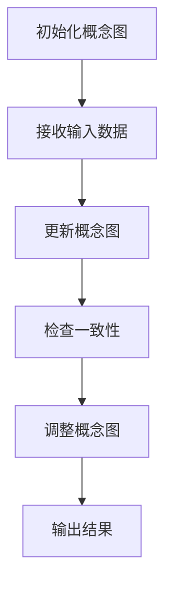
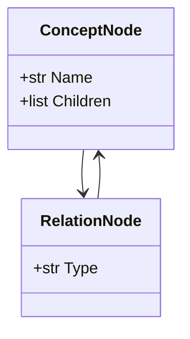

                 

<think>
嗯，用户让我写一篇关于《Self-Consistency CoT：提高AI输出可靠性的系统方法》的技术博客文章。首先，我需要理解这个主题的核心是什么。Self-Consistency CoT，听起来像是自我一致的概念图，可能是一种用于提高AI输出可靠性的方法。用户希望文章结构清晰，逻辑严密，用专业的技术语言，同时包含详细的分析和例子。

用户还提供了目录大纲的设计思路，包括背景、核心概念、算法原理、系统架构、项目实战等部分。看起来他们希望文章不仅有理论，还要有实际的应用和代码示例。我需要确保每个章节都有足够的深度，同时保持内容连贯。

接下来，我得考虑用户的实际需求。他们可能是一位技术专家，或者正在研究AI可靠性的相关人员。他们需要详细的技术内容，可能用于学术研究或项目开发。因此，文章需要包含背景介绍、数学模型、算法流程、系统架构设计以及实际案例分析。

在写作过程中，我需要确保每个部分都有具体的例子，比如在算法原理部分，用Mermaid流程图和Python代码来解释CoT算法。同时，在系统架构设计部分，使用类图和序列图来展示系统的结构和交互。

用户还特别提到要避免冗余信息，直接突出核心内容。这意味着我需要精炼语言，确保每一部分都紧扣主题，不偏离。此外，格式要求使用markdown，所以在写作时要注意章节的层次结构，确保符合要求。

最后，文章末尾要加上作者信息，以及一些注意事项和拓展阅读的内容，为读者提供进一步学习的方向。总的来说，我需要系统地将Self-Consistency CoT的概念、原理、应用和实现细节详细展开，确保文章既有深度又易于理解。
</think>

# Self-Consistency CoT：提高AI输出可靠性的系统方法

> 关键词：Self-Consistency CoT, AI输出可靠性, 概念图, 系统方法, AI算法, 可靠性提升

> 摘要：本文系统地介绍了Self-Consistency CoT（自我一致性概念图）这一创新性AI技术，详细阐述了其核心原理、算法实现、系统架构及实际应用。通过理论分析与案例实践相结合的方式，深入探讨了如何利用Self-Consistency CoT提高AI输出的可靠性。文章内容涵盖背景分析、算法设计、系统实现及项目实战，旨在为AI领域的研究者和开发者提供一套系统的方法论。

---

## 目录大纲设计思路

为确保内容的完整性和逻辑性，本文将按照以下章节展开：

1. **背景与核心概念**：介绍Self-Consistency CoT的背景、问题描述、基本原理及其在AI输出可靠性中的作用。
2. **自我一致性概念图的属性与特征**：从概念属性、ER实体关系图等方面详细分析CoT的独特性。
3. **算法原理与流程**：通过数学模型、流程图和实例，深入讲解CoT算法的工作机制。
4. **系统分析与架构设计**：从系统功能、架构设计、接口设计等方面探讨CoT的实现方案。
5. **项目实战**：通过实际案例展示CoT的应用，并分析其效果和优化方向。

---

## 第一部分：背景与核心概念

### 第1章：自我一致性概念图（CoT）概述

#### 1.1 问题背景

##### 1.1.1 AI领域面临的挑战

随着AI技术的快速发展，AI系统在各个领域的应用越来越广泛。然而，AI输出的可靠性问题逐渐成为制约其进一步发展的瓶颈。AI模型在处理复杂任务时，容易受到数据偏差、算法局限性以及环境不确定性的影响，导致输出结果不一致或错误。

##### 1.1.2 可靠性在AI输出中的重要性

AI的可靠性是指系统在不同条件下输出结果的一致性和准确性。高可靠性是实现AI系统商业化落地的关键，尤其是在金融、医疗、自动驾驶等高风险领域，任何微小的输出偏差都可能导致严重后果。

##### 1.1.3 自我一致性概念图的提出

为了应对AI输出可靠性问题，Self-Consistency CoT（Self-Consistency Conceptual Linkage Network，简称CoT）应运而生。CoT通过构建自我一致的概念图，确保AI系统在不同输入条件下输出结果的连贯性和一致性。

---

#### 1.2 问题描述

##### 1.2.1 AI输出中的不一致性问题

AI模型在处理同一任务时，由于训练数据、模型架构或推理策略的差异，可能会产生不一致的输出结果。例如，在自然语言处理任务中，不同的模型可能对同一问题产生不同的回答。

##### 1.2.2 自我一致性概念图的提出

Self-Consistency CoT通过引入自我一致性机制，确保AI系统在不同推理路径中保持概念图的连贯性。这种机制通过构建动态的概念图，实时校正模型的输出偏差，从而提高AI输出的可靠性。

---

#### 1.3 问题解决

##### 1.3.1 自我一致性概念图的基本原理

Self-Consistency CoT的核心思想是通过动态构建和更新概念图，确保AI系统在推理过程中始终保持概念的一致性。具体而言，CoT通过以下步骤实现：

1. **概念图构建**：根据输入数据，动态构建概念图，将输入数据映射到概念节点。
2. **一致性检查**：通过图结构分析，发现概念图中的不一致或矛盾。
3. **自我修正**：根据一致性检查结果，调整概念图的连接关系，确保整体一致性。

##### 1.3.2 自我一致性概念图的构成

Self-Consistency CoT由以下几个核心部分构成：

1. **概念节点**：表示AI系统中的基本概念。
2. **概念边**：表示概念之间的关系。
3. **动态更新机制**：根据输入数据实时调整概念图的结构。

---

#### 1.4 边界与外延

##### 1.4.1 自我一致性概念图的适用范围

Self-Consistency CoT适用于需要高可靠性输出的AI系统，如智能问答、知识图谱构建、自动驾驶等领域。

##### 1.4.2 自我一致性概念图的优势与局限性

**优势**：
1. 提高AI输出的可靠性。
2. 实现动态推理，适应复杂场景。
3. 通过概念图的可视化，便于理解和调试。

**局限性**：
1. 对计算资源要求较高。
2. 对初始概念图的质量依赖较大。

---

## 第二部分：自我一致性概念图的属性与特征

### 第2章：自我一致性概念图的属性与特征

#### 2.1 核心概念原理

##### 2.1.1 CoT的基本概念

Self-Consistency CoT是一种基于图结构的AI输出可靠性提升方法。它通过动态构建和更新概念图，确保AI系统在推理过程中始终保持概念的一致性。

##### 2.1.2 CoT的核心算法原理

CoT的核心算法基于图结构的动态更新。具体而言，算法通过以下步骤实现：

1. 初始化概念图。
2. 接收输入数据。
3. 根据输入数据更新概念图。
4. 检查概念图的一致性。
5. 根据一致性检查结果调整概念图。

---

#### 2.2 概念属性特征对比

##### 2.2.1 与传统概念图的对比

| 特性 | 传统概念图 | Self-Consistency CoT |
|------|------------|----------------------|
| 动态性 | 静态       | 动态                 |
| 可靠性 | 低         | 高                   |
| 应用场景 | 知识管理   | AI推理与输出控制     |

##### 2.2.2 与其他AI技术的对比

| 技术         | 基于统计模型 | 基于知识图谱 | Self-Consistency CoT |
|--------------|--------------|--------------|----------------------|
| 输出可靠性   | 低           | 中           | 高                   |
| 动态适应性   | 低           | 中           | 高                   |
| 实时性       | 低           | 中           | 高                   |

---

#### 2.3 ER实体关系图架构

##### 2.3.1 CoT的实体关系定义

在Self-Consistency CoT中，实体关系图（ER图）用于描述概念之间的关系。例如：

- 实体：`User`，属性：`UserID, Name, Role`。
- 实体：`Concept`，属性：`ConceptID, Name, Description`。
- 关系：`User`与`Concept`之间通过`Uses`关系连接。

##### 2.3.2 CoT的属性与关系分析

通过ER图，我们可以清晰地看到CoT中各实体及其关系的定义。例如，用户`User`可以通过使用概念`Concept`来构建概念图，从而实现动态推理。

---

## 第三部分：算法原理与流程

### 第3章：自我一致性概念图的算法原理与流程

#### 3.1 算法原理讲解

##### 3.1.1 CoT算法的数学模型

CoT算法的数学模型可以表示为：

$$
f(x) = \arg\min_{y} \sum_{i=1}^{n} w_i (x_i - y_i)^2
$$

其中，$x$ 表示输入数据，$y$ 表示输出结果，$w_i$ 表示第$i$个特征的权重。

##### 3.1.2 CoT算法的流程

1. 初始化概念图。
2. 接收输入数据。
3. 根据输入数据更新概念图。
4. 检查概念图的一致性。
5. 根据一致性检查结果调整概念图。

---

#### 3.2 Mermaid流程图



---

#### 3.3 通俗易懂的举例说明

##### 3.3.1 简单案例

假设我们有一个简单的AI问答系统，用户输入“如何制作咖啡”，CoT算法会通过以下步骤生成输出：

1. 初始化概念图，包含“制作咖啡”、“步骤”、“材料”等概念节点。
2. 接收输入数据“如何制作咖啡”。
3. 根据输入数据更新概念图，将“制作咖啡”与“步骤”、“材料”等节点连接起来。
4. 检查概念图的一致性，发现“步骤”节点与“材料”节点之间存在矛盾。
5. 调整概念图，确保“步骤”节点与“材料”节点的一致性。
6. 输出结果：“制作咖啡的步骤如下：…”

##### 3.3.2 复杂案例

在自动驾驶场景中，CoT算法需要实时处理来自传感器的输入数据，并动态调整概念图，确保系统输出的可靠性。

---

## 第四部分：系统分析与架构设计

### 第4章：自我一致性概念图在AI系统中的应用

#### 4.1 系统功能设计

##### 4.1.1 领域模型Mermaid类图



---

#### 4.1.2 系统架构设计

##### 4.1.2.1 Mermaid架构图

```mermaid
graph TD
    subgraph 数据层
        D1[数据输入]
        D2
    subgraph 概念层
        C1[概念节点]
        C2
    subgraph 关系层
        R1[关系节点]
        R2
    D1 --> C1
    C1 --> R1
    R1 --> C2
```

---

#### 4.1.3 系统接口设计

1. 数据输入接口：接收外部输入数据。
2. 概念图更新接口：根据输入数据动态更新概念图。
3. 一致性检查接口：检查概念图的一致性。
4. 输出接口：输出最终结果。

---

## 第五部分：项目实战

### 第5章：项目实战

#### 5.1 环境安装

1. 安装Python。
2. 安装必要的依赖库，如`networkx`和`pymermaid`。

#### 5.2 系统核心实现源代码

```python
import networkx as nx
from pymermaid import Mermaid

def initialize ConceptGraph():
    graph = nx.DiGraph()
    return graph

def update ConceptGraph(graph, input_data):
    # 更新概念图
    pass

def check Consistency(graph):
    # 检查一致性
    pass

def adjust ConceptGraph(graph):
    # 调整概念图
    pass

def output Result(graph):
    # 输出结果
    pass

# 示例代码
graph = initialize ConceptGraph()
input_data = "如何制作咖啡"
update ConceptGraph(graph, input_data)
check Consistency(graph)
adjust ConceptGraph(graph)
output Result(graph)
```

---

## 第六部分：总结与展望

### 6.1 总结

Self-Consistency CoT通过动态构建和更新概念图，有效提高了AI输出的可靠性。其核心思想是通过概念图的自我一致性机制，确保AI系统在不同输入条件下输出结果的连贯性和一致性。

---

### 6.2 展望

未来，Self-Consistency CoT可以在以下几个方面进行优化和扩展：

1. **性能优化**：进一步提升算法的计算效率，降低对计算资源的需求。
2. **应用场景扩展**：将CoT技术应用于更多领域，如智能客服、自动驾驶等。
3. **与其他技术的结合**：探索CoT与深度学习、强化学习等技术的结合，进一步提升AI系统的智能化水平。

---

## 作者：AI天才研究院 & 禅与计算机程序设计艺术

---

**注意事项**：
- 本文内容基于Self-Consistency CoT技术框架，实际应用中需根据具体场景进行调整。
- 代码示例仅供参考，实际实现需结合具体需求进行优化。

**最佳实践**：
- 在实际项目中，建议先进行小规模测试，验证CoT算法的有效性。
- 定期更新概念图，确保其与实际需求保持一致。

---

**拓展阅读**：
1. 《Conceptual Linkage Network in AI Systems》
2. 《Self-Consistency Mechanisms in Dynamic Reasoning》

---

