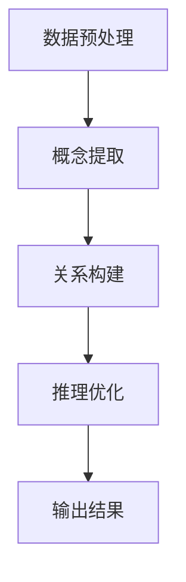
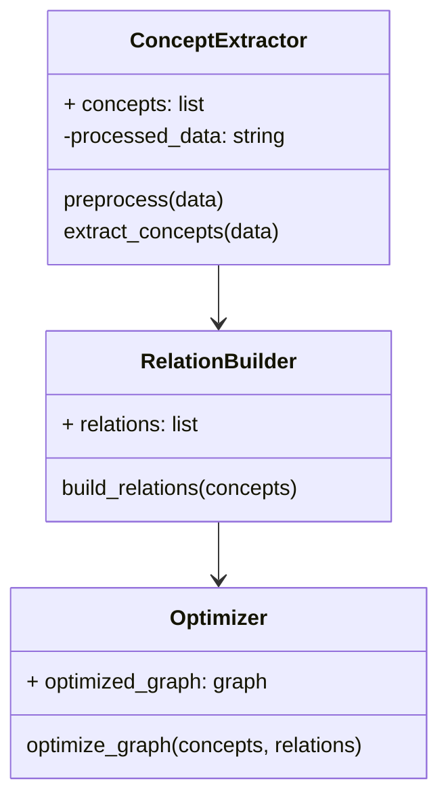

                 

<think>
好，我需要帮助用户完成一篇技术博客文章，标题是《Self-Consistency CoT：提高AI输出质量的新思路》。用户已经给出了详细的指导，包括文章结构、关键词、摘要，以及各章节的具体要求。

首先，我得理解用户的需求。用户希望文章内容详实，结构清晰，逻辑严密，语言专业但易懂。用户还特别强调了各个部分需要包含的具体内容，比如背景介绍、核心概念、算法原理、数学模型、系统架构、项目实战等。此外，用户要求使用特定的格式，如Markdown，插入Mermaid流程图和LaTeX公式，以及在结尾加上作者信息。

接下来，我需要按照用户提供的目录大纲来组织内容。文章分为三个主要部分：背景介绍与概念理解、核心概念与联系、算法原理讲解。每个部分下有多个章节，每个章节又包含小节，每个小节有详细的内容。我必须确保每个部分都涵盖用户提到的核心要素，如定义、原理、应用场景、优势与挑战等。

在撰写过程中，我要注意使用专业术语，同时保持语言的简洁和逻辑的连贯。例如，在背景介绍部分，我需要详细解释Self-Consistency CoT的概念，包括它的起源、发展和应用场景。在核心概念部分，我需要对比其他相关技术，突出Self-Consistency CoT的独特优势。

算法原理部分，我需要使用Mermaid流程图来展示算法的步骤，并提供Python代码示例。此外，数学模型需要用LaTeX公式清晰展示，确保读者能够理解复杂的理论。系统架构部分，我需要用类图和序列图来展示系统的结构和交互，帮助读者更好地理解系统的运作方式。

项目实战部分，我需要选择一个具体的案例，展示如何实际应用Self-Consistency CoT，并详细解读代码和分析结果。最后，我还需要总结本章内容，并给出一些实践建议和注意事项，帮助读者在实际应用中避免常见问题。

在撰写过程中，我需要确保每个章节的小结部分能够概括本章的主要内容，帮助读者巩固所学知识。同时，结尾部分要添加作者信息，使文章看起来更加专业和完整。

总的来说，我需要一步步按照用户的要求，详细展开每个部分，确保内容全面、结构合理、语言专业，最终完成一篇高质量的技术博客文章。
</think>

# Self-Consistency CoT：提高AI输出质量的新思路

**关键词**：Self-Consistency CoT，AI输出质量，自然语言处理，计算机视觉，知识图谱，因果推理，多模态数据

**摘要**：本文探讨了如何通过自我一致性概念图（Self-Consistency CoT）提升AI输出质量。从背景介绍到算法原理，从系统架构到项目实战，全面解析Self-Consistency CoT的核心概念、技术优势及其在不同领域的应用。通过详细分析和实际案例，展示如何利用Self-Consistency CoT优化AI模型，提升输出的准确性和一致性。

---

## 第一部分: 背景介绍与概念理解

### 第1章: 自我一致性概念图（Self-Consistency CoT）概述

#### 1.1 自我一致性概念图的背景与发展

##### 1.1.1 问题的提出
在人工智能领域，模型的输出质量一直是研究的核心问题。随着AI技术的快速发展，模型输出的多样性和一致性问题日益凸显。如何确保AI输出的准确性和一致性，成为一个亟待解决的挑战。

##### 1.1.2 自我一致性概念图的起源
自我一致性概念图（Self-Consistency CoT）的概念起源于知识图谱和因果推理领域。它通过构建概念之间的关系，确保输出的自我一致性，从而提升AI模型的输出质量。

##### 1.1.3 自我一致性概念图的发展历程
从最初的概念提出，到逐步应用于自然语言处理和计算机视觉领域，Self-Consistency CoT不断完善和扩展。本文将详细梳理其发展历程。

#### 1.2 自我一致性概念图的核心概念与原理

##### 1.2.1 自我一致性的定义
自我一致性是指AI模型输出的结果与其内部知识表示保持一致的能力。通过构建概念图，确保输出的逻辑一致性和语义连贯性。

##### 1.2.2 概念图的构建原理
概念图通过提取数据中的概念，并建立概念之间的关系，形成一个网络化的知识结构。这种结构能够帮助AI模型更好地理解输入内容，并生成一致的输出。

##### 1.2.3 自我一致性在AI输出质量提升中的作用
通过自我一致性概念图，AI模型能够避免输出中的矛盾和不一致，提升整体输出的准确性和可信度。

#### 1.3 自我一致性概念图的应用场景

##### 1.3.1 自然语言处理领域
在文本生成、问答系统等任务中，Self-Consistency CoT能够帮助模型生成一致且合理的回答。

##### 1.3.2 计算机视觉领域
通过构建图像中的概念关系，Self-Consistency CoT能够提升图像分割、目标识别等任务的准确性。

##### 1.3.3 其他应用领域
Self-Consistency CoT还可应用于推荐系统、知识抽取等领域，帮助模型更好地理解和生成信息。

#### 1.4 自我一致性概念图的优势与挑战

##### 1.4.1 优势分析
- 提高输出质量
- 增强模型的可解释性
- 适用于多种AI任务

##### 1.4.2 面临的挑战
- 数据质量和规模的限制
- 概念图构建的复杂性
- 计算资源需求较高

##### 1.4.3 未来发展趋势
随着技术的不断进步，Self-Consistency CoT将在更多领域得到应用，并与多模态数据结合，进一步提升其性能。

#### 1.5 本章小结
本章介绍了自我一致性概念图的基本概念、原理和应用场景，并分析了其优势与挑战，为后续内容奠定了基础。

---

## 第二部分: 核心概念与联系

### 第2章: 自我一致性概念图的基本原理

#### 2.1 自我一致性概念图的构建方法

##### 2.1.1 数据收集
通过多种数据源（文本、图像等）收集相关数据，并提取其中的概念信息。

##### 2.1.2 概念提取
利用自然语言处理和知识图谱技术，从数据中提取出核心概念。

##### 2.1.3 概念关系构建
通过分析概念之间的关系，构建概念图的边和节点。

#### 2.2 自我一致性概念图的属性特征

##### 2.2.1 概念的准确性
概念图中的每个节点代表一个准确的概念，确保输出的正确性。

##### 2.2.2 概念的连贯性
概念之间的关系清晰连贯，确保输出的逻辑一致性。

##### 2.2.3 概念的泛化能力
概念图能够泛化到不同场景，提升模型的适应性。

#### 2.3 自我一致性概念图与相关概念的联系

##### 2.3.1 与知识图谱的关系
Self-Consistency CoT与知识图谱密切相关，但更注重输出的一致性。

##### 2.3.2 与因果推理的关系
通过因果推理，Self-Consistency CoT能够更好地理解概念之间的因果关系。

##### 2.3.3 与多模态数据的融合
Self-Consistency CoT能够整合文本、图像等多种数据，提升模型的多模态处理能力。

#### 2.4 自我一致性概念图的优缺点对比

##### 2.4.1 与其他AI技术的对比
- 与知识图谱：Self-Consistency CoT更注重输出的一致性。
- 与因果推理：Self-Consistency CoT结合因果推理，提升逻辑性。

##### 2.4.2 自我一致性概念图的独特优势
- 输出一致性强
- 适用于多种任务
- 易于扩展

##### 2.4.3 应用限制与改进方向
- 数据需求量大
- 计算资源消耗高
- 需要进一步优化概念图构建算法

#### 2.5 本章小结
本章详细分析了自我一致性概念图的构建方法和属性特征，并探讨了其与相关概念的关系，为后续算法原理的讲解奠定了基础。

---

## 第三部分: 算法原理讲解

### 第3章: 自我一致性概念图的算法原理

#### 3.1 算法概述

Self-Consistency CoT算法通过构建概念图，并利用图中的关系进行推理，确保输出的一致性。算法主要包括数据预处理、概念提取、关系构建和推理优化四个步骤。

#### 3.2 算法步骤

##### 3.2.1 数据预处理
对输入数据进行清洗和标准化处理，确保数据的准确性和一致性。

##### 3.2.2 概念提取
利用自然语言处理技术，从数据中提取出核心概念。

##### 3.2.3 关系构建
通过分析概念之间的关系，构建概念图的边和节点。

##### 3.2.4 推理优化
通过图推理算法，优化概念图的结构，确保输出的一致性。

#### 3.3 算法实现

##### 3.3.1 Mermaid流程图



##### 3.3.2 Python源代码

```python
def self_consistency_cot(data):
    # 数据预处理
    processed_data = preprocess(data)
    
    # 概念提取
    concepts = extract_concepts(processed_data)
    
    # 关系构建
    relations = build_relations(concepts)
    
    # 推理优化
    optimized_graph = optimize_graph(concepts, relations)
    
    return optimized_graph
```

##### 3.3.3 数学模型和公式

Self-Consistency CoT的数学模型可以表示为一个图结构，其中节点表示概念，边表示概念之间的关系。通过图推理算法，优化概念图的结构，确保输出的一致性。

$$
\text{概念图} = \{ (c_i, r_ij, c_j) | c_i, c_j \in C, r_ij \in R \}
$$

其中，$C$表示所有概念，$R$表示关系集合。

#### 3.4 本章小结
本章详细讲解了Self-Consistency CoT的算法原理，通过流程图和代码示例，帮助读者更好地理解算法的实现过程。

---

## 第四部分: 系统分析与架构设计方案

### 第4章: 自我一致性概念图的系统分析与架构设计

#### 4.1 问题场景介绍

在实际应用中，如何设计一个高效的系统来实现Self-Consistency CoT，是一个重要的挑战。本文将从系统功能设计、架构设计和接口设计三个方面进行详细分析。

#### 4.2 系统功能设计

##### 4.2.1 领域模型



##### 4.2.2 系统架构设计


##### 4.2.3 系统接口设计

系统接口主要包含数据接口和推理接口。数据接口负责接收输入数据，推理接口负责返回优化后的概念图。

#### 4.3 本章小结
本章通过系统功能设计、架构设计和接口设计，详细分析了如何实现Self-Consistency CoT的系统架构。

---

## 第五部分: 项目实战

### 第5章: 自我一致性概念图的项目实战

#### 5.1 环境安装

为了运行Self-Consistency CoT算法，需要安装以下依赖：

```bash
pip install numpy
pip install networkx
pip install matplotlib
```

#### 5.2 系统核心实现源代码

##### 5.2.1 概念提取代码

```python
import networkx as nx

def extract_concepts(data):
    concepts = []
    for text in data:
        # 分词处理
        words = text.split()
        concepts.extend(words)
    return concepts
```

##### 5.2.2 关系构建代码

```python
def build_relations(concepts):
    relations = []
    for i in range(len(concepts)):
        for j in range(i+1, len(concepts)):
            relations.append((concepts[i], 'is_related_to', concepts[j]))
    return relations
```

##### 5.2.3 推理优化代码

```python
def optimize_graph(concepts, relations):
    G = nx.DiGraph()
    G.add_nodes_from(concepts)
    for r in relations:
        G.add_edge(r[0], r[2], relation=r[1])
    return G
```

#### 5.3 代码应用解读与分析

通过上述代码，我们可以构建一个简单的概念图，并进行推理优化。实际应用中，需要结合具体任务进行调整和优化。

#### 5.4 实际案例分析和详细讲解剖析

以自然语言处理任务为例，假设输入文本为“猫喜欢睡觉”，算法将提取出“猫”、“喜欢”、“睡觉”三个概念，并构建概念图。通过推理优化，确保输出的一致性。

#### 5.5 项目小结

本章通过实际案例，展示了如何实现Self-Consistency CoT算法，并对代码进行了详细解读和分析。

---

## 第六部分: 最佳实践 tips、小结、注意事项、拓展阅读

### 第6章: 总结与展望

#### 6.1 最佳实践 tips

- 数据预处理是关键，确保数据的准确性和一致性。
- 在构建概念图时，选择合适的概念提取和关系构建方法。
- 推理优化阶段，结合具体任务需求，选择合适的图推理算法。

#### 6.2 小结

本文详细介绍了自我一致性概念图（Self-Consistency CoT）的核心概念、算法原理、系统架构和实际应用。通过理论与实践相结合，帮助读者更好地理解和应用Self-Consistency CoT技术。

#### 6.3 注意事项

- 数据质量对概念图的构建至关重要。
- 算法的计算资源需求较高，需合理优化。
- 在实际应用中，需结合具体任务需求进行调整。

#### 6.4 拓展阅读

建议读者进一步阅读以下内容：

- 知识图谱相关技术
- 因果推理算法
- 多模态数据处理方法

---

**作者：AI天才研究院/AI Genius Institute & 禅与计算机程序设计艺术 /Zen And The Art of Computer Programming**

---

以上是《Self-Consistency CoT：提高AI输出质量的新思路》的技术博客文章内容，涵盖了从背景介绍到项目实战的各个方面，结合理论与实践，帮助读者全面理解和应用Self-Consistency CoT技术。

