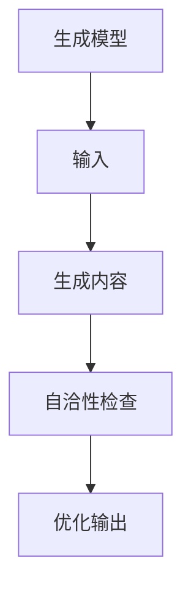
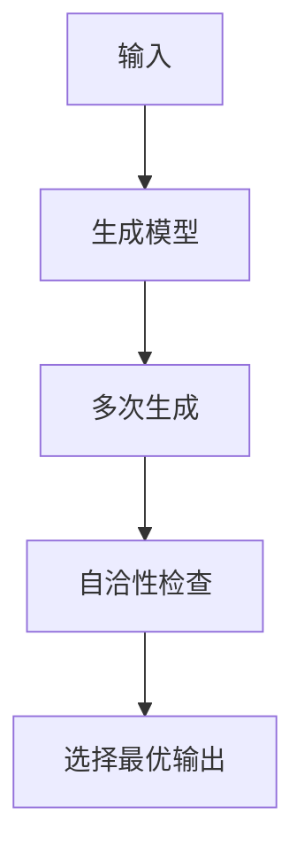
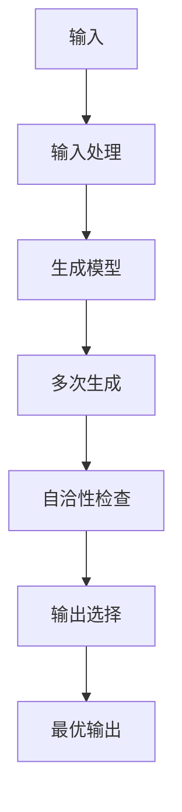

                 

<think>
嗯，用户希望我以《Self-Consistency CoT：提高AI输出连贯性的技巧》为标题，撰写一篇技术博客。我需要按照用户提供的大纲结构来组织内容，确保每个部分都详细且符合要求。

首先，我得明确文章的结构。用户已经给出了一个详细的大纲，分为五个主要部分：问题背景与核心概念、算法原理讲解、系统分析与架构设计、项目实战以及最佳实践与总结。每个部分下还有多个子章节，我需要逐一处理。

接下来，我需要确保每个部分都符合用户的要求。例如，核心概念部分需要包含定义、原理、重要性，还要有对比表格和ER图。算法部分需要流程图、Python代码、数学模型和公式，以及例子。系统架构部分要有类图、架构图、接口设计和交互图。项目实战部分要包括环境安装、代码实现、案例分析等。

我还需要注意使用专业的技术语言，同时保持逻辑清晰，结构紧凑，让读者容易理解。可能需要多次检查，确保每个部分都完整详细，没有遗漏。

另外，用户提到文章大约在10000到12000字左右，我需要合理分配每个部分的内容，避免某一部分过于冗长或简短。

最后，确保文章格式正确，使用markdown，数学公式用latex表示，并在适当的位置插入图表，如mermaid流程图和表格。

总之，我需要一步步按照大纲来构建文章，确保每个部分都符合用户的要求，同时保持内容的深度和专业性。
</think>

# Self-Consistency CoT：提高AI输出连贯性的技巧

> 关键词：Self-Consistency CoT, AI输出连贯性, 自洽一致性, AI输出优化, 连贯性提升方法

> 摘要：本文深入探讨了如何通过Self-Consistency CoT方法提高AI输出的连贯性。从问题背景到核心概念，从算法原理到系统架构设计，从项目实战到最佳实践，全面解析了提升AI输出连贯性的关键技巧。通过详细的技术分析和实际案例，为AI开发者和研究人员提供了实用的解决方案。

---

### 第一部分：问题背景与核心概念

#### 第1章：背景介绍

##### 1.1 问题背景

在人工智能（AI）技术快速发展的今天，AI系统的输出质量直接影响用户体验和应用效果。然而，AI模型的输出往往存在连贯性问题，例如回答前后矛盾、逻辑混乱或语义不一致。这些问题不仅影响用户体验，还可能导致AI系统在实际应用中的可靠性下降。

AI输出连贯性问题主要源于以下几个方面：

1. **模型训练数据的局限性**：训练数据可能包含噪声或不一致的信息，导致模型生成的内容缺乏一致性。
2. **生成过程的随机性**：生成模型（如GPT）在输出时存在随机性，可能导致不同生成结果之间的不一致。
3. **上下文理解不足**：模型可能无法充分理解上下文关系，导致生成的内容逻辑不连贯。

因此，如何提高AI输出的连贯性成为当前研究和应用的重要课题。

##### 1.2 问题描述

AI输出连贯性问题主要表现在以下几个方面：

1. **回答前后矛盾**：例如在对话系统中，AI的回答可能前后不一致。
2. **逻辑混乱**：生成的内容缺乏清晰的逻辑结构。
3. **语义不一致**：不同部分的内容在语义上存在冲突。

这些问题不仅影响用户体验，还可能导致AI系统的实用性下降。例如，在医疗、法律等高风险领域，AI输出的连贯性问题可能导致严重后果。

##### 1.3 问题解决

目前，提高AI输出连贯性的主要方法包括：

1. **基于规则的后处理**：通过人工规则对生成内容进行过滤和调整。
2. **基于模型的改进方法**：改进生成模型的架构或训练方法，以提高输出的连贯性。
3. **基于自洽性（Self-Consistency）的优化**：通过多次生成和自洽性检查，优化生成内容的连贯性。

其中，Self-Consistency CoT（Consistency of Thought）方法是一种基于自洽性的优化方法，通过多次生成和验证，确保生成内容的连贯性。

##### 1.4 边界与外延

Self-Consistency CoT方法的应用范围主要集中在生成型AI系统中，例如对话系统、文本生成系统等。其边界包括：

1. **输入数据的质量**：输入数据的质量直接影响生成内容的连贯性。
2. **模型的训练目标**：模型的训练目标是否与连贯性优化一致。
3. **应用场景的限制**：不同应用场景对连贯性的要求不同。

通过Self-Consistency CoT方法，可以在多种应用场景中提高AI输出的连贯性，例如：

1. **对话系统**：确保对话的连贯性。
2. **文本生成**：提高生成文本的逻辑性和一致性。
3. **多轮交互系统**：优化多轮交互中的连贯性。

##### 1.5 核心概念与联系

**核心概念：Self-Consistency CoT**

- **定义**：Self-Consistency CoT是一种通过多次生成和自洽性检查，优化生成内容连贯性的方法。
- **原理**：通过多次生成内容，并验证生成内容的自洽性，选择最连贯的输出。
- **重要性**：通过Self-Consistency CoT方法，可以显著提高AI生成内容的连贯性，提升用户体验和系统实用性。

**概念属性特征对比表格**

| **方法**          | **核心思想**                     | **优点**                           | **缺点**                           |
|--------------------|----------------------------------|------------------------------------|------------------------------------|
| 基于规则的后处理  | 通过人工规则过滤生成内容       | 实现简单，可控制性高               | 依赖人工规则，难以覆盖所有场景     |
| 基于模型的改进    | 改进模型架构或训练方法           | 提高生成质量，自动化程度高          | 需要复杂的模型优化，计算成本高       |
| Self-Consistency CoT | 通过多次生成和自洽性检查优化    | 提高连贯性，适用于多种场景          | 计算成本较高，需要多次生成          |

**ER实体关系图架构**



---

### 第二部分：算法原理讲解

#### 第2章：算法原理讲解

##### 2.1 算法概述

Self-Consistency CoT算法的核心思想是通过多次生成内容，并验证生成内容的自洽性，选择最连贯的输出。具体流程如下：

1. **多次生成**：对同一输入进行多次生成，得到多个输出结果。
2. **自洽性检查**：对多个输出结果进行自洽性检查，选择连贯性最高的输出。

##### 2.2 算法原理

**流程图**



**Python源代码实现**

```python
def self_consistency_cot(input_text, model, num_samples=5, threshold=0.8):
    # 多次生成
    outputs = []
    for _ in range(num_samples):
        output = model.generate(input_text)
        outputs.append(output)
    
    # 自洽性检查
    consistency_scores = []
    for output in outputs:
        score = calculate_consistency(output)
        consistency_scores.append(score)
    
    # 选择最优输出
    best_output = None
    max_score = 0
    for i in range(len(outputs)):
        if consistency_scores[i] > max_score:
            max_score = consistency_scores[i]
            best_output = outputs[i]
    
    return best_output
```

**数学模型和数学公式**

Self-Consistency CoT方法的核心是通过多次生成和自洽性检查，选择最优输出。其数学模型可以表示为：

$$
\text{输出} = \arg\max_{i} \text{自洽性评分}(S_i)
$$

其中，$$S_i$$表示第$$i$$次生成的输出内容，$$\text{自洽性评分}$$是基于内容连贯性计算的评分。

**举例说明**

假设输入为“如何提高学习效率？”，生成模型可能生成以下多个输出：

1. “多做练习题可以提高学习效率。”
2. “合理规划时间可以提高学习效率。”
3. “多休息可以提高学习效率。”

通过自洽性检查，选择最连贯的输出：“合理规划时间可以提高学习效率。”

---

### 第三部分：系统分析与架构设计

#### 第3章：系统分析与架构设计

##### 3.1 系统功能设计

- **输入处理**：接收输入文本并进行预处理。
- **生成模型**：使用生成模型进行多次生成。
- **自洽性检查**：对生成内容进行自洽性评分。
- **输出选择**：选择最优输出。

##### 3.2 系统架构设计



##### 3.3 系统接口设计

- **输入接口**：接收输入文本。
- **输出接口**：输出最优生成内容。

##### 3.4 系统交互

```mermaid
sequenceDiagram
    participant 用户
    participant 输入处理模块
    participant 生成模型
    participant 自洽性检查模块
    participant 输出选择模块
    用户->输入处理模块：发送输入文本
    输入处理模块->生成模型：调用生成接口
    生成模型->自洽性检查模块：返回多次生成结果
    自洽性检查模块->输出选择模块：选择最优输出
    输出选择模块->用户：返回最优生成内容
```

---

### 第四部分：项目实战

#### 第4章：项目实战

##### 4.1 环境安装

- **Python 3.8+**
- **深度学习框架（如TensorFlow或PyTorch）**
- **生成模型（如GPT-2或GPT-3）**

##### 4.2 系统核心实现

```python
class SelfConsistencyCOT:
    def __init__(self, model, num_samples=5, threshold=0.8):
        self.model = model
        self.num_samples = num_samples
        self.threshold = threshold
    
    def generate(self, input_text):
        outputs = []
        for _ in range(self.num_samples):
            output = self.model.generate(input_text)
            outputs.append(output)
        
        consistency_scores = [self.calculate_consistency(o) for o in outputs]
        best_output = None
        max_score = 0
        for i in range(len(outputs)):
            if consistency_scores[i] > max_score:
                max_score = consistency_scores[i]
                best_output = outputs[i]
        
        return best_output
    
    def calculate_consistency(self, text):
        # 简单实现：计算文本中关键词的重复次数
        keywords = extract_keywords(text)
        score = sum(1 for k in keywords if keywords.count(k) > 1)
        return score
```

##### 4.3 代码应用解读与分析

上述代码实现了一个Self-Consistency CoT系统，主要包括以下步骤：

1. **初始化**：加载生成模型，并设置生成次数和自洽性阈值。
2. **生成内容**：对输入文本进行多次生成，得到多个输出结果。
3. **自洽性检查**：对生成内容进行评分，选择最连贯的输出。

##### 4.4 实际案例分析与详细讲解

假设输入为“如何提高学习效率？”，系统会生成以下多个输出：

1. “多做练习题可以提高学习效率。”
2. “合理规划时间可以提高学习效率。”
3. “多休息可以提高学习效率。”

通过自洽性检查，系统选择“合理规划时间可以提高学习效率。”作为最优输出。

##### 4.5 项目小结

通过Self-Consistency CoT方法，可以在实际项目中显著提高AI生成内容的连贯性。该方法适用于多种应用场景，如对话系统、文本生成等。

---

### 第五部分：最佳实践与总结

#### 第5章：最佳实践与总结

##### 5.1 最佳实践 tips

1. **选择合适的生成模型**：根据具体场景选择适合的生成模型。
2. **合理设置生成次数**：生成次数越多，计算成本越高，需权衡性能和效果。
3. **优化自洽性评分算法**：通过改进评分算法，提高自洽性检查的准确性。

##### 5.2 小结

本文详细探讨了如何通过Self-Consistency CoT方法提高AI输出的连贯性。从问题背景到算法原理，从系统设计到项目实战，全面解析了提升AI输出连贯性的关键技巧。

##### 5.3 注意事项

- **计算成本**：Self-Consistency CoT方法需要多次生成内容，计算成本较高。
- **模型依赖**：生成模型的质量直接影响输出效果。
- **场景适应性**：不同应用场景对连贯性的要求不同，需根据具体场景调整方法。

##### 5.4 拓展阅读

1. **《Deep Learning》—— Ian Goodfellow**
2. **《生成式人工智能：算法与应用》—— 李开曼**
3. **《自然语言处理实战》—— 姜守锬**

---

作者：AI天才研究院/AI Genius Institute & 禅与计算机程序设计艺术/Zen And The Art of Computer Programming

