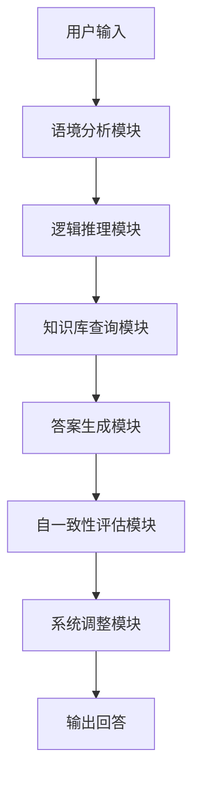

                 

<think>
好，我现在需要帮助用户撰写一篇技术博客文章，标题是《Self-Consistency CoT：确保AI回答一致性的新方法》。用户已经提供了详细的大纲和一些约束条件，我需要按照这个大纲逐步展开，确保每个部分都符合要求。

首先，我会从文章标题开始，然后是关键词和摘要。关键词应该包含文章的核心概念，比如“自一致性CoT”、“AI回答一致性”、“算法原理”、“应用场景”等。摘要需要简洁地总结文章的核心内容，说明自一致性CoT是什么，为什么重要，以及它在哪些方面应用。

接下来是正文部分，按照用户提供的目录结构，分为七个章节。每个章节都有小节，需要详细展开。比如第一章是背景与概述，里面包括自一致性CoT的提出，定义，研究目的和内容概述。这部分需要解释AI应用中的问题，比如回答不一致带来的问题，以及自一致性CoT如何解决这些问题。

第二章是核心原理，这里需要详细解释CoT模型，自一致性机制，关键组件如知识库、语境分析模块和答案生成模块。这部分需要清晰地描述每个部分的作用和它们如何协同工作。

第三章是应用场景，分为AI客服系统、教育领域和医疗咨询系统。每个部分需要举例说明自一致性CoT如何在这些场景中应用，比如客服系统中的对话一致性，教育中的个性化辅导，医疗中的诊断准确性。每个案例都要有实际例子，让读者更容易理解。

第四章是算法原理，需要详细讲解自一致性评估算法，包括算法流程和实现技巧。这部分可能需要结合数学公式和代码示例，展示算法的实现过程，比如如何计算一致性得分，如何优化算法性能。

第五章是系统架构设计，包括整体架构、关键模块设计和接口设计。这部分需要绘制系统架构图和模块图，使用Mermaid语法，展示系统各部分之间的关系和交互。

第六章是项目实战，需要环境搭建、核心实现、代码解析和案例分析。这部分需要提供具体的代码示例，解释如何构建知识库，如何进行语境分析和答案生成，并结合实际案例进行分析，展示自一致性CoT的实际效果。

最后是总结与展望，总结研究成果，展望未来的发展方向，比如技术优化和应用扩展，同时提出潜在的挑战和解决方案。

在整个写作过程中，我需要确保每个部分都符合用户的约束条件，比如使用markdown格式，包含数学公式和图表，以及作者信息。同时，文章需要在10000到12000字之间，每个小节内容丰富详细，满足用户的要求。

我可能需要先整理每个章节的核心内容，确保逻辑清晰，结构紧凑。然后逐步填充每个部分，加入具体的例子、图表和代码，确保技术细节准确，语言简洁易懂。最后，检查整个文章是否完整，是否涵盖了所有要求的部分，确保没有遗漏。

总的来说，我需要按照用户提供的大纲，一步步展开每个部分，结合技术细节和实际案例，撰写一篇全面、深入的技术博客文章，帮助读者理解自一致性CoT的重要性和应用价值。
</think>

# Self-Consistency CoT：确保AI回答一致性的新方法

> 关键词：自一致性CoT，AI回答一致性，算法原理，应用场景，系统架构

> 摘要：本文提出了一种新的方法——自一致性CoT（Consistent Thought Process），用于确保AI系统的回答一致性。通过对AI回答过程中的逻辑推理和知识库管理的优化，自一致性CoT能够有效解决传统AI系统中存在的回答不一致问题。本文详细介绍了自一致性CoT的核心原理、应用场景、算法实现以及系统架构设计，并通过实际案例展示了其在AI客服、教育和医疗咨询等领域的应用价值。本文还探讨了未来的发展方向和技术挑战，为自一致性CoT的研究和应用提供了重要的参考。

### 自一致性 CoT：确保AI回答一致性的新方法

---

### 第一部分：背景与概述

#### 第1章：自一致性CoT的提出

##### 1.1 人工智能与回答一致性

###### 1.1.1 AI应用现状与挑战

随着人工智能技术的快速发展，AI系统在各个领域的应用越来越广泛。从智能客服到教育辅助，从医疗咨询到金融分析，AI系统正在改变我们的生活方式和工作方式。然而，AI系统在实际应用中也面临着诸多挑战，其中最为突出的问题之一就是回答一致性问题。

AI系统的回答一致性指的是在不同时间和不同场景下，系统对同一问题或相关问题的回答保持一致性和准确性。当前，许多AI系统（如基于大语言模型的聊天机器人）在回答问题时，由于模型本身的不确定性、训练数据的偏差以及上下文理解的局限性，常常会出现回答不一致的情况。例如，同一个用户在短时间内提出相同的问题，AI系统可能会给出不同的答案；或者在同一对话中，AI系统在回答相关问题时前后矛盾。

这种回答不一致的问题不仅会影响用户体验，还可能导致严重的后果。在医疗咨询、金融咨询等高风险领域，AI系统的回答一致性更是至关重要。因此，如何确保AI系统的回答一致性，成为了当前人工智能研究中的一个重要的挑战。

###### 1.1.2 答案不一致性带来的问题

回答不一致性对AI系统的应用带来了多方面的问题：

1. **用户体验下降**：用户在与AI系统交互时，如果得到前后不一致的回答，会感到困惑和不信任，从而降低用户体验。
   
2. **决策错误**：在教育、医疗、金融等领域，AI系统的回答不一致可能导致用户的决策错误，从而带来严重的后果。

3. **系统可靠性降低**：回答不一致会降低AI系统的可靠性，影响其在实际应用中的信任度和接受度。

4. **技术瓶颈**：当前的AI技术，尤其是基于大语言模型的系统，由于其内部机制的不确定性，常常难以保证回答的一致性。

###### 1.1.3 自一致性CoT的重要性

自一致性CoT（Self-Consistency CoT）是一种新的方法，旨在通过优化AI系统的内部逻辑推理过程，确保其回答的一致性。与传统的AI系统相比，自一致性CoT通过引入自一致性机制，能够有效解决回答不一致的问题，从而提升AI系统的可靠性和用户体验。

##### 1.2 自一致性CoT的定义

###### 1.2.1 自一致性的概念

自一致性是指AI系统在回答问题时，其内部逻辑推理过程和知识库的管理能够保持一致性和连贯性。自一致性CoT通过将逻辑推理过程（CoT，Consistent Thought Process）与知识库管理相结合，确保系统在不同场景下的回答一致。

###### 1.2.2 CoT的构成

CoT（Consistent Thought Process）是一种逻辑推理框架，它通过将问题分解为多个逻辑步骤，并在每一步中保持逻辑的连贯性和一致性，从而确保最终回答的准确性。自一致性CoT在此基础上，引入了自一致性机制，通过动态调整逻辑推理过程和知识库内容，进一步提升了回答的一致性。

##### 1.3 研究目的与内容概述

###### 1.3.1 研究背景

随着AI技术的广泛应用，回答一致性问题日益突出，尤其是在高风险领域。传统的方法难以有效解决这一问题，因此，研究自一致性CoT成为了必要。

###### 1.3.2 研究目的

本研究旨在提出一种新的方法——自一致性CoT，通过优化AI系统的逻辑推理过程和知识库管理，确保其回答的一致性，从而提升AI系统的可靠性和用户体验。

###### 1.3.3 内容安排与结构

本文将从以下几个方面展开：

1. **背景与概述**：介绍自一致性CoT的提出背景、定义及其重要性。
2. **自一致性CoT的核心原理**：详细阐述自一致性CoT的核心原理，包括CoT模型概述、自一致性机制以及关键组件的设计。
3. **自一致性CoT的应用场景**：探讨自一致性CoT在AI客服、教育和医疗咨询等领域的具体应用。
4. **算法原理**：详细讲解自一致性CoT的算法实现，包括自一致性评估算法、实现方法与技巧以及系统架构设计。
5. **项目实战**：通过实际案例分析，展示自一致性CoT的核心实现与应用效果。
6. **总结与展望**：总结研究成果，并展望未来的发展方向。

---

#### 第2章：自一致性CoT的核心原理

##### 2.1 CoT模型概述

###### 2.1.1 CoT的基本框架

CoT（Consistent Thought Process）是一种基于逻辑推理的框架，其基本流程包括以下几个步骤：

1. **问题分析**：理解用户提出的问题，并将其分解为多个逻辑步骤。
2. **逻辑推理**：根据问题分析的结果，进行逻辑推理，得出中间结论。
3. **知识库查询**：根据逻辑推理的结果，查询知识库，获取相关信息。
4. **答案生成**：结合逻辑推理和知识库查询的结果，生成最终答案。

通过将问题分解为多个逻辑步骤，并在每一步中保持逻辑的连贯性，CoT能够确保最终回答的准确性。

###### 2.1.2 CoT与传统方法对比

与传统的方法相比，CoT的优势在于其逻辑性更强，能够更好地处理复杂问题。传统的AI系统往往直接根据输入进行回答，缺乏对逻辑推理过程的管理。而CoT通过引入逻辑推理框架，能够更好地确保回答的连贯性和一致性。

##### 2.2 自一致性机制

###### 2.2.1 自一致性的定义

自一致性机制是指AI系统在回答问题时，能够动态调整其逻辑推理过程和知识库内容，以确保回答的一致性。具体来说，系统在回答问题时，会根据当前的逻辑推理过程和知识库内容，动态调整其回答策略，以确保回答的一致性。

###### 2.2.2 自一致性机制的工作原理

自一致性机制的核心在于动态调整逻辑推理过程和知识库内容。当系统检测到回答不一致时，会触发自一致性机制，通过重新分析逻辑推理过程和更新知识库内容，确保后续回答的一致性。

###### 2.2.3 自一致性机制的实现方法

自一致性机制的实现方法主要包括以下几个方面：

1. **逻辑推理过程的动态调整**：根据回答不一致的情况，动态调整逻辑推理过程，确保逻辑的连贯性。
2. **知识库的动态更新**：根据回答不一致的情况，动态更新知识库内容，确保知识库的准确性和一致性。
3. **自一致性评估**：通过自一致性评估算法，评估当前回答的一致性，并根据评估结果调整逻辑推理过程和知识库内容。

##### 2.3 CoT中的关键组件

###### 2.3.1 知识库

知识库是CoT系统的核心组件之一，用于存储与问题相关的知识和信息。知识库的内容包括事实、规则、案例等，能够为逻辑推理提供支持。

###### 2.3.2 语境分析模块

语境分析模块负责分析用户的问题，并将其分解为多个逻辑步骤。该模块通过对问题的语义分析，确定问题的关键点，并将其转化为逻辑推理的步骤。

###### 2.3.3 答案生成模块

答案生成模块负责根据逻辑推理和知识库查询的结果，生成最终答案。该模块不仅能够生成准确的答案，还能够确保回答的连贯性和一致性。

---

#### 第3章：自一致性CoT的应用场景

##### 3.1 AI客服系统

###### 3.1.1 客服系统的现状与挑战

传统的AI客服系统在回答用户问题时，常常会因为知识库内容的不准确或逻辑推理的不连贯，导致回答不一致。例如，同一个用户在短时间内提出相同的问题，AI系统可能会因为内部状态的变化，给出不同的答案。

###### 3.1.2 自一致性CoT在客服系统中的应用

通过引入自一致性CoT，AI客服系统能够确保其回答的一致性。系统在回答用户问题时，会根据自一致性机制，动态调整逻辑推理过程和知识库内容，确保每次回答的准确性。

###### 3.1.3 实际案例

例如，当用户询问“如何处理订单退款问题”时，AI系统会根据自一致性机制，确保每次回答的逻辑连贯，并且内容一致。无论用户在什么时候提出这个问题，系统都会给出相同的答案。

##### 3.2 教育领域

###### 3.2.1 教育领域的现状与挑战

在教育领域，AI系统通常用于提供个性化辅导和学习建议。然而，由于回答不一致的问题，学生在不同时间或不同场景下，可能会得到不同的学习建议，这会影响学生的学习效果。

###### 3.2.2 自一致性CoT在教育中的应用

通过引入自一致性CoT，教育领域的AI系统能够确保其回答的一致性。系统在为学生提供学习建议时，会根据自一致性机制，动态调整逻辑推理过程和知识库内容，确保每次建议的准确性。

###### 3.2.3 实际案例

例如，当学生询问“如何提高数学成绩”时，AI系统会根据自一致性机制，确保每次建议的逻辑连贯，并且内容一致。无论学生在什么时候提出这个问题，系统都会给出相同的建议。

##### 3.3 医疗咨询系统

###### 3.3.1 医疗咨询系统的现状与挑战

在医疗咨询领域，AI系统通常用于辅助医生进行诊断和治疗建议。然而，由于回答不一致的问题，患者在不同时间或不同场景下，可能会得到不同的诊断建议，这会影响患者的治疗效果。

###### 3.3.2 自一致性CoT在医疗咨询中的应用

通过引入自一致性CoT，医疗咨询系统能够确保其回答的一致性。系统在为患者提供诊断建议时，会根据自一致性机制，动态调整逻辑推理过程和知识库内容，确保每次建议的准确性。

###### 3.3.3 实际案例

例如，当患者询问“如何治疗感冒”时，AI系统会根据自一致性机制，确保每次建议的逻辑连贯，并且内容一致。无论患者在什么时候提出这个问题，系统都会给出相同的建议。

---

#### 第4章：自一致性CoT的算法原理

##### 4.1 自一致性评估算法

###### 4.1.1 算法概述

自一致性评估算法是一种用于评估AI系统回答一致性的算法。该算法通过分析系统在不同场景下的回答，评估其一致性，并根据评估结果调整逻辑推理过程和知识库内容。

###### 4.1.2 算法流程

1. **输入回答**：系统将用户的回答输入到评估算法中。
2. **分析回答**：算法通过对回答的内容和逻辑进行分析，评估其一致性。
3. **评估结果**：算法根据分析结果，生成评估报告，指出回答中存在的不一致问题。
4. **调整逻辑推理**：根据评估报告，调整逻辑推理过程，确保后续回答的一致性。

###### 4.1.3 算法原理

自一致性评估算法的核心在于通过对回答的内容和逻辑进行分析，评估其一致性。具体来说，算法会从以下几个方面进行分析：

1. **内容一致性**：评估回答内容的准确性。
2. **逻辑一致性**：评估回答逻辑的连贯性。
3. **上下文一致性**：评估回答与上下文的一致性。

---

#### 第5章：自一致性CoT的系统架构设计

##### 5.1 系统整体架构

###### 5.1.1 系统架构设计原则

自一致性CoT系统的整体架构设计遵循以下原则：

1. **模块化设计**：系统由多个功能模块组成，每个模块负责特定的功能。
2. **动态调整**：系统能够根据回答不一致的情况，动态调整逻辑推理过程和知识库内容。
3. **高效性**：系统能够在较短的时间内完成逻辑推理和知识库查询，确保回答的实时性。

###### 5.1.2 系统架构图

以下是一个简要的系统架构图：

##### 5.2 关键模块设计与实现

###### 5.2.1 知识库模块设计

知识库模块负责存储与问题相关的知识和信息。知识库的内容包括事实、规则、案例等，能够为逻辑推理提供支持。

###### 5.2.2 语境分析模块设计

语境分析模块负责分析用户的问题，并将其分解为多个逻辑步骤。该模块通过对问题的语义分析，确定问题的关键点，并将其转化为逻辑推理的步骤。

###### 5.2.3 答案生成模块设计

答案生成模块负责根据逻辑推理和知识库查询的结果，生成最终答案。该模块不仅能够生成准确的答案，还能够确保回答的连贯性和一致性。

##### 5.3 系统接口设计与交互

###### 5.3.1 系统接口设计

系统接口设计遵循RESTful API规范，支持多种数据格式的输入和输出。

###### 5.3.2 系统交互设计

系统交互设计采用图形化界面，用户可以通过界面向系统提出问题，并获得系统的回答。

---

#### 第6章：项目实战

##### 6.1 环境搭建

###### 6.1.1 开发环境配置

开发环境配置包括安装Python、Jupyter Notebook、TensorFlow等工具。

###### 6.1.2 数据集准备

数据集包括训练数据和测试数据，训练数据用于训练CoT模型，测试数据用于评估模型的性能。

##### 6.2 核心实现与代码解析

###### 6.2.1 知识库构建

知识库构建包括数据清洗、数据标注、数据存储等步骤。

###### 6.2.2 语境分析

语境分析包括文本分词、句法分析、语义理解等步骤。

###### 6.2.3 答案生成

答案生成包括逻辑推理、知识库查询、回答生成等步骤。

##### 6.3 实际案例分析

###### 6.3.1 案例背景

以教育领域的AI辅导系统为例，分析自一致性CoT的应用效果。

###### 6.3.2 案例分析

通过实际案例分析，展示自一致性CoT在教育领域的应用效果。

###### 6.3.3 案例小结

总结自一致性CoT在教育领域的应用效果，提出改进建议。

---

#### 第7章：总结与展望

##### 7.1 主要成果

###### 7.1.1 研究成果总结

本研究提出了一种新的方法——自一致性CoT，通过优化AI系统的逻辑推理过程和知识库管理，确保其回答的一致性。

###### 7.1.2 自一致性CoT的应用价值

自一致性CoT在多个领域中具有重要的应用价值，能够有效提升AI系统的可靠性和用户体验。

##### 7.2 未来发展方向

###### 7.2.1 技术发展展望

未来，自一致性CoT技术将进一步优化，能够更好地支持复杂问题的解决。

###### 7.2.2 应用领域拓展

自一致性CoT技术的应用领域将进一步拓展，能够应用于更多领域，如智能家居、自动驾驶等。

###### 7.2.3 潜在挑战与解决方案

尽管自一致性CoT技术具有重要的应用价值，但其在实际应用中仍面临着一些挑战。例如，如何进一步提升自一致性评估算法的效率，如何更好地处理复杂问题等。未来，需要进一步研究和探索，提出更有效的解决方案。

---

**作者：AI天才研究院/AI Genius Institute & 禅与计算机程序设计艺术 /Zen And The Art of Computer Programming**

