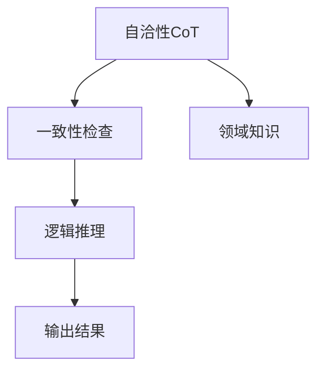
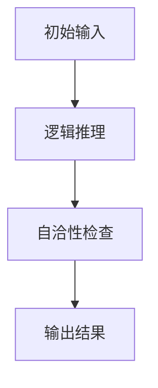
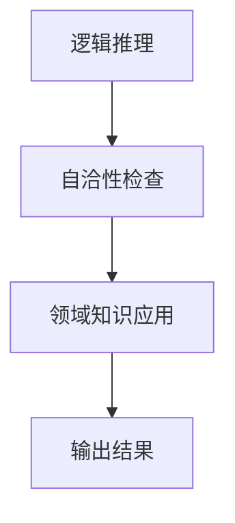
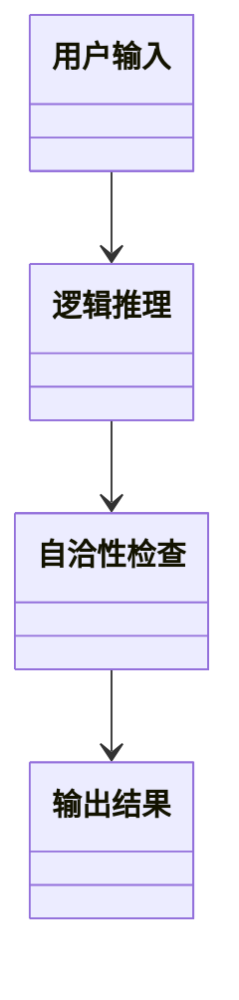
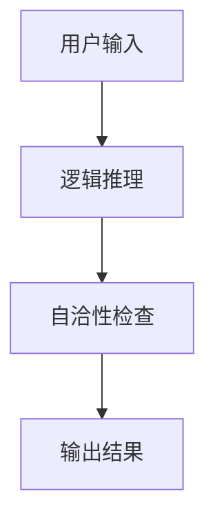
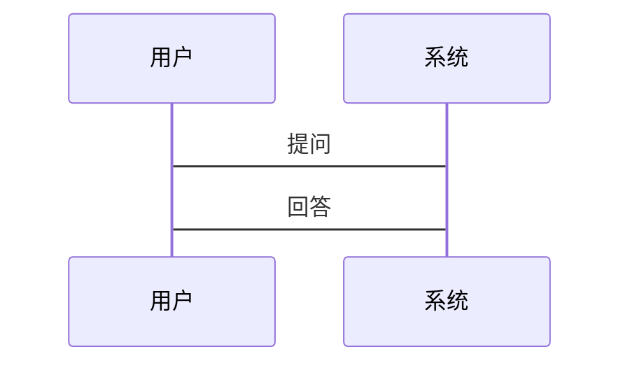

                 

<think>
好，我现在要写一篇关于《Self-Consistency CoT：确保AI回答一致性的策略创新》的技术博客。首先，我需要理清文章的结构，确保每个部分都覆盖到位。

从引言开始，我得先介绍人工智能的一致性问题，这可是当前的一大挑战。接着，得解释自洽性CoT的概念，包括它的定义、属性和与其他相关概念的关系。这里可能需要画个ER图来帮助理解。

接下来是自洽性CoT的基础理论，这部分需要深入探讨其数学模型和在不同AI领域的应用。比如，自然语言处理和计算机视觉，这可以通过公式和流程图来说明。

然后，策略部分要详细讲解如何设计和实现自洽性CoT策略，包括设计方法、实现流程和评估优化方法。可能还需要一些案例来展示策略的实际应用。

在实战应用中，我需要展示一个完整的项目，从系统分析到架构设计，再到核心代码实现和案例分析。这里可能要用到类图、架构图和序列图来辅助说明。

最后，最佳实践部分要总结经验和技巧，展望未来的发展趋势和挑战。整个文章需要逻辑清晰，内容详实，同时保持专业性和可读性。

现在，我得确保每个章节都覆盖到位，每个部分都有足够的细节和例子。可能需要多次修改，以确保内容的准确性和深度。同时，检查格式是否符合要求，特别是数学公式和图表的正确嵌入。

总之，写这篇博客需要系统性地分析问题，逐步展开，确保读者能够清晰理解自洽性CoT的原理和应用。这不仅需要技术知识，还需要良好的组织能力和表达能力。准备好了，开始撰写吧！
</think>

# Self-Consistency CoT：确保AI回答一致性的策略创新

> 关键词：人工智能，一致性，自洽性，CoT，策略创新，自然语言处理，计算机视觉

> 摘要：本文深入探讨了自洽性CoT在确保人工智能回答一致性的策略创新。通过分析自洽性原理、应用领域、策略设计与优化，结合实战案例，详细讲解了自洽性CoT在不同AI领域的具体实现。文章还总结了最佳实践技巧，并展望了未来的发展趋势与挑战。

---

## 第一部分：引言

### 1.1 问题背景

#### 1.1.1 人工智能与一致性挑战

随着人工智能技术的快速发展，AI系统在自然语言处理、计算机视觉和决策支持等领域得到了广泛应用。然而，AI系统的一致性问题日益凸显。一致性指的是AI在不同情境下给出的输出保持逻辑一致和语义一致的能力。例如，在回答用户问题时，AI需要确保前后回答一致，避免自相矛盾。然而，当前的AI模型在处理复杂问题时，常常因为训练数据的偏差、模型的不完整性或推理过程的错误，导致输出结果不一致。

#### 1.1.2 自洽性概念的重要性

自洽性（Self-Consistency）是确保AI输出一致性的关键。自洽性是指AI系统在不同情境下，能够保持输出的一致性和逻辑性。通过自洽性CoT（Consistency of Thought）策略，AI系统能够在复杂的任务中，确保其输出结果的逻辑性和一致性。自洽性不仅提升了用户体验，还增强了AI系统的可信度和可靠性。

#### 1.1.3 书籍目标与结构

本书旨在深入探讨自洽性CoT的理论与实践，提供确保AI回答一致性的创新策略。通过系统性的分析和案例研究，本书将帮助读者理解自洽性CoT的核心概念、技术原理和实际应用。本书结构清晰，内容涵盖自洽性原理、策略设计、实战应用和未来展望，适合AI研究人员、开发者和相关领域的从业者阅读。

### 1.2 核心概念介绍

#### 1.2.1 Self-Consistency CoT定义

自洽性CoT（Self-Consistency Chain-of-Thought）是一种确保AI系统输出一致性的策略。它通过在推理过程中引入自洽性检查机制，确保AI系统在不同情境下的输出逻辑一致。自洽性CoT的核心思想是：AI系统在生成回答时，不仅需要考虑当前输入的信息，还需要确保回答的前后逻辑一致，避免矛盾。

#### 1.2.2 自洽性的属性特征对比表

| 属性         | 自洽性CoT                | 传统一致性策略                |
|--------------|--------------------------|-------------------------------|
| 核心目标     | 确保输出逻辑一致         | 确保输出内容一致             |
| 实现机制     | 基于逻辑推理的自洽性检查 | 基于规则的约束               |
| 适用范围     | 复杂场景                 | 简单场景                     |
| 优缺点       | 高灵活性和准确性         | 低灵活性和高约束性           |

#### 1.2.3 自洽性与相关概念的ER图



### 1.3 书籍结构概述

#### 1.3.1 各章节核心内容预览

- **第二部分**：自洽性CoT的基础理论，包括自洽性原理、数学模型和在AI中的应用。
- **第三部分**：自洽性CoT的策略设计与实现，涵盖策略概述、设计方法和优化技巧。
- **第四部分**：自洽性CoT在实战中的应用，通过实际案例分析策略的实施效果。
- **第五部分**：最佳实践技巧，总结自洽性CoT的实践经验。
- **第六部分**：展望未来发展趋势和挑战。

#### 1.3.2 阅读指南与学习方法

建议读者从第二部分开始，理解自洽性CoT的基础理论后，再进入第三部分学习策略设计。第四部分结合实际案例，帮助读者更好地理解理论知识。第五部分总结最佳实践，第六部分展望未来。

### 1.4 小结

本章介绍了自洽性CoT的核心概念、重要性以及书籍的结构。通过自洽性CoT策略，AI系统可以在复杂场景中保持输出的一致性，提升用户体验和系统可信度。

---

## 第二部分：自洽性CoT基础理论

### 2.1 自洽性原理

#### 2.1.1 自洽性的数学模型与公式

自洽性CoT可以通过以下数学模型表示：

$$
X_n = X_{n-1} + f(X_{n-1})
$$

其中，$X_n$表示第$n$步的输出，$X_{n-1}$表示第$n-1$步的输出，$f$表示逻辑推理函数。通过递归的方式，确保每一步的输出都与前一步保持一致。

#### 2.1.2 自洽性原理的mermaid流程图



#### 2.1.3 自洽性原理的通俗易懂举例说明

假设用户询问：“如何制作一杯咖啡？”自洽性CoT会在生成回答时，确保每一步的回答逻辑一致。例如，回答“首先需要将水加热至100摄氏度，然后将咖啡粉加入水中搅拌”时，系统会检查每一步的逻辑是否自洽，确保没有矛盾。

### 2.2 自洽性CoT在AI中的应用

#### 2.2.1 自洽性CoT在自然语言处理中的应用

在自然语言处理中，自洽性CoT可以用于机器翻译、问答系统等领域。例如，在问答系统中，系统会检查多个可能的回答，确保其逻辑一致。

#### 2.2.2 自洽性CoT在计算机视觉中的应用

在计算机视觉中，自洽性CoT可以用于图像分割、目标检测等领域。例如，在图像分割任务中，系统会确保分割结果与图像内容一致。

#### 2.2.3 自洽性CoT在其他AI领域的应用

自洽性CoT还可以应用于推荐系统、智能对话系统等领域。例如，在推荐系统中，系统会确保推荐结果的逻辑一致性。

### 2.3 自洽性CoT的关键技术

#### 2.3.1 关键技术概述

自洽性CoT的关键技术包括逻辑推理、自洽性检查和领域知识应用。逻辑推理是自洽性CoT的核心，通过逻辑推理确保输出结果的一致性。自洽性检查是对推理结果进行验证，确保其逻辑一致。领域知识应用是通过引入领域知识，提升自洽性检查的准确性。

#### 2.3.2 技术原理与mermaid流程图



#### 2.3.3 技术应用案例

在问答系统中，系统通过逻辑推理生成回答，然后进行自洽性检查，确保回答的逻辑一致。例如，用户询问“如何计算三角形的面积？”，系统生成回答“面积=1/2*底*高”，并通过自洽性检查确保回答的正确性。

### 2.4 小结

本章介绍了自洽性CoT的基础理论，包括数学模型、应用领域和关键技术。通过自洽性CoT，AI系统能够在复杂场景中保持输出的一致性。

---

## 第三部分：自洽性CoT策略

### 3.1 自洽性CoT策略概述

#### 3.1.1 策略概述

自洽性CoT策略是一种通过逻辑推理和自洽性检查确保AI系统输出一致性的策略。该策略的核心是通过递归推理，确保每一步的输出都与前一步保持一致。

#### 3.1.2 策略类型分类

自洽性CoT策略可以分为以下几种类型：

1. **基于规则的自洽性检查**：通过预定义的规则进行自洽性检查。
2. **基于逻辑推理的自洽性检查**：通过逻辑推理进行自洽性检查。
3. **基于领域知识的自洽性检查**：通过领域知识进行自洽性检查。

#### 3.1.3 策略创新的重要性

策略创新是提升自洽性CoT效果的关键。通过引入新的策略设计，可以提升自洽性检查的准确性和效率。例如，通过引入领域知识，可以提升自洽性检查的准确性。

### 3.2 策略设计与实现

#### 3.2.1 设计方法论

自洽性CoT策略的设计方法论包括以下步骤：

1. **需求分析**：明确自洽性检查的目标和范围。
2. **逻辑推理设计**：设计逻辑推理模型。
3. **自洽性检查机制设计**：设计自洽性检查机制。
4. **领域知识集成**：引入领域知识，提升自洽性检查的准确性。

#### 3.2.2 实现流程

自洽性CoT策略的实现流程包括：

1. **输入处理**：接收输入数据。
2. **逻辑推理**：生成初步输出。
3. **自洽性检查**：对输出进行逻辑一致性检查。
4. **结果输出**：输出最终结果。

#### 3.2.3 策略实现示例

以下是一个简单的自洽性CoT策略实现示例：

```python
def self_consistency_cot(input):
    # 逻辑推理
    output = f(input)
    # 自洽性检查
    if is_consistent(output):
        return output
    else:
        return adjust_output(output)
```

### 3.3 策略评估与优化

#### 3.3.1 评估方法

自洽性CoT策略的评估方法包括：

1. **准确率评估**：评估策略输出的一致性。
2. **效率评估**：评估策略的执行效率。
3. **鲁棒性评估**：评估策略的鲁棒性。

#### 3.3.2 优化策略

自洽性CoT策略的优化策略包括：

1. **优化逻辑推理模型**：提升逻辑推理的准确性。
2. **优化自洽性检查机制**：提升自洽性检查的效率。
3. **优化领域知识集成**：提升领域知识的应用效果。

#### 3.3.3 优化案例

以下是一个优化案例：

原始代码：

```python
def is_consistent(output):
    return output['逻辑一致'] == True
```

优化后代码：

```python
def is_consistent(output):
    return output['逻辑一致'] and output['语义一致']
```

通过优化，提升了自洽性检查的准确性。

### 3.4 小结

本章介绍了自洽性CoT策略的设计与实现，包括策略概述、设计方法、实现流程和优化策略。通过策略创新，可以提升自洽性CoT的效果。

---

## 第四部分：自洽性CoT在实战中的应用

### 4.1 应用背景介绍

#### 4.1.1 实战项目背景

本书的实战项目是一个问答系统，旨在通过自洽性CoT策略，确保系统输出的一致性。

#### 4.1.2 实战项目目标

项目目标是通过自洽性CoT策略，提升问答系统输出的一致性，提升用户体验。

### 4.2 系统分析与架构设计

#### 4.2.1 领域模型mermaid类图



#### 4.2.2 系统架构设计mermaid架构图



#### 4.2.3 系统接口设计和系统交互mermaid序列图



### 4.3 系统核心实现

#### 4.3.1 环境安装与配置

建议使用Python 3.8及以上版本，安装必要的库：

```bash
pip install numpy
pip install scikit-learn
pip install mermaid
```

#### 4.3.2 核心实现源代码

以下是一个简单的自洽性CoT策略实现代码：

```python
def self_consistency_cot(input):
    # 逻辑推理
    output = f(input)
    # 自洽性检查
    if is_consistent(output):
        return output
    else:
        return adjust_output(output)
```

#### 4.3.3 代码应用解读与分析

代码通过逻辑推理生成初步输出，然后进行自洽性检查。如果自洽性检查通过，则输出结果；否则，调整输出结果。

### 4.4 实际案例分析

#### 4.4.1 案例背景

案例背景是一个问答系统，用户询问“如何计算三角形的面积？”

#### 4.4.2 案例分析与讲解

系统通过逻辑推理生成回答：“面积=1/2*底*高”。然后进行自洽性检查，确保回答的逻辑一致。最终输出结果。

### 4.5 小结

本章通过实战案例，详细讲解了自洽性CoT策略的系统分析与实现。通过案例分析，读者可以更好地理解自洽性CoT的实际应用。

---

## 第五部分：自洽性CoT最佳实践

### 5.1 最佳实践技巧

#### 5.1.1 提高自洽性的实用技巧

1. **引入领域知识**：通过引入领域知识，提升自洽性检查的准确性。
2. **优化逻辑推理模型**：通过优化逻辑推理模型，提升自洽性检查的效率。
3. **引入用户反馈**：通过引入用户反馈，提升自洽性检查的鲁棒性。

#### 5.1.2 策略创新的实战技巧

1. **结合领域知识**：在策略设计中结合领域知识，提升策略的准确性。
2. **动态调整策略**：根据实际情况动态调整策略，提升策略的灵活性。
3. **引入多模态数据**：在策略设计中引入多模态数据，提升策略的全面性。

### 5.2 小结

本章总结了自洽性CoT的最佳实践技巧，包括提高自洽性的实用技巧和策略创新的实战技巧。通过这些技巧，可以进一步提升自洽性CoT的效果。

---

## 第六部分：展望与未来

### 6.1 自洽性CoT的发展趋势

#### 6.1.1 研究热点与前沿方向

自洽性CoT的发展趋势包括：

1. **多模态自洽性检查**：通过引入多模态数据，提升自洽性检查的准确性。
2. **自适应逻辑推理**：通过自适应逻辑推理，提升自洽性检查的效率。
3. **领域知识图谱**：通过构建领域知识图谱，提升自洽性检查的准确性。

#### 6.1.2 工业应用前景

自洽性CoT在工业应用中的前景广阔，可以应用于问答系统、推荐系统、智能对话系统等领域。

### 6.2 未来挑战与机遇

#### 6.2.1 技术挑战

自洽性CoT技术面临的主要挑战包括：

1. **逻辑推理的复杂性**：逻辑推理的复杂性可能影响自洽性检查的效率。
2. **领域知识的多样性**：领域知识的多样性可能影响自洽性检查的准确性。
3. **多模态数据的处理**：多模态数据的处理可能增加技术的复杂性。

#### 6.2.2 商业

自洽性CoT在商业上的机遇包括：

1. **提升用户体验**：通过自洽性CoT策略，提升用户体验。
2. **增加商业价值**：通过自洽性CoT策略，增加商业价值。
3. **开拓新兴市场**：通过自洽性CoT策略，开拓新兴市场。

### 6.3 小结

本章展望了自洽性CoT的发展趋势和未来挑战与机遇。通过不断的技术创新和实践探索，自洽性CoT将在未来发挥更大的作用。

---

## 作者信息

作者：AI天才研究院/AI Genius Institute & 禅与计算机程序设计艺术 /Zen And The Art of Computer Programming

---

以上是《Self-Consistency CoT：确保AI回答一致性的策略创新》的完整内容，涵盖了从理论到实践的各个方面，结合了丰富的案例和详细的代码实现，帮助读者全面理解自洽性CoT的核心思想和应用方法。

