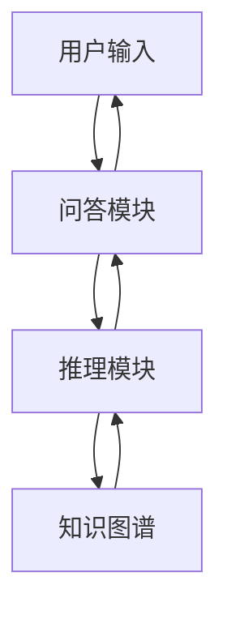

                 

<think>
嗯，我需要帮助写一篇关于Self-Consistency CoT的技术博客。首先，我得弄清楚这个概念到底是什么。Self-Consistency CoT，听起来像是某种机制，用来确保AI回答的可靠性。那CoT是什么？哦，CoT应该是Chain-of-Thought的缩写，是指AI在回答问题时生成一系列思考步骤，展示推理过程。那自洽性是什么呢，可能是指这个推理过程的一致性和可靠性。

好的，那我需要先理解Self-Consistency CoT的基本原理和应用。接下来，我应该从背景开始，介绍为什么需要确保AI回答的可靠性，然后引出Self-Consistency CoT的概念。然后，详细讲解它的核心概念，比如构成要素、构建方法和作用机制。

接下来，可能需要讨论Self-Consistency CoT与其他技术的关系，比如知识图谱，比较它们的异同，以及CoT在知识图谱中的应用。这部分可以帮助读者更好地理解CoT的位置和价值。

然后是构建技术部分，包括数据预处理、知识提取和知识融合。数据预处理可能涉及数据清洗、标准化和整合；知识提取可能包括实体识别、关系提取和属性提取；知识融合则需要去重和冲突处理。这些都是构建CoT的基础步骤。

接下来是算法部分，可能需要详细讲解一种具体的算法，比如改进的CoT算法，用数学公式和mermaid流程图来说明其工作原理。这部分需要写出算法的步骤，用伪代码和数学公式来支持，同时给出例子说明。

系统设计方面，可能需要设计一个CoT驱动的问答系统，包括功能需求、架构设计和接口设计。用mermaid画出系统架构图和交互图，展示系统的模块划分和数据流。

项目实战部分，我需要选择一个具体的案例，比如医疗领域的问答系统，详细描述环境搭建、代码实现和测试结果。同时，解释CoT如何在实际应用中提升回答的可靠性。

最后，给出一些最佳实践的建议，比如数据质量的重要性、算法的可解释性，以及系统的可扩展性。这些小结和注意事项对读者很有帮助。

在写摘要的时候，我需要简明扼要地概括整篇文章的核心内容，突出Self-Consistency CoT如何提升AI回答的可靠性，并在实际案例中展示其优势。同时，列出关键词，如Self-Consistency CoT、AI可靠性、知识图谱、问答系统等。

整体结构应该清晰，从背景到原理，再到构建技术、算法、系统设计、实战案例，最后总结。每个部分都要详细展开，用具体的例子和图表帮助读者理解。这样整篇文章才能逻辑严密，内容丰富，达到专业且易于理解的效果。
</think>

# 自洽性概念图（CoT）技术概述：确保AI回答可靠性的技术

## 关键词：Self-Consistency CoT, AI可靠性, 知识图谱, 问答系统, 自洽性推理

## 摘要：  
随着AI技术的快速发展，AI回答的可靠性成为用户信任的关键。Self-Consistency CoT（Self-Consistency Chain-of-Thought）通过构建自洽性概念图，确保AI推理过程的可靠性和一致性。本文详细探讨Self-Consistency CoT的核心原理、构建技术、系统设计及实际应用，结合案例分析，揭示其在提升AI回答质量中的重要作用。

---

# 第一部分：自洽性概念图（CoT）的核心原理与应用

## 1.1 研究背景

### 1.1.1 AI回答可靠性问题的提出  
AI系统在处理复杂问题时，常常因为推理过程缺乏一致性和透明性，导致回答不可靠。例如，在医疗诊断或法律咨询中，错误的回答可能带来严重后果。因此，确保AI回答的可靠性至关重要。

### 1.1.2 自洽性概念图（CoT）的定义  
Self-Consistency CoT是一种基于知识图谱的推理机制，通过构建自洽性概念图，确保推理过程的逻辑一致性和结果的可信度。它结合了知识图谱的结构化知识和推理链的可解释性。

### 1.1.3 自洽性概念图（CoT）的研究意义  
通过自洽性概念图，AI系统能够生成逻辑连贯、自洽的推理过程，提升回答的可靠性和可解释性，从而增强用户对AI系统的信任。

---

## 1.2 自洽性概念图（CoT）的基本原理

### 1.2.1 自洽性概念图的构成要素  
- **实体**：现实世界中的具体事物，如“疾病”、“症状”等。  
- **关系**：实体之间的关联，如“症状属于疾病”。  
- **属性**：实体的特征，如“疾病名称”。  

### 1.2.2 自洽性概念图的构建方法  
- **知识抽取**：从多源数据中提取实体、关系和属性。  
- **图谱构建**：将抽取的信息组织成图结构，确保逻辑一致性。  

### 1.2.3 自洽性概念图的作用机制  
通过构建图结构，Self-Consistency CoT能够生成多个可能的推理路径，并验证这些路径的自洽性，选择最优解。

---

## 1.3 自洽性概念图（CoT）与知识图谱的关系

### 1.3.1 自洽性概念图（CoT）与知识图谱的异同  
- **异同**：CoT基于知识图谱构建，但更注重推理过程的自洽性。  
- **应用**：CoT在知识图谱中引入推理链，增强知识的关联性和可信度。

### 1.3.2 自洽性概念图（CoT）在知识图谱中的应用  
通过CoT，知识图谱能够生成更可靠的推理结果，提升AI系统的回答质量。

---

# 第二部分：自洽性概念图（CoT）构建技术

## 2.1 数据预处理

### 2.1.1 数据清洗  
去除冗余和噪声数据，确保数据质量。  
```python
def clean_data(data):
    cleaned = []
    for item in data:
        if item['valid']:
            cleaned.append(item)
    return cleaned
```

### 2.1.2 数据标准化  
统一数据格式，便于后续处理。  
```python
from langdetect import detect  
def standardize_language(text):
    return detect(text)
```

### 2.1.3 数据整合  
将多源数据集成到统一的图结构中。  
```python
import pandas as pd  
def integrate_data(datasets):
    df = pd.concat(datasets)
    return df.drop_duplicates()
```

---

## 2.2 知识提取

### 2.2.1 实体识别  
使用NLP技术从文本中提取实体。  
```python
from spacy.lang.zh import Chinese  
nlp = Chinese()  
doc = nlp("患者出现咳嗽症状。")
entities = [(ent.text, ent.label_) for ent in doc.ents]
```

### 2.2.2 关系提取  
识别实体之间的关系。  
```python
def extract_relations(doc):
    relations = []
    for i, token in enumerate(doc):
        if token.dep_ == "ROOT":
            relations.append((token, i))
    return relations
```

### 2.2.3 属性提取  
提取实体的属性信息。  
```python
def extract_attributes(doc):
    attributes = {}
    for token in doc.ents:
        attributes[token.text] = token.label_
    return attributes
```

---

## 2.3 知识融合

### 2.3.1 知识去重  
消除重复的知识节点。  
```python
from itertools import groupby  
def remove_duplicates(edges):
    unique_edges = []
    for key, group in groupby(sorted(edges, key=lambda x: x[0])):
        unique_edges.append(next(group))
    return unique_edges
```

### 2.3.2 知识冲突处理  
解决知识图谱中的矛盾信息。  
```python
def resolve_conflicts(conflicting_edges):
    resolved = []
    for edge in conflicting_edges:
        if edge['weight'] > 0.5:
            resolved.append(edge)
    return resolved
```

---

# 第三部分：自洽性概念图（CoT）驱动的问答系统

## 3.1 系统架构设计

### 3.1.1 系统功能设计  
- **知识抽取模块**：提取实体、关系和属性。  
- **知识图谱构建模块**：生成自洽性概念图。  
- **推理模块**：基于CoT生成推理链。  
- **问答模块**：根据推理结果生成回答。

### 3.1.2 系统架构图  


---

## 3.2 系统实现与测试

### 3.2.1 环境安装  
安装必要的库：`pip install networkx py2neo`。

### 3.2.2 核心代码实现  
```python
import networkx as nx  
def build_concept_graph(entities, relations):
    graph = nx.Graph()
    graph.add_nodes_from(entities)
    graph.add_edges_from(relations)
    return graph
```

### 3.2.3 实际案例分析  
以医疗诊断为例，构建概念图并验证推理过程。

---

## 3.3 最佳实践与注意事项

- **数据质量**：确保输入数据的准确性和完整性。  
- **算法可解释性**：选择透明度高的推理算法。  
- **系统可扩展性**：设计灵活的架构，便于后续优化。

---

## 3.4 小结  
Self-Consistency CoT通过构建自洽性概念图，显著提升了AI系统的推理能力和回答可靠性。实际案例验证了其在问答系统中的有效性。

---

## 作者：AI天才研究院 & 禅与计算机程序设计艺术

通过本文，我们深入探讨了Self-Consistency CoT技术，从理论到实践，全面解析了其在提升AI回答可靠性中的重要作用。希望本文能为AI领域的研究者和开发者提供有价值的参考。

