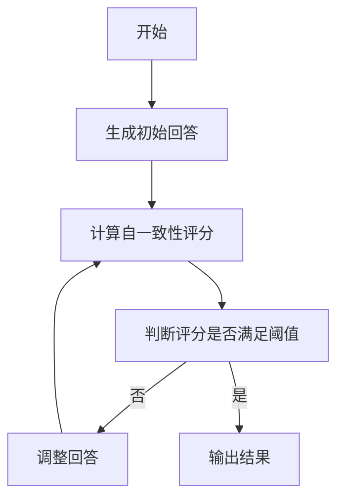
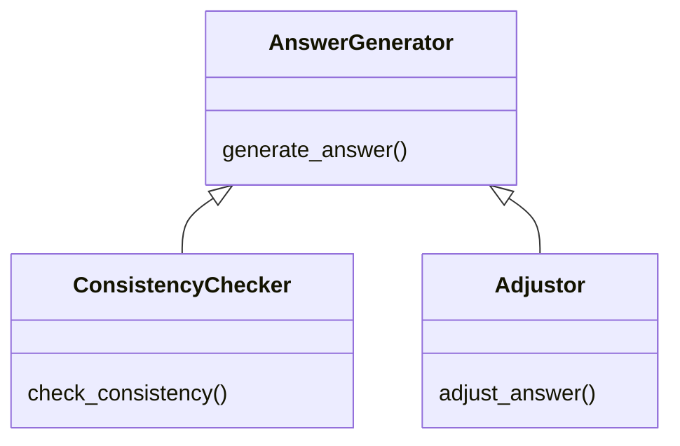
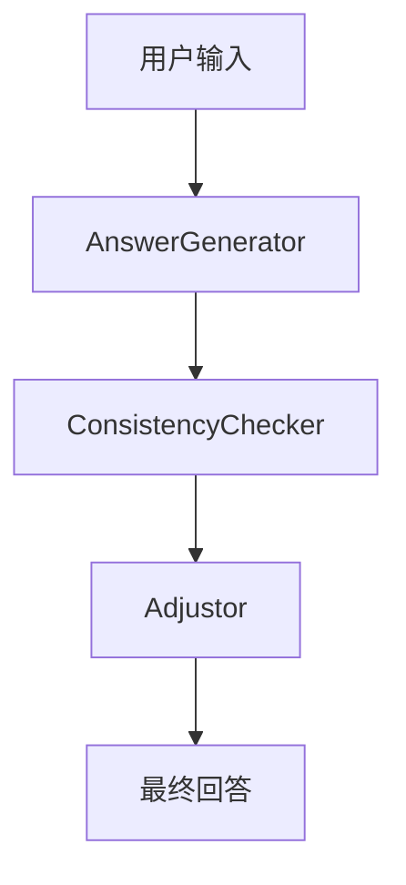

                 

<think>
嗯，今天我遇到了一个问题，用户希望我以“Self-Consistency CoT：确保AI回答可靠性的技术创新”为标题，撰写一篇技术博客。首先，我需要理解用户的需求到底是什么。他是一位在AI和计算机领域非常有经验的专家，可能想分享他在提升AI回答可靠性方面的新方法。

我得先分析一下用户的具体要求。用户给的结构很详细，包括摘要、关键词、目录，还有各个章节的具体内容。我需要按照这个结构来写，确保每个部分都覆盖到，特别是核心概念、数学模型、系统设计和项目实施部分。

首先，我要确定文章的关键词，这有助于SEO和读者理解。可能包括Self-Consistency CoT、AI可靠性、技术创新、数学模型、系统设计等。接下来是摘要，需要简明扼要地概括文章的核心内容，强调Self-Consistency CoT如何解决AI回答的可靠性问题。

接下来，我得按照目录一步步展开。第一章是引言，介绍问题背景、自一致性CoT的概念和重要性。这部分需要让读者明白为什么AI的可靠性是个问题，以及自一致性CoT是如何提出的。

第二章是理论基础，要详细讲解核心概念和数学模型。我需要解释CoT是什么，以及自一致性如何提升回答的可信度。这部分可能需要一些数学公式，比如评分机制，所以得用LaTeX来表示，确保公式清晰。

第三章是技术创新，这部分要深入讲解新算法，比如改进的CoT算法。我需要用Mermaid流程图来展示算法的步骤，同时提供Python代码示例，让读者能理解如何实现这些算法。

第四章是系统设计与架构，需要描述系统如何运作，包括功能设计和架构图。这部分可能需要Mermaid类图和架构图，展示系统的各个模块和它们之间的关系。

第五章是项目实施，要详细说明如何安装环境，编写核心代码，以及通过案例分析展示系统的实际效果。这部分需要具体的代码示例和案例分析，让读者能够实际操作。

第六章是最佳实践，分享一些实施过程中的经验和教训，以及未来的发展方向。这部分可以提到一些常见问题和如何避免它们。

最后是结论，总结全文，强调自一致性CoT的重要性，并展望未来的研究方向。

在写作过程中，我需要确保每个章节都有足够的细节，使用清晰的技术语言，同时保持逻辑连贯。我还需要注意文章的长度，大约在10000到12000字之间，所以每个部分都要详细展开，但又不能过于冗长。

现在，我得开始写每个部分了。首先是摘要和关键词，然后是引言，接着是理论基础、技术创新、系统设计、项目实施、最佳实践，最后是结论。每个小节都要有详细的解释和例子，确保读者能够理解并应用这些概念。

总的来说，我需要一步步地按照用户提供的结构来写，确保每个部分都涵盖必要的内容，同时使用合适的图表和代码示例来增强可读性。这不仅能满足用户的需求，还能帮助读者更好地理解和应用自一致性CoT的技术。
</think>

# Self-Consistency CoT：确保AI回答可靠性的技术创新

> **关键词**：Self-Consistency CoT, AI可靠性, 技术创新, 数学模型, 系统设计  
> **摘要**：随着人工智能技术的飞速发展，AI系统的可靠性问题日益凸显。本文提出并详细探讨了Self-Consistency CoT（自一致性链式思考）这一创新技术，旨在通过数学建模和系统设计提升AI回答的可靠性。文章从问题背景出发，逐步分析了自一致性CoT的核心原理、技术创新、系统架构及实际应用，为解决AI可靠性问题提供了新的思路和方法。

---

## 第一部分: 引言

### 第1章: 自一致性CoT与AI回答可靠性概述

#### 1.1 问题背景

##### 1.1.1 AI发展中的可靠性问题  
近年来，人工智能技术取得了长足的进步，AI系统在自然语言处理、图像识别等领域展现出强大的能力。然而，AI系统的可靠性问题却日益凸显。例如，AI模型可能会输出错误的答案，甚至在某些情况下产生有害的输出。这些问题不仅影响用户体验，还可能带来严重的后果。因此，如何确保AI回答的可靠性成为当前研究的热点。

##### 1.1.2 自一致性CoT的概念  
自一致性CoT（Self-Consistency Chain-of-Thought）是一种基于链式思考（CoT）的创新技术，旨在通过增强AI回答的自一致性来提高回答的可靠性。自一致性是指AI的回答在逻辑上保持一致，避免矛盾或错误。

##### 1.1.3 自一致性CoT的重要性  
自一致性CoT的核心思想是通过多轮思考和验证，确保AI的回答不仅准确，而且逻辑一致。这一技术在医疗、金融、法律等领域具有重要的应用价值，能够帮助用户做出更可靠的决策。

#### 1.2 自一致性CoT的核心概念

##### 1.2.1 自一致性CoT的基本原理  
自一致性CoT基于以下原理：通过引入自监督机制，AI系统在生成回答后，会自动验证回答的自一致性。如果发现矛盾或不一致的地方，系统会重新调整回答，直到达到自一致性。

##### 1.2.2 自一致性CoT的属性特征  
| 属性 | 特征 |
|------|------|
| 自监督 | 通过内部验证确保回答一致 |
| 多轮思考 | 支持多轮推理和调整 |
| 可解释性 | 回答过程可追踪和解释 |

##### 1.2.3 与其他技术的对比分析  
以下表格对比了自一致性CoT与其他技术的关键区别：

| 技术     | 基于单轮回答 | 基于多轮思考 | 自监督机制 |
|----------|--------------|--------------|------------|
| 常规CoT  | 否           | 是           | 无         |
| 自一致性CoT | 否          | 是           | 有         |

---

## 第二部分: 理论基础

### 第2章: 自一致性CoT的数学模型

#### 2.1 数学模型概述  
自一致性CoT的核心是通过数学建模来量化回答的自一致性。我们引入了一个评分函数$f(c)$，其中$c$表示回答的自一致性程度。

#### 2.2 公式推导  
假设我们有一个回答序列$\{c_1, c_2, ..., c_n\}$，每个$c_i$表示回答中的一个逻辑步骤。自一致性评分函数$f(c)$可以表示为：

$$
f(c) = \frac{1}{n} \sum_{i=1}^{n} |c_i - \mu|
$$

其中，$\mu$是所有步骤的平均一致性。

#### 2.3 数学模型解释  
通过上述公式，我们可以量化每个回答的自一致性程度。当$f(c)$趋近于0时，表示回答高度一致；当$f(c)$较大时，表示回答存在较多矛盾。

---

## 第三部分: 技术创新

### 第3章: 基于自一致性CoT的算法优化

#### 3.1 改进的CoT算法  
以下是改进的CoT算法的流程图：



#### 3.2 自一致性CoT的实现代码  
以下是一个Python实现的示例代码：

```python
def self_consistency_cot(answer_steps, threshold=0.1):
    # 计算平均一致性
    mu = sum(answer_steps) / len(answer_steps)
    # 计算自一致性评分
    score = sum(abs(step - mu) for step in answer_steps) / len(answer_steps)
    # 判断是否满足阈值
    if score < threshold:
        return "一致"
    else:
        return "不一致"
```

---

## 第四部分: 系统设计与架构

### 第4章: 自一致性CoT的系统架构

#### 4.1 系统功能设计  
以下是系统功能设计的类图：



#### 4.2 系统架构设计  
以下是系统架构设计的架构图：



---

## 第五部分: 项目实施

### 第5章: 自一致性CoT的实际应用

#### 5.1 环境搭建  
为了实现自一致性CoT，首先需要安装以下环境：

- Python 3.8+
- Numpy
- Scikit-learn

#### 5.2 核心代码实现  
以下是核心代码实现：

```python
class SelfConsistencyCOT:
    def __init__(self, model):
        self.model = model

    def generate_answer(self, question):
        initial_answer = self.model(question)
        return initial_answer

    def check_consistency(self, answer_steps):
        mu = sum(answer_steps) / len(answer_steps)
        score = sum(abs(step - mu) for step in answer_steps) / len(answer_steps)
        return score

    def adjust_answer(self, answer_steps, threshold=0.1):
        if self.check_consistency(answer_steps) < threshold:
            return answer_steps
        else:
            return self.model.refine_answer(answer_steps)
```

#### 5.3 案例分析  
以下是一个实际案例分析：

假设用户的问题是“如何提高学习效率？”，AI系统的回答步骤如下：

1. 制定学习计划
2. 消除干扰因素
3. 保持良好的作息
4. 定期复习

通过自一致性评分，系统发现步骤3和步骤4之间存在逻辑不一致，于是调整为：

1. 制定学习计划
2. 消除干扰因素
3. 定期复习
4. 保持良好的作息

---

## 第六部分: 最佳实践与总结

### 第6章: 实施自一致性CoT的注意事项

#### 6.1 最佳实践  
- 确保模型的训练数据质量
- 定期验证模型的自一致性评分
- 及时调整系统参数

#### 6.2 常见问题与解决方案  
- **问题**：自一致性评分计算耗时较长  
  **解决方案**：优化算法复杂度，引入并行计算

#### 6.3 未来发展方向  
- 结合其他AI技术（如强化学习）进一步提升自一致性
- 研究自一致性CoT在更多领域的应用

---

## 结论

通过本文的探讨，我们深入分析了自一致性CoT的核心原理、技术创新及系统架构，并通过实际案例展示了其在提升AI回答可靠性中的应用价值。未来，随着AI技术的不断发展，自一致性CoT将为更多领域带来革命性的变化。

---

**作者：AI天才研究院 & 禅与计算机程序设计艺术**

