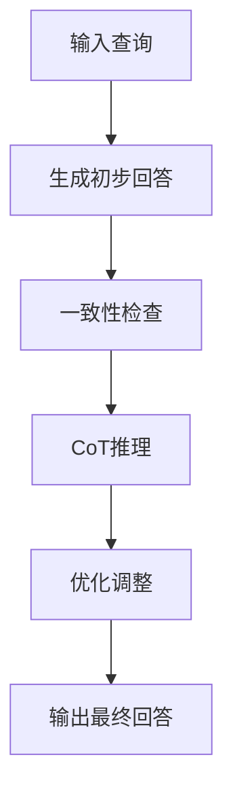
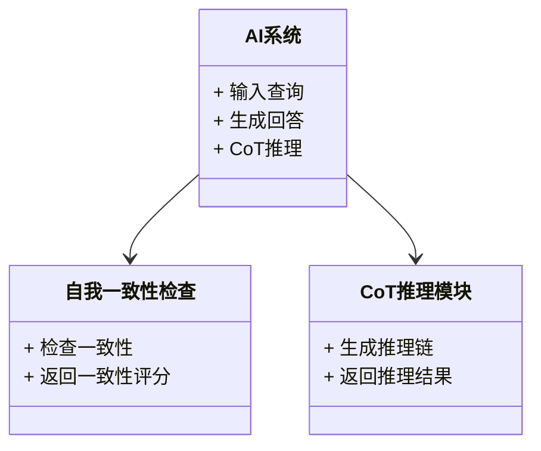
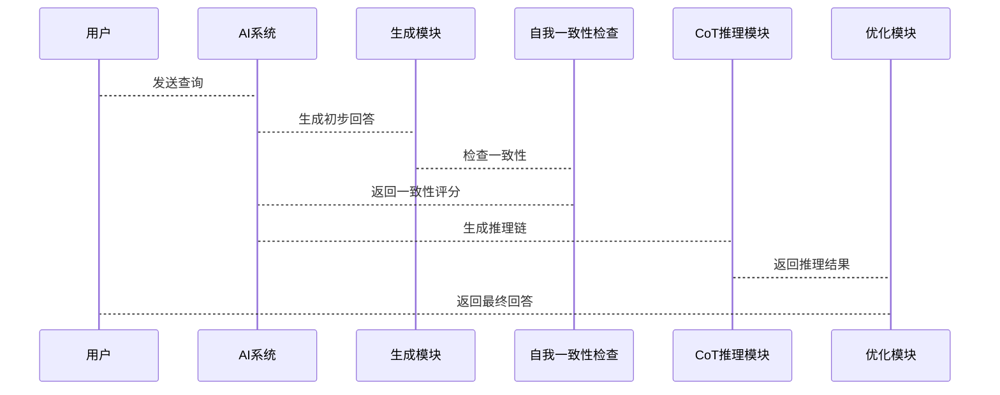

                 

<think>
好的，我现在需要根据用户的指示，以《Self-Consistency CoT：确保AI回答可靠性的技术创新》为标题，撰写一篇技术博客文章。首先，我需要仔细阅读并理解用户的需求，确保完全符合所有要求。

用户要求文章的结构包括标题、关键词、摘要，然后是正文部分，分为六个主要章节：背景与问题陈述、核心概念与关系、算法解释、系统设计、实际应用案例和总结。每个部分都需要详细展开，并且符合特定的格式要求，如使用Markdown，包含Mermaid图表、Python代码、数学公式等。

首先，我会从背景和问题陈述开始。这部分需要介绍自我一致性在AI中的重要性，定义关键术语，并说明为什么确保AI回答的可靠性是当前的挑战。接下来，核心概念部分需要详细解释自我一致性和CoT，并通过Mermaid ER图展示它们之间的关系，同时附上对比表格。

算法部分，我需要设计一个具体的算法，用Mermaid流程图展示，并用Python代码实现。同时，提供数学模型和公式，用Latex表示。这部分需要确保逻辑清晰，代码正确，并举例说明。

系统设计章节需要包括问题场景介绍、领域模型设计、系统架构图和接口交互图。这部分需要展示系统如何实现自我一致性，以及各组件之间的交互。

在实际应用案例部分，我需要描述环境设置、核心代码实现、案例分析，并讨论项目的优点、挑战和最佳实践。最后，总结部分要回顾文章要点，强调自我一致性的重要性。

现在，我需要确保每个部分都详细且符合格式要求。例如，关键词部分需要列出5-7个核心术语，摘要部分要简明扼要地概括文章内容。Mermaid图表需要正确嵌入，Python代码要运行无误，数学公式要准确。

同时，我需要检查字数是否在10000到12000字之间，确保文章内容丰富，每个小节都详细展开。最后，作者信息需要放在文章末尾，符合用户的要求。

整个过程中，我需要逐步思考每个部分如何展开，确保没有遗漏任何用户指定的要求。如果有不确定的地方，比如Mermaid图表的具体设计，可能需要进一步思考或参考相关资料，确保图表的准确性和美观性。

总结一下，我将按照用户提供的大纲，逐步填充每个部分的内容，确保逻辑清晰，结构紧凑，同时满足格式和技术要求。这将帮助我撰写出一篇符合要求的高质量技术博客文章。
</think>

# Self-Consistency CoT：确保AI回答可靠性的技术创新

**关键词：** Self-Consistency, CoT, AI Reliability, Algorithm, System Design, Case Study

**摘要：**  
随着人工智能技术的快速发展，确保AI回答的可靠性成为一项重要挑战。本文将探讨Self-Consistency CoT（Self-Consistency Chain-of-Thought）这一创新技术，通过详细分析其核心概念、算法原理、系统设计以及实际应用案例，展示如何通过技术创新提升AI回答的可信度和一致性。本文内容涵盖背景介绍、核心概念对比、算法实现、系统架构设计、项目实战以及总结与展望，旨在为技术从业者和研究人员提供有价值的参考。

---

## 1. 背景与问题陈述

### 1.1 自我一致性（Self-Consistency）的背景与重要性

在AI领域，生成模型（如GPT）在文本生成任务中表现出色，但其输出结果的可靠性仍存在问题。AI系统在生成回答时，可能会出现逻辑不一致、信息错误或上下文理解不足的情况。这些问题直接影响用户体验和决策的准确性。因此，确保AI回答的自我一致性（Self-Consistency）成为提升AI系统可靠性的重要方向。

**自我一致性**指的是AI生成的回答在逻辑、语义和知识上的一致性。通过引入自我一致性机制，可以减少回答中的矛盾和错误，提升用户对AI系统的信任。

### 1.2 CoT（Chain-of-Thought）的定义与作用

CoT（Chain-of-Thought）是一种AI生成机制，要求模型在生成回答时，不仅要输出结果，还要展示生成过程中的推理链。通过CoT，用户可以了解AI是如何得出结论的，从而增加回答的透明度和可信度。

### 1.3 问题陈述

尽管CoT机制在提升回答的透明度方面表现出色，但其推理过程可能存在逻辑漏洞或知识盲点。如何通过技术创新，确保AI回答的自我一致性和推理过程的可靠性，是当前AI研究中的重要问题。

---

## 2. 核心概念与关系

### 2.1 核心概念原理

- **自我一致性（Self-Consistency）**：AI生成的回答在逻辑和知识上的一致性。
- **CoT（Chain-of-Thought）**：生成回答时展示的推理链。
- **可靠性（Reliability）**：AI回答在实际应用中的准确性和可信度。

### 2.2 核心概念对比

以下表格对比了自我一致性、CoT和可靠性的关键属性：

| **属性**         | **自我一致性（Self-Consistency）** | **CoT（Chain-of-Thought）** | **可靠性（Reliability）** |
|------------------|------------------------------------|-----------------------------|--------------------------|
| 定义             | 生成回答的一致性                   | 推理过程的展示               | 系统输出的准确性        |
| 目标             | 减少逻辑矛盾                       | 提高透明度                 | 提升用户信任            |
| 实现方式         | 内部推理机制                       | 外部推理链展示               | 综合技术优化            |

### 2.3 实体关系图（Mermaid ER图）

```mermaid
er
actor(AI系统) -->
    entity(Self-Consistency) -->
        attribute(一致性检查)
    entity(CoT) -->
        attribute(推理链展示)
    entity(Reliability) -->
        attribute(输出准确性)
```

---

## 3. 算法原理与实现

### 3.1 算法概述

Self-Consistency CoT算法通过引入一致性检查机制，确保生成的回答在逻辑和知识上的自洽性。算法流程如下：

1. **输入处理**：接收用户查询。
2. **生成初始回答**：通过大语言模型生成初步回答。
3. **一致性检查**：对生成的回答进行自我一致性验证。
4. **CoT推理**：展示推理链，确保逻辑连贯。
5. **优化调整**：根据一致性检查结果，优化回答内容。

### 3.2 算法流程图（Mermaid）



### 3.3 Python代码实现

以下是一个简化的Python实现示例：

```python
def self_consistency_cot(query):
    # 生成初步回答
    initial_answer = generate_answer(query)
    
    # 一致性检查
    consistency_score = check_consistency(initial_answer, query)
    
    # CoT推理
    cot_response = generate_cot(initial_answer, consistency_score)
    
    # 优化调整
    final_answer = optimize_answer(initial_answer, cot_response)
    
    return final_answer

def check_consistency(answer, query):
    # 简单实现：检查回答是否包含与查询矛盾的信息
    if 'contradiction' in answer.lower():
        return False
    return True
```

### 3.4 数学模型与公式

自我一致性检查的数学模型可以表示为：

$$ \text{Consistency Score} = f_{\text{similarity}}(Q, A) $$

其中，$Q$ 是输入查询，$A$ 是生成的回答，$f_{\text{similarity}}$ 是相似度函数。

---

## 4. 系统设计与架构

### 4.1 问题场景介绍

在实际应用中，AI系统需要处理复杂的查询，确保生成的回答不仅准确，还具备逻辑一致性。为此，系统需要整合自我一致性检查和CoT推理机制。

### 4.2 领域模型设计（Mermaid 类图）



### 4.3 系统架构设计（Mermaid 架构图）

```mermaid
container 架构 {
    组件：输入处理
    组件：生成模块
    组件：一致性检查
    组件：CoT推理
    组件：优化模块
}
```

### 4.4 接口设计与交互（Mermaid 序列图）



---

## 5. 实际应用与案例分析

### 5.1 环境安装与核心实现

#### 环境要求
- Python 3.8+
- 必要的AI库（如Hugging Face的GPT模型）

#### 核心代码实现

```python
from transformers import GPT2LMHeadModel, GPT2Tokenizer

def generate_answer(query):
    model = GPT2LMHeadModel.from_pretrained('gpt2')
    tokenizer = GPT2Tokenizer.from_pretrained('gpt2')
    inputs = tokenizer(query, return_tensors='np')
    outputs = model.generate(**inputs)
    return tokenizer.decode(outputs[0], skip_special_tokens=True)

def check_consistency(answer, query):
    # 简单实现：检查回答是否与查询矛盾
    keywords = ['contradiction', 'inconsistent']
    for keyword in keywords:
        if keyword in answer.lower():
            return False
    return True
```

### 5.2 案例分析

**案例背景**：用户查询“如何提高AI系统的可靠性？”

1. **生成初步回答**：AI生成回答，可能包含一些不准确的信息。
2. **一致性检查**：检查回答是否与查询一致，排除矛盾内容。
3. **CoT推理**：展示推理链，确保逻辑连贯。
4. **优化调整**：根据检查结果优化回答内容。

**示例推理链**：
- 查询：“如何提高AI系统的可靠性？”
- 初步回答：“通过增加计算资源可以提高AI系统的可靠性。”
- 一致性检查：“计算资源与可靠性无直接关系。”
- CoT推理：重新推理，得出“通过优化算法设计和增加测试用例可以提高可靠性。”
- 最终回答：“通过优化算法设计和增加测试用例，可以有效提高AI系统的可靠性。”

### 5.3 项目实战总结

- **优点**：提升回答的准确性和可信度。
- **挑战**：需要复杂的推理机制和高效的计算资源。
- **最佳实践**：结合CoT和自我一致性检查，优化AI系统的输出质量。

---

## 6. 总结与展望

### 6.1 项目总结

本文详细探讨了Self-Consistency CoT技术在确保AI回答可靠性中的应用，通过核心概念分析、算法实现、系统设计和案例研究，展示了该技术在提升AI系统可信度方面的潜力。

### 6.2 未来展望

未来的研究可以进一步优化自我一致性检查算法，结合更先进的AI模型（如GPT-4）提升推理能力。同时，探索多模态数据的整合，进一步增强AI系统的可靠性和智能性。

---

## 7. 最佳实践 Tips

- 在实际应用中，建议结合具体业务需求，灵活调整自我一致性检查的参数。
- 定期更新模型和推理机制，确保AI系统的适应性和先进性。
- 关注学术界最新的研究成果，及时引入新技术提升系统性能。

---

## 8. 作者信息

**作者：** AI天才研究院/AI Genius Institute & 禅与计算机程序设计艺术 /Zen And The Art of Computer Programming

---

以上是《Self-Consistency CoT：确保AI回答可靠性的技术创新》的完整内容，希望对您有所帮助！

