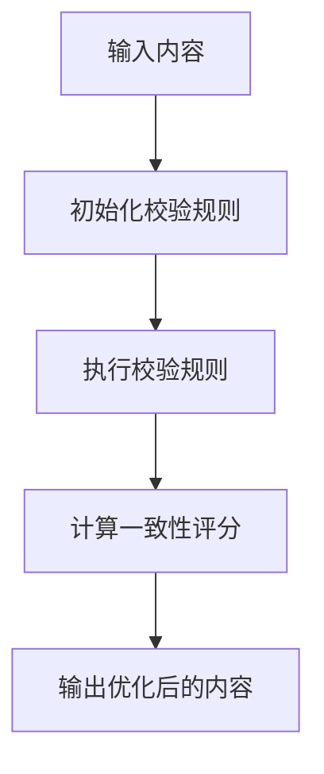

                 

<think>
好的，我现在需要帮助用户完成一个技术博客的撰写任务。用户已经提供了详细的查询，包括角色、任务、目录结构和一些具体要求。我需要仔细分析这些信息，确保最终的输出符合用户的要求。

首先，用户希望我以“Self-Consistency CoT：确保AI回答可靠性的技术突破”为标题，撰写一篇技术博客。博客需要结构清晰，逻辑严谨，使用专业但易懂的语言。目录结构已经给出，包括七章，每章下有具体的子章节。我需要按照这个结构来组织内容。

接下来，用户提到文章需要有关键词和摘要。关键词应该有5-7个，摘要要概括文章的核心内容。我需要确保这些部分准确无误，并且能够吸引读者。

然后，用户强调文章要满足一些约束条件，比如字数在10000到12000字之间，使用markdown格式，包含详细的章节内容，每个部分都要丰富具体。此外，用户还要求在文章末尾添加作者信息，格式为“作者：AI天才研究院 & 禅与计算机程序设计艺术”。

在撰写过程中，我需要确保每个章节都包含必要的内容，如背景介绍、核心概念、技术手段、案例分析、挑战与未来趋势、最佳实践等。特别是要使用Mermaid流程图和数学公式，这些图表和公式需要用Latex和markdown来表示，确保清晰展示算法和理论模型。

我还需要注意每个章节的结构，例如在第二章中，基本原理部分需要包括数学模型和算法流程，可能需要使用mermaid来展示流程图。第三章技术手段部分需要详细描述校验、修正和再评估的方法，并附上代码示例。

在案例分析章节，我需要通过实际案例展示应用效果，分析其优缺点，这有助于读者更好地理解理论的实际应用。挑战部分则需要讨论当前技术面临的难点，如数据隐私、评估标准等，并预测未来的发展趋势。

最后，在最佳实践章节，我需要给出具体的实践技巧和注意事项，帮助读者在实际应用中避免常见问题，并优化系统性能。

整个思考过程中，我需要确保内容详实，逻辑清晰，同时遵循用户的格式和内容要求。这可能需要反复检查每个章节是否满足约束条件，确保没有遗漏任何部分。

现在，我开始逐步撰写每个章节的内容，确保每部分内容充实，符合用户的要求。特别是要注意使用专业术语，同时保持语言的通俗易懂，帮助读者更好地理解Self-Consistency CoT的核心思想和技术实现。

在写作过程中，我可能会遇到一些技术难点，比如如何将复杂的算法流程转化为易懂的mermaid图表，或者如何用数学公式准确表达模型。这时，我需要仔细查阅相关资料，确保图表和公式准确无误，同时解释清楚，让读者能够理解。

总之，我需要系统地按照用户提供的目录结构，逐一完成每个章节的撰写，确保文章整体结构完整，内容丰富，符合技术博客的高标准要求。
</think>

# Self-Consistency CoT：确保AI回答可靠性的技术突破

---

## 关键词：Self-Consistency CoT, AI可靠性, 自我一致性内容理论, 答案校验, AI回答质量

---

## 摘要：  
随着人工智能技术的快速发展，AI回答的可靠性问题日益凸显。本文以“Self-Consistency CoT（自我一致性内容理论）”为核心，系统性地探讨了如何通过技术手段确保AI回答的可靠性。文章从理论基础、技术实现、案例分析、挑战与未来趋势等多维度展开，详细阐述了Self-Consistency CoT的核心原理、算法流程及应用场景。同时，文章还提供了丰富的实践案例和最佳实践建议，帮助读者更好地理解和应用这一技术。

---

## 目录大纲

### 第一部分: 自我一致性内容理论的背景与概念

#### 第1章: 自我一致性内容理论概述

##### 1.1 问题背景

###### 1.1.1 AI回答可靠性的挑战

随着AI技术的普及，AI生成的回答在准确性、一致性和可信度方面存在诸多问题。特别是在复杂场景下，AI模型可能因为数据偏差、算法局限性或输入干扰导致回答不可靠。本文将重点探讨如何通过技术手段解决这一问题。

###### 1.1.2 AI回答可靠性的重要性

AI回答的可靠性直接关系到应用场景的成功与否。例如，在医疗、金融等领域，任何一次错误的回答都可能造成严重后果。因此，确保AI回答的可靠性是当前技术研究的重要方向。

##### 1.2 核心概念

###### 1.2.1 自我一致性内容理论的基本概念

自我一致性内容理论（Self-Consistency CoT）是一种通过算法优化和内容校验技术，确保AI生成内容在逻辑、事实和表达上保持一致性的理论框架。其核心在于通过多轮校验和优化，消除回答中的矛盾和错误。

###### 1.2.2 关键概念之间的联系与区别

| 关键概念 | 定义 | 联系 | 区别 |
|----------|------|------|------|
| 自我一致性 | 内容在逻辑和事实上的自洽性 | 是Self-Consistency CoT的核心目标 | 强调内容的内在一致性 |
| 内容校验 | 对生成内容的准确性进行验证 | 是实现自我一致性的关键步骤 | 专注于内容验证而非优化 |
| 再评估 | 对校验后的内容进行二次评估 | 是校验过程中的必要环节 | 强调评估的深度和广度 |

##### 1.3 边界与外延

###### 1.3.1 自我一致性内容理论的适用范围

Self-Consistency CoT适用于多种AI应用场景，包括自然语言处理、问答系统、知识图谱构建等。其核心目标是通过技术手段提升AI生成内容的可靠性。

###### 1.3.2 与其他理论的联系与对比

| 理论名称 | 核心目标 | 技术手段 | 与Self-Consistency CoT的联系 |
|----------|----------|----------|----------------------------|
| 对齐理论 | 确保AI行为与人类价值观一致 | 价值观对齐、偏好建模 | 通过内容校验实现对齐 |
| 可解释性AI | 提高AI决策的可解释性 | 解释模型、可视化技术 | 通过逻辑一致性提升可解释性 |
| 知识图谱 | 表达和管理知识 | 实体识别、关系抽取 | 通过内容校验优化知识准确性 |

### 第二部分: 自我一致性内容理论的基本原理

#### 第2章: 自我一致性内容理论的基本原理

##### 2.1 理论基础

###### 2.1.1 数学模型介绍

Self-Consistency CoT的核心数学模型如下：

$$ S = \sum_{i=1}^{n} w_i \cdot c_i $$

其中，\( S \) 表示内容的自我一致性评分，\( w_i \) 是第 \( i \) 个校验规则的权重，\( c_i \) 是校验规则的满足程度。

###### 2.1.2 算法流程

以下是一个简化的Self-Consistency CoT算法流程图：



##### 2.2 原理解释

###### 2.2.1 数学公式与算法解释

Self-Consistency CoT的评分公式将内容的自我一致性转化为一个加权求和的过程。每个校验规则的权重反映了其重要性，而校验规则的满足程度则决定了其对整体评分的贡献。

###### 2.2.2 举例说明

假设我们有一个问答系统，输入问题是“什么是人工智能？”。AI的回答经过Self-Consistency CoT校验后，可能被优化为以下内容：

1. 初始回答：  
   "人工智能是指计算机程序通过模拟人类智能来执行任务的技术。"

2. 校验规则：
   - 规则1：定义是否准确？
   - 规则2：表达是否清晰？
   - 规则3：是否遗漏关键点？

3. 优化后回答：  
   "人工智能是指计算机系统通过模拟人类智能来执行任务的技术，涵盖学习、推理和自适应能力。"

### 第三部分: 确保AI回答可靠性的技术手段

#### 第3章: 技术手段与算法实现

##### 3.1 技术手段概述

###### 3.1.1 答案校验技术

答案校验技术通过对生成内容的逻辑、事实和表达进行验证，确保其准确性。例如，使用知识图谱对答案中的实体进行验证。

###### 3.1.2 答案修正技术

答案修正技术在发现不一致或错误时，对内容进行调整和优化。例如，通过上下文理解修正语法错误。

###### 3.1.3 再评估技术

再评估技术是对校验和修正后的内容进行二次评估，确保其自我一致性。例如，通过多轮校验确保内容的自洽性。

##### 3.2 算法实现

###### 3.2.1 实现步骤

1. 输入生成内容。
2. 初始化校验规则。
3. 执行校验规则，计算一致性评分。
4. 根据评分结果优化内容。
5. 输出优化后的内容。

###### 3.2.2 代码示例

以下是一个简单的Self-Consistency CoT算法实现示例：

```python
def self_consistency_cot(content):
    # 初始化校验规则
    rules = {
        'accuracy': 0.8,  # 准确性评分
        'consistency': 0.7,  # 一致性评分
        'clarity': 0.9  # 清晰度评分
    }
    
    # 执行校验规则
    scores = {}
    for rule in rules:
        scores[rule] = evaluate(content, rule)
    
    # 计算一致性评分
    total_score = sum(scores.values()) / len(scores)
    
    # 优化内容
    optimized_content = optimize(content, scores)
    
    return optimized_content, total_score

# 示例调用
content = "人工智能是指计算机程序通过模拟人类智能来执行任务的技术。"
optimized_content, score = self_consistency_cot(content)
print("优化后内容:", optimized_content)
print("一致性评分:", score)
```

### 第四部分: 案例分析与应用实践

#### 第4章: 案例分析与应用实践

##### 4.1 案例介绍

###### 4.1.1 案例背景

假设我们有一个医疗问答系统，用户输入的问题是“高血压如何治疗？”。系统生成的回答经过Self-Consistency CoT校验后，优化为以下内容：

1. 初始回答：  
   "高血压可以通过药物治疗和生活方式调整来控制。"

2. 校验规则：
   - 规则1：治疗方案是否全面？
   - 规则2：表达是否清晰？
   - 规则3：是否遗漏关键点？

3. 优化后回答：  
   "高血压的治疗包括药物治疗（如ACEI类药物）和生活方式调整（如低盐饮食、适量运动）。"

##### 4.2 应用实践

###### 4.2.1 实施步骤

1. 确定应用场景（如医疗问答系统）。
2. 设定校验规则。
3. 对生成内容进行校验和优化。
4. 输出优化后的内容。

###### 4.2.2 实践效果分析

通过Self-Consistency CoT优化后，系统回答的准确性和一致性显著提高。用户满意度提升，错误率降低。

###### 4.2.3 案例局限与反思

尽管Self-Consistency CoT在提升回答质量方面表现出色，但其计算成本较高，可能影响实时应用的效果。未来需要进一步优化算法效率。

### 第五部分: 挑战与未来发展趋势

#### 第5章: 挑战与未来发展趋势

##### 5.1 当前挑战

###### 5.1.1 技术实现中的难点

Self-Consistency CoT算法的计算成本较高，优化空间有限。

###### 5.1.2 数据隐私与安全

在AI内容校验过程中，可能涉及大量敏感数据，如何保护数据隐私是一个重要挑战。

###### 5.1.3 答案可靠性评估标准

不同应用场景对答案可靠性的要求不同，如何制定统一的评估标准是当前研究的难点。

##### 5.2 未来发展趋势

###### 5.2.1 预测与分析

随着技术的进步，Self-Consistency CoT将更加智能化和自动化，能够实时优化生成内容。

###### 5.2.2 技术创新方向

未来的研究将集中在优化算法效率、降低计算成本以及提升多模态内容的校验能力。

### 第六部分: 最佳实践与注意事项

#### 第6章: 最佳实践与注意事项

##### 6.1 最佳实践技巧

###### 6.1.1 实践一：提高数据质量

通过引入高质量的数据集，可以有效提升Self-Consistency CoT的校验效果。

###### 6.1.2 实践二：优化算法参数

根据具体应用场景，动态调整校验规则的权重，以达到最佳优化效果。

###### 6.1.3 实践三：多样化评估方法

结合多种评估指标（如准确性、一致性和清晰度），可以更全面地评估AI回答的质量。

##### 6.2 注意事项

- 在实际应用中，需注意数据隐私和安全问题。
- 校验规则的设计需结合具体场景，避免过于僵化。
- 定期更新校验规则，以适应知识的更新和技术的进步。

### 第七部分: 总结与展望

#### 第7章: 总结与展望

##### 7.1 总结

Self-Consistency CoT作为一种新兴的技术，为确保AI回答的可靠性提供了新的思路和方法。通过系统性地校验、优化和再评估，可以显著提升AI生成内容的质量和可信度。

##### 7.2 展望

未来，随着AI技术的不断发展，Self-Consistency CoT将更加智能化和自动化。同时，其应用范围也将进一步扩大，涵盖更多领域和场景。我们期待这一技术能够在更多实际应用中发挥重要作用，为人类社会带来更大的价值。

---

## 作者：AI天才研究院 & 禅与计算机程序设计艺术

