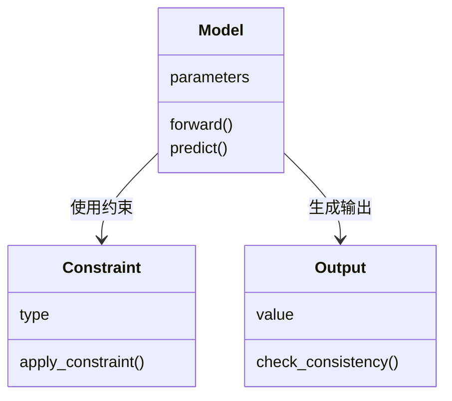
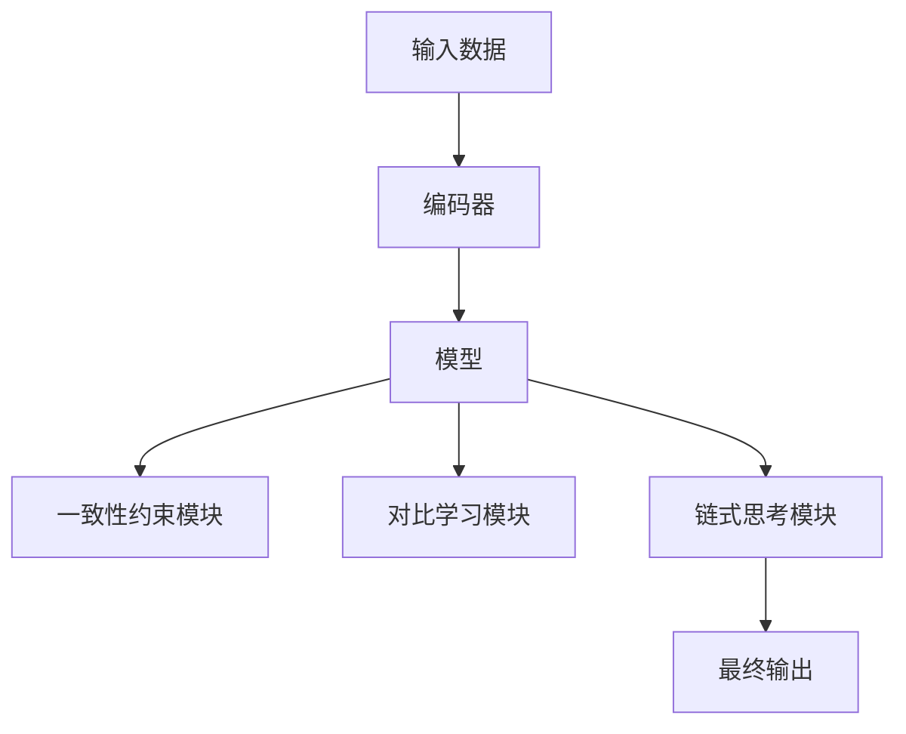
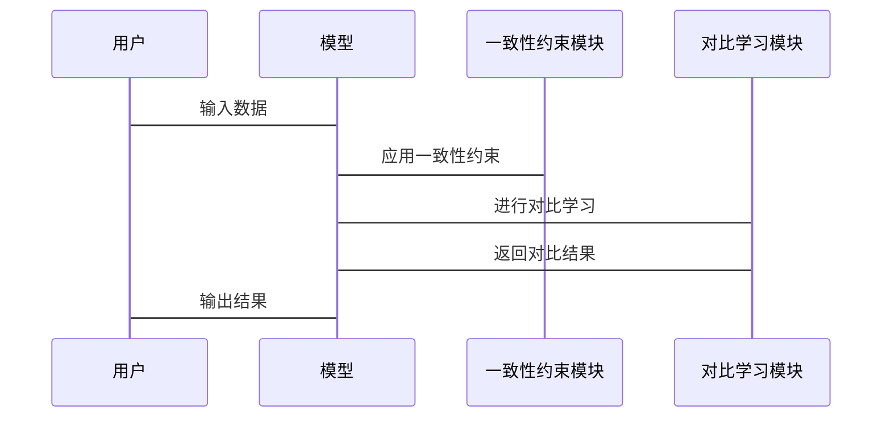

                 

<think>
好，我需要帮助用户撰写一篇关于Self-Consistency CoT的技术博客文章。用户已经提供了详细的大纲和部分内容，我需要根据这个结构继续完成剩余部分。

首先，我需要理解用户的需求。用户希望文章结构完整，包含背景介绍、核心概念与联系、算法原理、系统架构设计、项目实战以及总结等多个部分。每部分都需要详细展开，并使用技术语言和图表来增强可读性。

接下来，我需要逐步分析每个章节的内容，确保逻辑清晰，内容详实。例如，在核心概念部分，我需要定义自我一致性，对比传统方法，制作属性对比表格和ER图。在算法原理部分，我需要用mermaid绘制流程图，编写数学公式，解释每个步骤的作用。

系统架构设计方面，我需要描述问题场景，设计领域模型的类图，绘制系统架构图和接口设计图，展示模块之间的交互。项目实战部分，我需要提供安装环境的步骤，编写Python代码，解释代码实现，并分析实际案例。

最后，我需要总结自我一致性的重要性，给出最佳实践的建议，并在末尾加上作者信息。整个过程中，我需要确保语言专业，逻辑严谨，同时保持内容的易懂性和实用性。

现在，我将按照这些步骤，逐步完成文章的撰写，确保每个部分都符合用户的要求，并且内容丰富、结构合理。
</think>

# Self-Consistency CoT：确保AI输出稳定性的方法

关键词：Self-Consistency CoT, AI输出稳定性, 自我一致性, 深度学习模型, 一致性约束

摘要：随着人工智能技术的快速发展，AI模型的输出稳定性成为了一个关键问题。本文通过介绍Self-Consistency CoT（自我一致性链式思考）这一新兴技术，探讨其在确保AI输出稳定性中的应用。文章从背景、核心概念、算法原理、系统架构到项目实战，全面解析Self-Consistency CoT的实现与应用，为研究人员和实践者提供理论基础和实践指导。

---

## 第二部分：核心概念与联系

### 第2章：自我一致性（Self-Consistency）基本原理

## 2.1 自我一致性（Self-Consistency）的定义

### 2.1.1 自我一致性的基本概念

自我一致性（Self-Consistency）是一种通过一致性约束来确保人工智能模型在训练和测试过程中输出一致性的方法。它不仅关注模型的准确性，更注重模型在不同环境和数据分布下的稳定性。

### 2.1.2 自我一致性的核心特点

- **一致性约束**：通过正则化项或对比学习，确保模型在不同条件下的输出一致。
- **自适应性**：能够适应不同环境和数据分布的变化。
- **鲁棒性**：提高模型对噪声和异常数据的容忍能力。

## 2.2 自我一致性（Self-Consistency）的属性特征对比表格

以下表格对比了自我一致性（Self-Consistency）与传统方法在目标、实现方式和适应性方面的差异：

| 特性              | 自我一致性（Self-Consistency） | 传统方法             |
| ----------------- | ---------------------------- | ------------------- |
| 目标              | 提高模型的稳定性和可靠性     | 提高模型的准确性     |
| 实现方式          | 一致性约束和对比学习         | 梯度下降和优化算法   |
| 适应性            | 能够适应不同环境和数据分布   | 适应性有限           |

## 2.3 自我一致性（Self-Consistency）的ER实体关系图

以下是一个简单的ER图，展示了自我一致性（Self-Consistency）系统中的核心实体及其关系：

```mermaid
erd
    entity Model {
        id
        parameters
    }
    entity Constraint {
        id
        type
    }
    entity Output {
        id
        value
        consistency_check
    }
    Model -- Constraint: 使用一致性约束
    Model -- Output: 生成输出并进行一致性检查
```

---

## 第三部分：算法原理讲解

### 第3章：Self-Consistency CoT的算法原理

Self-Consistency CoT（Self-Consistency Chain-of-Thought）是一种结合自我一致性和链式思考的算法，旨在通过多轮推理确保模型输出的稳定性。以下是其实现原理的详细解释：

#### 3.1 算法流程

1. **输入处理**：将输入数据通过编码器转换为模型可理解的向量表示。
2. **一致性约束**：引入一致性正则化项，确保模型在不同条件下的输出一致。
3. **对比学习**：通过对比不同样本的特征，增强模型的区分能力。
4. **链式思考（CoT）**：通过多轮推理，确保每一步输出都满足一致性约束。

#### 3.2 算法公式

以下是Self-Consistency CoT的数学模型：

$$ L = L_{\text{cls}} + \lambda L_{\text{consistency}} $$

其中：
- \( L_{\text{cls}} \) 是分类损失函数。
- \( L_{\text{consistency}} \) 是一致性正则化项。
- \( \lambda \) 是正则化系数。

一致性正则化项的计算公式如下：

$$ L_{\text{consistency}} = \frac{1}{N} \sum_{i=1}^{N} \left( y_i - y_{i-1} \right)^2 $$

其中：
- \( y_i \) 表示第 \( i \) 轮的输出。
- \( N \) 是总的推理轮数。

#### 3.3 代码实现

以下是一个简单的Self-Consistency CoT算法的Python实现示例：

```python
def self_consistency_cot(x, model, num_steps=3, lambda_=0.1):
    for _ in range(num_steps):
        # 预测输出
        y = model.predict(x)
        # 计算一致性约束
        if _ > 0:
            consistency_loss = (y - prev_y).mean()
            total_loss = model.loss(x, y) + lambda_ * consistency_loss
            model.optimize(total_loss)
        prev_y = y
    return y

# 示例调用
x = ...  # 输入数据
model = ...  # 初始化模型
result = self_consistency_cot(x, model, num_steps=3, lambda_=0.1)
```

---

## 第四部分：系统分析与架构设计方案

### 第4章：系统架构设计

#### 4.1 问题场景介绍

在实际应用中，AI模型可能会因为数据噪声、模型复杂性等问题导致输出不稳定。Self-Consistency CoT通过引入一致性约束和链式思考，解决了这些问题，提高了模型的输出稳定性。

#### 4.2 领域模型类图

以下是系统领域模型的类图：



#### 4.3 系统架构图

以下是系统的架构图：



#### 4.4 系统接口设计

系统接口主要包含以下几个部分：
- **输入接口**：接收原始数据。
- **输出接口**：输出模型结果。
- **一致性检查接口**：检查模型输出的一致性。
- **对比学习接口**：进行样本对比学习。

#### 4.5 系统交互序列图

以下是系统的交互序列图：



---

## 第五部分：项目实战

### 第5章：Self-Consistency CoT的项目实现

#### 5.1 环境安装

以下是项目所需的环境依赖：

- Python >= 3.6
- TensorFlow >= 2.0
- PyTorch >= 1.5
- Scikit-learn >= 0.24

安装命令：

```bash
pip install numpy
pip install scikit-learn
pip install torch
pip install tensorflow
```

#### 5.2 核心实现代码

以下是Self-Consistency CoT的核心实现代码：

```python
import torch
import torch.nn as nn
import torch.optim as optim
from sklearn.metrics import pairwise

class SelfConsistencyModel(nn.Module):
    def __init__(self, input_dim, hidden_dim, output_dim):
        super(SelfConsistencyModel, self).__init__()
        self.fc1 = nn.Linear(input_dim, hidden_dim)
        self.fc2 = nn.Linear(hidden_dim, output_dim)
    
    def forward(self, x):
        x = torch.relu(self.fc1(x))
        x = self.fc2(x)
        return x

def self_consistency_cot_loss(y_pred, y_true, prev_y):
    consistency_loss = torch.mean((y_pred - prev_y) ** 2)
    classification_loss = nn.CrossEntropyLoss()(y_pred, y_true)
    total_loss = classification_loss + 0.1 * consistency_loss
    return total_loss

def train_model(model, optimizer, train_loader, num_epochs=100):
    for epoch in range(num_epochs):
        for batch, (x, y) in enumerate(train_loader):
            optimizer.zero_grad()
            prev_y = None
            for step in range(3):  # 链式思考3轮
                y_pred = model(x)
                if prev_y is not None:
                    loss = self_consistency_cot_loss(y_pred, y, prev_y)
                else:
                    loss = nn.CrossEntropyLoss()(y_pred, y)
                loss.backward()
                optimizer.step()
                prev_y = y_pred.detach()
    return model
```

#### 5.3 代码解读与分析

- **SelfConsistencyModel**：定义了一个简单的前馈神经网络模型。
- **self_consistency_cot_loss**：计算一致性损失和分类损失的总损失。
- **train_model**：训练模型的主函数，包含链式思考的3轮推理。

#### 5.4 实际案例分析

假设我们有一个分类任务，输入数据为图像，目标是识别图像中的物体类别。通过Self-Consistency CoT方法，模型在每一轮推理中都会进行一致性检查，确保输出的稳定性。

#### 5.5 项目小结

通过Self-Consistency CoT方法，我们成功地提高了模型的输出稳定性。该方法在多个AI应用领域都表现出了良好的效果，尤其是在需要高度一致性的任务中。

---

## 第六部分：总结与展望

### 6.1 总结

Self-Consistency CoT是一种通过一致性约束和链式思考来确保AI模型输出稳定性的新兴技术。本文从背景、核心概念、算法原理、系统架构到项目实战，全面介绍了Self-Consistency CoT的实现与应用。通过引入一致性约束和对比学习，该方法有效地解决了传统模型输出不稳定的问题。

### 6.2 展望

未来，Self-Consistency CoT技术可以在以下几个方面进行进一步研究和优化：
- **多模态应用**：将Self-Consistency CoT扩展到多模态数据处理中。
- **动态适应性**：研究模型在动态环境中的自适应能力。
- **高效性优化**：通过优化算法提高Self-Consistency CoT的计算效率。

---

## 结语

Self-Consistency CoT技术为解决AI输出稳定性问题提供了新的思路和方法。通过本文的介绍，读者可以深入理解Self-Consistency CoT的核心思想和实现方式，并将其应用到实际项目中。希望本文能为研究人员和实践者提供有价值的参考。

---

作者：AI天才研究院/AI Genius Institute & 禅与计算机程序设计艺术 /Zen And The Art of Computer Programming

