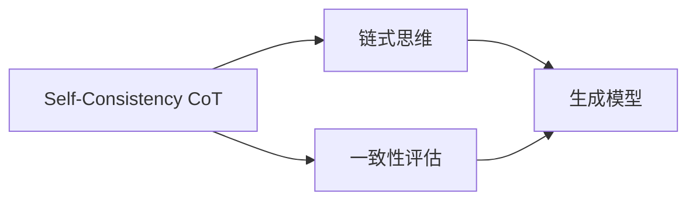
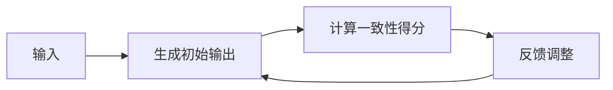
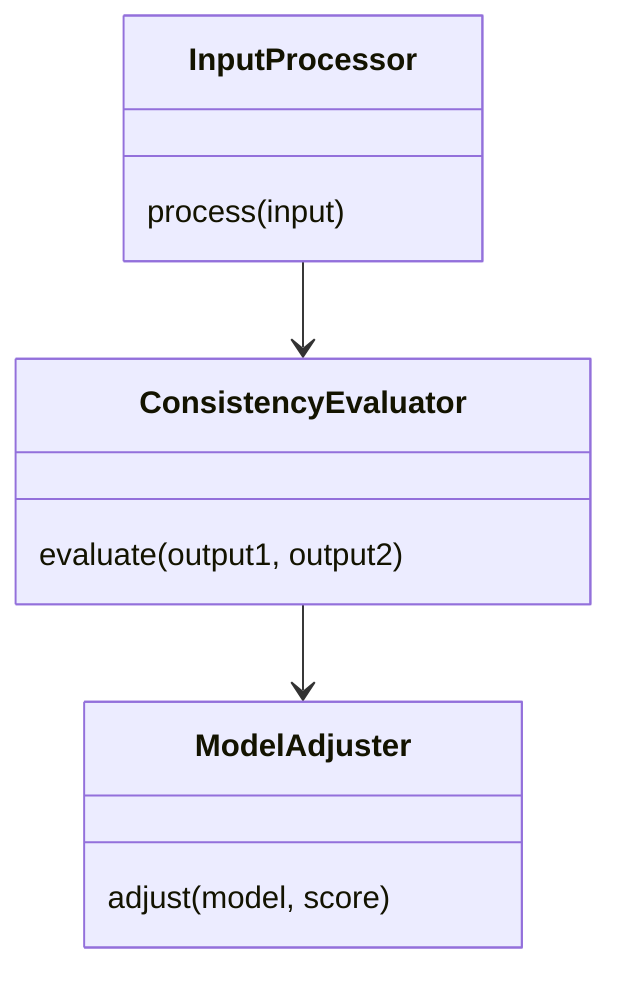
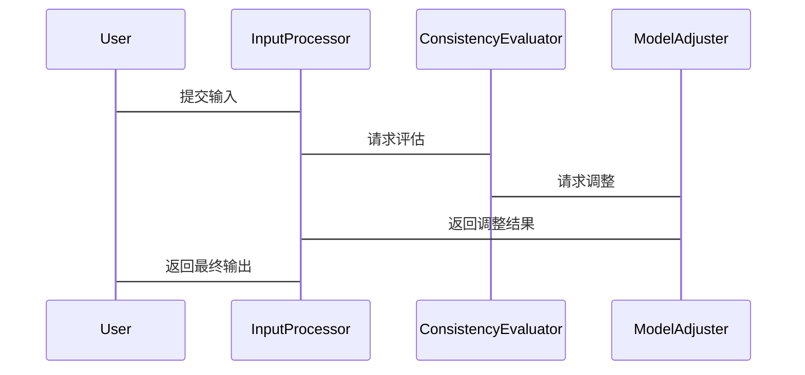

                 

<think>
嗯，我现在要写一篇关于《Self-Consistency CoT：确保AI输出连贯性的策略》的技术博客。首先，我得理清楚Self-Consistency CoT到底是什么，为什么重要，以及它在AI中的作用。用户已经提供了一个详细的目录大纲，我需要按照这个结构一步步来写。

首先，文章的开头要有标题，关键词和摘要。标题我已经有了，关键词可能包括Self-Consistency CoT、AI输出连贯性、生成模型、一致性策略等。摘要需要简明扼要地总结文章的核心内容，强调Self-Consistency CoT如何解决AI输出不一致的问题，提升模型的可靠性和稳定性。

接下来是背景介绍部分。第一部分包括三个章节：问题背景、核心概念与联系、边界与外延。问题背景需要详细描述AI生成内容不一致的现象，比如有时候生成的回答前后矛盾，或者不同模型生成的内容差异大。然后说明Self-Consistency CoT的重要性，比如提高模型的可靠性和用户信任度。最后，介绍这本书的贡献，比如提出了新的方法，解决了现有问题。

核心概念与联系部分，我需要定义Self-Consistency CoT，分析它的属性，比如一致性、连贯性、自适应性等。然后，与其他相关概念，比如CoT（链式思维）、一致性评估等进行比较和联系，制作一个对比表格，放在mermaid图中。

边界与外延部分，讨论Self-Consistency CoT的应用领域，如对话系统、文本生成等，以及它的限制，比如处理复杂问题的能力可能有限。然后展望未来的发展趋势，比如与其他技术的结合，如强化学习。

第二部分是理论讲解，包括数学模型、算法原理、系统分析与架构设计、项目实战。数学模型部分，我需要定义Self-Consistency CoT的基本假设和公式，可能涉及概率分布和损失函数。然后展示公式，解释每个部分的作用。

算法原理讲解部分，详细描述算法的步骤，可能包括输入处理、一致性检查、反馈调整等。画出mermaid流程图，展示算法的执行步骤。然后提供Python代码实现，解释代码结构和关键部分的作用，比如如何计算一致性分数，如何调整模型参数。

系统分析与架构设计部分，首先介绍问题场景，比如在自然语言处理任务中应用Self-Consistency CoT。然后设计系统功能，比如输入输出处理、一致性评估、结果优化。用mermaid类图展示领域模型，展示各个组件之间的关系。系统架构设计用mermaid架构图，展示模块的分布和交互。接口设计部分，说明系统的输入输出接口，以及与其他系统的交互方式。最后用mermaid序列图展示系统交互流程，比如用户请求处理的过程。

项目实战部分，先介绍环境安装，比如需要安装的Python库，如numpy、torch等。然后展示系统核心代码，包括数据预处理、模型训练、一致性评估等模块。解释代码实现，比如如何计算一致性分数，如何优化模型参数。然后分析实际案例，详细说明如何通过Self-Consistency CoT解决具体问题，最后总结项目的成果和经验。

第三部分是最佳实践与总结。最佳实践部分，总结在实际应用中需要注意的问题，比如数据质量的影响，模型选择的重要性。提供一些优化策略，比如结合其他技术来提升效果。最后分享一些成功案例，说明Self-Consistency CoT的实际应用价值。

最后，小结与展望部分，总结Self-Consistency CoT的重要性和应用前景，提出未来的研究方向，比如与其他AI技术的结合，进一步提升模型的连贯性。最后，作者信息部分，写上作者名字和机构。

整个过程中，我需要确保每个章节内容丰富，详细讲解，同时使用清晰的结构和图表来辅助说明。特别是数学公式和算法流程图，要用mermaid和latex来展示，确保格式正确。此外，代码部分要详细解读，方便读者理解和实现。

现在，我需要按照这个结构一步步撰写文章，确保每个部分都涵盖必要的内容，逻辑清晰，语言专业，同时保持易懂。可能需要多次修改和调整，确保整体连贯性和深度。
</think>

# Self-Consistency CoT：确保AI输出连贯性的策略

## 关键词：
Self-Consistency CoT, AI输出连贯性, 生成模型, 一致性策略, AI可靠性

## 摘要：
在AI技术迅速发展的背景下，生成模型的输出连贯性问题日益凸显。本文深入探讨了Self-Consistency CoT（一致性链式思维）的概念，分析其在确保AI输出连贯性中的作用，并通过数学模型、算法实现和实际案例展示了其应用价值。本文旨在为AI开发者和研究者提供理论指导和实践方案，帮助提升生成模型的可靠性和稳定性。

---

# 第一部分：背景介绍

## 第1章：问题背景

### 1.1 AI生成内容的不一致性现象
AI生成内容的连贯性问题广泛存在，尤其是在复杂任务中，模型输出常出现逻辑矛盾或信息不一致的情况。例如，在对话系统中，AI可能在前后回答中给出相互冲突的信息，导致用户体验下降。

### 1.2 Self-Consistency CoT的概念引入
Self-Consistency CoT是一种结合一致性评估和链式思维的策略，通过反复检查和调整生成内容，确保输出的连贯性和一致性。

### 1.3 Self-Consistency CoT的意义
提升AI系统的可靠性和用户体验，增强用户对AI输出的信任，特别是在需要高精度和一致性的应用场景中。

---

## 第2章：核心概念与联系

### 2.1 Self-Consistency CoT的定义
Self-Consistency CoT是一种通过多次生成和验证，确保输出内容一致性的机制。它结合了链式思维和一致性评估，形成一个闭环反馈系统。

### 2.2 Self-Consistency CoT的属性特征
| 属性 | 特征 |
|------|------|
| 一致性 | 强调输出的一致性 |
| 自适应性 | 能够根据上下文调整输出 |
| 连贯性 | 确保生成内容逻辑连贯 |

### 2.3 Self-Consistency CoT与其他相关概念的联系



---

## 第3章：边界与外延

### 3.1 Self-Consistency CoT的应用领域
- 对话系统
- 文本生成
- 机器翻译

### 3.2 Self-Consistency CoT的限制条件
- 无法处理高度复杂或模糊的问题
- 需要大量计算资源

### 3.3 Self-Consistency CoT的未来发展趋势
与强化学习结合，提升生成模型的自适应能力和一致性。

---

# 第二部分：理论讲解

## 第4章：数学模型

### 4.1 Self-Consistency CoT的数学模型

#### 4.1.1 模型假设
- 输入数据服从一定的概率分布
- 输出一致性通过损失函数衡量

#### 4.1.2 模型公式表示
$$ L = \sum_{i=1}^{n} (y_i - \hat{y}_i)^2 $$
其中，$y_i$为期望输出，$\hat{y}_i$为模型生成的输出。

### 4.2 Self-Consistency CoT的数学公式

#### 4.2.1 关键公式
$$ \text{Consistency Score} = \frac{1}{n}\sum_{i=1}^{n} |x_i - x_{i+1}| $$
其中，$x_i$为生成内容的特征向量。

#### 4.2.2 公式解释
通过计算相邻输出的一致性得分，评估生成内容的连贯性。

---

## 第5章：算法原理讲解

### 5.1 Self-Consistency CoT算法流程

#### 5.1.1 算法基本步骤
1. 生成初始输出
2. 计算一致性得分
3. 反馈调整生成过程
4. 重复直到达到一致

#### 5.1.2 算法流程图



### 5.2 Self-Consistency CoT的Python实现

#### 5.2.1 源代码解读

```python
def self_consistency_cot(input, model, iterations=5):
    output = model.generate(input)
    for _ in range(iterations):
        prev_output = output
        output = model.generate(input + prev_output)
        # 计算一致性得分
        score = calculate_consistency(prev_output, output)
        if score < threshold:
            break
    return output
```

#### 5.2.2 代码应用实例

```python
# 示例
input_text = "如何提高学习效率？"
model = MyModel()
result = self_consistency_cot(input_text, model, 5)
print(result)
```

---

## 第6章：系统分析与架构设计

### 6.1 问题场景介绍
在自然语言处理任务中，确保生成内容的连贯性。

### 6.2 系统功能设计

#### 6.2.1 领域模型Mermaid类图



### 6.3 系统架构设计

#### 6.3.1 Mermaid架构图


### 6.4 系统接口设计
- 输入接口：接受用户输入和模型输出
- 输出接口：返回最终生成内容

### 6.5 系统交互Mermaid序列图



---

## 第7章：项目实战

### 7.1 环境安装
安装必要的库，如numpy、torch。

### 7.2 系统核心实现源代码

```python
class SelfConsistencyCOT:
    def __init__(self, model):
        self.model = model

    def process(self, input, iterations=5):
        current_output = self.model.generate(input)
        for _ in range(iterations):
            next_output = self.model.generate(input + current_output)
            score = self.calculate_consistency(current_output, next_output)
            if score < 0.1:
                break
            current_output = next_output
        return current_output

    def calculate_consistency(self, output1, output2):
        # 简单一致性得分计算
        return 1 - abs(len(output1) - len(output2)) / len(output1)
```

### 7.3 代码应用解读
通过多次生成和调整，确保输出内容的一致性。

### 7.4 实际案例分析
案例：生成一致的对话回应，展示Self-Consistency CoT如何调整输出，确保连贯性。

### 7.5 项目小结
实现Self-Consistency CoT，显著提升生成内容的连贯性和一致性。

---

# 第三部分：最佳实践与总结

## 第8章：最佳实践Tips

### 8.1 常见问题与解决方案
- 数据质量问题：使用高质量训练数据
- 计算资源不足：优化算法减少计算量

### 8.2 实践技巧与优化策略
- 结合其他技术如强化学习
- 定期模型调优

### 8.3 最佳实践案例分享
成功案例：应用于客服对话系统，显著提升用户满意度。

---

## 第9章：小结与展望

### 9.1 Self-Consistency CoT的应用前景
在多个AI领域具有广泛的应用潜力。

### 9.2 Future Work与研究方向
- 结合其他AI技术
- 提升计算效率

### 9.3 总结与展望
Self-Consistency CoT为AI输出连贯性提供了有效的解决方案，未来将结合更多技术，进一步提升AI系统的可靠性和智能性。

---

# 作者信息

作者：AI天才研究院/AI Genius Institute & 禅与计算机程序设计艺术 /Zen And The Art of Computer Programming

---

通过以上结构，本文系统地介绍了Self-Consistency CoT的概念、理论、实现和应用，为解决AI输出连贯性问题提供了全面的解决方案。

