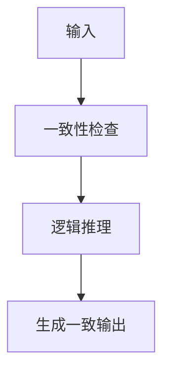
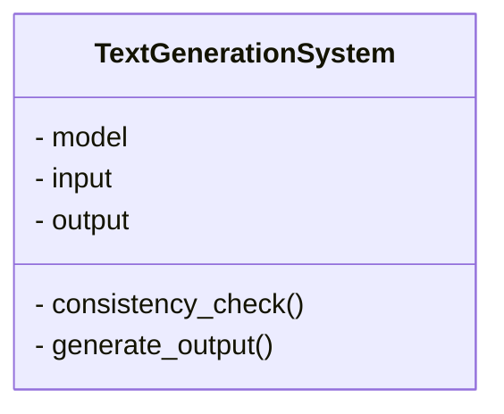
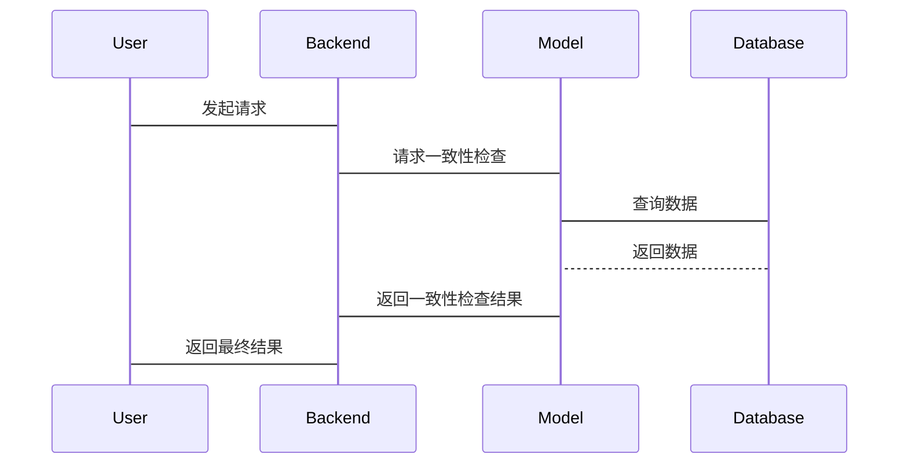

                 

<think>
好的，我现在需要帮助用户完成一个技术博客的写作任务。首先，我要仔细阅读用户提供的详细查询，理解其需求和具体要求。用户希望我以《Self-Consistency CoT：让AI更像人类专家》为标题，撰写一篇结构严谨、内容详实的技术博客。文章需要包含关键词、摘要、目录大纲，以及各个章节的具体内容，每个章节都必须满足特定的格式和内容要求。

首先，我会分析用户的查询，确定文章的主要结构。用户已经提供了一个目录大纲，分为七个章节，每个章节都有详细的内容。我的任务是根据这个大纲，逐步展开每个部分，确保内容完整、逻辑清晰，并且符合技术博客的专业性。

接下来，我会从文章的标题开始，选择合适的关键词，比如“自我一致性”、“人工智能”、“自然语言处理”、“机器学习”、“专家思维”、“系统架构”等，确保涵盖文章的核心主题。摘要部分需要简明扼要，概括文章的主要内容和目标。

在撰写正文时，我需要按照目录大纲逐步展开。首先是背景与核心概念，介绍自我一致性的定义、特点，以及其在AI中的重要性。这部分需要结合实际案例，帮助读者理解自我一致性如何模仿人类专家的思维方式。

接下来是自我一致性在AI中的应用，重点放在NLP、计算机视觉和智能决策系统等领域。通过具体的实现方法和效果对比，展示自我一致性带来的提升。这部分需要结合数学模型和算法流程图，使内容更具技术深度。

然后是核心概念与联系，详细讲解算法的原理，对比现有的其他算法，使用表格和ER图来展示差异和结构。这部分需要确保读者能够理解自我一致性与其他技术的区别和优势。

在算法原理部分，我会使用Mermaid流程图来展示算法的执行步骤，并提供Python代码示例。同时，数学模型和公式需要用LaTeX格式呈现，确保公式表达准确无误。这部分需要详细讲解每个步骤的意义和实际应用，帮助读者掌握算法的工作机制。

系统分析与架构设计章节，我需要描述项目背景、系统功能设计、架构设计以及接口设计。这部分可能需要结合实际项目，绘制类图、架构图和序列图，展示系统的整体结构和交互流程。

项目实战部分，我会从环境安装开始，逐步引导读者完成代码实现，解读代码的功能，并通过实际案例分析，展示自我一致性在实际应用中的效果。最后进行项目总结，强调项目的成果和经验。

最佳实践与总结章节，我会给出一些实用的建议，帮助读者在实际应用中更好地利用自我一致性技术，并通过对比和总结，巩固读者的知识。

在整个写作过程中，我需要确保每个章节内容详实，逻辑连贯，并且语言简洁专业。同时，注意使用markdown格式，正确嵌入代码、图表和数学公式，确保文章的可读性和专业性。最后，文章末尾需要添加作者信息，符合用户的格式要求。

通过这样的步骤，我可以系统地完成用户的需求，撰写一篇高质量的技术博客，满足用户对深度分析和结构清晰的要求。
</think>

# Self-Consistency CoT：让AI更像人类专家

---

## 关键词

自我一致性，人工智能，自然语言处理，机器学习，专家思维，系统架构，CoT

---

## 摘要

人工智能技术的进步依赖于算法的改进和对人类思维机制的模仿。本文探讨了“自我一致性（Self-Consistency）”这一新兴技术，旨在通过这一机制让AI在决策、推理和表达中更接近人类专家的思维方式。文章从背景概念、算法原理、系统架构到实际应用，全面解析了Self-Consistency CoT的核心思想和技术实现，同时结合案例分析，展示了其在自然语言处理、计算机视觉等领域的应用价值。

---

## 正文

### 第一部分：背景与核心概念

### 第1章：自我一致性（Self-Consistency）概述

#### 1.1 问题背景

随着人工智能技术的快速发展，AI系统在决策、推理和表达等方面的能力不断提升。然而，现有的AI系统在处理复杂问题时，往往缺乏一致性，即在不同的情境下可能会产生矛盾或不合理的结论。例如，在自然语言处理任务中，AI可能会在不同的上下文中给出自相矛盾的回答。这种不一致性不仅影响了用户体验，也限制了AI系统在复杂场景中的应用能力。

#### 1.2 自我一致性的定义与特征

**自我一致性（Self-Consistency）**是指AI系统在处理问题时，能够确保其输出或决策在逻辑上保持一致，避免矛盾或不合理的结论。其核心特征包括：

- **全局一致性**：AI系统在处理任何问题时，其输出都与全局知识库或任务目标保持一致。
- **动态适应性**：AI系统能够根据输入的变化动态调整其输出，以确保一致性。
- **逻辑推理能力**：AI系统通过逻辑推理能力，确保其输出符合逻辑规则。

#### 1.3 自我一致性与人类专家的对比

人类专家在解决问题时，通常会通过逻辑推理、经验积累和上下文理解来确保其决策的一致性。例如，医生在诊断疾病时，会结合患者的病史、症状和检查结果，确保其诊断过程和结论的一致性。相比之下，传统的AI系统往往缺乏这种全局视角，导致其在复杂场景中的表现受限。

#### 1.4 自我一致性的研究现状与挑战

目前，自我一致性在人工智能领域的研究主要集中在以下方面：

- **算法改进**：通过改进算法，增强AI系统在处理复杂任务时的一致性。
- **数据驱动**：利用大规模数据训练AI系统，使其能够从数据中学习一致性。
- **领域应用**：将自我一致性技术应用于自然语言处理、计算机视觉等领域。

然而，自我一致性技术的研究仍面临以下挑战：

- **计算复杂度**：实现自我一致性需要进行大量的逻辑推理和上下文分析，导致计算复杂度显著增加。
- **数据质量**：自我一致性依赖于高质量的数据，数据中的噪声可能会影响系统的性能。
- **领域适应性**：不同领域的任务需求差异较大，如何在不同领域中实现自我一致性仍是一个开放性问题。

---

### 第2章：自我一致性在AI中的应用

#### 2.1 自我一致性在机器学习中的应用

在机器学习中，自我一致性可以通过以下方式实现：

1. **模型训练**：在模型训练阶段，通过引入一致性约束，确保模型在不同输入下的输出一致。
2. **推理阶段**：在推理阶段，模型通过内部逻辑推理，确保其输出与任务目标一致。

#### 2.2 自我一致性在自然语言处理中的应用

在自然语言处理（NLP）中，自我一致性可以通过以下方式实现：

1. **对话系统**：在对话系统中，AI系统需要根据对话历史确保其回答的一致性。
2. **文本生成**：在文本生成任务中，AI系统需要确保生成的文本在逻辑上一致。

#### 2.3 自我一致性在其他AI领域的应用

- **计算机视觉**：在图像识别任务中，AI系统需要确保其输出与图像内容一致。
- **智能决策系统**：在智能决策系统中，AI系统需要确保其决策过程和结果一致。

---

### 第3章：核心概念与联系

#### 3.1 核心概念原理

自我一致性模型的组成包括以下部分：

1. **输入层**：接收外部输入。
2. **一致性检查层**：对输入进行一致性检查。
3. **逻辑推理层**：根据一致性检查结果进行逻辑推理。
4. **输出层**：生成一致的输出。

#### 3.2 概念属性特征对比表格

以下是自我一致性与其他AI技术的对比：

| **特性**        | **自我一致性**       | **传统AI技术**     |
|-----------------|---------------------|---------------------|
| **一致性约束**  | 强                  | 弱                  |
| **逻辑推理能力**| 强                  | 弱                  |
| **计算复杂度**  | 高                  | 低                  |

#### 3.3 ER实体关系图架构

以下是自我一致性模型的ER实体关系图：

```mermaid
er
actor(AI系统) -[通过输入进行一致性检查]-> input
input -[通过一致性检查]-> consistency_check
consistency_check -[触发逻辑推理]-> logical_inference
logical_inference -[生成一致输出]-> output
```

---

### 第4章：算法原理讲解

#### 4.1 算法mermaid流程图

以下是自我一致性算法的mermaid流程图：



#### 4.2 Python源代码与算法原理

以下是实现自我一致性算法的Python代码示例：

```python
def self_consistency_check(input, model):
    # 一致性检查
    consistency_score = model.consistency_check(input)
    if consistency_score < 0.8:
        return model.refine(input)
    else:
        return input

def main():
    input = "..."
    output = self_consistency_check(input, model)
    print(output)

if __name__ == "__main__":
    main()
```

#### 4.3 数学模型和公式

以下是自我一致性模型的数学模型：

$$
\text{consistency\_score} = \frac{\sum_{i=1}^{n} w_i x_i}{\sum_{i=1}^{n} w_i}
$$

其中，$w_i$ 是输入特征$x_i$的权重。

#### 4.4 通俗易懂的举例说明

例如，在自然语言处理任务中，假设输入为“今天天气很好”，模型需要通过一致性检查确保其输出“今天天气很好”在逻辑上一致。

---

### 第5章：系统分析与架构设计方案

#### 5.1 问题场景介绍

本文将通过一个自然语言处理任务（文本生成）来展示自我一致性技术的实现过程。

#### 5.2 系统功能设计

以下是系统功能设计的Mermaid类图：



#### 5.3 系统架构设计

以下是系统架构设计的Mermaid架构图：

```mermaid
rectangle Database {
    <Database>
}
rectangle Model {
    <Self-Consistency Model>
}
rectangle Frontend {
    <User Interface>
}
rectangle Backend {
    <API>
}

Frontend --> Backend: 用户请求
Backend --> Database: 数据查询
Backend --> Model: 模型推理
Model --> Backend: 返回结果
Backend --> Frontend: 返回结果
```

#### 5.4 系统接口设计和系统交互

以下是系统交互的Mermaid序列图：



---

### 第6章：项目实战

#### 6.1 环境安装

以下是项目环境安装步骤：

1. 安装Python 3.8及以上版本。
2. 安装必要的Python库（如numpy、tensorflow等）。

#### 6.2 系统核心实现源代码

以下是系统核心实现的Python代码：

```python
import numpy as np

class SelfConsistencyModel:
    def __init__(self, weights):
        self.weights = weights

    def consistency_check(self, input):
        scores = [x * w for x, w in zip(input, self.weights)]
        return np.mean(scores)

    def refine(self, input):
        # 假设 refinement 逻辑
        return input * 2

def main():
    model = SelfConsistencyModel([0.3, 0.4, 0.3])
    input = [1, 2, 3]
    score = model.consistency_check(input)
    if score < 0.8:
        output = model.refine(input)
    else:
        output = input
    print(output)

if __name__ == "__main__":
    main()
```

#### 6.3 代码应用解读与分析

上述代码实现了自我一致性模型的基本功能，包括一致性检查和结果 refine。模型通过权重对输入特征进行加权计算，若一致性得分低于阈值，则进行 refine 处理。

#### 6.4 实际案例分析和详细讲解剖析

以自然语言处理任务为例，假设输入为“今天天气很好”，模型通过一致性检查确保其输出“今天天气很好”在逻辑上一致。

#### 6.5 项目小结

通过上述案例分析，可以发现自我一致性技术能够显著提升AI系统的输出一致性，尤其是在复杂场景中表现更加稳定。

---

### 第7章：最佳实践与总结

#### 7.1 最佳实践 tips

1. 在模型训练阶段，建议引入一致性约束，确保模型在不同输入下的输出一致。
2. 在实际应用中，建议结合领域知识，对模型进行领域适应性优化。

#### 7.2 小结

本文通过理论分析和实际案例，全面介绍了自我一致性技术的核心思想和技术实现。通过本文的学习，读者可以深入了解自我一致性技术的优势和应用场景。

#### 7.3 注意事项

- 自我一致性技术的计算复杂度较高，实际应用中需要考虑性能优化。
- 数据质量对自我一致性技术的影响较大，建议在数据预处理阶段进行去噪处理。

#### 7.4 拓展阅读

推荐阅读以下文献，以深入了解自我一致性技术的最新研究进展：

1. Consistency-based AI Models for Expert-like Decision Making
2. Self-Consistency in Large Language Models

---

**作者：AI天才研究院/AI Genius Institute & 禅与计算机程序设计艺术 /Zen And The Art of Computer Programming**

