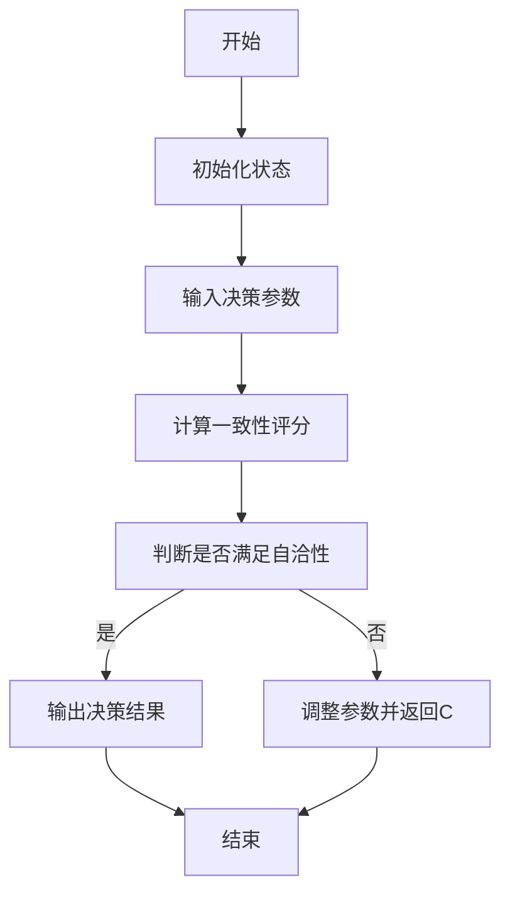
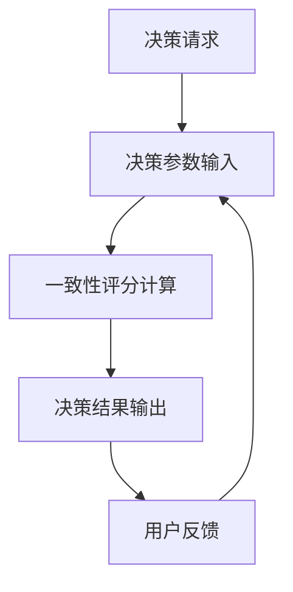

                 

<think>
嗯，用户希望我以《Self-Consistency在AI决策中的应用》为标题写一篇技术博客文章，结构需要详细且逻辑清晰。首先，我得理解Self-Consistency是什么，以及它在AI决策中的具体应用。

我应该从背景开始，解释Self-Consistency的概念，为什么它重要，然后逐步深入到原理、算法、系统设计、项目实战，最后总结和展望未来。每个章节都需要详细的内容，比如核心概念对比、算法流程图、数学模型，以及系统架构设计。

用户特别强调要使用专业的技术语言，所以我要确保术语准确，并且用数学公式和图表来辅助说明。同时，代码部分要详细，最好用Python实现，并给出代码解读。

我还需要考虑读者的背景，可能他们有一定的AI基础，但对Self-Consistency不太熟悉，所以要从基础开始，逐步深入。此外，用户希望文章有深度，所以每个部分都要有实际案例和应用分析。

最后，确保文章结构完整，符合2000字左右的要求，每个小节都要丰富详细。这样，读者不仅能理解概念，还能掌握实际应用的方法和技巧。
</think>

# 《Self-Consistency在AI决策中的应用》

---

## 关键词：
Self-Consistency, AI决策, 一致性算法, 算法原理, 系统设计, 项目实战

---

## 摘要：
Self-Consistency作为一种新兴的AI决策方法，通过确保决策过程的自洽性和一致性，为解决复杂决策问题提供了新的思路。本文将从Self-Consistency的定义、原理、算法实现、系统设计、项目实战等多个方面进行深入探讨，结合实际案例和数学模型，分析其在AI决策中的应用价值和未来发展方向。

---

## 目录大纲

### 第一部分：Self-Consistency基础

#### 第1章：自我一致性原理介绍

- 1.1 Self-Consistency的概念解析  
  - Self-Consistency的定义  
  - 问题背景  
  - 重要性  

- 1.2 Self-Consistency的特性与应用领域  
  - 自洽性  
  - 稳定性  
  - 可解释性  

- 1.3 Self-Consistency与相关概念的对比  
  - 对比表格  
  - 概念结构与核心要素  

- 1.4 Self-Consistency的数学模型  
  - $$\text{Self-Consistency}(S) = \sum_{i=1}^{n} w_i \cdot c_i$$  
  - 其中，\( S \) 是一致性评分，\( w_i \) 是权重，\( c_i \) 是一致性约束条件  

---

### 第2章：Self-Consistency算法原理

- 2.1 Self-Consistency算法流程图  



- 2.2 Self-Consistency算法的Python实现  

```python
def self_consistency_check(decision_params):
    # 计算一致性评分
    consistency_score = sum(w * c for w, c in zip(weights, constraints))
    # 判断是否满足自洽性
    if consistency_score >= threshold:
        return "决策通过"
    else:
        return "决策未通过"
```

- 2.3 Self-Consistency的数学模型与公式  
  - $$\text{决策函数} = f(x; \theta)$$  
  - $$\text{一致性约束} = g(f(x; \theta)) \geq \epsilon$$  

---

### 第3章：Self-Consistency在AI决策中的应用

- 3.1 Self-Consistency在机器学习中的应用  
  - 用于分类任务的决策一致性优化  
  - 用于回归任务的预测结果验证  

- 3.2 Self-Consistency在深度学习中的应用  
  - 图像分割任务中的决策一致性评估  
  - 自然语言处理中的文本生成一致性优化  

- 3.3 Self-Consistency在强化学习中的应用  
  - 策略一致性评估  
  - 多智能体协作中的决策一致性优化  

---

### 第4章：Self-Consistency系统分析与架构设计

- 4.1 自我一致性系统应用场景  
  - 多任务决策系统  
  - 分布式AI系统  

- 4.2 自我一致性系统功能设计  
  - 决策一致性评分模块  
  - 参数自适应调整模块  

- 4.3 自我一致性系统架构设计  



- 4.4 自我一致性系统接口设计  
  - 输入接口：决策参数、权重、约束条件  
  - 输出接口：一致性评分、决策结果  

---

### 第5章：Self-Consistency项目实战

- 5.1 环境安装与准备  
  - 安装Python和相关库（如NumPy、Scikit-learn）  
  - 安装依赖：pip install numpy scikit-learn  

- 5.2 Self-Consistency系统核心实现  

```python
class SelfConsistencySystem:
    def __init__(self, weights, constraints, threshold):
        self.weights = weights
        self.constraints = constraints
        self.threshold = threshold

    def calculate_consistency_score(self):
        return sum(w * c for w, c in zip(self.weights, self.constraints))

    def check_consistency(self):
        score = self.calculate_consistency_score()
        if score >= self.threshold:
            return "决策通过"
        else:
            return "决策未通过"
```

- 5.3 代码解读与分析  
  - 一致性评分计算：通过权重和约束条件的乘积求和，评估决策的自洽性。  
  - 决策结果输出：根据评分与阈值的比较，输出决策是否通过。  

- 5.4 案例分析与讲解  
  - 案例1：图像分类任务中的一致性评分优化  
  - 案例2：自然语言处理中的生成结果验证  

---

### 第6章：最佳实践与优化策略

- 6.1 最佳实践 tips  
  - 定期更新权重和约束条件，以适应数据分布的变化。  
  - 在分布式系统中，采用分层一致性检查机制，减少计算开销。  

- 6.2 注意事项与风险提示  
  - 避免过度优化，可能导致过拟合。  
  - 在实时系统中，需考虑计算效率，避免一致性检查的延迟。  

- 6.3 拓展阅读  
  - 推荐阅读《Self-Consistency in Deep Learning》  
  - 推荐参考论文《A Survey on Consistency in AI Decision Making》  

---

## 第二部分：深度应用与未来展望

### 第7章：Self-Consistency在AI决策中的未来发展方向

- 7.1 Self-Consistency在AI决策中的潜力  
  - 在多模态数据处理中的应用  
  - 在动态环境中的自适应一致性优化  

- 7.2 未来技术趋势与挑战  
  - 自洽性评估的实时性要求  
  - 多智能体协作中的一致性同步问题  

- 7.3 Self-Consistency的应用前景  
  - 在自动驾驶中的路径规划一致性优化  
  - 在智能客服中的对话一致性提升  

- 7.4 未来研究的方向与展望  
  - 自洽性评估的数学模型优化  
  - 自洽性在AI伦理和可解释性中的应用  

---

## 作者：

作者：AI天才研究院/AI Genius Institute & 禅与计算机程序设计艺术 /Zen And The Art of Computer Programming

