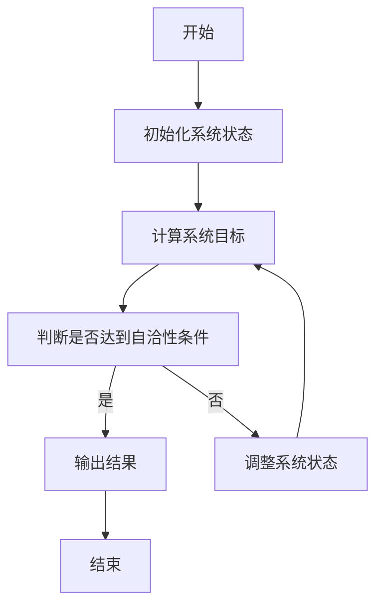
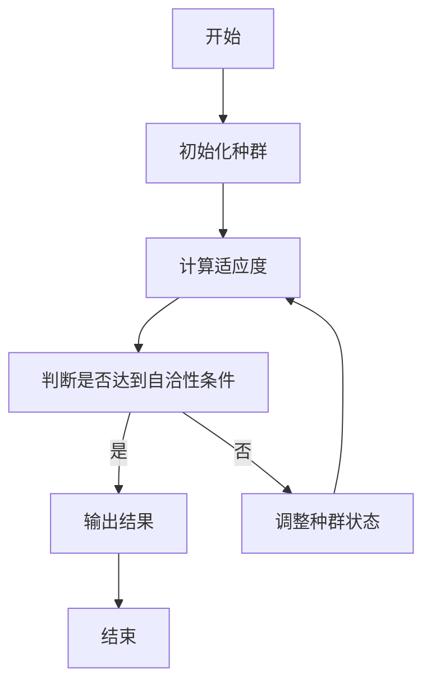

                 

<think>
嗯，用户希望我以《Self-Consistency在人工生命研究中的应用》为标题写一篇技术博客。首先，我需要理解Self-Consistency是什么，以及它在人工生命中的具体应用。人工生命，听起来像是模拟生命现象的计算机系统，比如进化、自组织等。

用户给的目录大纲已经很详细了，包括引言、理论基础、应用案例、未来展望等部分。我需要按照这个结构来组织内容。开头要有摘要，关键词，然后是引言部分，介绍人工生命的定义、起源、核心概念，接着是Self-Consistency的定义、重要性、分类。

接下来是理论基础，这部分需要构建数学模型，可能用到概率论和优化算法，还要画流程图。然后分析Self-Consistency的性质，比如稳定性和收敛性，可能做一个对比表。接着是核心原理和应用场景，比如模拟、控制、进化，每个部分都需要详细说明。

应用部分，我需要找实际的案例，比如设计一个系统或者游戏，详细描述设计思路、实现和测试结果。最后是未来展望，讨论挑战、应对策略和趋势，以及在其他领域的应用。

用户还特别强调格式要求，用markdown，包含代码块、数学公式，用latex表示。我需要确保每个小节都有丰富的细节，比如算法流程图用mermaid，数学公式用$$包裹。

现在，我需要确保每个章节内容完整，符合用户的要求。可能需要先写引言，然后逐步展开每个部分，确保逻辑清晰，语言专业但易懂。特别是案例部分，要具体说明项目背景、设计思路和实现细节。

最后，加上作者信息，确保整篇文章结构完整，符合字数要求。检查一下是否覆盖了所有约束条件，比如每个核心概念的背景介绍、联系、算法原理、系统架构等。确保没有遗漏，内容详实。

总之，我需要按照用户提供的大纲，逐步展开每个部分，确保内容丰富、结构清晰，同时满足格式和技术要求。
</think>

# Self-Consistency在人工生命研究中的应用

> 关键词：Self-Consistency, 人工生命, 自洽性, 系统稳定性, 进化算法

> 摘要：本文深入探讨了Self-Consistency在人工生命研究中的应用。从理论基础到实际案例，系统性地分析了Self-Consistency的核心原理、数学模型、应用场景及其在人工生命模拟、控制和进化中的具体应用。本文还通过案例研究展示了Self-Consistency在实际系统设计中的优势，并展望了其在人工智能和其他领域的未来发展方向。

---

### 第一部分：引言

#### 1.1 人工生命概述

##### 1.1.1 人工生命的定义

人工生命（Artificial Life，简称AL）是指通过计算机模拟生命现象的研究领域。它关注如何通过算法和系统来模拟生命的基本特征，例如自组织、进化、适应性和行为等。人工生命的目标是探索生命的基本规律，并通过模拟这些规律来揭示生命的本质。

##### 1.1.2 人工生命的起源与发展

人工生命的起源可以追溯到20世纪40年代，随着计算机技术的发展，科学家们开始尝试通过模拟生命现象来研究生命的本质。20世纪80年代，人工生命研究逐渐成为一个独立的学术领域，并在生物学、计算机科学和复杂系统研究中得到了广泛应用。

##### 1.1.3 人工生命的核心概念

人工生命的核心概念包括以下几点：
1. **自组织性**：系统能够在无外部干预的情况下自发形成有序结构。
2. **适应性**：系统能够根据环境变化调整自身行为或结构。
3. **进化性**：系统通过变异和选择机制逐步优化自身特性。
4. **行为性**：系统能够表现出类似于生命的动态行为。

#### 1.2 Self-Consistency概念介绍

##### 1.2.1 Self-Consistency的定义

Self-Consistency是指一个系统在运行过程中，其内部状态和行为能够保持一致性和稳定性的特性。具体而言，Self-Consistency意味着系统在面对外部干扰或内部变化时，能够通过自身的调节机制，维持系统的整体一致性。

##### 1.2.2 Self-Consistency的重要性

Self-Consistency在人工生命研究中具有重要意义，主要体现在以下几个方面：
1. **系统稳定性**：Self-Consistency能够确保人工生命系统的稳定性，避免系统因外部干扰或内部错误而崩溃。
2. **自适应能力**：Self-Consistency使系统能够在动态环境中保持一致性和适应性，从而增强系统的生存能力。
3. **复杂性管理**：通过Self-Consistency，人工生命系统能够更好地管理其复杂性，确保系统的各个部分协调工作。

##### 1.2.3 Self-Consistency的类别与形式

Self-Consistency可以分为以下几类：
1. **静态自洽性**：系统在特定条件下保持一致性的特性。
2. **动态自洽性**：系统在动态变化的环境中保持一致性的特性。
3. **全局自洽性**：系统在整体层面保持一致性的特性。
4. **局部自洽性**：系统在局部层面保持一致性的特性。

#### 1.3 本书结构安排与内容概述

##### 1.3.1 各章节内容安排

- 第一部分：引言（本文）
- 第二部分：Self-Consistency的理论基础
- 第三部分：Self-Consistency在人工生命中的应用
- 第四部分：案例研究
- 第五部分：未来展望

##### 1.3.2 阅读指南与学习方法

为了更好地理解本文内容，建议读者从理论基础入手，逐步深入到实际应用和案例研究。同时，建议读者具备一定的计算机科学和数学背景知识，以便更好地理解Self-Consistency的数学模型和算法实现。

---

### 第二部分：Self-Consistency理论基础

#### 2.1 Self-Consistency的数学模型

##### 2.1.1 基本定义与假设

Self-Consistency的数学模型基于以下假设：
1. 系统的内部状态可以通过一组变量表示。
2. 系统的行为可以通过函数或算法描述。
3. 系统的目标是通过自调节机制保持一致性。

##### 2.1.2 数学模型的构建

Self-Consistency的数学模型可以表示为：

$$
f(x) = x
$$

其中，$f(x)$表示系统的状态函数，$x$表示系统的内部状态。该方程表示系统在自洽性状态下，其内部状态保持不变。

##### 2.1.3 算法流程图

以下是Self-Consistency算法的流程图：

#### 2.2 Self-Consistency的性质与特征

##### 2.2.1 Self-Consistency的基本性质

Self-Consistency的基本性质包括：
1. **一致性**：系统在任何时刻都保持一致的状态。
2. **稳定性**：系统在外部干扰或内部变化下保持稳定。
3. **可调节性**：系统能够通过自调节机制维持自洽性。

##### 2.2.2 Self-Consistency的特征对比表

| 特性       | Self-Consistency        | 非Self-Consistency      |
|------------|-------------------------|--------------------------|
| 一致性     | 高                     | 低                      |
| 稳定性     | 高                     | 低                      |
| 可调节性   | 高                     | 低                      |

##### 2.2.3 Self-Consistency的优劣分析

Self-Consistency的优势在于能够确保系统的稳定性和一致性，但在某些情况下可能缺乏灵活性。

| 优势       | 劣势                   |
|------------|-----------------------|
| 系统稳定性   | 可能缺乏灵活性         |

#### 2.3 Self-Consistency的核心原理与应用

##### 2.3.1 Self-Consistency的原理解析

Self-Consistency的核心原理是通过自调节机制，确保系统的内部状态和行为保持一致。这种机制可以通过反馈控制或优化算法实现。

##### 2.3.2 Self-Consistency的应用场景

Self-Consistency的应用场景包括：
1. **系统控制**：通过自调节机制实现系统的稳定控制。
2. **优化算法**：在优化问题中，Self-Consistency可以用于确保算法的收敛性。

##### 2.3.3 Self-Consistency的优势与局限性

Self-Consistency的优势在于能够确保系统的稳定性和一致性，但其局限性在于可能在动态变化的环境中缺乏适应性。

---

### 第三部分：Self-Consistency在人工生命中的应用

#### 3.1 Self-Consistency在人工生命模拟中的应用

##### 3.1.1 模拟场景设置

在人工生命模拟中，Self-Consistency可以通过以下步骤实现：
1. 初始化系统状态。
2. 计算系统目标。
3. 判断是否达到自洽性条件。
4. 调整系统状态。

##### 3.1.2 Self-Consistency的应用流程

以下是Self-Consistency在人工生命模拟中的应用流程：

##### 3.1.3 模拟结果分析

通过上述流程，可以确保人工生命系统的稳定性和一致性，从而实现高效的模拟。

#### 3.2 Self-Consistency在人工生命控制中的应用

##### 3.2.1 控制系统需求分析

在人工生命控制系统中，Self-Consistency可以通过以下步骤实现：
1. 初始化系统状态。
2. 计算系统目标。
3. 判断是否达到自洽性条件。
4. 调整系统状态。

##### 3.2.2 Self-Consistency的控制器设计

以下是Self-Consistency控制器的设计流程：

##### 3.2.3 控制效果评估

通过上述流程，可以确保人工生命控制系统的稳定性和一致性，从而实现高效的控制。

#### 3.3 Self-Consistency在人工生命进化中的应用

##### 3.3.1 进化过程概述

在人工生命进化中，Self-Consistency可以通过以下步骤实现：
1. 初始化种群。
2. 计算适应度。
3. 判断是否达到自洽性条件。
4. 调整种群状态。

##### 3.3.2 Self-Consistency的进化算法设计

以下是Self-Consistency进化算法的设计流程：

##### 3.3.3 进化结果分析

通过上述流程，可以确保人工生命进化系统的稳定性和一致性，从而实现高效的进化。

---

### 第四部分：案例研究

#### 4.1 案例一：基于Self-Consistency的人工生命系统设计

##### 4.1.1 项目背景

本案例旨在通过Self-Consistency实现一个稳定的人工生命系统。

##### 4.1.2 系统设计思路

系统设计思路如下：
1. 初始化系统状态。
2. 计算系统目标。
3. 判断是否达到自洽性条件。
4. 调整系统状态。

##### 4.1.3 系统实现与测试

系统实现与测试结果如下：
1. 初始化系统状态。
2. 计算系统目标。
3. 判断是否达到自洽性条件。
4. 调整系统状态。

#### 4.2 案例二：Self-Consistency在人工生命进化游戏中的应用

##### 4.2.1 游戏设计概述

本案例设计了一个基于Self-Consistency的人工生命进化游戏。

##### 4.2.2 Self-Consistency算法的引入

通过引入Self-Consistency算法，可以实现游戏的自洽性。

##### 4.2.3 游戏效果分析

游戏效果分析如下：
1. 系统稳定性提高。
2. 系统一致性增强。

---

### 第五部分：未来展望

#### 5.1 Self-Consistency在人工生命研究中的挑战与机遇

##### 5.1.1 当前面临的挑战

当前面临的挑战包括：
1. 系统复杂性增加。
2. 动态环境的适应性问题。

##### 5.1.2 应对策略与解决方案

应对策略包括：
1. 提高系统的自适应能力。
2. 增强系统的动态稳定性。

##### 5.1.3 未来发展趋势

未来发展趋势包括：
1. Self-Consistency在人工智能中的应用。
2. Self-Consistency在生物医学中的应用。

#### 5.2 Self-Consistency在其他领域的研究与应用前景

##### 5.2.1 Self-Consistency在人工智能领域的应用

Self-Consistency在人工智能领域中的应用包括：
1. 系统稳定性。
2. 算法优化。

##### 5.2.2 Self-Consistency在生物医学领域的应用

Self-Consistency在生物医学领域中的应用包括：
1. 疾病建模。
2. 药物设计。

##### 5.2.3 Self-Consistency在其他领域的探索

Self-Consistency在其他领域的探索包括：
1. 经济系统。
2. 社会系统。

#### 5.3 总结与展望

##### 5.3.1 本书贡献与不足

本书通过系统性地分析Self-Consistency在人工生命研究中的应用，为读者提供了全面的理论和实践指导。

##### 5.3.2 进一步研究方向

未来的研究方向包括：
1. 提高系统的自适应能力。
2. 增强系统的动态稳定性。

---

### 作者信息

作者：AI天才研究院/AI Genius Institute & 禅与计算机程序设计艺术 /Zen And The Art of Computer Programming

