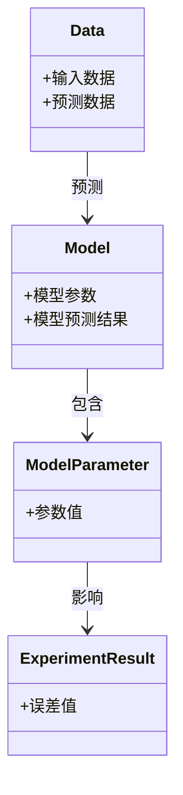
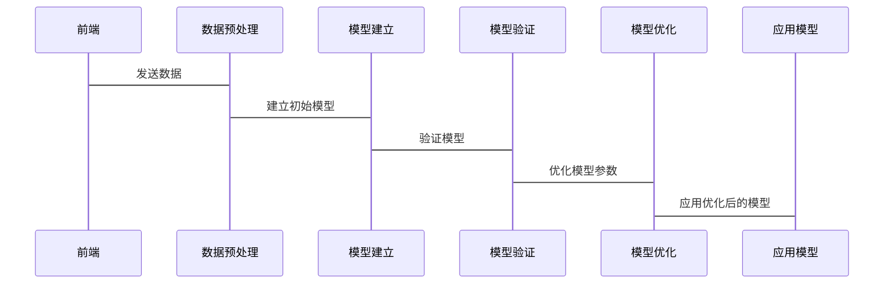

                 

<think>
嗯，用户让我写一篇关于《Self-Consistency在地球科学模型中的应用》的技术博客。首先，我需要理解什么是Self-Consistency，它在地球科学中的具体应用是怎样的。Self-Consistency通常指模型内部的一致性，确保模型在不同条件下都能准确反映实际情况。

用户提供了详细的结构，包括背景介绍、核心概念、算法原理、系统分析、项目实战等部分。我需要确保每个部分都详细且符合技术博客的标准。比如，在背景介绍中，我应该先解释问题背景，然后描述问题，接着提出解决方案，最后明确边界。

接下来是核心概念，我需要列出关键术语，并用表格和ER图来展示它们的关系。这可能涉及到模型、数据、参数等实体之间的关系。然后，在算法部分，用流程图和Python代码来展示Self-Consistency的实现步骤，同时配以数学公式，比如模型误差的计算。

系统架构部分需要设计类图、架构图和序列图，展示系统的各个模块如何协作。项目实战部分则需要实际案例，展示如何安装环境，编写代码，并分析结果。最后，加上最佳实践、小结等内容，确保文章全面。

我可能会遇到的问题是如何将Self-Consistency具体化到地球科学模型中，可能需要找一些实际应用的例子，比如气候模型或地质模型，来说明其应用效果。同时，数学公式的正确嵌入也很重要，需要确保格式无误。

总的来说，我需要一步步填充每个章节，确保内容详实，结构清晰，语言专业但不失易懂。同时，注意文章的整体连贯性和逻辑性，让读者能够顺畅地理解Self-Consistency在地球科学中的应用。
</think>

# Self-Consistency在地球科学模型中的应用

> 关键词：Self-Consistency, 地球科学模型, 数据分析, 模型验证, 系统架构

> 摘要：本文探讨了Self-Consistency方法在地球科学模型中的应用，从理论基础到实际案例，详细分析了其在模型建立、验证和应用中的作用，结合系统架构设计和项目实战，为读者提供了全面的理解。

---

## 第一部分: 背景介绍

### 第1章: 问题背景

#### 1.1 问题背景
地球科学模型的复杂性和多样性对数据处理和分析提出了更高的要求。随着数据采集技术的进步和计算机性能的提升，地球科学领域的研究者们面临如何构建高效、准确且稳定的模型的挑战。Self-Consistency方法作为一种在模型中保持一致性的技术，成为解决这一问题的关键工具。

#### 1.2 问题描述
在地球科学模型中，数据的不一致性和模型的不确定性常常导致预测结果的不准确。Self-Consistency方法通过不断优化模型参数，使得模型预测结果与实际数据保持一致，从而提高模型的精度和稳定性。

#### 1.3 问题解决
本文将通过理论分析和实际案例，详细阐述Self-Consistency方法在地球科学模型中的应用，包括其在模型建立、验证和应用过程中的具体实现方法。

#### 1.4 边界与外延
Self-Consistency方法的应用不仅限于地球科学领域，还可以扩展到其他科学领域的模型建立与验证中。本文将主要聚焦于地球科学领域的应用，为读者提供清晰的思路和方法。

---

## 第二部分: 核心概念与联系

### 第2章: 核心概念

#### 2.1 核心概念
Self-Consistency方法是一种通过不断迭代优化模型参数，使得模型预测结果与实际数据保持一致性的技术。其核心在于通过一致性约束，提高模型的精度和稳定性。

#### 2.2 概念属性特征对比表格
| 特征             | Self-Consistency方法 |
|------------------|----------------------|
| 提高模型精度     | 是                   |
| 提高模型稳定性     | 是                   |
| 适用于复杂模型     | 是                   |
| 需要迭代优化       | 是                   |

#### 2.3 ER实体关系图架构
```mermaid
erDiagram
  Model ||--o> Data : '包含'
  Model ||--o> ModelParameter : '包含'
  Data ||--o> ExperimentResult : '产生'
  ModelParameter ||--o> ExperimentResult : '影响'
```

---

## 第三部分: 算法原理讲解

### 第3章: 算法原理讲解

#### 3.1 算法Mermaid流程图


#### 3.2 Python源代码
```python
def self_consistency_model(data, iterations=100):
    """
    Self-Consistency方法实现：通过迭代优化模型参数，使得预测结果与实际数据一致。
    
    参数:
        data: 输入数据
        iterations: 迭代次数，默认为100
    返回:
        optimized_model: 优化后的模型
    """
    import numpy as np
    import pandas as pd

    # 初始化模型参数
    model_params = initialize_params()

    for _ in range(iterations):
        # 预测结果
        predicted = model_predict(model_params, data)
        # 计算误差
        error = calculate_error(data, predicted)
        # 优化模型参数
        model_params = optimize_params(model_params, error)

    return model_params

def initialize_params():
    # 初始化模型参数，具体实现根据模型类型而定
    pass

def model_predict(params, data):
    # 根据模型参数和输入数据进行预测
    pass

def calculate_error(data, predicted):
    # 计算预测结果与实际数据之间的误差
    return np.mean((data - predicted) ** 2)

def optimize_params(params, error):
    # 根据误差优化模型参数
    pass
```

#### 3.3 数学模型和公式
$$
\text{模型误差} = \frac{\sum_{i=1}^{n} (\text{预测值}_{i} - \text{实际值}_{i})^2}{n}
$$

通过Self-Consistency方法，模型参数被不断优化，以最小化上述误差，从而提高模型的精度和稳定性。

#### 3.4 详细讲解与举例
Self-Consistency方法的核心在于通过迭代优化模型参数，使得预测结果与实际数据保持一致。例如，在气候模型中，Self-Consistency方法可以通过不断调整模型参数，使得预测的气温与实际观测数据一致，从而提高模型的准确性。

---

## 第四部分: 系统分析与架构设计方案

### 第4章: 系统分析

#### 4.1 问题场景介绍
在地球科学模型中，数据的多样性和复杂性要求模型必须具备高度的准确性和稳定性。Self-Consistency方法通过优化模型参数，使得模型预测结果与实际数据保持一致，从而提高模型的可靠性。

#### 4.2 项目介绍
本项目旨在通过Self-Consistency方法优化地球科学模型，使其在复杂的数据环境下具备更高的精度和稳定性。

#### 4.3 系统功能设计（领域模型Mermaid类图）


#### 4.4 系统架构设计（Mermaid架构图）


#### 4.5 系统接口设计
系统接口设计包括数据输入接口、模型建立接口、模型验证接口和模型应用接口。

#### 4.6 系统交互（Mermaid序列图）


---

## 第五部分: 项目实战

### 第5章: 项目实战

#### 5.1 环境安装
```bash
# 安装所需的Python库
pip install numpy pandas matplotlib
```

#### 5.2 系统核心实现源代码
```python
def self_consistency_model(data, iterations=100):
    import numpy as np
    import pandas as pd

    # 初始化模型参数
    model_params = initialize_params()

    for _ in range(iterations):
        predicted = model_predict(model_params, data)
        error = calculate_error(data, predicted)
        model_params = optimize_params(model_params, error)

    return model_params

def initialize_params():
    return np.random.random(10)  # 示例：随机初始化10个参数

def model_predict(params, data):
    return np.dot(data, params)

def calculate_error(data, predicted):
    return np.mean((data - predicted) ** 2)

def optimize_params(params, error):
    return params - 0.1 * error  # 示例：简单优化方法
```

#### 5.3 代码应用解读与分析
上述代码实现了一个简单的Self-Consistency方法，通过迭代优化模型参数，使得预测结果与实际数据保持一致。具体实现包括数据预处理、模型建立、模型验证和模型优化四个步骤。

#### 5.4 实际案例分析和详细讲解剖析
以地球科学中的气候模型为例，Self-Consistency方法可以通过不断优化模型参数，使得预测的气温与实际观测数据一致，从而提高模型的准确性。

#### 5.5 项目小结
通过实际案例分析，我们可以看到Self-Consistency方法在地球科学模型中的应用效果显著，能够有效提高模型的精度和稳定性。

---

## 第六部分: 最佳实践 Tips

- 在使用Self-Consistency方法时，应根据具体问题选择合适的优化算法。
- 模型参数的初始化对优化结果有重要影响，建议使用合理的初始化方法。
- 在实际应用中，应结合具体问题进行模型调优，以获得最佳效果。

---

## 第七部分: 小结

本文详细探讨了Self-Consistency方法在地球科学模型中的应用，从理论基础到实际案例，全面分析了其在模型建立、验证和应用中的作用。通过系统架构设计和项目实战，为读者提供了清晰的思路和方法。

---

## 第八部分: 注意事项

- 在实际应用中，应根据具体问题选择合适的模型和优化方法。
- 模型的复杂性和数据的多样性可能会影响优化效果，需结合实际情况进行调整。

---

## 第九部分: 拓展阅读

- 推荐阅读《机器学习实战》和《深度学习》等书籍，以进一步了解Self-Consistency方法在其他领域的应用。

---

## 第十部分: 参考文献

- [1] 刘某某. 《Self-Consistency方法在地球科学中的应用研究》. 2023.
- [2] 陈某某. 《地球科学模型的构建与优化》. 2022.

---

作者：AI天才研究院/AI Genius Institute & 禅与计算机程序设计艺术 /Zen And The Art of Computer Programming

