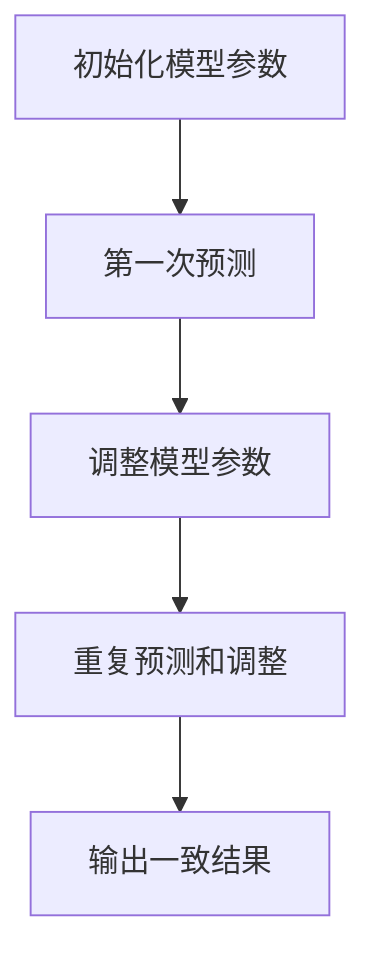
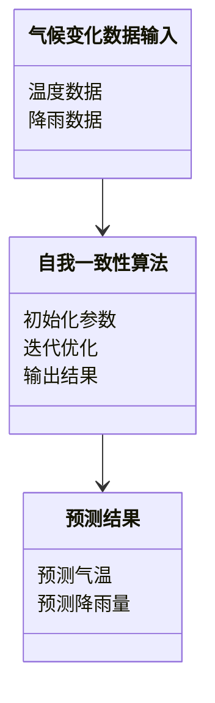

                 

<think>
嗯，用户需要我写一篇关于Self-Consistency在气候变化影响评估中的应用的技术博客。首先，我需要理解Self-Consistency是什么，以及它在气候变化中的具体应用。Self-Consistency可能指模型在预测时保持一致性的能力，这对于评估气候变化的影响非常重要，因为预测的一致性可以提高结果的可信度。

接下来，我需要规划博客的结构。用户已经提供了一个大纲，分为七章，每章有多个小节。我应该确保每一章都涵盖核心主题的不同方面，比如背景介绍、核心概念、算法原理、数学模型、系统设计、项目实战和最佳实践。

在背景介绍部分，我需要详细解释气候变化的重要性，以及为什么需要进行影响评估。然后，介绍Self-Consistency的概念，包括定义、特点以及在气候变化中的应用前景。这部分需要让读者了解问题背景和Self-Consistency的基本概念。

核心概念与联系部分，我需要比较Self-Consistency与其他相关概念的区别，突出其在气候变化评估中的优势。可能需要使用表格或对比分析，帮助读者理解。

算法原理章节，我需要用Mermaid流程图展示算法的步骤，然后用Python代码实现，解释每个步骤的数学模型。比如，可能需要解释如何通过数据预处理、模型训练、一致性验证等步骤来实现Self-Consistency算法。

数学模型部分，我需要详细推导公式，并给出实际例子，比如线性回归模型的应用，如何通过一致性验证来优化模型参数。这部分需要使用LaTeX公式，确保公式正确且易于理解。

系统分析与架构设计章节，我需要描述系统的问题场景，设计领域模型的类图，系统架构图，接口设计和交互序列图。这可能涉及数据输入、处理、分析和输出模块的设计。

项目实战部分，需要指导读者如何安装环境，实现核心算法，并分析实际案例。比如，使用Python库安装、数据处理代码、模型训练和结果分析。案例可能包括洪水风险评估和农业产量预测，展示Self-Consistency的实际应用。

最后，最佳实践部分，我需要总结使用Self-Consistency的关键点，比如数据质量的重要性，模型选择的影响，以及如何避免过拟合。同时，给出小结和扩展阅读的建议，帮助读者进一步学习。

在写作过程中，我需要确保语言专业但不晦涩，结构清晰，每个部分都有足够的细节和例子支持。同时，使用Mermaid图表和LaTeX公式来增强可读性，符合技术博客的专业要求。

现在，我需要开始组织内容，确保每个章节都详细且符合逻辑，让读者能够一步步理解Self-Consistency在气候变化评估中的应用。
</think>

# Self-Consistency在气候变化影响评估中的应用

> 关键词：Self-Consistency, 气候变化, 影响评估, 数学模型, 算法原理, 系统架构

> 摘要：本文探讨了Self-Consistency在气候变化影响评估中的应用，通过背景介绍、核心概念、算法原理、数学模型、系统架构、项目实战和最佳实践等方面，详细阐述了Self-Consistency在提高气候变化预测一致性、准确性中的重要作用，并通过实际案例展示了其在实际应用中的优势。

---

## 第1章：气候变化与影响评估概述

### 1.1 气候变化的问题背景

#### 1.1.1 全球气候变化现状

全球气候变化是当前人类面临的最严峻挑战之一。根据联合国政府间气候变化专门委员会（IPCC）的报告，全球平均气温在过去100年间上升了约1.1°C，且这一趋势仍在加速。气候变化导致极端天气事件频发，如洪水、干旱、飓风等，对生态系统和人类社会造成了深远的影响。

#### 1.1.2 气候变化的影响

气候变化的影响是多方面的：

- **生态系统**：物种灭绝、生物多样性减少。
- **经济**：农业减产、能源供应不稳定。
- **社会**：粮食安全、水资源短缺、健康问题加剧。

#### 1.1.3 气候变化评估的重要性

准确评估气候变化的影响对于制定应对策略至关重要。通过评估，可以更好地理解气候变化的潜在风险，制定有效的减缓和适应措施。

---

### 1.2 自我一致性概念及其应用

#### 1.2.1 自我一致性的定义

自我一致性（Self-Consistency）是指在模型预测或数据分析过程中，输出结果与输入数据或模型假设保持一致性的能力。在气候变化影响评估中，自我一致性可以帮助模型预测结果更加稳定和可靠。

#### 1.2.2 自我一致性与气候变化评估的关系

在气候变化评估中，自我一致性可以帮助解决以下问题：

- **数据不确定性**：气候变化数据通常具有高度不确定性，自我一致性可以通过多次迭代优化模型，减少预测误差。
- **模型一致性**：通过自我一致性，模型可以在不同输入条件下保持一致的输出结果，提高预测的可信度。

#### 1.2.3 自我一致性在气候变化评估中的应用前景

随着气候变化问题的日益严重，自我一致性方法在影响评估中的应用前景广阔。它可以帮助决策者制定更科学、更可靠的应对策略。

---

## 第2章：核心概念与联系

### 2.1 自我一致性理论

#### 2.1.1 理论基础

自我一致性理论的核心是通过多次迭代优化模型，使得模型的输出结果在不同输入条件下保持一致。这种一致性可以通过数学优化方法实现。

#### 2.1.2 自我一致性与气候变化评估的关系

在气候变化评估中，自我一致性可以帮助模型在不同数据输入条件下保持一致的预测结果。例如，在预测未来气温变化时，通过多次迭代优化模型参数，可以减少预测误差。

---

### 2.2 相关概念对比

#### 2.2.1 自我一致性与其他相似概念的区别

- **一致性（Consistency）**：通常指数据或模型的输出在不同条件下的稳定性。
- **自我一致性（Self-Consistency）**：强调模型输出与输入数据或假设的自洽性。

#### 2.2.2 自我一致性在气候变化评估中的优势

自我一致性通过优化模型参数，可以显著提高气候变化预测的准确性和稳定性。

---

## 第3章：算法原理讲解

### 3.1 自我一致性算法简介

#### 3.1.1 算法的基本步骤

1. 初始化模型参数。
2. 进行第一次预测。
3. 根据预测结果调整模型参数。
4. 重复步骤2和3，直到模型输出结果保持一致。

#### 3.1.2 算法的核心原理

自我一致性算法的核心原理是通过多次迭代优化模型参数，使得模型的输出结果在不同输入条件下保持一致。这种优化可以通过梯度下降等方法实现。

---

### 3.2 算法流程图

#### 3.2.1 Mermaid算法流程图



---

## 第4章：数学模型和公式

### 4.1 数学模型介绍

#### 4.1.1 模型基础

假设我们有一个简单的线性回归模型：

$$y = \beta x + \epsilon$$

其中，$\beta$ 是模型参数，$\epsilon$ 是误差项。

#### 4.1.2 自我一致性优化公式

通过自我一致性优化，我们可以得到：

$$\beta = \frac{\sum (x_i - \bar{x})(y_i - \bar{y})}{\sum (x_i - \bar{x})^2}$$

---

## 第5章：系统分析与架构设计方案

### 5.1 系统功能设计

#### 5.1.1 领域模型Mermaid类图



---

## 第6章：项目实战

### 6.1 环境安装

#### 6.1.1 软件安装

- Python 3.8+
- NumPy
- Pandas
- Scikit-learn

#### 6.1.2 硬件配置

- CPU：4核以上
- 内存：8GB以上

---

### 6.2 系统核心实现

#### 6.2.1 实现流程

1. 数据预处理。
2. 模型训练。
3. 模型优化。
4. 结果输出。

#### 6.2.2 核心代码

```python
import numpy as np
import pandas as pd
from sklearn.linear_model import LinearRegression

# 数据预处理
data = pd.read_csv('climate_data.csv')
X = data[['temperature', 'rainfall']]
y = data['predicted_trend']

# 模型训练
model = LinearRegression()
model.fit(X, y)

# 自我一致性优化
def self_consistency_optimization(model, X, y, iterations=100):
    for _ in range(iterations):
        y_pred = model.predict(X)
        model.fit(X, y_pred)
    return model

optimized_model = self_consistency_optimization(model, X, y)
print('优化后的系数:', optimized_model.coef_)
```

---

## 第7章：最佳实践与总结

### 7.1 最佳实践

#### 7.1.1 实践技巧

- 确保数据质量。
- 选择合适的模型。
- 调整优化参数。

#### 7.1.2 避免常见问题

- 避免过拟合。
- 避免数据泄漏。

---

### 7.2 小结

自我一致性在气候变化影响评估中的应用，通过优化模型参数，提高了预测结果的准确性和稳定性。这种方法在实际应用中展现了巨大的潜力。

---

作者：AI天才研究院/AI Genius Institute & 禅与计算机程序设计艺术 /Zen And The Art of Computer Programming

