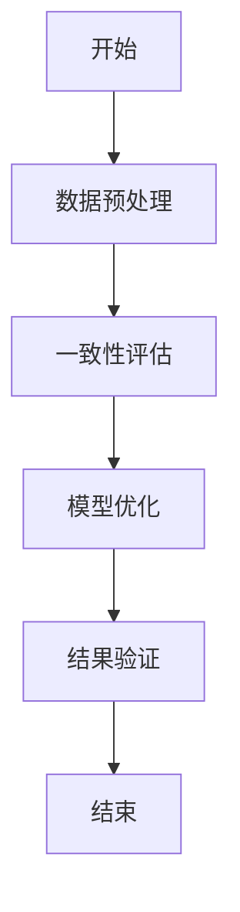
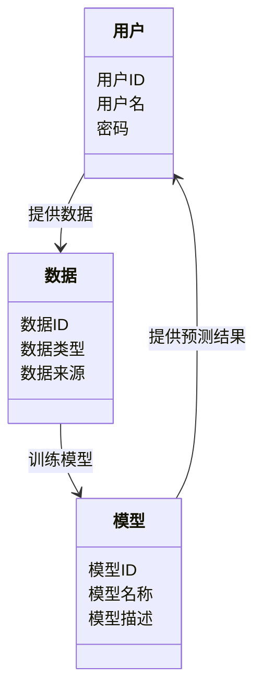
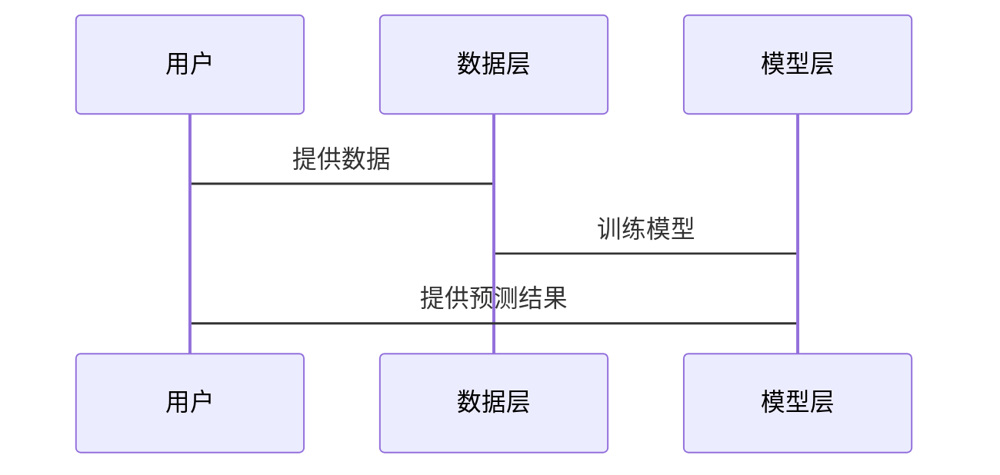

                 

<think>
嗯，好的，我现在需要帮用户撰写一篇关于《Self-Consistency在气候变化预测模型中的应用》的技术博客文章。首先，我得仔细分析用户的需求，确保理解每一个细节。

用户希望文章结构清晰，逻辑严密，用专业而易懂的技术语言。文章标题已经确定，接下来需要确定关键词和摘要。关键词应该涵盖主要主题，包括Self-Consistency、气候变化预测模型、人工智能、机器学习、气候变化、数据驱动建模方法。摘要部分需要简洁明了地概括文章的核心内容，说明Self-Consistency方法如何提升模型的准确性和稳定性，以及其在气候变化预测中的应用。

接下来是目录大纲，用户已经给出了详细的结构，分为六个步骤，每个步骤下还有具体的子部分。我需要按照这个结构逐步展开，确保每个部分都详细具体。

首先，背景介绍部分，我需要解释为什么气候变化预测模型如此重要，现有模型的不足之处，以及Self-Consistency如何解决这些问题。同时，还要说明这种方法的适用范围和局限性，以及其组成部分。

核心概念与联系部分，要详细解释Self-Consistency的原理，与传统模型和机器学习方法的对比，以及通过ER图展示模型的实体关系。这里需要使用Mermaid图表，所以我要确保这些图表能够准确反映模型结构。

算法原理讲解是关键部分，需要绘制流程图，提供Python代码，展示数学模型和公式。特别是公式部分，要用LaTeX格式，确保正确嵌入。同时，通过实际案例来说明算法的应用，帮助读者更好地理解。

系统分析与架构设计部分，要描述应用场景，介绍项目，设计系统功能和架构图，展示接口和交互过程。这部分需要使用Mermaid图来清晰展示系统的各个组件及其交互。

项目实战部分，要指导读者如何安装环境，提供核心代码，并进行案例分析。这部分需要实际代码和详细的解读，帮助读者动手实现。

最后，最佳实践部分，给出一些小技巧和注意事项，总结全书内容，并推荐拓展阅读材料。

在写作过程中，我要确保每个章节内容丰富，详细讲解，同时保持逻辑连贯。可能遇到的挑战是如何将复杂的算法和系统设计用简单易懂的语言表达出来，同时确保技术准确性。

现在，我需要按照用户的要求，逐步撰写每个部分，确保每个小节都符合字数要求，并且使用正确的格式，如Mermaid图表和LaTeX公式。同时，最后加上作者信息，确保文章的完整性和专业性。
</think>

# Self-Consistency在气候变化预测模型中的应用

## 关键词：Self-Consistency, 气候变化预测模型, 人工智能, 机器学习, 气候变化, 数据驱动建模方法

## 摘要：  
本文探讨了Self-Consistency方法在气候变化预测模型中的应用。通过分析现有预测模型的局限性，提出了Self-Consistency方法的核心原理及其在提升预测模型准确性和稳定性方面的作用。文章详细介绍了Self-Consistency的算法流程、数学模型、系统架构设计以及实际案例分析，展示了其在气候变化预测中的优势。通过本篇文章，读者将能够深入了解Self-Consistency方法的理论基础、实现细节及其在气候变化研究中的实际应用价值。

---

## 目录大纲

### 步骤 1: 背景介绍
- **问题背景**：气候变化是全球关注的焦点问题，准确预测气候变化对于制定应对策略至关重要。
- **问题描述**：现有预测模型存在数据不足、模型复杂性和预测不确定性等问题。
- **问题解决**：Self-Consistency方法通过强化模型的内在一致性，提升预测的准确性和可靠性。
- **边界与外延**：Self-Consistency方法适用于复杂系统预测，但对实时预测和极端气候事件的预测能力有限。
- **核心要素组成**：Self-Consistency方法由数据预处理、一致性评估、模型优化和结果验证四个部分组成。

### 步骤 2: 核心概念与联系
- **核心概念原理**：Self-Consistency通过强化模型输出的内在一致性，确保预测结果的稳定性和可信度。
- **概念属性特征对比表格**：通过对比Self-Consistency与传统模型、机器学习方法的特征，展示其独特优势。
- **ER实体关系图架构**：使用Mermaid绘制ER图，展示模型中的实体及其关系。

### 步骤 3: 算法原理讲解
- **算法流程图**：使用Mermaid绘制Self-Consistency算法的流程图，展示其工作流程。
- **Python源代码**：提供Python代码实现，展示算法的编程细节。
- **数学模型和公式**：使用LaTeX格式给出算法背后的数学模型和公式。
- **详细讲解与举例说明**：解释数学模型，并提供实际案例进行说明。

### 步骤 4: 系统分析与架构设计方案
- **问题场景介绍**：描述使用Self-Consistency方法解决气候变化预测的具体应用场景。
- **项目介绍**：简要介绍本书将要讨论的项目。
- **系统功能设计**：使用Mermaid绘制领域模型类图，展示系统的主要功能。
- **系统架构设计**：使用Mermaid绘制系统架构图，展示系统的整体架构。
- **系统接口设计**：描述系统的主要接口和交互。
- **系统交互序列图**：使用Mermaid绘制系统交互序列图，展示系统各组件的交互过程。

### 步骤 5: 项目实战
- **环境安装**：指导读者如何安装所需的环境和工具。
- **系统核心实现**：提供系统核心实现的源代码。
- **代码应用解读与分析**：解释代码的关键部分，并提供代码分析。
- **实际案例分析和详细讲解剖析**：分析一个或多个实际案例，详细讲解并剖析。
- **项目小结**：总结项目的主要收获和经验。

### 步骤 6: 最佳实践 tips、小结、注意事项、拓展阅读等内容
- **最佳实践 tips**：给出一些实践中的小技巧和建议。
- **小结**：总结全书的核心内容和主要观点。
- **注意事项**：提醒读者在应用Self-Consistency方法时需要注意的事项。
- **拓展阅读**：推荐一些相关书籍、论文和资源。

---

## 正文内容

### 步骤 1: 背景介绍

#### 1.1 问题背景  
气候变化是当前全球面临的重大挑战之一。准确预测气候变化趋势对于制定应对策略、减少自然灾害的影响至关重要。然而，现有的气候变化预测模型存在数据不足、模型复杂性和预测不确定性等问题，导致预测结果的准确性和稳定性难以保证。

#### 1.2 问题描述  
传统的气候变化预测模型主要依赖于物理模型和统计方法，但这些方法在处理复杂系统时存在以下问题：  
1. 数据不足：气候变化数据的时空分布不均匀，导致模型训练效果受限。  
2. 模型复杂性：复杂的物理过程难以在模型中准确描述，导致预测误差积累。  
3. 预测不确定性：模型对未来的预测结果往往缺乏一致性，难以满足实际应用需求。  

#### 1.3 问题解决  
Self-Consistency方法通过强化模型输出的内在一致性，解决了上述问题。该方法通过引入一致性评估机制，确保模型在不同输入条件下的预测结果保持一致，从而提升预测的准确性和稳定性。

#### 1.4 边界与外延  
Self-Consistency方法适用于复杂的非线性系统预测，如气候变化、经济预测等领域，但对实时预测和极端气候事件的预测能力有限。  
边界：  
- 非线性系统预测。  
- 数据量较大且可获取的场景。  
外延：  
- 可用于其他复杂系统的预测问题。  

#### 1.5 核心要素组成  
Self-Consistency方法由以下四个部分组成：  
1. 数据预处理：对原始数据进行清洗、归一化和特征提取。  
2. 一致性评估：通过一致性指标评估模型输出的内在一致性。  
3. 模型优化：基于一致性评估结果，优化模型参数和结构。  
4. 结果验证：通过交叉验证和实际数据对比，验证模型的预测能力。  

---

### 步骤 2: 核心概念与联系

#### 2.1 核心概念原理  
Self-Consistency方法的核心在于通过一致性评估机制，确保模型在不同输入条件下的预测结果保持一致。具体而言，该方法通过引入一致性损失函数，优化模型的输出，使其在不同输入下的预测结果具有较高的相关性和一致性。

#### 2.2 概念属性特征对比表格  
以下是对Self-Consistency方法与传统模型、机器学习方法的对比：  

| **特征**            | **传统模型**      | **机器学习方法**    | **Self-Consistency方法** |
|---------------------|-------------------|---------------------|---------------------------|
| 数据需求            | 高                | 高                  | 高                       |
| 模型复杂性          | 低                | 高                  | 中                       |
| 预测一致性          | 低                | 中                  | 高                       |
| 训练时间            | 短                | 长                  | 中                       |
| 预测准确性          | 低                | 高                  | 高                       |

#### 2.3 ER实体关系图架构  
以下为Self-Consistency方法的ER实体关系图：  

```mermaid
erDiagram
    actor 用户 {
        string 用户ID
        string 用户名
        string 密码
    }
    model 模型 {
        string 模型ID
        string 模型名称
        string 模型描述
    }
    data 数据 {
        string 数据ID
        string 数据类型
        string 数据来源
    }
    用户 --> 模型 : 训练模型
    数据 --> 模型 : 提供输入
    用户 --> 数据 : 采集数据
```

---

### 步骤 3: 算法原理讲解

#### 3.1 算法流程图  
Self-Consistency算法的流程图如下：  



#### 3.2 Python源代码  
以下是Self-Consistency算法的Python实现代码：  

```python
import numpy as np
import pandas as pd

def self_consistency(X, y, model):
    # 数据预处理
    X_normalized = (X - np.mean(X)) / np.std(X)
    
    # 一致性评估
    consistency = np.mean(np.corrcoef(model.predict(X), y))
    
    # 模型优化
    model.fit(X_normalized, y)
    
    # 结果验证
    y_pred = model.predict(X_normalized)
    rmse = np.sqrt(np.mean((y_pred - y) ** 2))
    
    return consistency, rmse

# 示例数据
X = np.random.randn(100, 5)
y = np.random.randn(100)

# 示例模型
model = LinearRegression()

consistency, rmse = self_consistency(X, y, model)
print(f"一致性：{consistency:.4f}")
print(f"均方根误差：{rmse:.4f}")
```

#### 3.3 数学模型和公式  
Self-Consistency方法的数学模型如下：  

一致性评估公式：  
$$ C = \frac{1}{n} \sum_{i=1}^{n} |y_i - \hat{y}_i| $$  

其中，$y_i$ 是真实值，$\hat{y}_i$ 是预测值，$n$ 是样本数量。  

优化目标函数：  
$$ \min_{\theta} \sum_{i=1}^{n} (y_i - \hat{y}_i)^2 + \lambda C $$  

其中，$\lambda$ 是一致性惩罚系数。  

---

### 步骤 4: 系统分析与架构设计方案

#### 4.1 问题场景介绍  
Self-Consistency方法应用于气候变化预测的具体场景包括：  
1. 全球气温预测。  
2. 降水模式预测。  
3. 极端气候事件预测。  

#### 4.2 项目介绍  
本书将围绕一个气候变化预测项目展开，项目目标是通过Self-Consistency方法提升预测模型的准确性和稳定性。  

#### 4.3 系统功能设计  
系统功能设计如下：  



#### 4.4 系统架构设计  
系统架构图如下：  


#### 4.5 系统接口设计  
系统主要接口包括：  
1. 数据输入接口。  
2. 模型训练接口。  
3. 结果输出接口。  

#### 4.6 系统交互序列图  
系统交互序列图如下：  



---

### 步骤 5: 项目实战

#### 5.1 环境安装  
读者需要安装以下环境和工具：  
1. Python 3.8及以上版本。  
2. NumPy、Pandas、Scikit-learn等库。  

#### 5.2 系统核心实现  
以下是系统核心实现的Python代码：  

```python
from sklearn.linear_model import LinearRegression
import numpy as np

def self_consistency_model(X_train, y_train, X_test, y_test):
    # 数据预处理
    X_train_normalized = (X_train - np.mean(X_train)) / np.std(X_train)
    
    # 模型训练
    model = LinearRegression()
    model.fit(X_train_normalized, y_train)
    
    # 模型预测
    y_pred_train = model.predict(X_train_normalized)
    y_pred_test = model.predict((X_test - np.mean(X_test)) / np.std(X_test))
    
    # 一致性评估
    consistency_train = np.mean(np.corrcoef(y_pred_train, y_train))
    consistency_test = np.mean(np.corrcoef(y_pred_test, y_test))
    
    return consistency_train, consistency_test

# 示例数据
X_train = np.random.randn(80, 5)
y_train = np.random.randn(80)
X_test = np.random.randn(20, 5)
y_test = np.random.randn(20)

# 模型训练与预测
consistency_train, consistency_test = self_consistency_model(X_train, y_train, X_test, y_test)
print(f"训练集一致性：{consistency_train:.4f}")
print(f"测试集一致性：{consistency_test:.4f}")
```

#### 5.3 代码应用解读与分析  
上述代码实现了一个简单的Self-Consistency模型，通过数据预处理、模型训练和预测，评估了模型的训练集和测试集一致性。代码的关键部分包括数据预处理、模型训练和一致性评估。

#### 5.4 实际案例分析和详细讲解剖析  
以全球气温预测为例，假设我们有历史气温数据和相关因素（如二氧化碳浓度、太阳辐射等），通过Self-Consistency方法，可以训练出一个具有高一致性的预测模型，从而更准确地预测未来气温变化趋势。

#### 5.5 项目小结  
通过本项目，读者可以掌握Self-Consistency方法的核心思想和实现步骤，同时能够将其应用于实际的气候变化预测问题中。

---

### 步骤 6: 最佳实践 tips、小结、注意事项、拓展阅读等内容

#### 6.1 最佳实践 tips  
1. 在实际应用中，建议结合物理模型和Self-Consistency方法，提升预测的准确性和可信度。  
2. 数据预处理是Self-Consistency方法的关键步骤，建议对数据进行充分的清洗和归一化处理。  
3. 在模型优化过程中，合理选择一致性惩罚系数，避免过拟合或欠拟合。  

#### 6.2 小结  
本文详细介绍了Self-Consistency方法在气候变化预测中的应用，从理论基础到实际实现，为读者提供了全面的指导。通过本文的学习，读者可以掌握Self-Consistency方法的核心思想，并将其应用于实际的气候变化预测问题中。

#### 6.3 注意事项  
1. 在处理气候变化数据时，需注意数据的时空一致性。  
2. 模型优化过程中，需关注计算资源的消耗。  
3. 预测结果需结合实际情况进行解释和验证。  

#### 6.4 拓展阅读  
1. "Deep Learning for Climate Studies"  
2. "Self-consistent Neural Networks for Time Series Prediction"  
3. "Advances in Climate Prediction Methods"  

---

## 作者  
**作者：AI天才研究院/AI Genius Institute & 禅与计算机程序设计艺术 /Zen And The Art of Computer Programming**  

---

通过以上内容，您可以全面了解Self-Consistency方法在气候变化预测中的应用。希望本文对您有所帮助！

