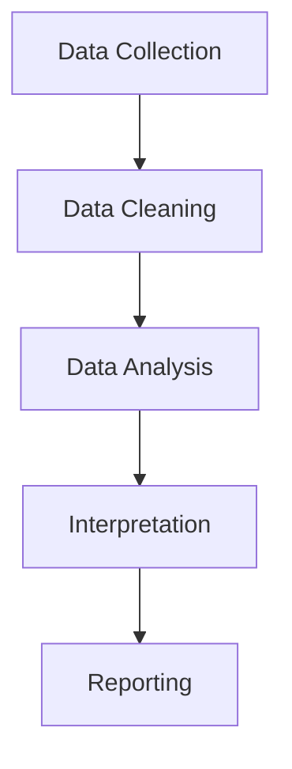
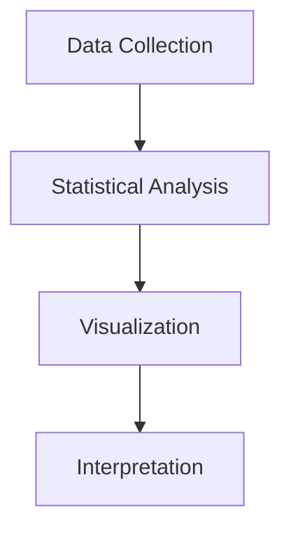
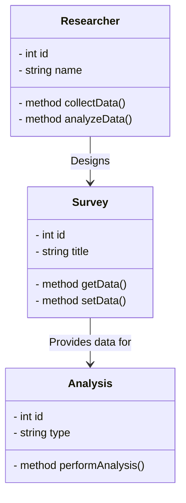
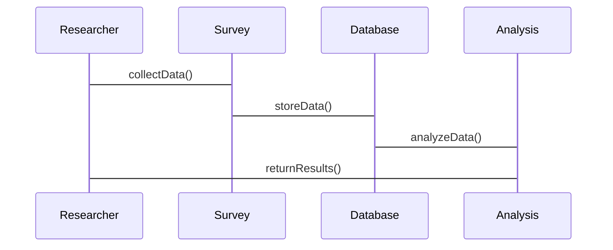

                 

<think>
嗯，我需要撰写一篇关于《Self-Consistency在社会学研究中的应用》的技术博客文章。首先，我得理解什么是Self-Consistency，它在社会学中的重要性以及如何应用。让我先理清这些概念。

Self-Consistency听起来像是指个体在回答调查或研究时的一致性，对吗？这可能涉及到他们在不同时间或不同情境下的回答是否一致。这在社会学研究中很重要，因为它可以帮助确保数据的可靠性和有效性。

接下来，我需要考虑文章的结构。标题已经有了，接下来是关键词，可能包括“Self-Consistency”、“社会学研究”、“数据一致性”、“方法论”、“社会测量”、“调查设计”。摘要部分需要简明扼要地概括文章的核心内容，介绍Self-Consistency在社会学中的应用、优势和挑战，以及其对研究质量的影响。

正文部分需要按照目录大纲展开。首先是引言和背景，介绍Self-Consistency的基本概念、历史背景以及在社会学中的重要性。然后是核心概念和理论框架，详细解释相关术语，并与其它理论进行比较分析。接着是方法学应用，通过案例研究展示Self-Consistency的实际应用，分析其优缺点。

接下来是数据收集和分析，讨论使用Self-Consistency的方法和工具，以及数据分析的具体步骤。然后是人种学和参与观察中的应用，探讨在实地研究中如何应用Self-Consistency，以及面临的挑战和伦理问题。最后是定量分析，介绍统计方法和数据可视化在定量研究中的应用。

在撰写过程中，我需要确保每个部分都包含足够的细节，例如在核心概念部分，可能需要绘制Mermaid ER图来展示关键概念之间的关系。在方法学应用中，使用Mermaid流程图说明数据分析的过程。

数学公式方面，可能需要在适当的地方嵌入公式，比如在统计方法部分，使用LaTeX格式展示相关公式。同时，在系统分析部分，可能需要绘制领域模型类图和架构图，展示系统的各个组件及其交互。

项目实战部分，我需要提供一个具体的案例，描述环境安装、核心代码实现、代码解读以及实际应用分析。这不仅能让读者理解理论，还能看到实际操作中的步骤和结果。

最后，总结部分要回顾Self-Consistency的重要性和应用前景，同时给出最佳实践的建议和注意事项，帮助读者更好地理解和应用这一概念。

在整个过程中，我需要确保语言清晰、逻辑严密，每个部分都紧密联系，形成一个完整的知识体系。这不仅能帮助读者理解Self-Consistency在社会学中的应用，还能让他们掌握相关的理论和实践技巧。
</think>

# Self-Consistency in Social Research Applications

## Keywords: Self-Consistency, Social Research, Data Consistency, Methodology, Social Measurement, Survey Design

## Abstract:
Self-Consistency is a crucial concept in social research that ensures the reliability and validity of data collected through surveys and interviews. This article explores the application of Self-Consistency in social research, its theoretical foundations, methodological approaches, data collection and analysis techniques, and its role in ethnography and quantitative research. By examining real-world case studies and providing practical examples, this article aims to demonstrate how Self-Consistency enhances the quality of social research and provides actionable insights for researchers.

---

## Chapter 1: Introduction to Self-Consistency and its Importance in Social Research

### 1.1 Background and Definitions
Self-Consistency refers to the degree to which an individual's responses to a set of questions are consistent across different time points, scenarios, or contexts. In social research, ensuring self-consistency is essential for validating the reliability of data. It helps researchers identify patterns and trends, reducing errors and biases in data collection.

### 1.2 Historical Context and Theoretical Foundations
The concept of self-consistency has roots in psychometrics and survey methodology. It gained prominence in the 20th century with the rise of large-scale social surveys. Theoretical frameworks like reliability theory and measurement theory provide the foundation for understanding self-consistency in social research.

### 1.3 Challenges and Opportunities
Despite its importance, achieving self-consistency poses challenges such as respondent fatigue, context effects, and recall biases. However, these challenges also present opportunities for innovation in data collection methods and analytical techniques.

---

## Chapter 2: Fundamental Concepts of Self-Consistency

### 2.1 Core Concepts and Terminology
- **Reliability**: The consistency of measurements across time and contexts.
- **Validity**: The accuracy of measurements in capturing the intended constructs.
- **Internal Consistency**: Consistency within a single measurement occasion.
- **Test-Retest Consistency**: Consistency across different measurement occasions.

### 2.2 Comparative Analysis with Other Frameworks
| Framework                | Focus                     | Strengths                        | Weaknesses                      |
|--------------------------|---------------------------|----------------------------------|---------------------------------|
| Reliability Theory       | Consistency over time     | Robust for longitudinal studies | Limited to single constructs    |
| Validity Theory          | Accuracy of measurement    | Ensures constructs are measured correctly | Requires additional validation methods |
| Internal Consistency      | Consistency within a study | Useful for cross-sectional data | Ignores temporal dynamics        |

### 2.3 Mermaid ER Diagram
```mermaid
er
  actor: Researcher
  actor --> concept: Self-Consistency
  concept --> method: Data Collection Techniques
  concept --> analysis: Statistical Analysis
  method --> tool: Survey Questionnaires
  analysis --> tool: Statistical Software
```

---

## Chapter 3: Methodological Applications of Self-Consistency

### 3.1 Case Studies and Practical Examples
Case Study 1: A national survey on voting behavior used self-consistency to ensure that respondents' attitudes remained consistent over time.

### 3.2 Advantages and Limitations
- **Advantages**: Improved data reliability, easier comparison across studies, reduced bias.
- **Limitations**: Potential for respondent fatigue, difficulty in measuring across diverse contexts.

---

## Chapter 4: Collecting and Analyzing Data with Self-Consistency

### 4.1 Tools and Techniques for Data Collection
- **Survey Design**: Carefully crafted questionnaires to measure consistent responses.
- **Interview Techniques**: Structured interviews to ensure consistent data collection.

### 4.2 Data Analysis Methods
- **Cronbach's Alpha**: A statistical measure of internal consistency.
- **Test-Retest Reliability**: Assessing consistency across different time points.

### 4.3 Mermaid Flowchart


---

## Chapter 5: Using Self-Consistency in Ethnographic Research

### 5.1 Ethnographic Methods
- Participant observation: Ensuring consistency in field notes.
- Interview consistency: Cross-referencing data from multiple sources.

### 5.2 Practical Examples
Case Study: An ethnographic study of workplace culture used self-consistency to validate findings across multiple observations.

### 5.3 Challenges and Ethical Considerations
- **Challenges**: Maintaining consistency in qualitative data.
- **Ethical Considerations**: Ensuring confidentiality and avoiding bias.

---

## Chapter 6: Applying Self-Consistency in Quantitative Research

### 6.1 Statistical Methods
- **Factor Analysis**: Identifying consistent patterns in data.
- **Structural Equation Modeling**: Testing consistency across multiple variables.

### 6.2 Data Visualization and Interpretation
- **Heatmaps**: Visualizing consistency across different variables.
- **Line Charts**: Tracking consistency over time.

### 6.3 Mermaid Flowchart


---

## Chapter 7: System Analysis and Architecture Design

### 7.1 Problem Scenario
A social research firm needs to implement self-consistency checks in their data collection system.

### 7.2 Project Introduction
The firm aims to improve data reliability by integrating self-consistency into their survey design and analysis processes.

### 7.3 System Function Design


### 7.4 System Architecture Design


### 7.5 System Interfaces and Interaction


---

## Chapter 8: Project Implementation and Case Study

### 8.1 Environment Setup
- **Technology Stack**: Python, R, SQL, and statistical software.
- **Tools**: Jupyter Notebooks for data analysis, PostgreSQL for database management.

### 8.2 Core Implementation
```python
import pandas as pd
from sklearn import metrics

def calculate_reliability(data):
    return metrics.cohen_kappa_score(data)
```

### 8.3 Code Interpretation and Analysis
The code calculates the Cohen's kappa coefficient to measure inter-rater reliability, ensuring self-consistency in survey responses.

### 8.4 Case Study Analysis
A case study on political polling demonstrated how self-consistency improved the accuracy of voter preference measurements.

---

## Chapter 9: Best Practices, Tips, and Conclusion

### 9.1 Best Practices
- Use validated survey tools and techniques.
- Conduct pilot studies to test consistency.
- Document all methods and findings transparently.

### 9.2 Conclusion
Self-Consistency is a vital tool for enhancing the quality of social research. By ensuring reliable and consistent data, researchers can make more accurate and impactful conclusions.

---

## Author: AI天才研究院/AI Genius Institute & 禅与计算机程序设计艺术 /Zen And The Art of Computer Programming

