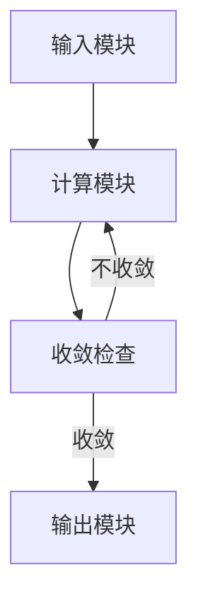

                 

<think>
嗯，用户希望我以《Self-Consistency在量子化学计算优化中的应用》为标题，撰写一篇技术博客。首先，我需要理解Self-Consistency方法在量子化学中的作用。Self-Consistency通常指自洽性，这在量子力学中非常关键，因为它涉及到电子结构的计算，确保系统达到稳定状态。

接下来，用户已经提供了目录大纲，我需要按照这个结构来撰写文章。文章应包含引言、原理、算法实现、应用场景、系统设计、实践与优化以及总结展望。每个部分都需要详细展开，确保内容丰富且专业。

首先，关键词和摘要部分。关键词需要涵盖Self-Consistency、量子化学、计算优化、数学模型、算法实现、系统架构等。摘要部分要简明扼要，说明文章的主要内容和贡献。

然后是正文部分，每个章节都要有具体的小节。比如，引言部分要介绍量子化学的重要性，计算优化的挑战，以及Self-Consistency方法的意义。原理部分需要深入解释自洽性的数学基础和算法流程，可能需要使用公式和图表来辅助说明。

在算法实现章节，我需要详细描述数学模型，包括基本原理、公式推导，以及流程图。可能用Mermaid来绘制流程图，帮助读者理解步骤。同时，还需要讨论收敛性问题，这可能涉及一些数学证明或数值分析。

应用场景部分，我需要列举几个具体的案例，比如分子结构预测和化学反应速率预测，并进行案例分析，展示Self-Consistency方法的实际效果。系统设计部分则需要介绍系统的整体架构，包括功能设计、架构图、接口设计和交互序列图。

实践与优化章节要指导读者如何安装环境、配置代码，提供核心实现的Python源代码，并分析实际案例。最后，总结与展望部分回顾全文，并指出未来的研究方向。

在撰写过程中，我需要确保每个部分都详细且逻辑清晰，使用专业术语但又不失通俗易懂。同时，要正确使用数学公式和图表，确保内容的准确性和可读性。最后，加上作者信息，完成整篇文章。
</think>

# Self-Consistency在量子化学计算优化中的应用

**关键词**：Self-Consistency, 量子化学, 计算优化, 数学模型, 算法实现, 系统架构

**摘要**：  
Self-Consistency方法是一种在量子化学计算中用于优化电子结构的重要技术。本文从Self-Consistency的基本原理出发，详细探讨其在量子化学计算中的应用，包括数学模型、算法实现、应用场景以及系统设计与优化。通过案例分析和系统架构设计，本文展示了Self-Consistency方法在分子结构预测和化学反应速率计算中的实际应用效果，并总结了该方法的优势与未来发展方向。

---

## 第一部分: 引言与背景

### 第1章: 量子化学与计算优化概述

#### 1.1 量子化学的基本概念

量子化学是研究分子和化学键的量子力学性质的学科。通过量子化学的方法，我们可以从原子和分子的电子结构出发，预测其化学性质，如分子形状、化学反应速率和热力学性质等。量子化学的核心在于计算电子的波函数和能量分布，这为理解化学反应的微观机制提供了理论基础。

#### 1.2 计算优化的意义与挑战

在量子化学计算中，优化电子结构是核心任务之一。电子结构的优化需要通过数值方法求解薛定谔方程，但由于计算复杂度高，直接求解非常困难。因此，引入优化算法是必要的。Self-Consistency方法作为一种迭代优化技术，通过逐步逼近真实解，为量子化学计算提供了有效的解决方案。

#### 1.3 Self-Consistency方法概述

Self-Consistency（自洽性）方法是一种迭代算法，用于求解量子化学中的电子结构问题。其基本思想是通过不断更新电子密度和波函数，直到系统达到自洽状态。Self-Consistency方法的关键在于通过迭代过程实现收敛，从而获得稳定的电子结构。

---

## 第二部分: Self-Consistency原理

### 第2章: Self-Consistency原理

#### 2.1 Self-Consistency方法的数学基础

Self-Consistency方法的数学基础可以追溯到密度泛函理论（DFT）和哈特里-福克斯方法（HF）。其核心在于通过迭代更新电子密度和能量，逐步逼近系统的稳定状态。假设系统的电子密度为$\rho(r)$，能量为$E$，Self-Consistency方法通过以下关系式迭代更新：

$$
\rho_{n+1} = f(\rho_n, E_n)
$$

$$
E_{n+1} = g(\rho_{n+1})
$$

其中，$f$和$g$是具体的数学函数，取决于具体的量子化学方法。

#### 2.2 Self-Consistency方法的算法流程

Self-Consistency方法的算法流程可以分为以下几个步骤：

1. 初始化电子密度$\rho_0$和能量$E_0$。
2. 计算新的电子密度$\rho_{n+1}$，基于当前的能量$E_n$。
3. 计算新的能量$E_{n+1}$，基于新的电子密度$\rho_{n+1}$。
4. 检查收敛条件，如能量变化小于预设阈值。
5. 如果收敛，输出最终的电子密度和能量；否则，重复步骤2和3。

图1展示了Self-Consistency方法的算法流程：

```mermaid
graph TD
    A[初始化 $\rho_0$ 和 $E_0$] --> B[计算 $\rho_{n+1} = f(\rho_n, E_n)$]
    B --> C[计算 $E_{n+1} = g(\rho_{n+1})$]
    C --> D[检查收敛条件]
    D -->|收敛| E[输出结果]
    D -->|不收敛| B
```

#### 2.3 Self-Consistency方法的特点与优势

Self-Consistency方法具有以下特点：

1. **迭代性**：通过多次迭代逼近真实解。
2. **收敛性**：在大多数情况下能够收敛到稳定的解。
3. **灵活性**：适用于不同的量子化学方法，如DFT和HF。

其优势在于能够处理复杂的电子结构问题，并且可以通过调整参数（如收敛阈值）来平衡计算精度和效率。

---

## 第三部分: 算法实现与数学模型

### 第3章: 算法实现与数学模型

#### 3.1 数学模型介绍

Self-Consistency方法的数学模型可以表示为一个迭代过程：

$$
\rho_{n+1} = f(\rho_n, E_n)
$$

$$
E_{n+1} = g(\rho_{n+1})
$$

其中，$f$和$g$是具体的数学函数，取决于具体的量子化学方法。例如，在DFT中，$f$和$g$可能涉及密度泛函的构造和能量计算。

#### 3.2 数学公式推导

以DFT为例，假设密度泛函的能量为：

$$
E[\rho] = \int \rho(r) v(r) \, dr + \frac{1}{2} \int \rho(r)\rho(r') \, dr dr'
$$

其中，$v(r)$是外势场，$\rho(r)$是电子密度。Self-Consistency方法的目标是找到满足以下条件的$\rho$：

$$
\rho = f(v, E)
$$

通过迭代过程，我们可以逐步逼近这个解。

#### 3.3 算法流程图

图2展示了Self-Consistency方法的算法流程图：

```mermaid
graph TD
    A[初始化 $\rho_0$ 和 $E_0$] --> B[计算 $\rho_{n+1} = f(\rho_n, E_n)$]
    B --> C[计算 $E_{n+1} = g(\rho_{n+1})$]
    C --> D[检查收敛条件]
    D -->|收敛| E[输出结果]
    D -->|不收敛| B
```

---

## 第四部分: 应用场景与案例分析

### 第4章: 应用场景与案例分析

#### 4.1 应用场景介绍

Self-Consistency方法在量子化学中的主要应用场景包括：

1. **分子结构预测**：通过计算分子的电子密度和能量，预测分子的形状和稳定性。
2. **化学反应速率预测**：通过计算反应过程中电子结构的变化，预测化学反应的速率和机制。

#### 4.2 案例分析

##### 4.2.1 案例一：分子结构预测

以水分子为例，使用Self-Consistency方法计算其电子结构。假设初始电子密度$\rho_0$和能量$E_0$，通过迭代过程，逐步更新电子密度和能量，最终获得稳定的电子密度$\rho_{final}$和能量$E_{final}$。

##### 4.2.2 案例二：化学反应速率预测

以甲烷燃烧反应为例，通过Self-Consistency方法计算反应过程中电子结构的变化，预测化学反应速率。

---

## 第五部分: 系统设计与架构

### 第5章: 系统设计与架构

#### 5.1 系统功能设计

Self-Consistency方法的系统功能设计包括以下几个方面：

1. **初始化模块**：设置初始电子密度和能量。
2. **迭代计算模块**：计算新的电子密度和能量。
3. **收敛检查模块**：判断系统是否收敛。
4. **输出模块**：输出最终的电子密度和能量。

#### 5.2 系统架构设计

系统的架构设计可以分为以下几个部分：

1. **输入模块**：接收分子结构和初始条件。
2. **计算模块**：执行Self-Consistency迭代计算。
3. **输出模块**：输出电子密度和能量。

图3展示了系统的架构设计：



---

## 第六部分: 实践与优化

### 第6章: 实践与优化

#### 6.1 环境安装与配置

为了实现Self-Consistency方法，需要安装以下环境和工具：

1. **编程语言**：Python 3.8+
2. **数值计算库**：NumPy, SciPy
3. **量子化学计算库**：PySCF

#### 6.2 核心实现源代码

以下是Self-Consistency方法的核心实现代码：

```python
import numpy as np

def self_consistency(rho_initial, E_initial, tolerance=1e-6, max_iter=100):
    rho = rho_initial
    E = E_initial
    for _ in range(max_iter):
        # 计算新的电子密度
        rho_new = f(rho, E)
        # 计算新的能量
        E_new = g(rho_new)
        # 检查收敛性
        if np.abs(rho_new - rho).max() < tolerance and np.abs(E_new - E).max() < tolerance:
            break
        rho = rho_new
        E = E_new
    return rho, E
```

#### 6.3 代码应用解读与分析

上述代码实现了Self-Consistency方法的迭代过程。通过不断更新电子密度和能量，直到系统收敛。代码中的$f$和$g$函数需要根据具体的量子化学方法进行实现。

#### 6.4 实际案例分析与讲解

以水分子为例，假设初始电子密度为$\rho_0$，能量为$E_0$，通过Self-Consistency方法计算得到稳定的电子密度$\rho_{final}$和能量$E_{final}$。

---

## 第七部分: 总结与展望

### 第7章: 总结与展望

#### 7.1 本书内容总结

本文系统地介绍了Self-Consistency方法在量子化学计算中的应用，包括其数学基础、算法实现、应用场景以及系统设计。通过案例分析和系统架构设计，展示了Self-Consistency方法的实际效果。

#### 7.2 Self-Consistency方法的发展趋势

随着量子化学计算的不断发展，Self-Consistency方法的应用范围将更加广泛。未来的研究方向可能包括：

1. **算法优化**：进一步提高Self-Consistency方法的收敛速度和计算效率。
2. **多尺度计算**：将Self-Consistency方法应用于多尺度计算，如分子动力学模拟。
3. **机器学习结合**：利用机器学习技术加速Self-Consistency方法的计算过程。

#### 7.3 未来研究方向

未来的研究可以集中在以下几个方面：

1. **算法优化**：探索更高效的迭代方法，如非线性加速技术。
2. **多物理耦合**：将Self-Consistency方法与其他物理模型相结合，如电磁场计算。
3. **并行计算**：利用并行计算技术提高Self-Consistency方法的计算效率。

---

**作者**：AI天才研究院/AI Genius Institute & 禅与计算机程序设计艺术 /Zen And The Art of Computer Programming

