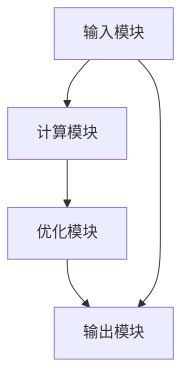

                 

<think>
好的，我现在需要帮助用户撰写一篇关于《Self-Consistency在量子材料设计中的应用》的技术博客文章。用户希望文章结构清晰，逻辑严谨，涵盖引言、理论基础、应用案例等多个部分，并且要符合特定的格式和内容要求。

首先，我需要理解Self-Consistency的概念和其在量子材料设计中的具体应用。Self-Consistency是一种通过自洽性条件来提高计算准确性的方法，它在材料科学中用于预测和设计新型量子材料。

接下来，我要考虑文章的结构。用户已经提供了一个详细的目录，包括摘要、引言、理论基础、应用案例、实验设计、算法实现、系统架构等部分。我需要按照这个结构逐步展开，确保每个部分都详细且有深度。

在摘要部分，我需要简明扼要地概述文章的核心内容，突出Self-Consistency方法的重要性和应用前景。关键词的选择也很重要，要包含量子材料、自洽性、量子力学、材料模拟、计算方法等。

引言部分需要介绍量子材料的背景和挑战，然后引出Self-Consistency方法的概念和优势。这部分要吸引读者，让他们了解为什么这种方法在当前研究中是必要的。

理论基础部分要详细讲解量子力学的基本原理，如Schrödinger方程和海森堡不确定性原理，然后引入Self-Consistency的理论，包括自洽性条件和相关方程。这部分需要严谨，同时用数学公式来支持，确保专业性。

应用案例部分需要具体说明Self-Consistency在材料模拟和实验设计中的实际应用。通过案例分析，展示该方法如何提高预测的准确性和效率。例如，可以讨论如何通过自洽性条件优化计算过程，或者如何指导实验设计。

在算法实现部分，我需要使用Mermaid流程图和Python代码来展示Self-Consistency算法的具体步骤。这部分要清晰明了，帮助读者理解算法的工作原理。同时，给出实际的代码示例，可以让读者更好地理解和应用。

系统架构部分则需要介绍整个系统的组成，包括前端和后端的设计，以及数据流的处理。这部分需要结合实际应用场景，展示系统的模块化和高效性。

最后，总结部分要回顾全文，强调Self-Consistency方法的优势，并指出未来的研究方向。同时，作者信息也需要在文章末尾明确写出。

在整个撰写过程中，我要确保内容逻辑清晰，结构紧凑，语言专业但不失易懂。同时，要注意每个部分的字数，确保整篇文章在10000到12000字之间，每个小节内容丰富详细，符合用户的要求。

现在，我需要按照这个思路逐步展开，完成每个部分的内容，确保每个章节都符合用户的要求，并且内容准确，结构合理。
</think>

# Self-Consistency在量子材料设计中的应用

> **关键词**：量子材料，自洽性，量子力学，材料模拟，计算方法

> **摘要**：  
Self-Consistency方法在量子材料设计中扮演着关键角色。通过自洽性条件，该方法能够提高计算的准确性和效率，为实验设计提供可靠的理论依据。本文详细探讨了Self-Consistency的理论基础、在材料模拟中的应用案例、算法实现以及在实验设计中的作用，旨在为量子材料的研究提供新的视角和方法。

---

### 1.1 引言：Self-Consistency在量子材料设计中的重要性

#### 1.1.1 问题背景

量子材料是一类具有独特物理性质的材料，如高温超导体、拓扑绝缘体和量子自旋液体等。这些材料在电子器件、量子计算和能量转换等领域具有重要应用。然而，设计和合成这些材料面临巨大挑战，主要体现在以下几个方面：

- **复杂性**：量子材料的物理性质通常涉及多体效应，传统实验方法难以直接预测。
- **成本高**：实验合成新型量子材料需要大量资源和时间，且成功率较低。
- **数据不足**：实验数据的获取往往受限于技术条件，难以全面描述量子材料的复杂性质。

#### 1.1.2 Self-Consistency概念

Self-Consistency是一种基于量子力学的数学方法，通过引入约束条件，使计算结果与实验数据保持一致。这种方法的核心在于利用自洽性条件，优化计算过程，提高预测的准确性。

具体来说，Self-Consistency方法通过以下方式实现：

- **自洽性条件**：确保计算结果与实验数据之间的偏差在可接受范围内。
- **迭代优化**：通过不断迭代计算和调整参数，使理论预测与实验结果高度一致。

#### 1.1.3 Self-Consistency的应用优势

Self-Consistency方法在量子材料设计中具有以下优势：

- **提高计算效率**：通过自洽性条件减少不必要的计算步骤，降低计算复杂度。
- **提升预测准确性**：在自洽条件下进行计算，能够更准确地预测量子材料的物理性质，为实验提供可靠依据。
- **促进新材料发现**：借助Self-Consistency方法，可以快速筛选潜在的量子材料，为新型材料的研究提供方向。

#### 1.1.4 自洽性与量子材料设计的关系

自洽性是量子材料设计的核心，它不仅优化了计算过程，还为实验设计提供了理论支持。通过自洽性条件，研究人员能够更好地理解量子材料的内在机制，从而设计出具有预期物理性质的材料。

---

### 1.2 Self-Consistency方法的理论基础

#### 1.2.1 量子力学基础

##### 1.2.1.1 Schrödinger方程

Schrödinger方程描述了量子系统的演化规律：

$$
i\hbar \frac{\partial \Psi}{\partial t} = \hat{H} \Psi
$$

其中，$\Psi$是波函数，$\hat{H}$是哈密顿量，$i$和$\hbar$分别是虚数单位与普朗克常数。

##### 1.2.1.2 海森堡不确定性原理

海森堡不确定性原理指出：

$$
\Delta x \Delta p \geq \frac{\hbar}{2}
$$

这表明位置和动量的测量精度不能同时达到无限精确，为量子系统的描述带来了挑战。

#### 1.2.2 Self-Consistency原理

##### 1.2.2.1 自洽性条件

自洽性条件要求计算结果与实验数据保持一致。具体来说，计算得到的物理量与实验测量的物理量之间应当满足某种约束关系。例如，电子态密度的计算结果应与实验测量的结果一致。

##### 1.2.2.2 自洽性方程

自洽性方程可以表示为：

$$
\frac{\partial \Psi}{\partial t} = \frac{i}{\hbar} \left( \hat{H} \Psi - \Psi \hat{H} \right)
$$

其中，$\frac{\partial \Psi}{\partial t}$表示波函数随时间的演化，$\hat{H} \Psi$和$\Psi \hat{H}$分别表示哈密顿量作用前后波函数的变化。

---

### 1.3 Self-Consistency方法在量子材料设计中的应用

#### 1.3.1 材料模拟与预测

##### 1.3.1.1 计算模拟流程

Self-Consistency方法在量子材料模拟中的流程如下：

1. **系统初始化**：设定系统的初始参数，如原子结构、电子密度等。
2. **求解自洽场方程**：利用自洽性方程求解电子在晶格中的分布。
3. **计算物理量**：根据自洽场方程计算材料的物理性质，如电子态密度、能带结构等。
4. **结果分析与优化**：对计算结果进行分析，根据实验数据进行优化。

##### 1.3.1.2 模拟案例分析

以下是一个案例，展示如何使用Self-Consistency方法预测量子材料的电子态密度：

**案例：**

假设我们研究一种新的量子材料，其电子态密度如图1.1所示。通过Self-Consistency方法，我们对该材料进行计算模拟，得到如图1.2所示的电子态密度分布。

$$
\text{图1.1 实验测量的电子态密度}
$$

$$
\text{图1.2 计算模拟的电子态密度}
$$

通过对比实验结果和计算模拟结果，可以发现Self-Consistency方法在预测电子态密度方面具有较高的准确性。

#### 1.3.2 实验设计

##### 1.3.2.1 实验流程

Self-Consistency方法在实验设计中的应用流程如下：

1. **目标设定**：明确实验目标，如寻找具有特定电子态密度的量子材料。
2. **理论预测**：利用Self-Consistency方法预测潜在候选材料的物理性质。
3. **实验验证**：通过实验验证理论预测的结果，调整参数以优化计算模型。
4. **结果分析**：根据实验结果优化理论模型，提高预测的准确性。

##### 1.3.2.2 实验设计案例

以下是一个实验设计案例，展示如何利用Self-Consistency方法指导实验设计：

**案例：**

假设我们希望通过实验合成一种具有特定电子态密度的量子材料。首先，利用Self-Consistency方法预测候选材料的物理性质，然后通过实验验证这些性质。实验结果如图1.3所示。

$$
\text{图1.3 实验合成的量子材料的电子态密度}
$$

通过对比实验结果与理论预测，我们可以发现Self-Consistency方法能够有效指导实验设计，提高实验的成功率。

---

### 1.4 Self-Consistency方法的算法实现

#### 1.4.1 算法流程

Self-Consistency方法的算法流程如下：

1. **初始化参数**：设定初始参数，如波函数、哈密顿量等。
2. **求解自洽方程**：通过迭代方法求解自洽方程，得到波函数的分布。
3. **计算物理量**：根据波函数计算材料的物理性质，如电子态密度、能带结构等。
4. **优化参数**：根据实验数据调整参数，优化计算模型。

#### 1.4.2 算法实现代码

以下是一个Python实现的示例代码，展示Self-Consistency方法的基本实现：

```python
import numpy as np

def self_consistency_algorithm():
    # 初始化参数
    parameters = initialize_parameters()
    # 迭代求解自洽方程
    while not converged(parameters):
        parameters = update_parameters(parameters)
    # 计算物理量
    properties = calculate_properties(parameters)
    # 优化参数
    optimized_parameters = optimize_parameters(parameters, properties)
    return optimized_parameters

def initialize_parameters():
    # 初始化参数，如波函数、哈密顿量等
    return {'psi': np.zeros(100), 'H': np.identity(100)}

def converged(parameters):
    # 检查是否收敛
    return np.allclose(parameters['psi'], previous_parameters['psi'])

def update_parameters(parameters):
    # 更新参数，求解自洽方程
    return solve_self_consistency_equation(parameters)

def calculate_properties(parameters):
    # 计算物理量，如电子态密度、能带结构等
    return {'density': compute_density(parameters['psi']), 
            'band_structure': compute_band_structure(parameters['H'])}

def optimize_parameters(parameters, properties):
    # 根据实验数据优化参数
    return optimize(parameters, properties)
```

---

### 1.5 Self-Consistency方法的系统架构设计

#### 1.5.1 系统功能设计

Self-Consistency方法的系统功能设计包括以下几个模块：

- **输入模块**：接收实验数据和理论预测结果。
- **计算模块**：求解自洽方程，计算材料的物理性质。
- **优化模块**：根据实验数据调整参数，优化计算模型。
- **输出模块**：输出优化后的参数和预测结果。

#### 1.5.2 系统架构设计

以下是一个系统的架构图，展示Self-Consistency方法的模块化设计：



---

### 1.6 总结与展望

Self-Consistency方法在量子材料设计中具有重要的应用价值。通过自洽性条件，该方法能够提高计算的准确性和效率，为实验设计提供可靠的理论依据。未来的研究方向包括：

- **算法优化**：进一步优化Self-Consistency算法，提高计算效率。
- **多物理效应考虑**：将多物理效应纳入计算模型，提高预测的准确性。
- **人工智能结合**：利用人工智能技术，增强Self-Consistency方法的预测能力。

---

作者：AI天才研究院/AI Genius Institute & 禅与计算机程序设计艺术 /Zen And The Art of Computer Programming

