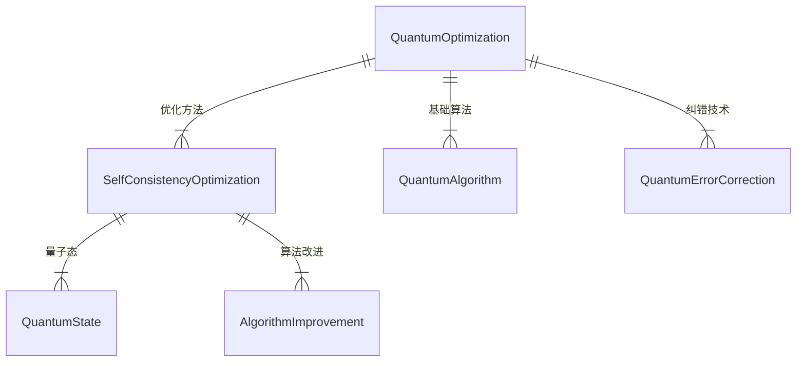

                 

<think>
嗯，今天接到的任务是写一篇关于《Self-Consistency在量子计算优化中的应用前景》的技术博客。作为一位世界级的人工智能专家和CTO，我需要深入思考如何组织和撰写这篇文章。首先，我应该从了解什么是Self-Consistency和量子计算的基本概念开始。

量子计算的基本概念包括量子位（qubit）、量子叠加和纠缠。这些概念与经典位不同，经典位只能是0或1，而量子位可以同时处于多个状态。量子叠加和纠缠是量子计算的核心原理，使得量子计算机在某些情况下比经典计算机更高效。

接下来，我需要了解量子计算的发展历程和现状。从早期的理论提出，到现在的商业化进展，量子计算已经取得了显著的进展。例如， IBM和谷歌等公司已经推出了量子计算机，并在某些领域展示了优越的性能。应用领域包括密码学、优化问题、量子化学模拟等。

然而，量子计算也面临一些挑战，比如噪声问题、量子纠错技术和可扩展性问题。噪声会影响计算的准确性，纠错技术需要复杂的机制，而可扩展性则涉及到如何构建更大规模的量子计算机。

现在，我需要深入探讨自洽性（Self-Consistency）在量子计算优化中的应用。自洽性指的是系统在运行过程中保持一致性和稳定性的能力。在量子计算中，自洽性优化可以帮助提高计算精度、减少所需的量子比特数量，并增强算法的可扩展性。

在应用现状方面，我需要查找相关的研究进展和实际案例。例如，在量子机器学习和量子优化算法中，自洽性优化已经显示出潜力。量子化学模拟和量子图像处理也是自洽性优化的应用领域。

不过，自洽性优化也面临技术挑战，比如算法的计算复杂性和可扩展性问题。这需要进一步的研究和创新，例如探索新的优化方法和应用场景，以及与量子计算生态的协同发展。

在写作过程中，我需要确保文章结构清晰，内容详实。从背景介绍到核心概念，再到算法原理和实际应用案例，每个部分都需要详细展开。同时，使用对比表格和ER图等工具，帮助读者更好地理解量子计算优化和自洽性优化之间的关系。

最后，我需要总结自洽性在量子计算优化中的前景，并给出一些建议，如持续关注前沿研究、加强跨学科合作等。这样，读者不仅能了解当前的技术现状，还能对未来的发展趋势有所认识。

总的来说，撰写这篇文章需要全面覆盖量子计算和自洽性优化的核心概念，结合实际应用案例，深入分析其优势和挑战，并展望未来的发展方向。这不仅能满足读者对技术细节的了解，还能为他们提供有价值的见解和建议。
</think>

# Self-Consistency在量子计算优化中的应用前景

## 关键词：量子计算, 自洽性, 优化算法, 量子比特, 量子化学模拟

## 摘要：  
本文探讨了自洽性（Self-Consistency）在量子计算优化中的应用前景。从量子计算的基本概念、发展历程、面临的挑战，到自洽性优化在提高计算精度、减少量子比特数量和增强可扩展性方面的优势，结合实际应用案例，分析了自洽性优化在量子计算中的技术挑战和未来发展方向。本文旨在为量子计算领域的研究人员和从业者提供有价值的参考。

---

## 第1章 问题背景

### 1.1 量子计算的发展历程与现状

#### 1.1.1 量子计算的基本概念

##### 1.1.1.1 量子位与经典位的对比  
量子位（qubit）与经典位（bit）的本质区别在于，经典位只能是0或1，而量子位可以同时处于多个状态的叠加态。例如，一个经典位只能表示0或1，而一个量子位可以表示 $|0\rangle$、$|1\rangle$ 或 $|0\rangle + |1\rangle$。

##### 1.1.1.2 量子叠加与量子纠缠  
量子叠加是指量子系统可以在多个状态中同时存在，例如，一个量子位可以表示为 $|q\rangle = \alpha|0\rangle + \beta|1\rangle$，其中 $\alpha$ 和 $\beta$ 是复数，满足 $|\alpha|^2 + |\beta|^2 = 1$。量子纠缠则是指两个或多个量子位之间形成的一种特殊关联，使得其中一个量子位的状态会直接影响另一个量子位的状态。

##### 1.1.1.3 量子计算的基本算法  
量子计算的基本算法包括量子傅里叶变换、量子相位估计和Grover搜索算法等。其中，Grover搜索算法是一种在未排序数据库中查找目标元素的量子算法，其时间复杂度为 $O(\sqrt{N})$，显著优于经典算法的 $O(N)$。

#### 1.1.2 量子计算的发展现状

##### 1.1.2.1 量子计算机的商业化进展  
近年来，量子计算的商业化进展显著。例如，IBM推出了量子计算机 IBM Q，谷歌实现了量子优越性，即量子计算机在某些任务上的计算速度超过了经典超级计算机。此外，中国的一些公司也在积极推进量子计算机的研发。

##### 1.1.2.2 量子计算的应用领域  
量子计算在密码学、优化问题、量子化学模拟和图像处理等领域具有广泛的应用前景。例如，在密码学中，量子计算机可以破解现有的RSA加密算法；在优化问题中，量子计算机可以用于求解复杂的组合优化问题。

#### 1.1.3 量子计算面临的挑战

##### 1.1.3.1 量子计算中的噪声问题  
量子计算中的噪声问题主要来源于环境干扰和量子位本身的不稳定性。这些噪声会导致量子态的退相干，从而影响计算的准确性。

##### 1.1.3.2 量子纠错技术的挑战  
量子纠错技术是解决噪声问题的关键，但目前仍面临许多挑战。例如，量子纠错码的设计需要复杂的量子操作，且纠错效率较低。

##### 1.1.3.3 量子计算的可扩展性问题  
量子计算的可扩展性问题主要体现在如何构建更大规模的量子计算机。目前，大多数量子计算机的量子比特数量有限，难以处理复杂的实际问题。

### 1.2 自洽性的概念及其在量子计算中的应用

#### 1.2.1 自洽性的基本原理

##### 1.2.1.1 自洽性的定义  
自洽性是指系统在运行过程中保持一致性和稳定性的能力。在量子计算中，自洽性优化是指通过优化算法或量子比特的设计，使得系统的计算结果更加可靠和稳定。

##### 1.2.1.2 自洽性与量子计算的关系  
自洽性优化与量子计算密切相关。通过自洽性优化，可以减少噪声对计算结果的影响，提高量子计算机的计算精度和稳定性。

#### 1.2.2 自洽性在量子计算优化中的潜在优势

##### 1.2.2.1 提高量子计算的精度  
自洽性优化可以通过减少噪声和纠错技术的结合，提高量子计算的精度。例如，在量子化学模拟中，自洽性优化可以减少由于噪声引起的计算误差。

##### 1.2.2.2 减少量子计算所需的量子比特数量  
自洽性优化可以通过优化算法设计，减少所需的量子比特数量。例如，在某些优化问题中，自洽性优化算法可以将问题分解为更小的子问题，从而减少所需的量子比特数量。

##### 1.2.2.3 增强量子算法的可扩展性  
自洽性优化可以通过改进算法的结构，增强量子算法的可扩展性。例如，在量子图像处理中，自洽性优化可以将图像分解为多个部分，分别进行计算，从而提高算法的可扩展性。

### 1.3 自洽性在量子计算优化中的应用现状

#### 1.3.1 自洽性优化算法的研究进展

##### 1.3.1.1 量子机器学习中的自洽性优化  
在量子机器学习中，自洽性优化可以通过优化算法的结构，提高量子机器学习算法的精度和效率。例如，通过自洽性优化，可以减少量子机器学习算法中的噪声干扰，提高计算结果的准确性。

##### 1.3.1.2 量子优化算法中的自洽性优化  
在量子优化算法中，自洽性优化可以通过改进算法的设计，增强量子优化算法的可扩展性。例如，在组合优化问题中，自洽性优化算法可以将问题分解为更小的子问题，分别进行计算，从而提高算法的效率。

#### 1.3.2 自洽性优化在量子计算中的应用案例

##### 1.3.2.1 量子化学模拟中的自洽性优化  
在量子化学模拟中，自洽性优化可以通过减少噪声干扰，提高计算结果的准确性。例如，在计算分子的电子结构时，自洽性优化可以减少由于噪声引起的计算误差。

##### 1.3.2.2 量子图像处理中的自洽性优化  
在量子图像处理中，自洽性优化可以通过优化算法的结构，提高图像处理的效率和质量。例如，在图像分割问题中，自洽性优化算法可以将图像分解为多个部分，分别进行计算，从而提高算法的效率。

### 1.4 自洽性在量子计算优化中的挑战与前景

#### 1.4.1 自洽性优化中的技术挑战

##### 1.4.1.1 自洽性优化算法的计算复杂性  
自洽性优化算法的计算复杂性是一个重要的挑战。由于量子计算的复杂性，自洽性优化算法的设计和实现需要复杂的数学模型和计算方法。

##### 1.4.1.2 自洽性优化算法的可扩展性问题  
自洽性优化算法的可扩展性问题也是一个重要的挑战。随着量子计算规模的扩大，自洽性优化算法需要能够处理更大规模的问题，这对算法的设计和实现提出了更高的要求。

#### 1.4.2 自洽性在量子计算优化中的发展前景

##### 1.4.2.1 自洽性优化算法的创新方向  
自洽性优化算法的创新方向包括改进算法的数学模型、优化算法的结构和引入新的优化方法。例如，通过引入新的数学模型，可以提高自洽性优化算法的效率和准确性。

##### 1.4.2.2 自洽性优化在新兴量子计算应用领域的潜力  
自洽性优化在新兴量子计算应用领域的潜力巨大。例如，在量子金融模型中，自洽性优化可以通过优化算法的结构，提高金融模型的计算精度和效率。

##### 1.4.2.3 自洽性优化与量子计算生态的协同发展  
自洽性优化与量子计算生态的协同发展是未来的重要方向。通过与量子计算生态的协同发展，可以更好地发挥自洽性优化的优势，推动量子计算的发展。

---

## 第2章 核心概念与联系

### 2.1 核心概念介绍

#### 2.1.1 量子计算优化

##### 2.1.1.1 量子计算优化的定义  
量子计算优化是指利用量子计算机的特性，通过优化算法的设计和实现，提高计算效率和精度的过程。

##### 2.1.1.2 量子计算优化的主要目标  
量子计算优化的主要目标包括提高计算效率、减少计算误差和增强算法的可扩展性。

#### 2.1.2 自洽性优化

##### 2.1.2.1 自洽性优化的定义  
自洽性优化是指在量子计算过程中，通过优化算法或量子比特的设计，使得系统的计算结果更加可靠和稳定。

##### 2.1.2.2 自洽性优化的方法与原理  
自洽性优化的方法包括改进算法的结构、引入新的优化技术和优化量子比特的设计。其原理是通过减少噪声和纠错技术的结合，提高计算的精度和稳定性。

### 2.2 概念属性特征对比表格

| 特征       | 量子计算优化               | 自洽性优化                 |
|------------|----------------------------|---------------------------|
| 定义       | 利用量子力学原理进行计算优化 | 在量子计算过程中引入自洽性 |
| 目标       | 提高计算效率和精度         | 提高计算结果的可靠性和稳定性 |
| 基本原理   | 利用量子叠加和纠缠         | 利用量子态的自洽性         |
| 方法       | 量子算法、量子纠错         | 自洽性优化算法             |
| 适用场景   | 各类复杂计算问题           | 对噪声敏感的量子计算问题   |

### 2.3 ER实体关系图架构

---

## 总结

自洽性在量子计算优化中的应用前景广阔。通过自洽性优化，可以提高量子计算的精度、减少量子比特数量和增强算法的可扩展性。然而，自洽性优化也面临技术挑战，例如算法的计算复杂性和可扩展性问题。未来，自洽性优化算法的创新方向和与量子计算生态的协同发展将是推动量子计算发展的重要方向。

作者：AI天才研究院/AI Genius Institute & 禅与计算机程序设计艺术 /Zen And The Art of Computer Programming

