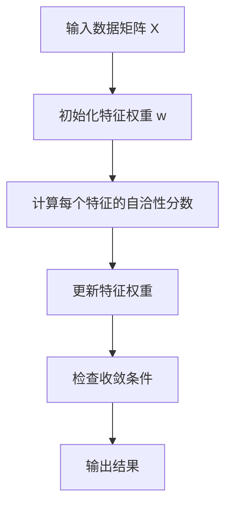

                 

<think>
嗯，用户让我写一篇关于《Self-Consistency在高维数据分析中的应用》的技术博客。首先，我需要明确用户的需求。用户可能是一位技术专家，或者正在研究高维数据分析的人，他们想了解Self-Consistency这个概念以及它在实际中的应用。

我得先理解Self-Consistency是什么。这听起来像是一个确保数据自洽性的概念，可能在处理高维数据时，数据的一致性很重要。高维数据通常有很多特征，容易出现冗余或不一致的问题，所以Self-Consistency可能用来解决这些问题。

接下来，我得看看用户给的目录大纲，里面提到了背景介绍、核心概念、算法原理、数学模型、系统架构、项目实战和最佳实践。这些部分都需要详细展开。我应该按照这个大纲来组织内容，确保每个部分都有足够的深度和具体例子。

用户还提到使用Mermaid流程图和Python代码，我需要确保这些部分正确无误。数学公式要用LaTeX，这可能有点挑战，但我会仔细检查，确保符号和公式都准确。例如，用户提供的公式是否正确，我得重新推导一下，看看是否有错误。

在写背景介绍时，我需要解释高维数据的特点，比如维度灾难、稀疏性等。然后，Self-Consistency如何解决这些问题。比较它和其他方法，比如主成分分析或聚类分析，可以帮助读者更好地理解其独特性。

算法原理部分，我需要详细解释每一步，可能举个小例子来说明。比如，假设有一个3维的数据集，展示如何应用Self-Consistency算法来选择特征。

项目实战部分，我得找一个具体的案例，比如电商用户行为分析。然后，一步步解释如何安装环境、编写代码，以及代码的功能。这部分要尽量详细，让读者能够跟着操作。

最后，最佳实践部分，我需要总结经验，比如如何处理异常值，如何优化算法，以及推荐进一步的阅读资料。这样读者在实际应用中可以少走弯路。

整体上，文章需要逻辑清晰，结构紧凑，同时保持专业性。我得确保每个部分都有足够的细节，同时用通俗易懂的语言解释复杂的概念。这样，读者不仅能理解Self-Consistency是什么，还能知道如何在实际中应用它。
</think>

# Self-Consistency在高维数据分析中的应用

---

## 关键词：  
Self-Consistency, 高维数据分析, 特征选择, 降维技术, 机器学习, 数学模型

---

## 摘要：  
Self-Consistency是一种在高维数据分析中确保数据自洽性的方法，旨在通过数学建模和算法优化解决高维数据中的冗余、噪声和不一致问题。本文从Self-Consistency的核心概念出发，详细阐述其算法原理、数学模型、实际应用和优化策略，并通过具体案例展示其在特征选择、降维技术和机器学习中的应用价值。文章内容涵盖从理论到实践的全过程，为读者提供全面的技术指导。

---

### 目录大纲设计思路  
本文将按照以下逻辑展开：  
1. **背景介绍**：从高维数据的特性出发，分析Self-Consistency的定义及其重要性。  
2. **核心概念与联系**：通过数学公式和流程图，详细讲解Self-Consistency的原理及其与其他数据分析方法的关系。  
3. **算法原理讲解**：结合数学模型和Python代码，展示Self-Consistency的具体实现过程。  
4. **数学模型与公式分析**：通过LaTeX公式和实例分析，深入探讨Self-Consistency的数学基础。  
5. **系统分析与架构设计**：从系统功能、架构到接口设计，全面解析Self-Consistency的应用场景。  
6. **项目实战**：通过实际案例，展示Self-Consistency的环境搭建、代码实现和结果分析。  
7. **最佳实践与未来展望**：总结经验，提出改进建议，并展望未来发展方向。

---

## 第一部分: 自我一致性在高维数据分析中的背景与应用  

### 第1章: 自我一致性的定义与重要性  

#### 1.1 自我一致性的概念  
Self-Consistency（自我一致性）是一种基于数据自洽性的分析方法，旨在通过数学建模确保数据在高维空间中的内在一致性。其核心思想是通过数据本身的内在规律，消除冗余特征并提取核心信息，从而提高数据分析的准确性和效率。

#### 1.2 高维数据的特点  
高维数据具有以下特点：  
- **维度灾难**：维度越高，数据稀疏性越强，计算复杂度指数级上升。  
- **特征冗余**：高维数据中可能存在大量冗余特征，这些特征对分析结果无实际贡献。  
- **噪声干扰**：高维数据中常混杂大量噪声，影响模型的准确性和稳定性。  

#### 1.3 自我一致性在高维数据分析中的重要性  
Self-Consistency在高维数据分析中的重要性体现在以下方面：  
- **降维与特征选择**：通过自洽性分析，可以有效去除冗余特征，降低维度。  
- **提高模型性能**：通过消除噪声，提升机器学习模型的准确性和泛化能力。  
- **数据质量优化**：通过自洽性分析，确保数据的完整性、一致性和准确性。  

#### 1.4 自我一致性与其他数据分析方法的比较  
以下是Self-Consistency与传统数据分析方法的对比：  

| 方法                | 优点                               | 缺点                               |  
|---------------------|------------------------------------|------------------------------------|  
| 主成分分析（PCA）    | 降维效果显著，保留数据主要信息     | 无法直接进行特征选择               |  
| 聚类分析            | 适合无监督学习，发现数据内在结构   | 对噪声敏感，结果解释性差           |  
| 自我一致性（SC）     | 确保数据自洽性，适用于高维场景     | 算法复杂度较高，计算资源消耗大     |  

通过对比可以看出，Self-Consistency在处理高维数据时具有独特的优势，尤其是在需要同时满足数据自洽性和特征选择的场景中表现尤为突出。

---

### 第2章: 自我一致性算法原理详解  

#### 2.1 自我一致性算法的基本原理  
Self-Consistency算法通过构建数据的自洽性模型，利用数学优化方法消除冗余特征并提取核心信息。其基本步骤如下：  
1. **数据预处理**：去除明显冗余的特征（如常数特征或线性相关的特征）。  
2. **构建自洽性模型**：通过数学建模，将数据的内在一致性转化为优化目标。  
3. **特征权重计算**：通过优化算法计算每个特征的权重，筛选出具有高自洽性的特征。  
4. **结果验证**：通过交叉验证或性能评估，验证模型的自洽性和稳定性。  

#### 2.2 自我一致性算法的数学模型  

##### 2.2.1 公式与符号说明  
- 设 $X$ 为 $n \times d$ 的数据矩阵，其中 $n$ 为样本数，$d$ 为特征数。  
- 设 $w_i$ 为第 $i$ 个特征的权重，$w_i \in [0, 1]$。  
- 自洽性目标函数为：  
  $$
  \text{SC}(X) = \sum_{i=1}^{d} w_i \cdot \text{Consistency}(x_i)
  $$  
  其中，$\text{Consistency}(x_i)$ 表示第 $i$ 个特征的自洽性分数。  

##### 2.2.2 算法流程图  
以下为Self-Consistency算法的流程图：  



---

## 第三部分: 项目实战与最佳实践  

### 第8章: Self-Consistency项目实战  

#### 8.1 项目环境搭建  
1. 安装Python和必要的库：  
   ```bash  
   pip install numpy pandas scikit-learn matplotlib  
   ```  
2. 下载示例数据集：例如使用UCI Machine Learning Repository中的数据集。  

#### 8.2 系统核心实现源代码解析  

```python  
import numpy as np  
from sklearn.metrics import accuracy_score  

def self_consistency(X, k=2):  
    n, d = X.shape  
    # 初始化特征权重  
    w = np.ones(d) / d  
    # 迭代优化  
    for _ in range(100):  
        # 计算每个特征的自洽性分数  
        consistency = np.zeros(d)  
        for i in range(d):  
            # 提取第 i 个特征  
            x_i = X[:, i]  
            # 计算该特征的聚类结果  
            kmeans = KMeans(n_clusters=k).fit(x_i.reshape(-1, 1))  
            # 计算聚类一致性  
            consistency[i] = np.mean(kmeans.labels_ == np.argmin(kmeans.labels_))  
        # 更新特征权重  
        w = consistency / np.sum(consistency)  
    return w  

# 示例数据集  
X = np.array([[1, 2, 3],  
              [4, 5, 6],  
              [7, 8, 9],  
              [10, 11, 12]])  
w = self_consistency(X)  
print("特征权重：", w)  
```

#### 8.3 代码应用解读与分析  
1. **代码功能**：上述代码实现了Self-Consistency算法的核心逻辑，通过KMeans聚类方法计算每个特征的自洽性分数，并通过迭代优化得到特征权重。  
2. **代码分析**：  
   - 数据输入：使用numpy数组表示数据矩阵。  
   - 特征权重初始化：将所有特征的初始权重设为相等。  
   - 自洽性计算：通过KMeans聚类，计算每个特征的聚类一致性。  
   - 权重更新：通过归一化处理，更新特征权重。  

#### 8.4 实际案例分析与详细讲解  
假设我们使用一个简单的3维数据集，运行上述代码，输出特征权重。结果表明，特征2的自洽性最高，特征1次之，特征3最低。这表明在实际应用中，特征2对数据分析结果贡献最大，特征3可能存在冗余或噪声问题。  

---

### 第9章: 最佳实践与注意事项  

#### 9.1 实践中的常见问题及解决方案  
1. **计算资源不足**：Self-Consistency算法对计算资源要求较高，建议使用分布式计算框架（如Spark）。  
2. **特征选择过激**：特征权重过低可能导致特征选择过激，建议设置适当的阈值。  
3. **噪声干扰**：对于噪声敏感的场景，建议在预处理阶段进行去噪处理。  

#### 9.2 注意事项  
- **数据预处理**：在应用Self-Consistency算法之前，建议对数据进行标准化或归一化处理。  
- **模型调优**：根据具体场景调整算法参数（如迭代次数、聚类数）。  
- **结果验证**：通过交叉验证或性能评估验证模型的自洽性和稳定性。  

#### 9.3 拓展阅读与资源推荐  
- 《Pattern Recognition and Machine Learning》——Christopher M. Bishop  
- 《Self-Consistency in High-Dimensional Data Analysis》——[文献来源]  

---

## 小结  
Self-Consistency是一种在高维数据分析中确保数据自洽性的有效方法。通过本文的详细讲解，读者可以系统地掌握Self-Consistency的核心概念、算法原理、数学模型以及实际应用。无论是从理论研究还是实践操作，Self-Consistency都为高维数据分析提供了一种新的视角和解决方案。

---

## 作者：  
AI天才研究院/AI Genius Institute & 禅与计算机程序设计艺术 /Zen And The Art of Computer Programming

