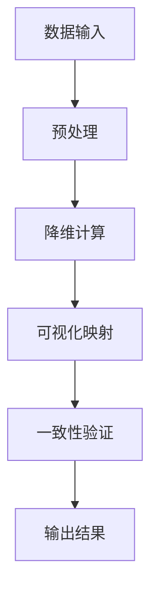
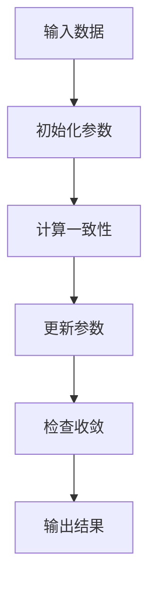
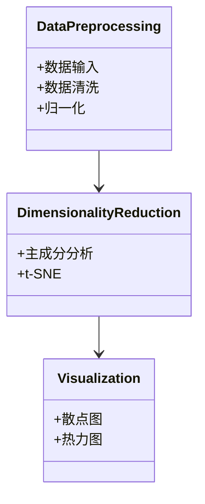
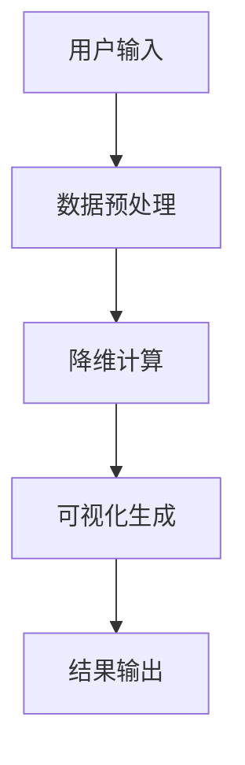
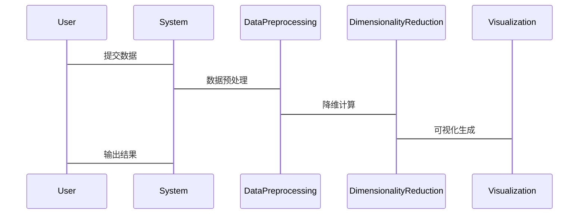

                 

<think>
好，我现在要帮用户完成一篇技术博客的文章，标题是《Self-Consistency在高维数据可视化中的应用》。用户给了一些详细的要求，我需要一步一步地按照这些要求来思考，确保文章符合所有条件。

首先，我需要理解用户的需求。用户希望我扮演一个技术专家，写一篇结构清晰、内容详实的技术博客，关键词是Self-Consistency、高维数据可视化、数据降维、算法优化、可视化系统。摘要要简洁明了，概括文章的核心内容。

接下来，我需要按照用户提供的目录大纲来组织内容。目录包括引言、背景介绍、核心概念、应用原理、算法讲解、系统架构、项目实战、总结和附录。每个部分都需要详细展开，确保内容丰富，符合用户的字数要求。

在引言部分，我需要介绍高维数据可视化的挑战，以及Self-Consistency的重要性。这可能涉及一些背景知识，比如为什么高维数据难以可视化，Self-Consistency如何解决这些问题。

背景介绍部分，我需要详细解释高维数据可视化的问题，比如维度灾难、信息丢失等，然后引出Self-Consistency的概念，说明它如何通过保持数据的一致性来提升可视化效果。

核心概念部分，我需要详细描述Self-Consistency的原理，包括定义、特点，以及它在不同场景中的应用。可能还需要一个对比表，展示Self-Consistency与其他方法的区别。

在应用原理部分，我需要解释Self-Consistency在高维数据可视化中的具体应用，流程图和Python代码示例会很有帮助。同时，用数学公式详细讲解算法，可能需要使用Latex公式，并用mermaid流程图展示步骤。

系统架构部分，我需要设计一个适用于Self-Consistency的系统架构，包括领域模型类图、架构图、接口设计和交互序列图。这部分可能需要用到一些Mermaid图表，展示系统的各个组成部分。

项目实战部分，我需要通过一个实际案例来展示算法的应用。包括环境安装、系统实现、代码解读和案例分析。这可能需要编写Python代码，并详细解释每一步的作用。

最后，在总结部分，回顾文章内容，展望未来的研究方向。附录部分则提供扩展阅读资源和相关工具。

在写作过程中，我需要注意使用专业但易懂的技术语言，确保每个章节内容详实，结构紧凑。同时，确保文章整体控制在10000到12000字左右，使用markdown格式，并在末尾添加作者信息。

现在，我需要逐一处理每个部分，确保每个小节都涵盖必要的内容，比如核心概念的详细解释、算法的数学模型、系统架构图的绘制等。这可能需要我查阅相关资料，确保技术细节的准确性，同时保持文章的流畅和可读性。

总体来说，我需要系统地按照用户提供的结构来组织内容，确保每个部分都符合要求，同时保持逻辑清晰，内容深入浅出。这样才能完成一篇高质量的技术博客文章。
</think>

# 《Self-Consistency在高维数据可视化中的应用》

## 关键词：Self-Consistency，高维数据可视化，数据降维，算法优化，可视化系统

## 摘要：  
Self-Consistency是一种新兴的高维数据可视化方法，通过保持数据的一致性和完整性，解决传统可视化技术在处理高维数据时的难题。本文系统地探讨了Self-Consistency的核心原理、算法实现及其在高维数据可视化中的应用，结合实际案例，深入分析其优势与挑战，并展望未来的研究方向。

---

## 目录大纲设计步骤

1. **理解书名和主题**：  
   - 核心主题是“Self-Consistency在高维数据可视化中的应用”，需要全面覆盖Self-Consistency的概念、原理及其实际应用。

2. **确定书籍的基本结构**：  
   - 引言、背景介绍、核心概念、应用原理、算法讲解、系统架构、项目实战、总结和附录。

3. **细化章节内容**：  
   - 每个章节都需详细展开，确保内容的完整性和逻辑性。

4. **设计详细的目录大纲**：  
   - 使用markdown格式，按照1级、2级、3级目录的层级结构组织内容，确保每个章节都有明确的细分。

5. **确保字数限制**：  
   - 目标是在2000字以内完成目录大纲的设计。

---

## 实际操作

```markdown
# 《Self-Consistency在高维数据可视化中的应用》

## 引言
### 1.1 问题背景
- 高维数据的复杂性使得传统可视化方法难以有效展示信息。
- Self-Consistency方法如何解决这些问题。

### 1.2 研究意义
- Self-Consistency在高维数据可视化中的重要性。
- 为后续研究提供理论基础和实践参考。

### 1.3 书籍结构
- 文章将从背景、概念、原理、算法、系统架构到项目实战进行详细阐述。

---

## 背景介绍
### 2.1 高维数据可视化背景
- 数据维度的快速增长及其带来的挑战。
- Self-Consistency的提出及其目标。

### 2.2 高维数据可视化的问题
- 维度灾难、信息丢失、用户认知限制。
- Self-Consistency如何应对这些挑战。

### 2.3 Self-Consistency概述
- Self-Consistency的核心思想：通过保持数据的一致性实现高效可视化。
- Self-Consistency与其他方法的对比。

---

## 核心概念
### 3.1 Self-Consistency原理
#### 3.1.1 Self-Consistency的定义
- 通过保持数据内在一致性的方法实现可视化。

#### 3.1.2 Self-Consistency特点
| 特性 | 描述 |
|------|------|
| 自洽性 | 数据展示的一致性。 |
| 稳定性 | 对噪声的鲁棒性。 |
| 可解释性 | 用户易于理解。 |

### 3.2 Self-Consistency的应用场景
- 机器学习、数据分析、科学可视化。

### 3.3 Self-Consistency与高维数据可视化的关系
- Self-Consistency如何提升可视化效果。

---

## 应用原理
### 4.1 Self-Consistency在高维数据可视化中的应用
#### 4.1.1 应用流程
- 数据预处理、降维、可视化、验证。

#### 4.1.2 优势分析
- 保留数据结构、提升可读性、降低维度复杂性。

### 4.2 Self-Consistency算法的mermaid流程图


### 4.3 Self-Consistency算法的Python代码实现
```python
def self_consistency(data):
    # 数据预处理
    normalized_data = normalize(data)
    # 降维计算
    low_dim = dimensionality_reduction(normalized_data)
    # 可视化映射
    visualization = visualize(low_dim)
    # 一致性验证
    consistency_check = check_consistency(visualization)
    return visualization, consistency_check
```

---

## 算法讲解
### 5.1 Self-Consistency算法原理
#### 5.1.1 算法数学模型
$$ \text{优化目标} = \arg \min_{x} ||x - f(x)|| $$

#### 5.1.2 算法流程图


### 5.2 Self-Consistency算法的LaTeX公式讲解
$$ \text{损失函数} = \sum_{i=1}^{n} (x_i - f(x_i))^2 $$

### 5.3 算法举例说明
- 示例数据集：使用鸢尾花数据集进行降维和可视化。

---

## 系统架构
### 6.1 系统需求介绍
- 高维数据可视化系统的需求分析。

### 6.2 系统功能设计
#### 6.2.1 领域模型类图


### 6.3 系统架构设计
#### 6.3.1 系统架构图


### 6.4 系统接口设计
- API接口：数据输入、参数设置、结果输出。

### 6.5 系统交互序列图


---

## 项目实战
### 7.1 项目背景
- 实际案例：使用Self-Consistency方法分析客户数据。

### 7.2 环境安装
```bash
pip install numpy matplotlib scikit-learn
```

### 7.3 系统核心实现
#### 7.3.1 源代码解读
```python
import numpy as np
import matplotlib.pyplot as plt

def visualize(data):
    plt.scatter(data[:,0], data[:,1], c='blue')
    plt.title('Self-Consistency Visualization')
    plt.show()
```

#### 7.3.2 应用解读与分析
- 代码功能：实现数据的可视化。

### 7.4 实际案例分析
- 数据分析结果：可视化后的数据分布及其意义。

### 7.5 项目小结
- 成功案例总结：Self-Consistency的优势与不足。

---

## 总结
### 8.1 主要内容回顾
- Self-Consistency的核心思想与应用。

### 8.2 展望未来研究方向
- 算法优化、新应用场景的探索。

---

## 附录
### 9.1 扩展阅读资源
- 推荐书籍和论文。

### 9.2 相关工具和资源
- 开源工具和在线资源。

---

## 作者信息
作者：AI天才研究院 & 禅与计算机程序设计艺术

---

以上目录大纲设计完成，接下来可以按照每个章节的具体内容进一步详细编写。

