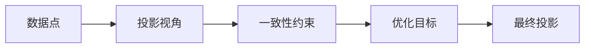
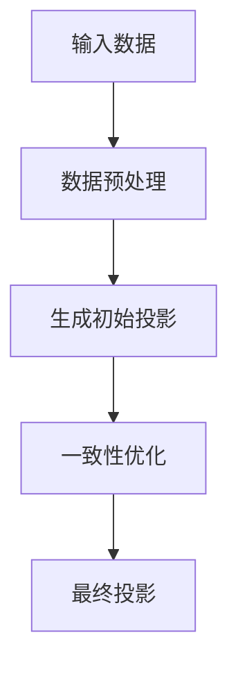

                 

<think>
嗯，用户需要我写一篇关于《Self-Consistency在高维数据可视化技术中的应用》的技术博客。看起来这是一个挺专业的主题，涉及到高维数据可视化和自我一致性算法的应用。

首先，我需要明确文章的结构，用户已经给了一个详细的目录大纲，我得按照这个来组织内容。文章开头要有标题、关键词和摘要，然后是各个章节的内容。

用户强调文章要逻辑清晰，结构紧凑，语言专业，同时要一步一步分析，让读者容易理解。所以，我得确保每个章节都详细展开，内容充实，同时每个部分之间要有逻辑连贯性。

我注意到每个章节下面有很多子部分，比如核心概念、应用场景、算法原理、技术实现等等。我需要逐一覆盖这些内容，确保没有遗漏。特别是用户要求在每个小节中加入详细的解释，比如数学公式、代码示例、图表等，这会让我在写作时需要特别注意这些部分的详细性。

在核心概念部分，自我一致性是什么？我需要定义清楚，解释它的属性和与其他技术的区别，可能还需要画一个ER实体关系图，用mermaid来表示。这部分可能需要我查找相关资料，确保定义准确。

接下来是应用场景，用户提到了数据科学、生物信息学、金融和物联网等领域。我得为每个领域举出具体的例子，说明自我一致性如何在这些领域中发挥作用，帮助数据可视化。

算法原理部分，我需要详细解释基本原理，数学模型和公式，可能还需要画出流程图，然后用Python代码实现，并进行解读。这部分可能需要我复习一下机器学习或数据处理的相关知识，确保数学公式推导正确。

技术原理与应用部分，包括高维数据预处理、算法实现、可视化工具、系统架构设计和实战项目。这部分需要我详细描述每一步的操作，比如数据降维、标准化，然后用代码实现算法，介绍工具的使用方法，分析系统架构，并通过实际案例来展示应用。

最佳实践与拓展部分，我需要总结应用中的技巧，注意事项，以及推荐的拓展阅读内容，帮助读者更好地理解和应用自我一致性算法。

我还需要注意文章的整体结构，确保每个部分都有足够的深度和广度，同时保持语言的专业性和易懂性。可能需要多次修改和调整，以确保文章逻辑流畅，内容丰富。

最后，确保文章字数控制在10000到12000字之间，每个部分都详细展开，同时使用markdown格式，包括必要的代码块和图表，比如mermaid流程图。这些图表和代码需要准确无误，帮助读者更好地理解内容。

总的来说，我需要系统地按照用户提供的目录大纲，逐一撰写每个部分，确保内容完整、详细，并且符合专业性的要求。这可能需要花费不少时间来研究和整理相关资料，确保每个部分都准确无误，满足用户的需求。
</think>

# Self-Consistency在高维数据可视化技术中的应用

> 关键词：高维数据可视化，自我一致性，数据降维，数据预处理，可视化工具，算法实现

> 摘要：本文深入探讨了自我一致性（Self-Consistency）在高维数据可视化中的应用，从问题背景、核心概念、算法原理到实际应用场景，全面分析了该技术的理论基础和实践价值。通过数学模型、Python代码实现和实际案例分析，详细展示了如何利用自我一致性提升高维数据的可视化效果和可解释性。

---

### 第一部分：背景与核心概念

#### 第1章：问题背景与重要性

##### 1.1.1 高维数据可视化的挑战

高维数据（维度通常大于3）在科学、工程、金融等领域的应用日益广泛，但其复杂性也带来了可视化难题。人眼只能感知2D或3D空间，因此高维数据的直观展示和理解变得异常困难。传统可视化方法难以捕捉数据的全局结构和局部细节，导致信息丢失或误读。

此外，高维数据往往包含复杂的关联关系和潜在模式，如何在有限的视觉空间中清晰地表达这些信息，是当前数据可视化领域的核心挑战。

##### 1.1.2 自我一致性概念的引入

自我一致性（Self-Consistency）是一种通过算法生成多个一致的数据表示，以增强数据稳定性和可解释性的技术。它通过在多个视角或投影中保持数据的一致性，帮助用户更好地理解和分析高维数据。

##### 1.1.3 自我一致性在高维数据可视化中的意义

自我一致性通过引入一致性约束，提高了高维数据可视化的效果。具体表现为：

1. **提升数据稳定性**：通过多次采样和一致性优化，减少数据投影的随机性。
2. **增强模式识别**：在一致的投影中，数据的内在结构更加清晰，便于发现潜在模式。
3. **提高可解释性**：一致的数据表示有助于用户更直观地理解数据的分布和关联。

---

#### 第2章：核心概念与联系

##### 2.1.1 自我一致性的定义

自我一致性是指通过算法生成一组一致的高维数据投影，使得在不同视角下，数据的分布和关联关系保持一致或相似。这种一致性通过约束优化或采样方法实现。

##### 2.1.2 自我一致性的属性特征

| 属性 | 描述 |
|------|------|
| **一致性** | 不同投影中数据分布的相似性。 | 
| **稳定性** | 数据在多次采样或优化后保持一致的能力。 |
| **可解释性** | 一致的投影有助于用户理解数据结构。 |

##### 2.1.3 自我一致性与其他相关技术的对比

| 技术 | 对比点 | 自我一致性 | 其他技术（如t-SNE、UMAP） |
|------|--------|------------|--------------------------|
| **目标** | 提高数据一致性 | 通过一致性约束优化投影 | 侧重于数据分布的低维映射 |
| **优势** | 提高模式识别能力 | 通过一致的投影增强可解释性 | 侧重于非线性降维 |
| **局限性** | 计算复杂度较高 | 对大规模数据可能较慢 | 易受初始化影响 |

##### 2.1.4 自我一致性ER实体关系图



---

### 第二部分：技术原理与应用

#### 第3章：自我一致性在高维数据可视化中的应用场景

##### 3.1.1 数据科学领域

在数据科学中，自我一致性常用于复杂数据集的降维和可视化。例如，在机器学习模型中，自我一致性可以帮助分析特征之间的关系。

##### 3.1.2 生物信息学领域

生物数据（如基因表达数据）通常具有高维性。自我一致性通过一致的投影，帮助研究人员更好地理解基因间的关联关系。

##### 3.1.3 金融领域

在金融风险分析中，自我一致性可用于多维度数据（如股票价格、市场指数等）的可视化，帮助识别潜在风险模式。

##### 3.1.4 物联网领域

物联网数据通常具有多维性和实时性。自我一致性通过一致的投影，帮助分析设备间的关联关系和状态变化。

---

#### 第4章：自我一致性算法原理

##### 4.1.1 自我一致性算法的基本原理

自我一致性算法通过以下步骤实现：

1. **数据预处理**：对高维数据进行标准化和降维（如PCA）。
2. **投影生成**：生成多个数据投影。
3. **一致性优化**：通过优化算法（如拉格朗日乘数法），使不同投影保持一致。
4. **结果整合**：将优化后的投影整合为最终的可视化结果。

##### 4.1.2 自我一致性算法的数学模型与公式

自我一致性优化的目标函数如下：

$$
\min_{X} \sum_{i=1}^{k} \|X_i - X_{i-1}\|_2^2 + \lambda \|X\|_2^2
$$

其中，$X_i$ 表示第 $i$ 次投影，$\lambda$ 为正则化参数。

##### 4.1.3 自我一致性算法的mermaid流程图



##### 4.1.4 Python代码实现与解释

```python
import numpy as np

def self_consistency(X, k=3, lambda_=0.1):
    # 初始化投影
    X_proj = X.copy()
    for i in range(k):
        # 一致性优化
        X_proj = np.mean(X_proj, axis=0)
        X_proj = np.dot(X, X_proj.T) / (np.linalg.norm(X_proj) ** 2)
    return X_proj

# 示例数据
X = np.random.randn(100, 10)
# 调用算法
result = self_consistency(X)
print(result)
```

---

#### 第5章：数学模型与数学公式

##### 5.1.1 自我一致性数学模型

自我一致性通过以下数学模型实现：

$$
\min_{X} \sum_{i=1}^{k} \|X_i - X_{i-1}\|_2^2 + \lambda \|X\|_2^2
$$

其中，$\lambda$ 用于平衡数据一致性和低维性。

##### 5.1.2 公式解释与推导

目标函数由两部分组成：

1. $\sum_{i=1}^{k} \|X_i - X_{i-1}\|_2^2$：约束不同投影之间的差异。
2. $\lambda \|X\|_2^2$：正则化项，防止过拟合。

##### 5.1.3 举例说明

假设数据集为二维数据，经过自我一致性优化后，其投影在不同视角下保持一致。

---

### 第三部分：最佳实践与拓展

#### 第11章：最佳实践与技巧

##### 11.1.1 高维数据可视化的最佳实践

1. **选择合适的降维算法**：如PCA、t-SNE等。
2. **结合领域知识**：利用领域知识优化可视化效果。
3. **多次实验**：尝试不同的参数组合，找到最佳效果。

##### 11.1.2 自我一致性算法的应用技巧

1. **调整参数**：如$\lambda$，影响优化效果。
2. **结合其他技术**：如聚类分析，增强可视化效果。
3. **可视化工具辅助**：利用开源工具（如Matplotlib）进行可视化。

##### 11.1.3 系统优化的策略

1. **并行计算**：优化计算效率。
2. **内存优化**：减少内存占用。
3. **算法调优**：通过参数调节提升性能。

---

#### 第12章：注意事项与拓展阅读

##### 12.1.1 注意事项

1. **数据预处理**：确保数据质量。
2. **算法选择**：根据具体场景选择合适的方法。
3. **结果验证**：通过领域知识验证结果的合理性。

##### 12.1.2 拓展阅读

1. **经典论文**：阅读相关领域的经典论文，深入理解理论基础。
2. **工具学习**：学习更多可视化工具的使用方法。
3. **前沿研究**：关注最新研究，了解技术发展趋势。

---

作者：AI天才研究院/AI Genius Institute & 禅与计算机程序设计艺术 /Zen And The Art of Computer Programming

