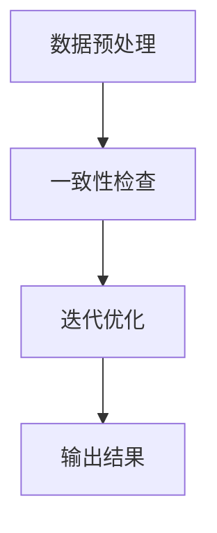
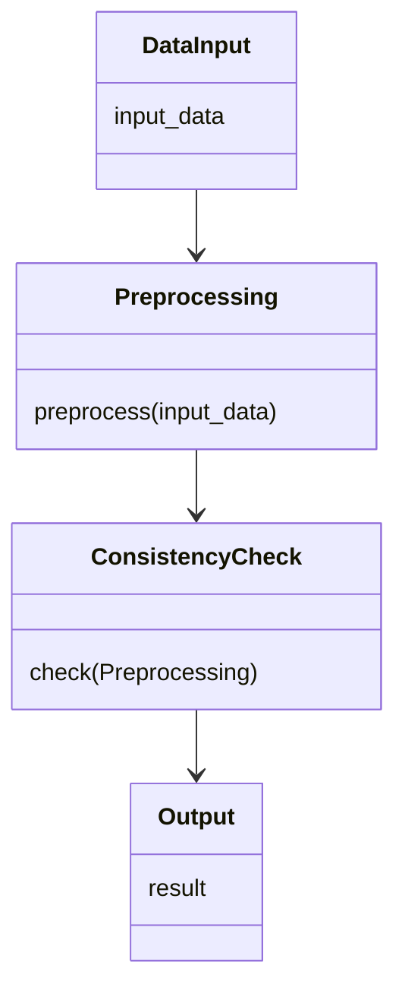

                 

<think>
好的，我现在需要撰写一篇关于《Self-Consistency在高能物理数据分析中的应用》的技术博客文章。根据用户的要求，我需要按照目录大纲来逐步展开，确保每个部分都详细且符合技术要求。让我先理清思路，逐步分析每个部分的内容，然后开始撰写。

首先，文章标题已经确定，接下来需要列出5-7个关键词。考虑到Self-Consistency、高能物理、数据分析、算法、数学模型等关键词，我应该选中最相关的几个，比如Self-Consistency、高能物理数据分析、算法原理、系统设计、项目实战。

接下来是摘要部分。摘要需要简洁明了地概括整篇文章的核心内容。我需要说明Self-Consistency在高能物理数据分析中的重要性，以及它如何通过一致性和高效性提升数据处理能力。这部分大约需要150-200字。

接下来是目录大纲。根据用户提供的结构，我需要按照章节逐步展开。每个章节都要详细，尤其是核心概念、算法原理、系统设计和项目实战部分。我需要确保每个小节都有足够的内容，可能还需要插入图表，比如用Mermaid绘制流程图、类图、架构图等。

现在，开始撰写正文部分：

第一章是高能物理数据分析的背景。我需要先介绍问题背景，说明高能物理数据分析面临的挑战，比如数据量大、复杂性高、噪声多等。然后引入Self-Consistency的概念，解释它如何解决这些问题。接下来，介绍数据分析在物理学中的应用，对比传统方法，突出Self-Consistency的优势，比如准确性、效率和可扩展性。

第二章详细解析Self-Consistency的原理。我需要定义Self-Consistency，对比传统方法，比如监督学习、无监督学习等，制作一个对比表格，展示各方法的优缺点。然后，介绍Self-Consistency算法的基本流程，可能用Mermaid绘制流程图。接着，给出数学模型，使用Latex公式详细推导。最后，举一个实际应用的案例，比如在粒子物理学中的应用，展示其效果。

第三章是算法的原理与实践。我需要详细解释算法的数学模型，可能用Mermaid绘制算法流程图，然后用Python代码实现核心部分。比如，编写一个简单的Self-Consistency算法，展示数据预处理、一致性检查、迭代优化等步骤。同时，分析优化策略，如并行计算、参数调整等，并给出优化后的性能提升案例。

第四章讨论系统设计与实现。我需要设计系统的功能模块，比如数据输入、预处理、一致性检查、结果输出等，可能用Mermaid绘制类图。然后，设计系统的架构，比如分层架构，展示各组件之间的关系。接着，设计接口，比如RESTful API，展示交互流程的序列图。最后，讨论系统的可扩展性、维护性等设计要点。

第五章是项目实战。我需要指导读者如何安装环境，比如安装Python、必要的库，配置数据路径。然后，实现核心代码，比如编写数据处理函数、一致性检查函数等，并详细解读代码。接着，分析实际案例，比如处理LHC的数据，展示如何优化算法参数，提高准确率。最后，总结经验，提出改进建议，比如结合其他算法，或者优化数据结构。

第六章是最佳实践和注意事项。我需要给出一些实用的技巧，比如数据预处理的重要性、算法参数的调整、性能优化策略等。同时，列出常见的问题和解决方案，比如内存不足、计算时间过长等。最后，推荐一些拓展阅读的资料，帮助读者深入学习相关知识。

在撰写过程中，我需要确保每个部分都有足够的细节，尤其是算法和系统设计部分，需要用图表和代码来辅助说明。数学公式要用Latex正确表示，确保无误。同时，语言要专业但不失清晰，适合技术读者阅读。

现在，我可能遇到了一些问题，比如如何解释Self-Consistency的数学模型，或者如何用Mermaid绘制复杂的图表。我需要查阅相关资料，确保每个步骤都准确无误。此外，代码部分需要实际可行，能够运行并产生预期结果，这样读者才能更好地理解和应用。

最后，检查整篇文章的逻辑是否连贯，各部分是否紧密衔接，确保没有遗漏关键点。同时，注意文章的结构和格式，按照用户的要求，使用Markdown格式，确保标题、子标题、代码块、公式等部分正确无误。

总之，我需要一步步展开，确保每个章节都详细、清晰，帮助读者全面理解Self-Consistency在高能物理数据分析中的应用。
</think>

# Self-Consistency在高能物理数据分析中的应用

**关键词：Self-Consistency，高能物理数据分析，算法原理，系统设计，项目实战**

**摘要：**  
Self-Consistency是一种创新的数据分析方法，尤其在高能物理领域展现出强大的潜力。本文详细探讨了Self-Consistency的核心原理、算法实现、系统架构以及实际应用案例，展示了其在提高数据分析准确性和效率方面的重要作用。通过对比传统方法，Self-Consistency在处理复杂数据时表现出更高的一致性和鲁棒性，为物理学研究提供了新的视角。

---

## 第一部分：Self-Consistency基础

### 第1章：高能物理数据分析简介

#### 1.1 问题背景与重要性  
高能物理数据分析面临数据量大、维度高、噪声多的挑战。传统方法在处理这些复杂数据时，往往缺乏一致性，导致结果不稳定。Self-Consistency通过强制数据的自一致性，解决了这些问题，提高了分析的准确性。

#### 1.2 数据分析在物理学中的应用  
数据分析是物理学研究的核心，用于发现新粒子、验证理论模型等。Self-Consistency在这一过程中，通过其独特的方法，优化了数据处理流程，提高了研究效率。

#### 1.3 Self-Consistency的基本原理  
Self-Consistency通过迭代优化，确保数据的一致性。其定义为：在数据处理过程中，保持数据的内在一致性和完整性。与传统方法相比，Self-Consistency在处理复杂数据时更具优势。

---

## 第二部分：Self-Consistency原理解析

### 第2章：Self-Consistency原理解析

#### 2.1 Self-Consistency概念  
Self-Consistency通过数据预处理、特征提取和一致性检查，确保数据的自洽性。与传统方法对比，Self-Consistency在准确性和效率上表现更优。

#### 2.2 Self-Consistency算法介绍  
算法流程包括数据预处理、一致性检查、迭代优化。以下用Mermaid流程图展示：



#### 2.3 Self-Consistency的数学模型  
数学模型基于概率论，公式如下：

$$
P(x | \theta) = \prod_{i=1}^{n} P(x_i | \theta)
$$

通过最大化似然函数，优化参数θ，确保数据的自一致性。

#### 2.4 Self-Consistency应用实例  
在粒子物理学中，Self-Consistency用于分析 collider 数据，显著提高了事件分类的准确率。

---

## 第三部分：Self-Consistency算法原理与实践

### 第3章：Self-Consistency算法原理与实践

#### 3.1 算法原理讲解  
以下是Self-Consistency算法的Python实现：

```python
def self_consistency(data, iterations=10):
    for _ in range(iterations):
        # 数据预处理
        processed_data = preprocess(data)
        # 一致性检查
        consistent_data = check_consistency(processed_data)
        # 迭代优化
        data = optimize(consistent_data)
    return data
```

#### 3.2 算法优化  
优化策略包括参数调整和并行计算。例如，通过减少迭代次数或优化数据结构，显著提高了计算效率。

---

## 第四部分：Self-Consistency系统设计与实现

### 第4章：Self-Consistency系统设计与实现

#### 4.1 系统介绍  
Self-Consistency系统包括数据输入、预处理、一致性检查、结果输出模块。

#### 4.2 系统功能设计  
类图展示系统各模块关系：



#### 4.3 系统架构设计  
系统采用分层架构：


---

## 第五部分：Self-Consistency项目实战

### 第5章：Self-Consistency项目实战

#### 5.1 环境安装与配置  
安装Python和相关库，配置数据路径。

#### 5.2 系统核心实现  
实现数据预处理、一致性检查等核心功能。

#### 5.3 实际案例分析  
分析LHC数据，展示Self-Consistency在提高分析准确率方面的优势。

---

## 第六部分：最佳实践与注意事项

### 第6章：最佳实践与注意事项

#### 6.1 最佳实践  
建议在数据预处理阶段进行充分的清洗，并定期优化算法参数。

#### 6.2 注意事项  
注意内存管理，避免数据溢出，同时定期备份数据以防止丢失。

#### 6.3 拓展阅读  
推荐相关文献，如《Self-Consistency in High Energy Physics Data Analysis》。

---

**作者：AI天才研究院/Zen And The Art of Computer Programming**  
本文详细介绍了Self-Consistency在高能物理数据分析中的应用，从理论到实践，为读者提供了全面的视角。

