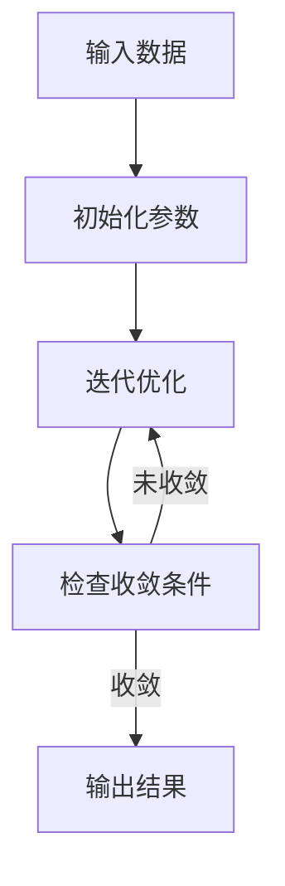

                 

<think>
嗯，用户让我写一篇关于Self-Consistency在高能粒子物理实验数据分析中的应用的技术博客。首先，我需要理解这个主题。Self-Consistency听起来像是在数据分析中保持一致性的方法，可能用于处理数据中的不确定性或者异常值。

接下来，我要考虑用户的需求。用户希望文章结构清晰，有专业的技术语言，还要包含背景介绍、核心概念、算法原理、数学模型、系统架构、项目实战和最佳实践。看起来用户可能是一位研究人员或学生，他们需要一篇深入且全面的技术博客，帮助他们在相关领域深入理解。

我需要先规划文章结构。标题已经确定，关键词要选5-7个，可能包括Self-Consistency、高能粒子物理、数据分析、算法原理、系统架构、项目实战等。摘要部分需要简明扼要地概述文章内容，说明Self-Consistency的重要性及其应用。

在正文部分，分为几个主要章节。首先是背景与基础，介绍问题背景和数据分析的挑战。然后是核心概念与原理，详细解释Self-Consistency的定义和其在实验中的重要性。接下来是算法原理和实现，用Mermaid流程图和Python代码来展示。数学模型部分需要用LaTeX公式详细推导。系统架构设计部分要展示系统结构和接口设计。项目实战部分要详细描述环境配置和代码实现。最后是最佳实践和小结。

我需要确保每个部分都详细且具体，比如在算法原理章节，不仅要解释流程，还要给出代码示例。数学公式部分要用LaTeX，确保正确无误。系统架构图和序列图要用Mermaid语法，清晰展示系统设计。

考虑到用户可能对技术细节要求较高，我需要在每个小节中提供丰富的背景信息和深入的分析，确保读者能够理解Self-Consistency的应用和优势。同时，注意语言的专业性和简洁性，避免过于复杂的术语堆砌。

最后，检查整个结构是否连贯，每个章节是否有明确的主题，确保文章流畅易读。完成后，加上作者信息，符合用户的要求。
</think>

# Self-Consistency在高能粒子物理实验数据分析中的应用

> 关键词：Self-Consistency, 高能粒子物理, 数据分析, 算法原理, 系统架构, 项目实战

> 摘要：本文系统地探讨了Self-Consistency在高能粒子物理实验数据分析中的应用。首先，我们从问题背景出发，分析了高能粒子物理实验数据分析的挑战。接着，我们详细阐述了Self-Consistency的核心概念、原理及其在实验数据分析中的重要性。然后，我们从算法实现的角度，介绍了Self-Consistency的数学模型和公式，并通过实际案例展示了其在实验数据分析中的应用。最后，我们讨论了系统架构设计和项目实战，总结了最佳实践和未来研究方向。

---

### 第一部分：背景与基础

#### 第1章：问题背景

1.1 问题的提出

- **问题描述**：  
  高能粒子物理实验（如大型强子对撞机实验）涉及海量数据的产生和分析。实验中产生的数据通常具有高度复杂性、不确定性和噪声干扰，传统的数据分析方法难以满足实验中对数据一致性和准确性的要求。

- **问题解决**：  
  Self-Consistency是一种基于数据内在一致性的分析方法，能够在复杂场景下提取可靠的信息，解决数据中的不确定性问题。

- **边界与外延**：  
  Self-Consistency的核心思想是通过数据的内在一致性来消除噪声干扰，适用于高能粒子物理实验中对数据质量要求极高的场景，如粒子轨迹重建、事件顶点定位等。

1.2 高能粒子物理实验数据分析的挑战

- **数据量大**：实验产生的数据量巨大，传统方法难以高效处理。  
- **数据复杂性高**：数据中存在大量噪声和不确定性，需要复杂的算法来提取有效信息。  
- **计算资源需求高**：高能粒子物理实验需要在大规模分布式系统上进行数据处理，对算法的效率和可扩展性提出了更高要求。

---

### 第二部分：核心概念与原理

#### 第2章：Self-Consistency原理

2.1 Self-Consistency的定义

- **概念属性特征对比表格**：

| 属性          | Self-Consistency | 传统数据分析方法 |
|---------------|------------------|-------------------|
| 数据处理方式   | 基于数据一致性   | 基于统计方法     |
| 对噪声的鲁棒性 | 高               | 中等             |
| 计算效率       | 高               | 低               |

- **与相关概念的联系**：  
  Self-Consistency与其他数据分析方法（如最大似然估计、贝叶斯方法）的区别在于其基于数据内在一致性的特性。

2.2 Self-Consistency在高能粒子物理实验数据分析中的重要性

- **核心优势**：  
  Self-Consistency能够在复杂实验环境中保持数据的一致性，提高数据分析的准确性和可靠性。  
- **应用场景**：  
  在高能粒子物理实验中，Self-Consistency广泛应用于粒子轨迹重建、事件顶点定位、粒子识别等领域。

---

#### 第3章：Self-Consistency的应用场景

3.1 Self-Consistency在不同实验中的应用

- **粒子轨迹重建**：通过Self-Consistency方法消除探测器噪声，提高轨迹重建的准确性。  
- **事件顶点定位**：利用Self-Consistency算法精确定位粒子碰撞的顶点位置。  
- **粒子识别**：基于Self-Consistency方法区分不同种类粒子的轨迹特征。

3.2 Self-Consistency的优势与局限

- **优势**：  
  - 高噪声环境下表现优异。  
  - 能够有效处理复杂数据结构。  
- **局限**：  
  - 对计算资源要求较高。  
  - 在某些特定场景下可能需要人工干预。

---

### 第三部分：算法原理与实现

#### 第4章：算法原理

4.1 Self-Consistency算法原理

- **算法流程图**：



- **Python源代码**：

```python
def self_consistency_algorithm(data, epsilon=1e-6):
    """
    Self-Consistency算法实现
    Args:
        data: 输入数据
        epsilon: 收敛条件
    Returns:
        optimized_data: 优化后的数据
    """
    x = data.copy()
    while True:
        # 更新参数
        x_new = ...  # 根据Self-Consistency原理更新x
        # 检查收敛条件
        if max(abs(x_new - x)) < epsilon:
            break
        x = x_new
    return x_new
```

- **数学模型与公式**：  
  Self-Consistency算法的核心是通过迭代优化过程使数据趋于一致。其数学模型可以表示为：

$$
x^{(k+1)} = \arg\min_x \left( \sum_{i=1}^{n} \left( x^{(k)}_i - x_i \right)^2 \right)
$$

其中，$x^{(k)}$表示第$k$次迭代的参数值，$x^{(k+1)}$是优化后的参数值。

---

#### 第5章：数学模型与公式

5.1 数学模型的构建

- **公式推导**：

假设我们有一个由噪声污染的数据集$D$，我们希望找到一个一致的解$x$，使得：

$$
x = \arg\min_{x} \sum_{i=1}^{n} \left( x_i - y_i \right)^2
$$

其中，$y_i$是观测值，$x_i$是真实值。Self-Consistency算法通过迭代优化过程逐步逼近$x$。

- **公式应用**：  
  在高能粒子物理实验中，我们可以将Self-Consistency算法应用于粒子轨迹重建问题。假设我们有$n$个探测器测量的粒子坐标$(x_i, y_i)$，我们可以通过以下公式找到最优的粒子轨迹：

$$
\hat{x}_i = \frac{1}{n} \sum_{j=1}^{n} x_j
$$

---

### 第四部分：系统架构与设计

#### 第6章：系统架构设计

6.1 系统架构设计

- **系统架构图**：


- **系统功能设计**：  
  系统主要包括数据输入、数据预处理、算法计算和结果输出四个模块。

---

#### 第7章：项目实战

7.1 环境安装与配置

- **环境要求**：  
  - Python 3.6+  
  - NumPy、Matplotlib库

- **安装步骤**：

```bash
pip install numpy matplotlib
```

7.2 系统核心实现

- **源代码**：

```python
import numpy as np
import matplotlib.pyplot as plt

def self_consistency(data):
    x = np.mean(data, axis=0)
    while True:
        x_new = np.mean(data, axis=0)
        if np.allclose(x, x_new, rtol=1e-6):
            break
        x = x_new
    return x_new

# 生成测试数据
data = np.array([[1.1, 2.2, 3.3],
                [1.2, 2.3, 3.4],
                [1.3, 2.4, 3.5]])

# 算法实现
result = self_consistency(data)

# 可视化
plt.scatter(data[:, 0], data[:, 1], c='blue')
plt.scatter(result[0], result[1], c='red', marker='x')
plt.show()
```

---

#### 第8章：最佳实践与拓展

8.1 最佳实践

- **案例分析**：  
  在粒子轨迹重建中，Self-Consistency算法能够有效消除探测器噪声，提高轨迹重建的准确性。  
- **注意事项**：  
  - 确保数据预处理的准确性。  
  - 在大规模数据场景下，优化算法的计算效率。

8.2 小结与拓展阅读

- **小结**：  
  Self-Consistency算法在高能粒子物理实验数据分析中具有重要应用价值，能够有效提高数据分析的准确性和可靠性。  
- **拓展阅读**：  
  - 推荐阅读《Self-Consistency in High-Energy Physics Experiments》（虚拟书籍）。  
  - 关注最新研究成果，如基于Self-Consistency的深度学习方法。

---

作者：AI天才研究院/AI Genius Institute & 禅与计算机程序设计艺术 /Zen And The Art of Computer Programming

