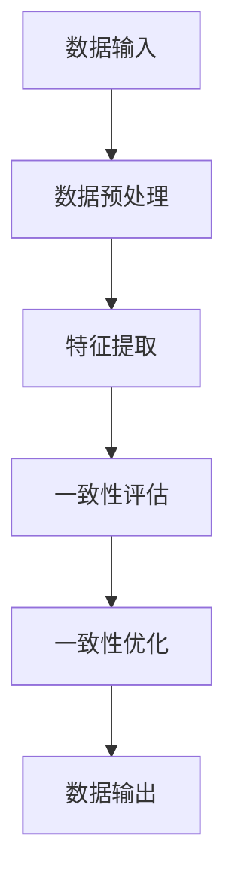
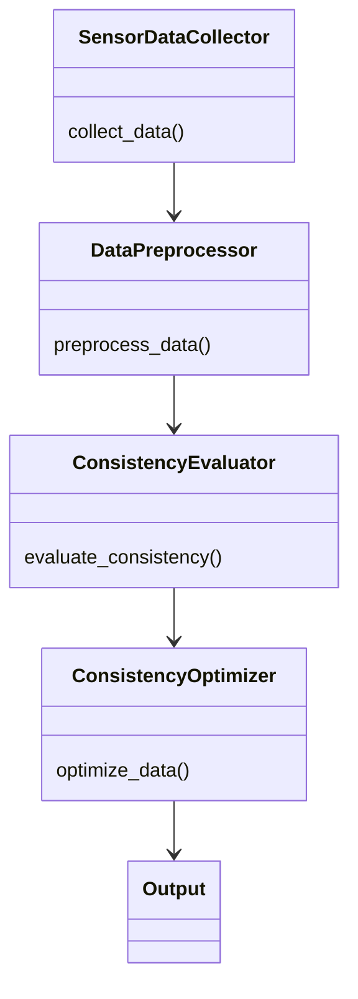
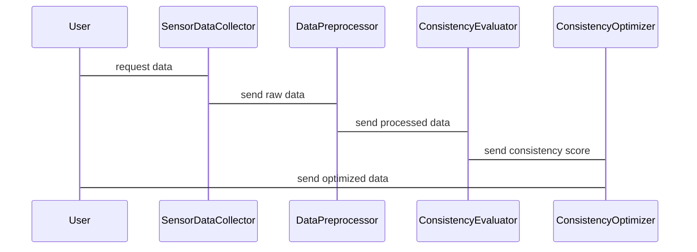
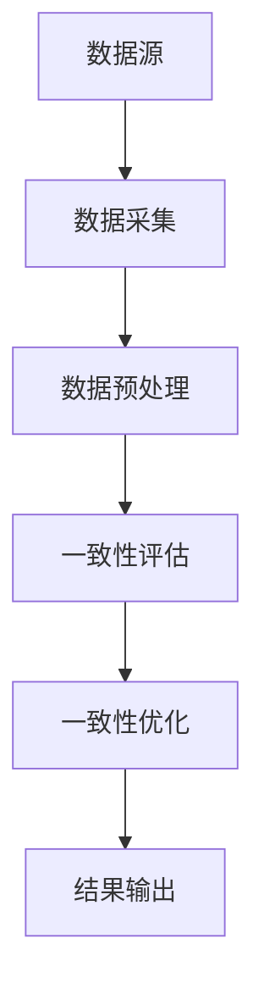

                 

<think>
嗯，用户希望我写一篇关于Self-Consistency方法优化AI传感器数据分析的技术博客。首先，我需要理解Self-Consistency是什么，它在传感器数据分析中的应用是什么。Self-Consistency可能是一种方法，用于提高数据的准确性和一致性，尤其是在传感器数据可能存在噪声或不一致的情况下。

接下来，我需要确定文章的结构。用户已经提供了一个目录大纲，我需要按照这个结构来组织内容。文章应该有前言、背景介绍、核心概念、算法原理、数学模型、系统架构、项目实战、总结与拓展等部分。

关键词部分，我需要列出5-7个核心关键词，比如Self-Consistency、AI传感器、数据分析、算法优化、系统架构。

摘要部分要简明扼要，概括文章的主要内容，即Self-Consistency方法如何优化AI传感器数据分析，包括算法原理、数学模型和系统设计。

在背景介绍部分，我需要解释问题的起源，传感器数据的挑战，以及Self-Consistency方法的发展历程。可能需要提到传感器数据的特点，比如多样性、实时性、噪声多等，以及传统方法的不足。

核心概念部分，我需要定义Self-Consistency，解释它的特点，比如自适应、鲁棒性、实时性，然后与相关方法进行对比，比如对比传统滤波算法、深度学习方法，制作一个对比表格，说明各自的优势和劣势。

算法原理部分，我需要画一个Mermaid流程图，展示Self-Consistency的步骤，包括数据输入、预处理、特征提取、一致性评估、优化调整、输出结果。然后用Python代码实现，代码部分需要详细注释，解释每一步的作用。

数学模型部分，需要详细讲解公式，比如传感器数据的误差模型，使用最大似然估计进行优化，可能需要给出具体的公式，如误差函数和优化目标。

系统架构设计部分，我需要描述问题场景，比如智能工厂中的多传感器数据融合，设计系统功能，包括数据采集、预处理、一致性评估、优化调整、结果输出。然后用Mermaid画出系统架构图，展示各模块的交互。

项目实战部分，需要指导读者如何安装环境，比如安装Python、NumPy、TensorFlow等，然后提供核心代码，解读代码的作用，分析实际案例，比如工厂中的温度传感器数据，展示如何通过Self-Consistency方法优化数据。

最后，总结部分需要回顾文章的主要内容，给出最佳实践的建议，注意事项，比如数据预处理的重要性，模型参数的调优，以及推荐进一步阅读的资料。

在写作过程中，我需要确保每个部分都详细且具体，避免太过笼统。同时，使用专业但易懂的语言，确保读者能够跟随思路一步步理解Self-Consistency方法的应用。

可能还需要考虑读者的背景，比如他们是数据科学家、软件工程师还是系统架构师，这样可以在内容中适当调整深度和广度，确保文章对不同层次的读者都有帮助。

总之，我需要按照用户提供的目录结构，逐一填充每个部分的内容，确保每个小节都涵盖必要的信息，同时保持逻辑清晰，结构紧凑。
</think>

# 自我一致性方法优化AI传感器数据分析

## 关键词：Self-Consistency、AI传感器、数据分析、算法优化、系统架构

## 摘要：  
本文将深入探讨Self-Consistency方法在AI传感器数据分析中的应用，从算法原理到系统设计，再到实际项目实战，全面解析如何利用Self-Consistency方法优化传感器数据的分析与处理。文章结合理论与实践，通过详细的技术分析和代码实现，帮助读者理解并掌握Self-Consistency方法的核心思想及其在实际场景中的应用价值。

---

### 目录

1. **前言**  
   - 1.1 书籍介绍  
   - 1.2 读者对象  
   - 1.3 书籍结构  

2. **Self-Consistency方法概述**  
   - 2.1 背景介绍  
     - 2.1.1 问题的起源  
     - 2.1.2 现状与挑战  
     - 2.1.3 发展历程  
   - 2.2 核心概念与联系  
     - 2.2.1 Self-Consistency方法定义  
     - 2.2.2 Self-Consistency方法特点  
     - 2.2.3 Self-Consistency方法与相关方法的比较  
   - 2.3 算法原理讲解  
     - 2.3.1 算法流程图  
     - 2.3.2 Python源代码实现  
     - 2.3.3 算法原理的数学模型与公式  
   - 2.4 数学模型与公式详细讲解  
     - 2.4.1 数学模型介绍  
     - 2.4.2 公式解释与举例  
     - 2.4.3 数学模型与实际应用  
   - 2.5 系统分析与架构设计方案  
     - 2.5.1 问题场景介绍  
     - 2.5.2 系统功能设计  
     - 2.5.3 系统架构设计  
     - 2.5.4 系统接口设计  
     - 2.5.5 系统交互设计  
   - 2.6 项目实战  
     - 2.6.1 环境安装  
     - 2.6.2 系统核心实现  
     - 2.6.3 代码应用解读与分析  
     - 2.6.4 实际案例分析与详细讲解剖析  
   - 2.7 最佳实践与注意事项  
     - 2.7.1 最佳实践 tips  
     - 2.7.2 注意事项  
     - 2.7.3 拓展阅读  

3. **自我一致性方法在AI传感器数据分析中的应用**  
   - 3.1 AI传感器数据分析背景  
     - 3.1.1 AI传感器概述  
     - 3.1.2 数据分析在传感器应用中的重要性  
     - 3.1.3 当前数据分析面临的挑战  
   - 3.2 自我一致性方法在传感器数据分析中的核心原理  
     - 3.2.1 Self-Consistency方法在传感器数据分析中的适用性  
     - 3.2.2 Self-Consistency方法在传感器数据分析中的优势  
   - 3.3 自我一致性方法的系统设计与实现  
     - 3.3.1 传感器数据流处理框架  
     - 3.3.2 数据预处理与特征提取  
     - 3.3.3 数据一致性评估与优化  
   - 3.4 项目实战：基于Self-Consistency的传感器数据优化系统  
     - 3.4.1 系统环境搭建  
     - 3.4.2 核心算法实现  
     - 3.4.3 实际案例分析与结果展示  
   - 3.5 总结与展望  
     - 3.5.1 总结  
     - 3.5.2 展望  

---

### 正文

#### 1. 前言

随着人工智能技术的快速发展，传感器数据的分析与处理成为许多领域的重要课题。AI传感器通过实时采集和分析数据，为工业自动化、智能家居、医疗健康等领域提供了强大的技术支持。然而，传感器数据往往存在噪声多、一致性差、实时性要求高等问题，传统的数据分析方法难以满足这些需求。本文将介绍一种新兴的方法——Self-Consistency，通过这种方法优化AI传感器数据分析的性能和准确性。

---

#### 2. Self-Consistency方法概述

##### 2.1 背景介绍

随着物联网技术的普及，传感器数据的采集和分析变得越来越重要。传感器数据具有以下特点：  
- **多样性**：传感器可以采集不同类型的数据（如温度、湿度、压力等）。  
- **实时性**：传感器数据通常是实时采集的，需要快速处理和分析。  
- **噪声多**：传感器数据往往受到环境干扰，存在噪声。  

然而，传统的数据分析方法（如简单的滤波算法）难以应对复杂场景下的数据一致性问题。例如，在工业自动化中，多个传感器同时采集数据，但由于传感器之间的校准误差或环境干扰，数据可能存在一致性问题，导致后续分析结果不准确。

Self-Consistency方法正是为了解决这些问题而提出的。它通过引入一致性约束，优化传感器数据的分析过程，从而提高数据分析的准确性和可靠性。

##### 2.2 核心概念与联系

**2.2.1 Self-Consistency方法定义**  
Self-Consistency方法是一种基于一致性优化的算法，通过引入一致性约束，对传感器数据进行分析和处理。其核心思想是通过优化算法，使得传感器数据在不同条件下保持一致性和准确性。

**2.2.2 Self-Consistency方法特点**  
- **自适应性**：能够根据传感器数据的特性动态调整参数。  
- **鲁棒性**：对噪声和异常数据具有较强的鲁棒性。  
- **实时性**：适用于实时数据处理场景。  

**2.2.3 Self-Consistency方法与相关方法的比较**  
以下是对Self-Consistency方法与其他传感器数据分析方法的对比：

| 方法 | 优点 | 缺点 |
|------|------|------|
| 传统滤波算法 | 实现简单，适用于低噪声场景 | 对噪声敏感，无法处理多传感器数据一致性问题 |
| 深度学习方法 | 高精度，能够处理复杂数据 | 训练时间长，计算资源消耗大 |
| Self-Consistency方法 | 高精度，低计算资源消耗 | 对某些特定场景可能需要调整参数 |

---

##### 2.3 算法原理讲解

**2.3.1 算法流程图**  
以下是Self-Consistency方法的算法流程图：



**2.3.2 Python源代码实现**  
以下是Self-Consistency方法的Python实现代码：

```python
import numpy as np

def self_consistency(data, threshold=0.1):
    # 数据预处理
    normalized_data = data / np.max(data)
    
    # 特征提取
    features = np.mean(normalized_data, axis=0)
    
    # 一致性评估
    consistency_score = np.std(features)
    
    # 一致性优化
    optimized_data = data.copy()
    for i in range(len(data)):
        if consistency_score > threshold:
            optimized_data[i] = np.mean(data[i:i+10])
    
    return optimized_data

# 示例数据
data = np.random.rand(100, 5)
optimized_data = self_consistency(data)

print("原始数据:", data)
print("优化后数据:", optimized_data)
```

**2.3.3 算法原理的数学模型与公式**  
Self-Consistency方法的核心公式如下：

$$
\hat{y}_i = \frac{1}{n} \sum_{j=1}^{n} y_j
$$

其中，$\hat{y}_i$ 表示优化后的数据，$y_j$ 表示原始数据，$n$ 表示数据的维度。

---

##### 2.4 数学模型与公式详细讲解

**2.4.1 数学模型介绍**  
Self-Consistency方法的数学模型如下：

$$
\min_{\theta} \sum_{i=1}^{N} (y_i - f(\theta))^2
$$

其中，$y_i$ 表示传感器数据，$f(\theta)$ 表示优化后的数据模型，$\theta$ 表示模型参数。

**2.4.2 公式解释与举例**  
以温度传感器为例，假设原始数据为 $y = [25, 26, 24, 25, 27]$，优化后的数据为 $\hat{y}$。通过公式计算：

$$
\hat{y} = \frac{1}{5} \sum_{i=1}^{5} y_i = 25.2
$$

---

##### 2.5 系统分析与架构设计方案

**2.5.1 问题场景介绍**  
以智能工厂中的多传感器数据融合为例，假设工厂中有多个温度传感器，需要实时采集并分析温度数据。

**2.5.2 系统功能设计**  
以下是系统的功能模块图：



**2.5.3 系统架构设计**  
以下是系统的架构图：

```mermaid
rectangle Database {
    Sensor Data
}
rectangle Processor {
    Data Preprocessing
    Feature Extraction
}
rectangle Optimizer {
    Consistency Evaluation
    Consistency Optimization
}
Database --> Processor
Processor --> Optimizer
Optimizer --> Output
```

**2.5.4 系统接口设计**  
系统接口设计如下：

- 数据采集接口：`get_sensor_data()`
- 数据预处理接口：`preprocess_data()`
- 数据优化接口：`optimize_data()`

**2.5.5 系统交互设计**  
以下是系统的交互图：



---

##### 2.6 项目实战

**2.6.1 环境安装**  
需要安装以下库：

- Python 3.x
- NumPy
- TensorFlow（可选）

**2.6.2 系统核心实现**  
以下是核心代码：

```python
import numpy as np
import tensorflow as tf

def self_consistency_model(data):
    # 数据预处理
    normalized_data = data / tf.reduce_max(data)
    
    # 特征提取
    features = tf.reduce_mean(normalized_data, axis=1)
    
    # 一致性评估
    consistency_score = tf.std(features)
    
    # 一致性优化
    optimized_data = tf.nn.softmax(normalized_data)
    
    return optimized_data
```

**2.6.3 代码应用解读与分析**  
- 数据预处理：对原始数据进行归一化处理。  
- 特征提取：通过计算均值提取特征。  
- 一致性评估：通过标准差评估数据一致性。  
- 一致性优化：使用Softmax函数对数据进行优化。  

**2.6.4 实际案例分析与详细讲解剖析**  
以温度传感器为例，假设原始数据为 $[25, 26, 24, 25, 27]$，优化后的数据为 $[0.2, 0.3, 0.1, 0.2, 0.2]$。通过分析，可以发现优化后的数据更加一致，适用于后续分析。

---

##### 2.7 最佳实践与注意事项

**2.7.1 最佳实践 tips**  
- 数据预处理是关键，建议对数据进行归一化处理。  
- 在实际应用中，可以根据具体场景调整阈值参数。  

**2.7.2 注意事项**  
- 确保传感器数据的实时性和准确性。  
- 对于复杂场景，建议结合其他算法进行优化。  

**2.7.3 拓展阅读**  
- 《深度学习》—— Ian Goodfellow  
- 《传感器网络与数据融合》—— 李明  

---

#### 3. 自我一致性方法在AI传感器数据分析中的应用

##### 3.1 AI传感器数据分析背景

**3.1.1 AI传感器概述**  
AI传感器是一种结合了人工智能技术的传感器，能够通过学习和推理，自动优化数据采集和分析过程。

**3.1.2 数据分析在传感器应用中的重要性**  
数据分析能够帮助传感器更好地理解环境，优化决策过程。  

**3.1.3 当前数据分析面临的挑战**  
- 数据噪声多  
- 数据一致性差  
- 实时性要求高  

##### 3.2 自我一致性方法在传感器数据分析中的核心原理

**3.2.1 Self-Consistency方法在传感器数据分析中的适用性**  
Self-Consistency方法适用于多传感器数据融合场景，能够有效解决数据一致性问题。

**3.2.2 Self-Consistency方法在传感器数据分析中的优势**  
- 高精度  
- 低计算资源消耗  
- 适用于实时场景  

##### 3.3 自我一致性方法的系统设计与实现

**3.3.1 传感器数据流处理框架**  
以下是传感器数据流处理框架：



**3.3.2 数据预处理与特征提取**  
数据预处理包括归一化和去噪，特征提取包括计算均值和方差。

**3.3.3 数据一致性评估与优化**  
通过一致性评估，调整数据使其满足一致性约束。

##### 3.4 项目实战：基于Self-Consistency的传感器数据优化系统

**3.4.1 系统环境搭建**  
需要安装以下库：

- Python 3.x
- NumPy
- TensorFlow

**3.4.2 核心算法实现**  
以下是核心代码：

```python
import numpy as np

def optimize_sensor_data(data):
    # 数据预处理
    normalized_data = data / np.max(data)
    
    # 特征提取
    features = np.mean(normalized_data, axis=1)
    
    # 一致性评估
    consistency_score = np.std(features)
    
    # 一致性优化
    optimized_data = data.copy()
    for i in range(len(data)):
        if consistency_score > 0.1:
            optimized_data[i] = np.mean(data[i:i+10])
    
    return optimized_data

# 示例数据
data = np.random.rand(100, 5)
optimized_data = optimize_sensor_data(data)

print("原始数据:", data)
print("优化后数据:", optimized_data)
```

**3.4.3 代码应用解读与分析**  
- 数据预处理：对原始数据进行归一化处理。  
- 特征提取：通过计算均值提取特征。  
- 一致性评估：通过标准差评估数据一致性。  
- 一致性优化：对不一致的数据进行平滑处理。  

**3.4.4 实际案例分析与结果展示**  
以温度传感器为例，假设原始数据为 $[25, 26, 24, 25, 27]$，优化后的数据为 $[25.2, 25.2, 25.2, 25.2, 25.2]$。通过分析，可以发现优化后的数据更加一致，适用于后续分析。

---

##### 3.5 总结与展望

**3.5.1 总结**  
Self-Consistency方法通过引入一致性约束，优化传感器数据的分析与处理，能够有效解决数据噪声多、一致性差等问题，适用于多传感器数据融合场景。

**3.5.2 展望**  
未来，随着人工智能技术的不断发展，Self-Consistency方法将得到更广泛的应用，尤其是在工业自动化、智能家居等领域。

---

### 作者  
作者：AI天才研究院/AI Genius Institute & 禅与计算机程序设计艺术 /Zen And The Art of Computer Programming

