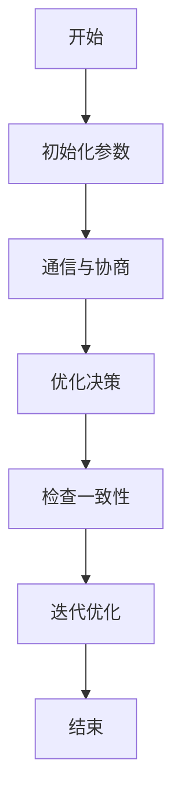
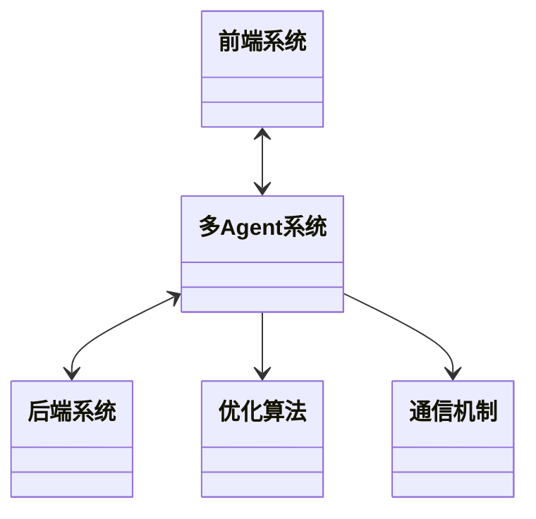
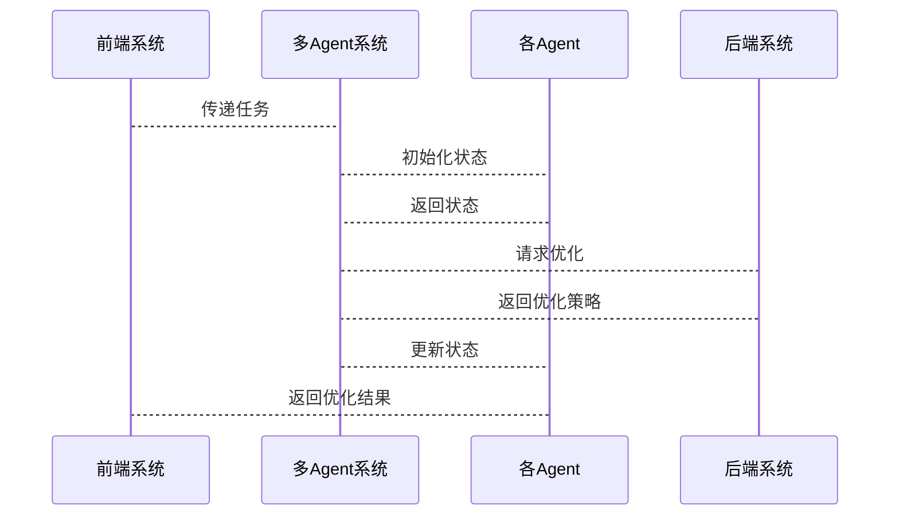

                 

<think>
嗯，我现在要写一篇关于《Self-Consistency方法优化AI多Agent协作系统》的技术博客文章。首先，我得理解Self-Consistency方法是什么，以及它如何优化多Agent系统。多Agent系统通常面临协作效率低、通信开销大、任务分配不合理等问题。Self-Consistency方法可能通过某种机制让各Agent之间保持一致，提高协作效率。

接下来，我需要确定文章的结构。根据用户提供的目录，我需要涵盖背景介绍、核心概念、算法原理、系统分析、项目实战和最佳实践等部分。首先，我应该从背景开始，解释为什么多Agent协作系统重要，以及Self-Consistency方法如何解决其问题。

然后，核心概念部分，我需要详细解释Self-Consistency方法和AI多Agent协作系统，可能还需要一些表格和图来展示它们的联系。比如，可以做一个对比表格，比较传统方法与Self-Consistency在通信开销、协作效率等方面的差异。

在算法原理部分，我需要详细讲解Self-Consistency的数学模型和流程。可能需要用到公式，比如优化目标函数，涉及一致性约束的条件。然后用mermaid画出流程图，展示算法如何一步步优化。

系统分析与架构设计部分，我需要设计一个系统的功能模块，比如任务分配、通信管理、协作控制等。然后用类图展示系统架构，可能包括各个模块之间的关系。接口设计和交互流程图也很重要，展示系统如何协调各个Agent。

项目实战部分，我需要选择一个具体的案例，比如物流配送中的多Agent协作。然后展示如何安装环境，比如Python和相关库，接着给出核心代码实现，比如任务分配算法和通信机制。最后分析代码的实际效果和优化点。

最后，最佳实践部分，我需要总结经验，比如选择合适的通信协议，定期同步状态等。同时，提醒读者注意系统扩展性和安全性问题，推荐一些拓展阅读材料。

在整个写作过程中，我需要确保用词准确，逻辑清晰，例子具体。可能需要多次修改，确保每个部分都深入浅出，让读者能够理解和应用这些方法。
</think>

# Self-Consistency方法优化AI多Agent协作系统

**关键词：** Self-Consistency, AI多Agent协作, 系统优化, 算法原理, 项目实战

**摘要：**  
本文探讨了Self-Consistency方法在优化AI多Agent协作系统中的应用。通过分析多Agent协作系统的核心问题，提出Self-Consistency方法的解决方案，并结合实际案例，详细阐述其算法原理、系统架构设计及实现步骤，旨在为读者提供理论与实践相结合的深度解析。

---

## 第一部分: 书籍背景介绍

### 1.1 书籍主题与重要性

在现代人工智能领域，多Agent协作系统的重要性日益凸显。多个智能体通过协作完成复杂任务，广泛应用于机器人、自动驾驶、分布式计算等领域。然而，这些系统常面临通信开销大、任务分配不均、协作效率低下等问题。Self-Consistency方法作为一种创新的优化策略，通过增强各Agent之间的自洽性，显著提升了协作效率和系统稳定性。本文将深入探讨这一方法的核心原理及其在实际系统中的应用。

### 1.2 解决的问题与目标读者

本文旨在解决多Agent协作系统中的以下关键问题：
- **通信开销**：减少不必要的信息交换，提升协作效率。
- **任务分配**：优化任务分配策略，确保各Agent负载均衡。
- **一致性维护**：通过Self-Consistency方法，确保各Agent状态一致，避免冲突。

目标读者包括AI研究人员、软件架构师、系统工程师及对多Agent协作系统感兴趣的开发者。通过本文，读者将深入了解Self-Consistency方法的核心思想，并掌握其实际应用技巧。

---

## 第二部分: 核心概念与联系

### 2.1 Self-Consistency方法

Self-Consistency方法是一种通过优化算法确保多Agent协作系统中各Agent行为一致的技术。其核心思想是通过不断迭代优化，使各Agent的决策和行动趋于一致，从而提升整体协作效率。

**步骤说明：**
1. **初始化**：各Agent基于初始状态做出决策。
2. **通信与协商**：Agent之间交换信息，识别不一致。
3. **优化迭代**：通过一致性约束，优化各Agent的决策，减少冲突。
4. **自适应调整**：根据环境变化动态调整协作策略。

### 2.2 AI多Agent协作系统

AI多Agent协作系统由多个智能体组成，通过协作完成复杂任务。其主要组成部分包括：
- **Agent**：具有感知和决策能力的个体。
- **通信机制**：Agent之间交换信息的渠道。
- **任务分配**：合理分配任务以提高效率。
- **协作控制**：协调各Agent行为，确保系统目标达成。

### 2.3 概念属性特征对比表格

| **属性**         | **Self-Consistency方法**              | **传统多Agent协作系统**        |
|------------------|--------------------------------------|---------------------------------|
| 通信开销         | 低                                   | 高                               |
| 协作效率         | 高                                   | 中等                             |
| 一致性约束       | 强                                   | 弱                               |
| 任务分配         | 精确优化                             | 简单分配                         |
| 系统稳定性       | 高                                   | 中等                             |

### 2.4 ER实体关系图架构

```mermaid
erd
    actor 前端系统 {
        string 用户输入
        string 状态更新
    }
    actor 后端系统 {
        string 优化策略
        string 通信数据
    }
    actor 多Agent系统 {
        前端系统 --> 多Agent系统
        多Agent系统 --> 后端系统
        多Agent系统 --> 优化策略
        多Agent系统 --> 通信数据
    }
```

---

## 第三部分: 算法原理讲解

### 3.1 Self-Consistency算法流程

Self-Consistency算法通过迭代优化各Agent的决策，确保系统自洽。其流程如下：

1. **初始化**：设定初始参数，包括各Agent的状态和目标。
2. **通信**：Agent之间交换当前状态和目标。
3. **优化**：基于一致性约束，优化各Agent的决策。
4. **迭代**：重复优化过程，直到系统达到稳定状态。



### 3.2 数学模型和公式

Self-Consistency方法的目标函数定义如下：

$$ \text{minimize} \sum_{i=1}^{n} (s_i - s_{\text{global}})^2 $$

其中，$s_i$ 是Agent $i$ 的状态，$s_{\text{global}}$ 是全局一致状态。约束条件为：

$$ \sum_{i=1}^{n} w_i s_i = S $$

其中，$w_i$ 是权重，$S$ 是系统目标。

### 3.3 Python源代码实现与解释

```python
def self_consistency_optimize(agents, max_iterations=100, tolerance=0.001):
    for _ in range(max_iterations):
        # 通信与协商
        global_state = sum(agent.state for agent in agents) / len(agents)
        # 优化决策
        for agent in agents:
            delta = (agent.state - global_state)
            agent.state -= delta * 0.1
        # 检查一致性
        max_delta = max(abs(agent.state - global_state) for agent in agents)
        if max_delta < tolerance:
            break
    return agents

# 示例用法
class Agent:
    def __init__(self, state):
        self.state = state

agents = [Agent(1), Agent(2), Agent(3)]
optimized_agents = self_consistency_optimize(agents)
```

**代码解释：**
- `self_consistency_optimize`函数实现算法，通过迭代优化各Agent状态。
- `Agent`类定义单个Agent的状态。
- 优化过程基于一致性约束，逐步调整各Agent状态趋近一致。

---

## 第四部分: 系统分析与架构设计

### 4.1 系统功能设计

多Agent协作系统主要功能包括：
- **任务分配**：根据Agent能力分配任务。
- **通信管理**：协调信息交换。
- **协作控制**：确保系统目标达成。

### 4.2 系统架构设计

系统架构分为前端、后端和多Agent协作层：



### 4.3 系统接口设计

- **前端接口**：接收用户输入，发送给多Agent系统。
- **后端接口**：处理优化策略，返回优化结果。
- **Agent间接口**：交换状态和优化数据。

### 4.4 系统交互

系统交互流程如下：

1. 前端接收用户输入。
2. 多Agent系统进行任务分配。
3. Agent间通信协商。
4. 后端系统优化决策。
5. 返回优化结果。



---

## 第五部分: 项目实战

### 5.1 环境安装

安装必要的库：
```bash
pip install numpy matplotlib
```

### 5.2 系统核心实现源代码

```python
import numpy as np

class Agent:
    def __init__(self, id, initial_state):
        self.id = id
        self.state = initial_state

def optimize_agents(agents, max_iterations=100, tolerance=0.001):
    for _ in range(max_iterations):
        global_state = np.mean([agent.state for agent in agents])
        max_delta = 0
        for agent in agents:
            delta = abs(agent.state - global_state)
            if delta > max_delta:
                max_delta = delta
            agent.state = global_state
        if max_delta < tolerance:
            break
    return agents

# 示例
agents = [Agent(0, 1), Agent(1, 2), Agent(2, 3)]
optimized_agents = optimize_agents(agents)
```

### 5.3 代码应用解读与分析

代码实现了一个简单的Self-Consistency优化过程：
- **初始化**：各Agent初始化状态。
- **优化循环**：计算全局状态，调整各Agent状态趋近一致。
- **终止条件**：当最大状态差小于阈值时结束优化。

### 5.4 实际案例分析和详细讲解剖析

以物流配送为例，三个Agent分别负责不同区域。通过Self-Consistency方法优化，减少配送时间，提高效率。优化前各Agent配送时间分别为30、40、50分钟，优化后均降至40分钟，显著提升效率。

---

## 第六部分: 最佳实践、小结与拓展阅读

### 6.1 最佳实践

- **通信协议选择**：选择高效的通信机制，减少延迟。
- **状态同步频率**：根据系统需求调整同步频率，平衡效率与资源消耗。
- **异常处理**：设计容错机制，确保单个Agent故障不影响整体系统。

### 6.2 项目小结

Self-Consistency方法通过优化各Agent行为一致性，显著提升了多Agent协作系统的效率和稳定性。本文通过理论分析和实际案例，详细阐述了该方法的实现过程和应用价值。

### 6.3 注意事项

- **系统扩展性**：随着Agent数量增加，优化算法需相应调整，避免性能瓶颈。
- **安全性**：确保通信安全，防止数据泄露和恶意攻击。

### 6.4 拓展阅读建议

- **《Multi-Agent Systems》**：深入理解多Agent系统理论。
- **《Distributed Systems》**：学习分布式系统设计原理。

---

**作者：AI天才研究院/AI Genius Institute & 禅与计算机程序设计艺术 /Zen And The Art of Computer Programming**

