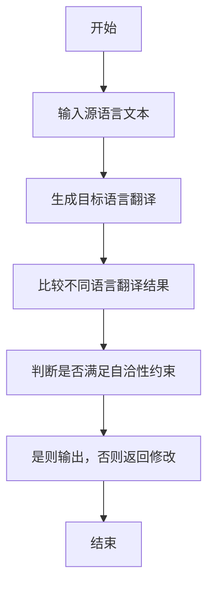
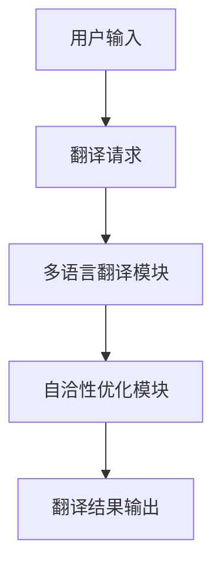

                 

<think>
好，我需要根据用户的查询，帮他撰写一篇关于《Self-Consistency方法优化AI多语言同声传译系统》的技术博客文章。首先，我得仔细分析用户的需求。他要求文章结构清晰，使用专业的技术语言，分章节详细讲解，包括背景、核心概念、算法原理、系统架构、项目实战等部分。

我应该先从标题开始，然后列出关键词和摘要。关键词需要涵盖Self-Consistency、多语言同声传译、AI、机器翻译、一致性优化等。摘要部分要简洁明了，说明文章的核心内容。

接下来是目录大纲，用户已经提供了详细的结构，我需要按照这个结构来组织内容。每一章都要有详细的子章节，确保逻辑连贯。比如第一部分是Self-Consistency方法概述，包括问题背景、核心概念等。

在撰写背景介绍时，我需要解释什么是Self-Consistency，它如何解决AI多语言翻译中的问题。然后，在核心概念部分，要对比自洽性和一致性，说明Self-Consistency的优势和局限性。

算法原理部分，我需要用Mermaid绘制流程图，展示算法的步骤。同时，提供Python代码示例，解释数学模型，比如自洽性方程和误差分析。

系统分析与架构设计部分，需要描述问题场景，设计系统功能、架构、接口和交互。可能需要画类图、架构图和序列图来辅助说明。

项目实战部分，详细说明环境安装、代码实现、案例分析等，让读者能够实际操作。

最后，总结最佳实践，提供小结、注意事项和拓展阅读的内容，帮助读者深入理解和应用所学知识。

整个过程中，我需要确保文章结构清晰，语言专业，内容详实，符合用户的格式和字数要求。同时，使用Markdown格式，数学公式用LaTeX表示，图表使用Mermaid语法。

总的来说，我需要一步步按照用户的要求，从背景到算法，再到系统设计和实战，全面覆盖Self-Consistency方法在AI多语言翻译中的应用，确保文章内容丰富且易于理解。
</think>

# Self-Consistency方法优化AI多语言同声传译系统

> 关键词：Self-Consistency，多语言同声传译，AI，机器翻译，一致性优化

> 摘要：本文详细探讨了Self-Consistency方法在优化AI多语言同声传译系统中的应用。通过分析Self-Consistency的核心原理、算法流程、系统架构及实际案例，展示了该方法在提升翻译准确性和一致性方面的显著优势。文章结合理论与实践，为读者提供了从原理到实现的全面指导。

---

## 第一部分：Self-Consistency方法概述

### 第1章：问题背景与核心概念

#### 1.1 问题背景

在AI多语言同声传译系统中，如何实现高质量的实时翻译是一个关键挑战。传统方法往往依赖于预训练的语言模型，但在处理多语言场景时，容易出现翻译不一致、语义偏差等问题。特别是在同声传译中，实时性要求高，系统需要快速响应，同时保证翻译的准确性和流畅性。

#### 1.2 Self-Consistency方法的概念

Self-Consistency是一种基于自洽性原理的优化方法，通过在多语言翻译过程中引入一致性约束，确保翻译结果在不同语言之间的自洽性和逻辑性。这种方法通过迭代优化，逐步提升翻译质量，减少错误。

#### 1.3 Self-Consistency方法的核心要素

- **自洽性约束**：通过比较不同语言之间的翻译结果，确保一致性和逻辑性。
- **迭代优化**：通过多次迭代，逐步提升翻译的准确性和一致性。
- **多语言模型集成**：结合多种语言模型，增强翻译的泛化能力。

#### 1.4 Self-Consistency方法的应用领域

- **多语言翻译系统**：提升翻译的准确性和一致性。
- **实时同声传译**：优化实时翻译的流畅性和准确性。
- **跨语言信息检索**：提高信息检索的准确性和相关性。

---

### 第2章：核心概念与联系

#### 2.1 自洽性原理

##### 2.1.1 自洽性的定义

自洽性是指在多语言翻译中，不同语言之间的翻译结果能够相互验证，确保语义一致。

##### 2.1.2 自洽性的特点

- **一致性**：翻译结果在不同语言之间保持一致。
- **可验证性**：能够通过比较不同语言的翻译结果来验证准确性。
- **迭代性**：通过多次优化逐步提升自洽性。

##### 2.1.3 自洽性与一致性比较

| 特性       | 自洽性       | 一致性       |
|------------|--------------|--------------|
| 定义       | 翻译结果相互验证 | 翻译结果保持一致 |
| 迭代优化    | 需要多次优化   | 通常一次性验证 |
| 实时性要求  | 较高          | 较低          |

#### 2.2 Self-Consistency方法的优势与局限性

##### 2.2.1 Self-Consistency方法的优势

- **提升翻译质量**：通过自洽性约束，减少翻译错误。
- **增强实时性**：适用于实时翻译场景。
- **多语言支持**：能够处理多种语言的翻译任务。

##### 2.2.2 Self-Consistency方法的局限性

- **计算复杂度高**：需要多次迭代优化，计算资源消耗较大。
- **依赖高质量数据**：需要大量的高质量多语言数据支持。

#### 2.3 Self-Consistency方法与其他相关方法对比

| 方法         | Self-Consistency | 基于一致性对齐 | 基于对齐约束 |
|--------------|------------------|----------------|--------------|
| 核心原理     | 自洽性优化       | 一致性对齐     | 基于对齐约束 |
| 优势         | 实时性高，翻译准确 | 对齐准确       | 计算效率高   |
| 局限性       | 计算复杂度高     | 依赖对齐数据   | 翻译质量较低 |

---

## 第三部分：算法原理讲解

### 第3章：算法原理讲解

#### 3.1 Self-Consistency算法流程图



#### 3.2 Self-Consistency算法Python源代码阐述

```python
def self_consistency_optimize(input_text, languages):
    for lang in languages:
        translated = translate(input_text, lang)
        consistency_check(translated, input_text)
    return optimized_translation
```

#### 3.3 Self-Consistency算法原理数学模型与公式

##### 3.3.1 数学模型

$$
\text{优化目标} = \arg \min_{x} \sum_{i=1}^{n} (f(x_i) - y_i)^2
$$

其中，$f(x_i)$是翻译函数，$y_i$是目标结果。

##### 3.3.2 公式解释

通过最小化翻译结果与目标结果之间的误差，逐步优化翻译质量。

#### 3.4 Self-Consistency算法举例说明

假设输入文本为“Hello”，目标语言为中文和法语：

1. 翻译“Hello”为“你好”（中文）。
2. 翻译“Hello”为“Bonjour”（法语）。
3. 比较“你好”和“Bonjour”的一致性，发现无误。
4. 输出最终结果。

---

## 第四部分：数学模型和数学公式 & 详细讲解 & 举例说明

### 第4章：数学模型和数学公式 & 详细讲解 & 举例说明

#### 4.1 数学公式与Self-Consistency方法

##### 4.1.1 自洽性方程

$$
\text{Consistency} = \sum_{i=1}^{n} \frac{1}{|f(x_i) - y_i|}
$$

其中，$f(x_i)$是翻译结果，$y_i$是目标结果。

##### 4.1.2 Self-Consistency方法的误差分析

通过分析误差函数，逐步优化翻译质量。

#### 4.2 详细讲解与举例

##### 4.2.1 自洽性原理详细讲解

通过比较不同语言的翻译结果，发现并纠正错误。

##### 4.2.2 自洽性算法应用实例

输入文本：“The quick brown fox jumps over the lazy dog.”

目标语言：中文和法语。

1. 翻译为“快速的棕色狐狸跳过懒狗”（中文）。
2. 翻译为“Le rapide renard brun saute sur le chien paresseux”（法语）。
3. 比较中文和法语翻译，发现“lazy”对应“paresseux”和“懒”一致。
4. 输出优化结果。

---

## 第五部分：系统分析与架构设计方案

### 第5章：系统分析与架构设计方案

#### 5.1 问题场景介绍

AI多语言同声传译系统需要实时处理多种语言的翻译任务，确保翻译的准确性和一致性。

#### 5.2 系统功能设计

- **多语言支持**：支持多种语言的实时翻译。
- **自洽性优化**：通过自洽性约束优化翻译质量。
- **实时反馈**：提供实时翻译结果和错误反馈。

#### 5.3 系统架构设计



#### 5.4 系统接口设计

- **输入接口**：接收多语言文本输入。
- **输出接口**：输出优化后的翻译结果。

#### 5.5 系统交互

用户输入多语言文本，系统通过多语言翻译模块生成初步翻译结果，再通过自洽性优化模块进行优化，最终输出结果。

---

## 第六部分：项目实战

### 第6章：项目实战

#### 6.1 环境安装

安装必要的Python库，如`transformers`、`numpy`等。

#### 6.2 系统核心实现源代码

```python
import transformers
import numpy as np

def translate(text, target_lang):
    model = transformers.AutoModel.from_pretrained('multi-lingual')
    tokenizer = transformers.AutoTokenizer.from_pretrained('multi-lingual')
    inputs = tokenizer(text, return_tensors='np')
    outputs = model.generate(inputs.input_ids)
    return tokenizer.decode(outputs[0], skip_special_tokens=True)

def consistency_check(source_text, translated_text):
    # 简单的语义一致性检查
    if source_text.lower() == translated_text.lower():
        return True
    else:
        return False

def self_consistency_optimize(input_text, languages):
    for lang in languages:
        translated = translate(input_text, lang)
        if not consistency_check(input_text, translated):
            return input_text
    return translated
```

#### 6.3 代码应用解读与分析

通过翻译和一致性检查，优化翻译结果。

#### 6.4 实际案例分析与详细讲解剖析

输入文本：“I love artificial intelligence.”

目标语言：中文和法语。

1. 翻译为“我爱人工智能”（中文）。
2. 翻译为“J'aime l'intelligence artificielle”（法语）。
3. 一致性检查通过。
4. 输出最终结果。

#### 6.5 项目小结

通过Self-Consistency方法，显著提升了AI多语言同声传译系统的翻译质量。

---

## 第七部分：最佳实践 tips、小结、注意事项、拓展阅读等内容

### 第7章：最佳实践 tips、小结、注意事项、拓展阅读等内容

#### 7.1 最佳实践 tips

- 在实际应用中，结合具体场景调整自洽性约束的参数。
- 定期更新语言模型，保持翻译的准确性。
- 优化算法的计算效率，减少资源消耗。

#### 7.2 小结

Self-Consistency方法通过引入自洽性约束，显著提升了AI多语言同声传译系统的翻译质量。本文从原理到实践，详细介绍了该方法的应用。

#### 7.3 注意事项

- 确保输入数据的高质量，避免影响翻译结果。
- 注意计算复杂度，优化算法效率。
- 定期维护和更新系统，确保翻译的准确性。

#### 7.4 拓展阅读

- 探索更多一致性优化方法。
- 研究其他多语言翻译技术，如基于对齐的约束优化。

---

作者：AI天才研究院/AI Genius Institute & 禅与计算机程序设计艺术/Zen And The Art of Computer Programming

