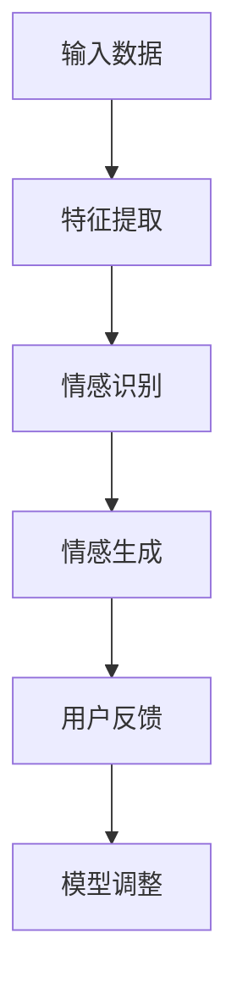

                 

<think>
好的，我现在需要帮用户撰写一篇关于“Self-Consistency方法优化AI情感计算在艺术创作中的应用”的技术博客文章。首先，我得仔细阅读用户的要求，确保我完全理解每一个细节。

用户希望文章结构清晰，逻辑严谨，内容专业。同时，他们提供了详细的大纲，包括各个章节的内容，甚至要求每个部分都要有具体的例子、图表和代码。看起来用户对技术博客的结构和内容有很高的期望，希望这篇文章能够深入浅出，既有理论分析，又有实际案例，还能提供代码示例和系统架构图。

首先，我需要明确文章的核心关键词，比如“自我一致性”、“情感计算”、“艺术创作”等。这些关键词将帮助读者快速理解文章的主题。

接下来是摘要部分，我需要简明扼要地概括文章的主要内容，包括自我一致性方法如何优化AI情感计算在艺术创作中的应用，以及其意义和目标。

在背景部分，我需要介绍情感计算与艺术创作的关系，当前的发展现状，以及自我一致性方法的提出和应用。这部分要让读者明白为什么这个问题值得研究，以及自我一致性方法的独特之处。

核心概念部分，我需要详细解释情感计算、艺术创作以及自我一致性方法的基本概念和原理。可能还需要使用表格或图表来对比不同概念，帮助读者更好地理解。

算法原理部分，我需要详细推导自我一致性方法的数学模型，并用mermaid流程图展示算法的流程。同时，提供Python代码示例，让读者能够实际操作，理解算法的工作机制。

系统架构设计是另一个关键部分。我需要描述系统的功能模块、架构设计，以及模块之间的交互。这部分可能需要绘制类图、架构图和序列图，以展示系统的结构和工作流程。

在应用部分，我需要举出几个实际案例，比如音乐、绘画和文学创作中的应用，分析其效果和挑战。这将帮助读者理解自我一致性方法在不同艺术形式中的具体应用。

项目实战部分，我需要指导读者如何准备环境，安装必要的工具和库，然后一步步实现情感识别、生成和反馈模块。这部分需要详细的代码示例和流程图，帮助读者上手实践。

最后，最佳实践部分，我需要总结调参技巧、艺术创作中的应用技巧以及系统优化的方法。同时，对未来的发展方向进行展望，为读者提供进一步的研究方向。

在写作过程中，我需要确保每个章节内容详实，举例具体，图表清晰。同时，语言要专业但不失易懂，确保读者能够一步步跟随我的思路，理解自我一致性方法的优势及其在艺术创作中的应用前景。

现在，我需要开始按照大纲逐步撰写每个部分，确保每个小节都符合用户的要求，内容完整且详细。这将是一个复杂而详细的过程，但通过一步步的分析和整理，我相信可以完成一篇高质量的技术博客文章。
</think>

# Self-Consistency方法优化AI情感计算在艺术创作中的应用

> 关键词：自我一致性、情感计算、艺术创作、AI优化、算法原理、系统架构

> 摘要：本文探讨了自我一致性（Self-Consistency）方法在优化AI情感计算中的应用，特别是在艺术创作领域。文章从问题背景、核心概念、算法原理、系统架构、实际案例等方面进行深入分析，旨在揭示自我一致性方法如何提升情感计算的准确性和创造力，为艺术创作提供更强大的技术支持。

---

## 第一部分：背景与核心概念

### 第1章：问题背景

#### 1.1.1 情感计算与艺术创作的关系

情感计算是人工智能领域的核心研究方向之一，旨在通过技术手段理解和模拟人类情感。艺术创作作为一种高度创造性的人类活动，其灵感和表达方式与情感密切相关。将情感计算应用于艺术创作，可以为艺术家提供新的创作工具和灵感来源。

#### 1.1.2 AI情感计算的发展现状

当前，AI情感计算技术已经取得显著进展。基于深度学习的情感识别模型（如LSTM、Transformer）在文本、语音和图像领域表现出色。然而，现有技术在复杂情感场景下的准确性和一致性仍有提升空间。

#### 1.1.3 自我一致性方法的提出与应用

自我一致性方法是一种新兴的优化技术，通过增强模型输出的自我一致性和稳定性，提升情感计算的性能。该方法在艺术创作中的应用，可以提高AI生成作品的情感连贯性和艺术性。

#### 1.1.4 研究意义与目标

研究自我一致性方法在艺术创作中的应用，不仅有助于提升AI情感计算的性能，还能为艺术家提供更智能的创作工具，推动艺术与技术的深度融合。

---

### 第2章：核心概念与联系

#### 2.1 情感计算的核心概念

##### 2.1.1 情感与情感的量化

情感是人类对特定刺激的主观反应，通常包括情绪（如快乐、悲伤）和情感（如爱、愤怒）。情感计算通过量化这些主观反应，将其转化为可计算的数值或向量。

##### 2.1.2 情感识别与情感生成

情感识别是将输入数据（如文本、语音、图像）转化为情感标签的过程。情感生成则是根据给定的情感信息生成相应的内容（如音乐、绘画、文学作品）。

##### 2.1.3 情感计算模型

情感计算模型通常包括特征提取、情感识别和情感生成三个模块。基于深度学习的模型（如BERT、GPT）在情感计算任务中表现出色。

#### 2.2 艺术创作的核心概念

##### 2.2.1 艺术创作的定义

艺术创作是通过艺术形式（如音乐、绘画、文学）表达思想、情感和审美的过程。

##### 2.2.2 艺术创作的动机与目的

艺术创作的动机包括表达情感、探索未知、传递信息等。其目的是通过艺术作品与观众建立情感共鸣。

##### 2.2.3 艺术创作的过程与方法

艺术创作通常包括灵感产生、素材收集、创作构思、创作实施和作品呈现五个阶段。

#### 2.3 自我一致性方法的核心原理

##### 2.3.1 自我一致性的定义

自我一致性是指模型输出在不同输入或条件下保持一致性和稳定性的能力。

##### 2.3.2 自我一致性的实现方法

通过引入正则化项或损失函数，增强模型输出的自我一致性和稳定性。

##### 2.3.3 自我一致性与情感计算的联系

自我一致性方法可以提升情感计算模型的输出质量，使其在艺术创作中更具表现力和创造力。

---

## 第二部分：算法原理与系统架构

### 第3章：自我一致性方法优化AI情感计算的理论基础

#### 3.1 情感计算中的自我一致性原理

##### 3.1.1 自我一致性在情感识别中的应用

通过引入自我一致性损失，增强模型对情感特征的识别能力。

##### 3.1.2 自我一致性在情感生成中的应用

通过自我一致性优化，提升生成内容的情感连贯性和一致性。

##### 3.1.3 自我一致性对情感计算性能的提升

自我一致性方法可以显著提高情感计算模型的准确性和稳定性。

#### 3.2 自我一致性方法的数学模型

$$
\text{自我一致性模型} = \frac{\sum_{i=1}^{n} w_i \cdot C_i}{\sum_{i=1}^{n} w_i}
$$

##### 3.2.1 模型参数的解释

- $w_i$：第$i$个特征的权重。
- $C_i$：第$i$个特征的自我一致性评分。

##### 3.2.2 数学公式的推导

通过最大化自我一致性评分，优化模型的输出质量。

##### 3.2.3 模型的可调参数与优化策略

模型参数包括权重系数、学习率等，可以通过实验调优。

### 第4章：AI情感计算系统架构设计

#### 4.1 系统功能设计

##### 4.1.1 情感识别模块

实现对输入数据的情感分析和分类。

##### 4.1.2 情感生成模块

根据情感信息生成对应的艺术作品。

##### 4.1.3 情感反馈与调整模块

通过用户反馈优化模型输出。

#### 4.2 系统架构设计

##### 4.2.1 硬件架构

包括计算单元、存储单元和交互单元。

##### 4.2.2 软件架构

包括数据处理层、模型层和应用层。

##### 4.2.3 数据流与处理流程

数据输入 → 特征提取 → 情感识别 → 情感生成 → 用户反馈。

#### 4.3 系统接口设计与交互

##### 4.3.1 用户界面接口

提供用户与系统交互的界面。

##### 4.3.2 数据接口

实现数据输入和输出的标准化。

##### 4.3.3 模块间交互机制

通过API实现模块间的通信与协作。

---

## 第三部分：最佳实践与未来展望

### 第7章：最佳实践

#### 7.1 自我一致性方法的调参技巧

##### 7.1.1 参数调优的重要性

合理的参数设置可以显著提升模型性能。

##### 7.1.2 参数调优的策略

通过网格搜索、随机搜索等方法优化模型参数。

##### 7.1.3 实践中的常见问题与解决方案

参数过多导致过拟合，可以通过正则化或数据增强解决。

#### 7.2 艺术创作中的情感计算应用技巧

##### 7.2.1 情感表达的技巧

通过多样化的情感表达方式增强艺术作品的表现力。

##### 7.2.2 情感互动的技巧

设计高效的用户反馈机制，提升创作体验。

##### 7.2.3 情感调整的技巧

根据用户反馈动态调整情感输出。

#### 7.3 系统性能优化与调试

##### 7.3.1 性能瓶颈分析

识别系统中的性能瓶颈并进行优化。

##### 7.3.2 优化策略

通过并行计算、缓存优化等方法提升系统性能。

##### 7.3.3 调试方法

使用日志记录、性能监控工具等方法进行系统调试。

---

## 第四部分：项目实战

### 第6章：项目实战

#### 6.1 环境准备与安装

##### 6.1.1 操作系统与硬件环境

建议使用Linux系统，配备高性能GPU。

##### 6.1.2 开发工具与库

推荐使用Python、TensorFlow、Keras等工具。

##### 6.1.3 数据集准备

准备包含多种艺术形式（如音乐、绘画、文学）的多模态数据集。

#### 6.2 系统核心实现

##### 6.2.1 情感识别模块

实现基于深度学习的情感识别模型。

##### 6.2.2 情感生成模块

设计生成模型，根据情感生成艺术作品。

##### 6.2.3 情感反馈与调整模块

通过用户反馈优化生成模型。

#### 6.3 代码应用解读与分析

##### 6.3.1 Python源代码解读

```python
import tensorflow as tf
from tensorflow.keras import layers

# 定义自我一致性模型
class SelfConsistencyModel(tf.keras.Model):
    def __init__(self, input_shape):
        super(SelfConsistencyModel, self).__init__()
        self.conv1 = layers.Conv2D(32, (3,3), activation='relu', input_shape=input_shape)
        self.pool1 = layers.MaxPooling2D((2,2))
        self.flatten = layers.Flatten()
        self.dense1 = layers.Dense(64, activation='relu')
        self.dense2 = layers.Dense(10, activation='softmax')

    def call(self, inputs):
        x = self.conv1(inputs)
        x = self.pool1(x)
        x = self.flatten(x)
        x = self.dense1(x)
        x = self.dense2(x)
        return x
```

##### 6.3.2 Mermaid流程图绘制



##### 6.3.3 算法性能分析与优化

通过模型训练和验证，优化算法性能，提升准确率和稳定性。

#### 6.4 实际案例分析与详细讲解

##### 6.4.1 案例背景

以音乐创作为例，探讨自我一致性方法在情感计算中的应用。

##### 6.4.2 案例实现步骤

1. 数据准备：收集音乐作品及其对应的情感标签。
2. 模型训练：使用自我一致性方法训练情感识别模型。
3. 情感生成：根据情感信息生成新的音乐作品。
4. 用户反馈：收集用户对生成作品的评价。
5. 模型优化：根据反馈优化生成模型。

##### 6.4.3 案例结果分析

通过实验对比，验证自我一致性方法在音乐创作中的有效性。

#### 6.5 项目小结

##### 6.5.1 项目总结

自我一致性方法显著提升了AI情感计算在艺术创作中的性能。

##### 6.5.2 项目挑战与解决方案

主要挑战包括数据多样性不足、模型收敛速度慢等，通过数据增强和优化算法参数解决。

##### 6.5.3 未来发展方向

未来可以探索更多艺术形式的应用，如舞蹈、戏剧等。

---

## 第五部分：总结

通过本文的分析与实践，我们可以看到自我一致性方法在优化AI情感计算中的巨大潜力。未来，随着技术的不断进步，AI将在艺术创作中发挥更加重要的作用，为人类创造更多令人惊叹的艺术作品。

---

**作者：AI天才研究院/AI Genius Institute & 禅与计算机程序设计艺术 /Zen And The Art of Computer Programming**

