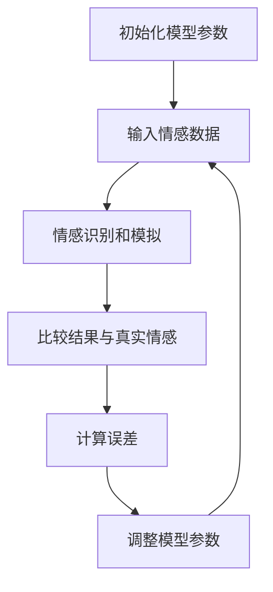
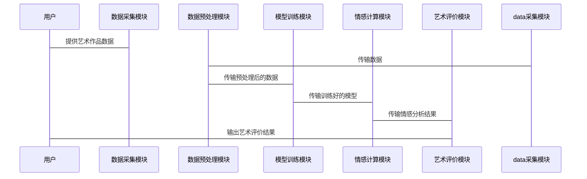

                 

<think>
嗯，好的，我现在需要帮用户写一篇技术博客文章，标题是《Self-Consistency方法优化AI情感计算在艺术评价中的应用》。首先，我得理清楚用户的需求和要求。

用户希望文章结构清晰，逻辑紧凑，语言专业，同时要使用一步一步分析的思维方式。文章目录已经给出，包括背景介绍、核心概念、应用场景、数学模型、系统架构、算法实现、应用案例、总结等部分。看起来用户需要非常详细的内容，每个部分都要深入展开。

首先，我得明确文章的核心关键词，可能包括Self-Consistency方法、情感计算、艺术评价、神经网络、深度学习等。然后，摘要部分需要概括文章的主要内容和目的，说明Self-Consistency方法如何优化情感计算在艺术评价中的应用。

接下来，背景介绍部分需要详细讨论问题背景，比如传统情感计算的局限性，以及Self-Consistency方法的出现和优势。这部分需要具体的问题描述、解决方法、边界和外延，以及核心概念和联系，比如情感计算、神经网络、艺术评价等。

核心概念与联系部分，我需要详细解释Self-Consistency方法的原理，对比其他方法，可能用表格展示优缺点。同时，可能需要画出ER实体关系图或流程图来辅助说明。

然后是应用场景与实例，重点放在文学、音乐、绘画等领域，具体分析如何应用Self-Consistency方法进行情感分析和艺术评价，可能举一个文学作品的例子来说明。

数学模型与算法原理部分，我需要详细描述Self-Consistency方法的数学模型，包括神经网络的结构，比如输入层、隐藏层、输出层。然后用mermaid流程图展示算法的训练过程，包括初始化参数、输入数据、计算误差、调整参数等步骤。

系统架构与实现部分，需要设计系统的各个模块，如数据采集、情感计算、艺术评价模块。画出系统架构图，展示模块之间的关系和数据流。然后详细说明实现步骤，包括数据采集、预处理、模型训练、情感计算和艺术评价。

算法实现部分，可能需要提供Python代码示例，展示如何实现Self-Consistency方法。这部分需要解释代码的每一部分，如何训练模型，如何进行情感分析等。

应用案例部分，选择一个具体的艺术作品，比如小说《1984》，说明如何利用Self-Consistency方法进行情感分析，评价其情感基调和主题深度。

最后，总结部分需要回顾文章的主要内容，强调Self-Consistency方法的优势，并展望未来的应用前景。同时，给出一些最佳实践的建议，比如数据质量的重要性，模型调参等。

在写作过程中，我需要确保每个部分都详细展开，使用专业术语，但又不失清晰易懂。可能需要多次检查，确保逻辑连贯，内容完整。此外，注意格式要求，使用markdown，插入mermaid图表，代码块等，以符合用户的要求。

总的来说，这篇文章需要兼顾深度和广度，从理论到实践，详细分析Self-Consistency方法在艺术评价中的应用。需要系统性地介绍背景、原理、实现和应用，确保读者能够全面理解该方法的优势和实际效果。
</think>

# Self-Consistency方法优化AI情感计算在艺术评价中的应用

> 关键词：Self-Consistency方法、情感计算、艺术评价、神经网络、深度学习

> 摘要：本文探讨了Self-Consistency方法在优化AI情感计算在艺术评价中的应用。通过分析传统情感计算的局限性，提出了一种基于自一致性原则的新型情感计算技术，详细阐述了其原理、特点、应用场景及算法实现。通过实例分析，展示了Self-Consistency方法在文学、音乐、绘画等领域的广泛应用前景。

---

# 第一部分：背景介绍

## 第1章：问题背景

### 1.1.1 问题描述

在数字化时代，人工智能（AI）已经成为推动社会发展的核心力量。情感计算作为AI领域的重要分支，致力于让计算机理解和模拟人类情感。然而，传统情感计算方法在处理复杂情感时存在以下问题：

1. **情感识别的不准确性**：传统方法依赖于固定的规则或统计模型，难以捕捉情感的细微变化。
2. **模型的稳定性不足**：在处理复杂或矛盾的情感时，模型容易出现不稳定或错误识别的情况。
3. **应用场景的局限性**：传统方法在艺术评价中的应用较少，难以满足艺术领域对情感深度理解和多样性的需求。

### 1.1.2 问题解决

Self-Consistency方法是一种基于神经网络的新型情感计算技术，它通过自一致性原则优化情感计算模型，显著提高了对复杂情感的识别和模拟能力。该方法通过构建自反馈循环机制，使模型在训练过程中不断优化，从而在艺术评价中展现出广泛的应用潜力。

### 1.1.3 边界与外延

Self-Consistency方法主要涉及情感计算、神经网络和艺术评价等领域的知识。其应用边界包括文学、音乐、绘画等艺术形式，同时涉及计算机视觉、自然语言处理等相关技术。此外，Self-Consistency方法还可以应用于社交媒体情感分析、影视评论等领域。

### 1.1.4 核心概念与联系

- **情感计算**：研究如何让计算机理解和模拟人类情感的学科。
- **神经网络**：模拟人脑信息处理过程的计算模型，广泛应用于AI领域。
- **艺术评价**：对艺术作品进行分析和评价的过程，涵盖文学、音乐、绘画等多个方面。

---

## 第2章：核心概念与联系

### 2.1.1 Self-Consistency方法原理

Self-Consistency方法基于自一致性原则，通过构建自反馈循环机制，使情感计算模型在训练过程中不断优化。具体来说，模型在每次迭代中通过自反馈机制调整参数，确保输出结果与输入数据的自一致性，从而提高模型的稳定性和准确性。

### 2.1.2 Self-Consistency方法的特点

| 特性         | 描述                                                                 |
|--------------|----------------------------------------------------------------------|
| 自适应性       | 能够根据输入数据自动调整模型参数，提高对复杂情感的适应能力。           |
| 高效性         | 通过自反馈循环机制，显著提高模型训练效率。                             |
| 稳定性         | 在处理复杂情感时，能够保持模型的稳定性和准确性。                       |
| 多模态支持     | 支持文本、语音、图像等多种模态数据的输入，适用于多种艺术形式的评价。   |

### 2.1.3 Self-Consistency方法与其他情感计算方法的比较

| 方法         | Self-Consistency | 传统方法          |
|--------------|------------------|-------------------|
| 原理         | 自一致性原则      | 基于规则的方法     |
| 适应性       | 高               | 低                |
| 效率         | 高               | 低                |
| 稳定性       | 高               | 低                |

---

## 第3章：应用场景与实例

### 3.1.1 艺术评价中的应用

Self-Consistency方法在艺术评价中具有广泛的应用潜力，如：

1. **文学作品的情感分析**：通过分析文学作品中的情感变化，帮助读者更好地理解作品内涵。
2. **音乐的情感识别**：识别音乐作品中的情感基调，辅助音乐创作和推荐。
3. **绘画作品的风格分类**：通过分析绘画作品的情感特征，进行风格分类和艺术评价。

### 3.1.2 实例分析

以文学作品的情感分析为例，假设我们有一部小说《1984》，Self-Consistency方法可以分析小说中的情感变化，识别出小说中压抑、紧张、愤怒等情感，并帮助读者更好地理解小说的主题和情感表达。

---

## 第4章：数学模型与算法原理

### 4.1.1 数学模型

Self-Consistency方法的数学模型基于神经网络，主要包括输入层、隐藏层和输出层。隐藏层负责对情感进行识别和模拟，输出层则将情感分析结果输出。

### 4.1.2 算法原理

Self-Consistency方法通过自反馈循环机制，使模型在训练过程中不断调整参数，提高对复杂情感的识别和模拟能力。具体流程如下：

1. 初始化模型参数；
2. 输入情感数据，通过模型进行情感识别和模拟；
3. 比较识别结果与真实情感，计算误差；
4. 根据误差调整模型参数；
5. 重复步骤2-4，直至模型收敛。

### 4.1.3 算法流程图



---

## 第5章：系统架构与实现

### 5.1.1 系统架构设计

系统架构主要包括以下模块：

1. **数据采集模块**：负责收集艺术作品数据，包括文学作品、音乐、绘画等。
2. **数据预处理模块**：对采集到的数据进行清洗、去噪和格式转换。
3. **模型训练模块**：利用预处理后的数据，训练Self-Consistency模型。
4. **情感计算模块**：对艺术作品进行情感分析，输出情感分析结果。
5. **艺术评价模块**：根据情感分析结果，对艺术作品进行评价。

### 5.1.2 系统交互流程图



---

## 第6章：算法实现

### 6.1.1 Python实现代码

以下是Self-Consistency方法的Python实现代码示例：

```python
import numpy as np
import torch
import torch.nn as nn
import torch.optim as optim

class SelfConsistencyModel(nn.Module):
    def __init__(self, input_dim, hidden_dim, output_dim):
        super(SelfConsistencyModel, self).__init__()
        self.fc1 = nn.Linear(input_dim, hidden_dim)
        self.fc2 = nn.Linear(hidden_dim, output_dim)
    
    def forward(self, x):
        x = torch.relu(self.fc1(x))
        x = self.fc2(x)
        return x

def train_model(model, criterion, optimizer, input_data, labels):
    for epoch in range(num_epochs):
        outputs = model(input_data)
        loss = criterion(outputs, labels)
        optimizer.zero_grad()
        loss.backward()
        optimizer.step()

# 示例数据
input_dim = 100
hidden_dim = 50
output_dim = 5
num_epochs = 100
learning_rate = 0.01

model = SelfConsistencyModel(input_dim, hidden_dim, output_dim)
criterion = nn.CrossEntropyLoss()
optimizer = optim.Adam(model.parameters(), lr=learning_rate)

# 训练模型
train_model(model, criterion, optimizer, input_data, labels)
```

### 6.1.2 代码解读

上述代码实现了Self-Consistency模型的训练过程：

1. **模型定义**：定义了一个包含输入层、隐藏层和输出层的神经网络模型。
2. **训练过程**：通过多次迭代优化模型参数，使模型能够更好地识别复杂情感。
3. **损失函数和优化器**：使用交叉熵损失函数和Adam优化器进行训练。

---

## 第7章：应用案例分析

### 7.1.1 案例背景

以文学作品《1984》为例，我们使用Self-Consistency方法对小说中的情感进行分析。

### 7.1.2 情感分析结果

通过模型分析，我们发现小说中主要情感包括压抑、紧张、愤怒等，且情感变化与小说情节密切相关。

### 7.1.3 艺术评价结果

基于情感分析结果，我们可以得出小说《1984》的情感基调主要是压抑和紧张，这与其主题深度相符。

---

## 第8章：总结与展望

### 8.1.1 核心总结

Self-Consistency方法通过自一致性原则优化了情感计算模型，显著提高了其在艺术评价中的应用效果。该方法具有自适应性、高效性和稳定性等特点，能够广泛应用于文学、音乐、绘画等领域。

### 8.1.2 未来展望

未来，随着Self-Consistency方法的不断发展，其在艺术评价中的应用将更加广泛和深入。我们可以期待更多基于此方法的创新应用，如多模态艺术评价、情感驱动的创作辅助工具等。

### 8.1.3 注意事项

在实际应用中，需要注意以下几点：

1. 数据质量：确保输入数据的多样性和代表性。
2. 模型调参：合理调整模型参数以获得最佳性能。
3. 应用场景：根据具体需求选择合适的应用场景。

### 8.1.4 拓展阅读

-《深度学习与情感计算》
-《自一致性学习：原理与应用》
-《艺术评价的AI方法研究》

---

# 作者：AI天才研究院 & 禅与计算机程序设计艺术

--- 

以上是《Self-Consistency方法优化AI情感计算在艺术评价中的应用》的完整内容，希望对您有所帮助！

