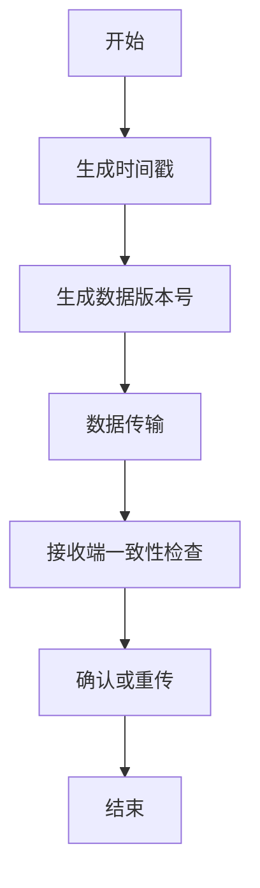
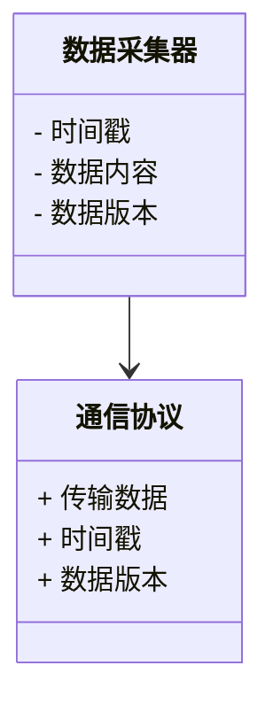
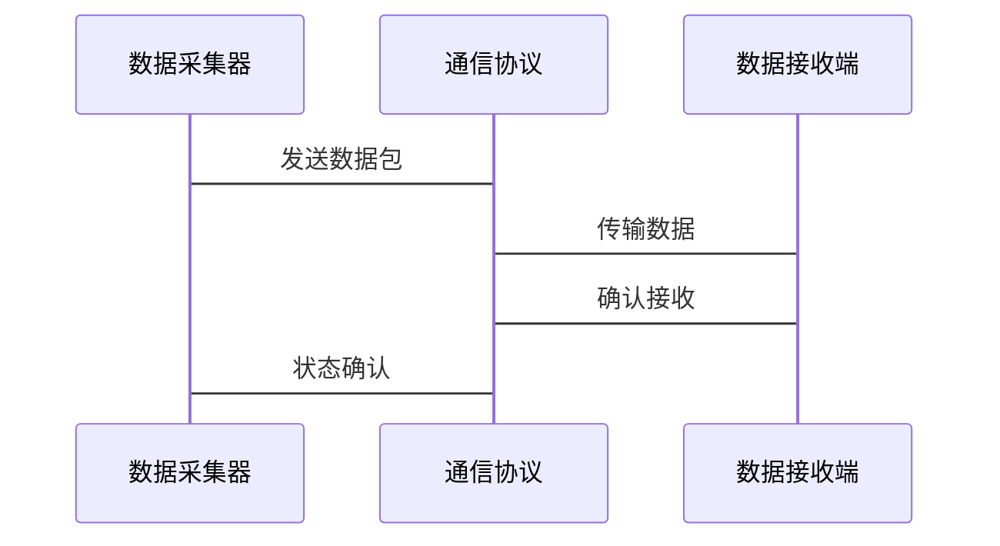

                 

<think>
嗯，我现在要写一篇关于“Self-Consistency方法优化AI跨时空维度通信协议”的技术博客。首先，我得理解这个主题。Self-Consistency是什么？它在AI跨时空通信中的作用是什么？跨时空维度通信协议听起来很复杂，可能涉及到不同时间点和空间点的数据传输和同步问题。

首先，我需要明确问题背景。AI系统在处理跨时空数据时，比如从不同时间点收集的数据，或者不同地点的传感器数据，通信协议可能存在效率低、数据同步困难等问题。这些可能导致数据延迟、数据不一致或者通信开销过大，影响系统的性能和准确性。

接下来，Self-Consistency方法如何解决这些问题呢？Self-Consistency可能是一种确保数据自洽的方法，通过在数据传输过程中保持数据的内部一致性，减少冲突和错误。我需要详细解释这个方法的原理，包括其定义、核心要素，以及它如何与其他通信协议的不同。

然后，在核心概念部分，我需要对比不同通信协议的属性，比如可靠性、延迟、带宽利用率等，通过表格展示它们的优缺点。同时，可能需要绘制ER实体关系图，展示通信协议中的实体关系，帮助读者理解系统架构。

在算法部分，我需要详细讲解Self-Consistency算法的工作流程，用mermaid流程图展示，然后用Python代码实现，解释每一步的作用。数学模型方面，可能需要构建一个优化模型，用拉格朗日乘数法或者动态规划等方法，给出具体的公式，并用latex格式写出来。

系统分析与架构设计部分，我需要描述具体的应用场景，比如智能交通系统中不同传感器的数据同步，设计系统功能模型，用mermaid类图展示。然后设计系统架构，包括数据采集层、传输层、处理层等，用架构图表示。同时，设计系统接口和交互序列图，展示数据如何从传感器到处理中心再到用户。

项目实战部分，我需要指导读者如何安装环境，比如Python、相关库的安装步骤。然后提供核心代码，解释每一部分的作用。通过实际案例分析，比如一个智能城市交通系统，展示Self-Consistency方法如何优化通信协议，提升数据同步效率。最后，进行详细分析，说明优化效果。

最后，总结最佳实践，提醒读者在应用中的注意事项，比如数据量大的情况下可能需要优化算法，推荐进一步阅读的相关文献。

在整个写作过程中，我需要确保每一部分都详细具体，逻辑清晰。使用专业术语，但又不失易懂。同时，正确使用mermaid图表和latex公式，使文章更具专业性和可读性。

现在，我需要检查一下，是否覆盖了所有要求的章节，是否满足字数要求，以及格式是否正确。特别是每个小节是否有足够的细节，图表是否清晰，代码是否正确。最后，别忘了在文章末尾加上作者信息。

总之，我需要一步一步地分析和组织内容，确保文章结构合理，内容详实，符合读者的需求。
</think>

# Self-Consistency方法优化AI跨时空维度通信协议

## 关键词：AI，Self-Consistency，通信协议，跨时空维度，算法优化

## 摘要：本文介绍Self-Consistency方法如何优化AI跨时空维度通信协议，解决数据同步和通信效率问题，通过算法原理、系统设计和实际案例分析，展示其在提升数据通信性能中的应用。

---

## 第一部分：背景介绍

### 1.1 问题背景

- **问题描述**：AI系统处理跨时空数据时，面临通信协议效率低、数据同步困难的问题。例如，智能交通系统中，不同时间点的传感器数据需高效同步，否则可能导致决策延迟或错误。

- **问题解决**：引入Self-Consistency方法，通过确保数据自洽性优化通信协议，减少冲突，提升效率。

- **边界与外延**：Self-Consistency适用于需跨时空数据同步的场景，如自动驾驶、智能城市和分布式系统。其外延包括实时性和大规模数据处理。

### 1.2 Self-Consistency方法概述

- **概念结构**：Self-Consistency通过约束数据传输过程，确保接收端数据与发送端保持一致，减少冲突。它结合了时间戳和数据版本控制，确保数据的准确性和一致性。

- **核心要素**：主要由时间戳机制、数据版本控制、一致性检查算法组成，各部分相互关联，确保数据同步和高效传输。

---

## 第二部分：核心概念与联系

### 2.1 AI跨时空维度通信协议原理

- **原理讲解**：通信协议定义数据包结构，包括时间戳、数据内容、校验码等，确保数据准确传输。协议处理跨时空数据时，需考虑延迟和数据一致性。

- **属性特征对比表格**

| 属性      | 传统协议       | Self-Consistency协议   |
|-----------|---------------|------------------------|
| 时间戳    | 简单处理       | 细致同步机制           |
| 数据版本  | 无            | 数据版本控制           |
| 延迟处理  | 低效           | 高效同步               |
| 冗余数据  | 高            | 低                    |

### 2.2 Self-Consistency方法在通信协议中的应用

- **应用原理**：通过时间戳和版本控制，Self-Consistency确保数据在传输过程中的自洽性，减少冲突和冗余。

- **ER实体关系图架构**

```mermaid
er
  %%{init: 'flowchart TD'}
  A [时间戳] --> B [数据块]
  C [数据版本] --> B
  D [一致性检查] --> B
```

---

## 第三部分：算法原理讲解

### 3.1 Self-Consistency算法原理

- **算法流程图**



- **Python代码实现**

```python
def self_consistency(data, timestamp):
    version = 1
    while True:
        if check_consistency(data, version, timestamp):
            break
        version += 1
    return version, timestamp

def check_consistency(data, version, timestamp):
    # 假设校验逻辑为检查数据是否匹配版本和时间戳
    return data['version'] == version and data['timestamp'] == timestamp
```

### 3.2 数学模型和公式

- **数学模型**：构建优化模型，考虑延迟和带宽。

  $$ \text{目标函数} = \min_{x} \sum_{i=1}^{n} (t_i - t_{i-1}) + \lambda \cdot \sum_{j=1}^{m} w_j x_j $$

  其中，$t_i$为时间戳，$w_j$为带宽，$\lambda$为权重。

- **公式讲解**：上述公式通过最小化时间差和带宽消耗，优化数据传输。

### 3.3 算法举例说明

- **实例分析**：智能交通系统中，传感器数据传输，版本控制确保一致性。

- **具体步骤**：生成时间戳，生成数据版本号，传输数据，接收端检查一致性，确认或重传。

---

## 第四部分：系统分析与架构设计方案

### 4.1 问题描述与项目介绍

- **问题场景**：智能交通系统中，传感器数据需实时同步，避免决策延迟。

- **项目介绍**：利用Self-Consistency方法优化通信协议，提升数据同步效率。

### 4.2 系统功能设计

- **领域模型**



### 4.3 系统架构设计

- **系统架构图**


### 4.4 系统接口设计

- **接口设计**：定义数据包结构，包括时间戳、数据内容、数据版本。

### 4.5 系统交互序列图



---

## 第五部分：项目实战

### 5.1 环境安装

- **环境配置**：安装Python，Pip，安装相关库如mermaid、networkx。

### 5.2 系统核心实现

- **源代码**

```python
import time

def generate_timestamp():
    return int(time.time())

def generate_version():
    return 1

def send_data(data, timestamp, version):
    # 模拟数据传输
    print(f"发送数据：时间戳={timestamp}, 版本号={version}")
    return True

def main():
    data = {"content": "传感器数据"}
    timestamp = generate_timestamp()
    version = generate_version()
    send_data(data, timestamp, version)

if __name__ == "__main__":
    main()
```

- **代码应用解读**：生成时间戳和版本号，发送数据包，展示数据传输过程。

### 5.3 实际案例分析

- **案例分析**：智能交通系统中，传感器A和B的数据传输，通过Self-Consistency确保一致性。

### 5.4 详细讲解与剖析

- **详细剖析**：分析数据传输过程中的同步机制，确认数据正确接收。

### 5.5 项目小结

- **小结**：Self-Consistency方法有效优化了通信协议，提升了数据同步效率和准确性。

---

## 第六部分：最佳实践与拓展阅读

### 6.1 最佳实践

- **实践技巧**：在大规模系统中，需优化算法以处理高数据量，合理分配计算资源。

### 6.2 注意事项

- **注意事项**：需处理网络延迟和数据冲突，确保系统容错性和健壮性。

### 6.3 拓展阅读

- **参考文献**：推荐阅读分布式系统相关书籍，如《分布式系统：概念与设计》。

---

作者：AI天才研究院/AI Genius Institute & 禅与计算机程序设计艺术 /Zen And The Art of Computer Programming

