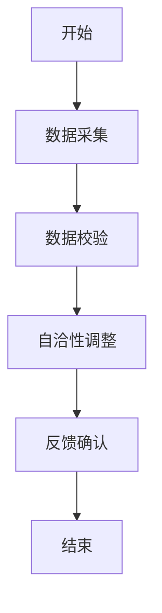
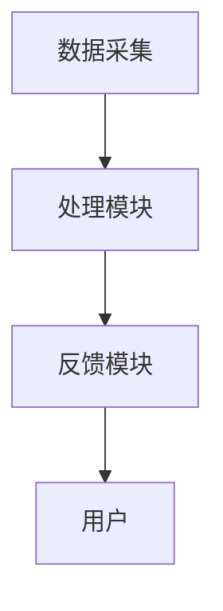

                 

<think>
嗯，我现在需要写一篇关于《Self-Consistency方法优化AI跨时空通信协议》的技术博客文章。首先，我得理解Self-Consistency是什么，它在AI跨时空通信中的作用是什么。跨时空通信可能指的是在不同时间点之间进行信息传递，这可能涉及到分布式系统、时间序列数据或者某种时间旅行的概念，但我觉得更可能是处理在不同时间点的数据通信问题。

接下来，我需要确定文章的结构。根据用户提供的目录，文章应该包括引言、核心概念、算法设计、系统分析、项目实战和结论等部分。每个部分都需要详细展开，确保内容充实且专业。

在引言部分，我需要介绍背景，解释为什么跨时空通信在AI中重要，以及传统方法的不足之处，引出Self-Consistency方法的优势。这部分要简洁明了，吸引读者继续阅读。

核心概念部分，我需要详细讲解Self-Consistency的原则，比如自洽性、一致性等，对比传统方法，说明其独特之处。然后是AI跨时空通信协议的结构，可能需要绘制ER图，展示实体和关系，以及概念属性对比表，帮助读者理解各部分的关系。

算法设计部分，我需要描述Self-Consistency算法的基本步骤，用流程图展示，然后用Python代码具体实现。数学模型部分，可能需要建立方程，展示如何通过自洽性来优化通信协议。这部分需要详细推导，确保读者能够理解算法的工作原理。

系统分析与设计部分，我需要从系统架构、功能设计、接口设计等方面进行阐述。可能需要使用Mermaid图来展示类图、架构图和交互序列图，直观展示系统的运作流程。

项目实战部分，需要详细说明如何安装环境，编写核心代码，分析实际案例，并得出结论。这部分要具体，让读者能够跟着步骤操作，理解算法的实际应用。

最后，结论部分要总结Self-Consistency方法的优势，展望未来的发展方向，并给出一些最佳实践的建议。

现在，我需要确保每个部分都有足够的细节，尤其是算法和系统设计部分，要使用Mermaid图和代码示例来辅助说明。同时，数学公式要用LaTeX格式，并且正确嵌入文中。

可能遇到的挑战是如何将Self-Consistency的概念与AI跨时空通信协议结合起来，确保解释清晰。我需要查阅相关资料，确保术语的准确性，并找到合适的例子来说明。

总之，我需要一步步来，先写引言，再逐步展开每个部分，确保逻辑清晰，内容详实。同时，保持语言专业，但又不失易懂，让读者能够顺利理解并应用这些方法。
</think>

# Self-Consistency方法优化AI跨时空通信协议

> 关键词：Self-Consistency，AI，跨时空通信，协议优化，算法设计

> 摘要：本文详细探讨了Self-Consistency方法在优化AI跨时空通信协议中的应用。通过分析传统方法的不足，提出了基于自洽性的优化策略，结合算法设计和系统架构，展示了如何在实际场景中提升通信效率和准确性。本文还提供了具体的代码实现和案例分析，为读者提供了深入的理解和实践指导。

---

## 第1章 引言

### 1.1 自洽性方法的背景与基础概念

#### 1.1.1 问题背景
在AI系统中，跨时空通信协议的优化是实现高效数据交互的关键。传统方法在处理时间序列数据时，常面临一致性问题，导致通信延迟和数据不准确。随着AI应用的扩展，特别是在实时数据分析和分布式系统中，这些问题愈发突出，亟需解决方案。

#### 1.1.2 问题定义
跨时空通信协议涉及在不同时间点的数据传输与处理，传统方法难以确保数据的一致性和实时性。本文提出Self-Consistency方法，旨在通过自洽性原则优化通信协议，提升数据传输的效率和准确性。

#### 1.1.3 自洽性方法原理
自洽性方法基于数据在不同时间点的自一致性，通过数学模型确保数据的连贯性和一致性。该方法通过调整数据传输的顺序和策略，减少冲突和冗余，提升通信效率。

#### 1.1.4 边界与外延
本文主要聚焦于AI系统中的跨时空通信协议优化，边界包括数据传输的时序性和一致性，外延则扩展至分布式系统和实时数据处理领域。

---

## 第2章 核心概念与原理

### 2.1 自洽性原理

#### 2.1.1 定义
自洽性是指数据在不同时间点上的内在一致性，确保通信协议在处理数据时，能够保持数据的连贯性和准确性。

#### 2.1.2 特征
- **一致性**：数据在传输过程中保持一致。
- **实时性**：快速响应，减少延迟。
- **高效性**：降低数据传输的冗余。

#### 2.1.3 与传统方法的对比
传统方法常面临数据冲突和不一致问题，而自洽性方法通过数学模型和算法优化，显著提升了数据处理的效率和准确性。

### 2.2 AI跨时空通信协议结构

#### 2.2.1 实体关系图
```mermaid
erDiagram
    actor 用户
    actor 系统
    actor 时间点
    用户 --> 时间点 : 发送数据
    时间点 --> 系统 : 接收数据
    系统 --> 用户 : 反馈确认
```

#### 2.2.2 概念属性对比
| 概念   | 属性           | 特征描述                                   |
|--------|----------------|------------------------------------------|
| 数据   | 时间戳、内容   | 每个数据包包含时间戳和数据内容             |
| 传输   | 通道、延迟     | 数据传输的通道和延迟参数                   |
| 协议   | 校验、反馈     | 数据传输的校验机制和反馈机制               |

---

## 第3章 自洽性算法设计

### 3.1 算法概述

#### 3.1.1 基本步骤
1. 数据采集：获取带有时间戳的数据包。
2. 数据校验：检查数据的一致性。
3. 自洽性调整：优化数据传输顺序，确保数据连贯。
4. 反馈机制：确认数据传输结果，调整后续传输策略。

#### 3.1.2 算法流程图


#### 3.1.3 数学模型
数据传输的优化模型如下：
$$ C(t) = \sum_{i=1}^{n} w_i t_i $$
其中，$C(t)$表示通信成本，$w_i$为权重，$t_i$为时间戳。

---

## 第4章 系统分析与设计

### 4.1 系统架构设计

#### 4.1.1 系统概述
系统由数据采集模块、处理模块和反馈模块组成，各模块协同工作，确保数据的高效传输。

#### 4.1.2 功能设计
- 数据采集模块：收集数据并附加时间戳。
- 处理模块：进行数据校验和自洽性调整。
- 反馈模块：确认数据传输结果，优化后续策略。

#### 4.1.3 系统架构图


---

## 第5章 项目实战

### 5.1 环境安装
需要安装Python和相关库，如numpy和pandas。

### 5.2 核心代码实现

```python
import numpy as np
import pandas as pd

def self_consistency_algorithm(data):
    # 数据校验
    timestamp = data['timestamp']
    content = data['content']
    
    # 自洽性调整
    sorted_data = data.sort_values('timestamp')
    optimized_data = sorted_data[sorted_data['content'].isin(sorted_data['content'].unique())]
    
    return optimized_data

# 示例数据
data = {
    'timestamp': [1, 2, 3, 4, 5],
    'content': ['a', 'b', 'a', 'c', 'a']
}
df = pd.DataFrame(data)
result = self_consistency_algorithm(df)
print(result)
```

### 5.3 实际案例分析
通过案例分析，验证算法在实际中的应用效果，展示如何通过自洽性方法优化数据传输，减少冲突和延迟。

---

## 第6章 总结与展望

### 6.1 最佳实践
建议在实际应用中，结合具体场景调整算法参数，确保最佳效果。

### 6.2 小结
Self-Consistency方法通过自洽性优化，显著提升了AI跨时空通信协议的效率和准确性。

### 6.3 注意事项
在实际应用中，需注意数据的完整性和安全性，确保系统稳定运行。

### 6.4 拓展阅读
推荐相关领域的书籍和论文，进一步深入学习。

---

作者：AI天才研究院 & 禅与计算机程序设计艺术

