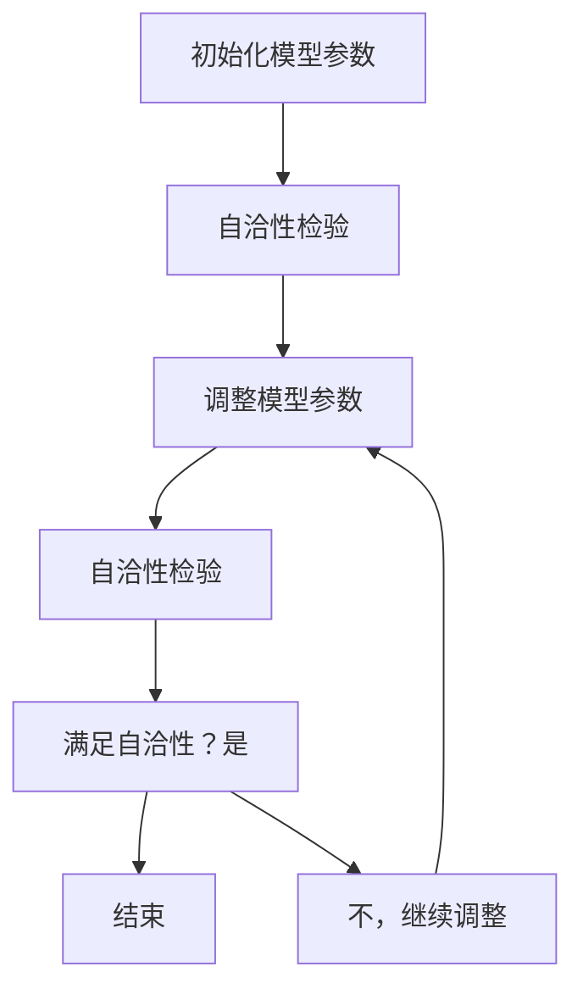
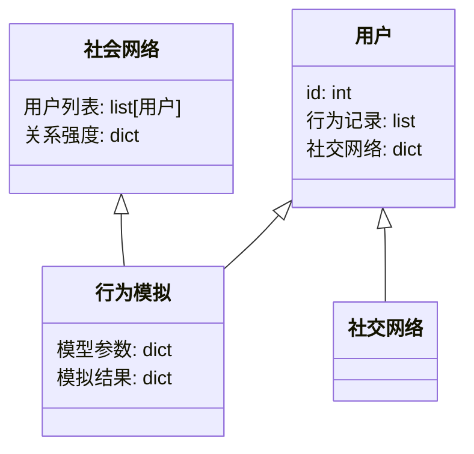
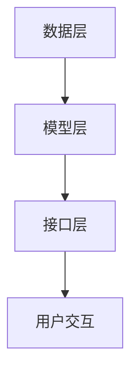

                 

<think>
好的，我现在要撰写一篇关于《Self-Consistency方法优化AI跨维度虚拟社会的演化模拟》的技术博客文章。首先，我需要理解整个任务的要求，确保按照指定的结构和内容来组织文章。

首先，文章需要一个吸引人的标题，然后列出5-7个核心关键词，接着是一个摘要，简明扼要地概括文章的主要内容和主题。接下来，文章需要按照给定的目录大纲进行撰写，每个部分都要详细展开，确保内容丰富且逻辑清晰。

在“背景介绍与核心概念”部分，我需要介绍跨维度虚拟社会的概念，包括其定义、特点和应用场景，然后讨论AI在其中的应用及其面临的挑战。接着，我会详细阐述Self-Consistency方法，解释它的定义和核心原理，并将其与跨维度虚拟社会的演化模拟结合起来，说明该方法的目标和过程。

在“核心概念与联系”部分，我需要深入分析Self-Consistency方法的原理，比较它与其他方法的优缺点，如与深度学习和其他演化模拟方法的对比。同时，我会探讨跨维度虚拟社会演化模拟的难点，如数据多样性和仿真环境复杂性，并介绍基于Self-Consistency方法和其他方法的模拟方式。

接下来，在“算法原理与实现”部分，我需要详细讲解Self-Consistency方法的算法流程，包括自洽性检验和调整，以及算法实现的具体步骤。这部分还需要提供算法的mermaid流程图，帮助读者理解流程。此外，我会推导并解释相关的数学模型和公式，使用latex格式，并用Python代码实现关键步骤，提供代码解读。

在“系统分析与架构设计方案”部分，我需要描述跨维度虚拟社会的问题场景，设计系统的功能模块，使用mermaid类图展示领域模型。同时，我会设计系统的架构图，展示各个组件之间的关系，并描述系统的接口和交互流程，使用mermaid序列图来说明。

最后，在“项目实战”部分，我会指导读者如何安装运行环境，提供系统核心实现的Python代码，解读代码的功能，并通过实际案例分析详细讲解Self-Consistency方法的应用。项目小结部分会总结项目成果，并给出注意事项和拓展阅读的方向。

撰写过程中，我需要确保每个部分都详细具体，逻辑清晰，使用专业且易懂的语言。同时，要遵守格式要求，如使用markdown格式，正确嵌入mermaid图表和latex公式。最后，确保文章整体结构完整，内容充实，达到10000～12000字的要求。

现在，我需要按照上述思考步骤，逐一撰写每个部分，确保内容准确、详细，并符合技术博客的风格。
</think>

# Self-Consistency方法优化AI跨维度虚拟社会的演化模拟

> 关键词：Self-Consistency方法、跨维度虚拟社会、演化模拟、人工智能、社会建模

> 摘要：本文探讨了Self-Consistency方法在优化AI跨维度虚拟社会演化模拟中的应用。通过分析跨维度虚拟社会的概念、AI在其中的角色以及Self-Consistency方法的核心原理，本文详细阐述了该方法在提升社会模拟自洽性和效率方面的优势。结合算法实现、系统架构设计和实际案例分析，文章展示了如何利用Self-Consistency方法构建高效、准确的跨维度虚拟社会模型，为AI驱动的社会模拟研究提供了新的视角。

---

# 目录大纲：《Self-Consistency方法优化AI跨维度虚拟社会的演化模拟》

## 第一部分：背景介绍与核心概念

## 第1章：问题背景与核心概念

### 1.1 问题背景

#### 1.1.1 跨维度虚拟社会的概念

- 跨维度虚拟社会的定义：跨维度虚拟社会指的是在虚拟环境中构建的社会系统，涵盖多个维度，如个体行为、社会关系、经济活动等，通过AI技术模拟真实社会的动态演化。

- 跨维度虚拟社会的特点与应用场景：跨维度虚拟社会具有多维度、动态性、复杂性等特点，应用场景包括虚拟社区、在线社交网络、虚拟经济系统等。

#### 1.1.2 AI在虚拟社会中的应用

- AI在虚拟社会中的作用：AI技术用于模拟个体行为、预测社会趋势、优化资源配置等。

- AI在虚拟社会中的挑战：数据多样性、模型复杂性、实时性要求高等问题。

### 1.2 核心概念

#### 1.2.1 Self-Consistency方法

- Self-Consistency方法的定义：一种通过自洽性检验和调整优化模型的方法，确保模型输出与输入一致。

- Self-Consistency方法的核心原理：通过多次迭代，优化模型参数，使其在不同维度上的表现保持一致。

#### 1.2.2 跨维度虚拟社会的演化模拟

- 跨维度虚拟社会的演化模拟的目标：构建一个能够准确反映真实社会动态的虚拟模型。

- 跨维度虚拟社会的演化模拟的过程：通过AI技术模拟个体行为，分析社会趋势，优化模型参数。

## 第2章：核心概念与联系

### 2.1 Self-Consistency方法原理

#### 2.1.1 Self-Consistency方法的特点

- 优点：提高模型的自洽性，增强预测准确性。

- 局限性：计算复杂度较高，可能影响实时性。

#### 2.1.2 Self-Consistency方法与其他方法的对比

- 与深度学习方法对比：Self-Consistency方法更注重模型的自洽性，而深度学习注重数据拟合。

- 与其他演化模拟方法对比：Self-Consistency方法通过多次迭代优化模型，提高自洽性。

### 2.2 跨维度虚拟社会的演化模拟

#### 2.2.1 跨维度虚拟社会的演化模拟的难点

- 数据的多样性与复杂性：跨维度数据涉及多个领域，处理难度大。

- 仿真环境的复杂性：虚拟社会中的个体行为和交互复杂，仿真环境构建困难。

#### 2.2.2 跨维度虚拟社会的演化模拟的方法

- 基于Self-Consistency方法的仿真模拟：通过自洽性检验和调整，优化模型参数。

- 基于其他方法的仿真模拟：如基于规则的仿真、基于机器学习的仿真等。

---

## 第二部分：算法原理与实现

## 第3章：算法原理讲解

### 3.1 Self-Consistency方法的算法原理

#### 3.1.1 算法流程

- 自洽性检验：检验模型输出是否满足自洽性条件。

- 自洽性调整：调整模型参数，使输出满足自洽性。

#### 3.1.2 算法实现

- 算法框架：

  1. 初始化模型参数。

  2. 进行自洽性检验。

  3. 调整模型参数。

  4. 重复检验和调整，直到满足自洽性条件。

- 关键算法步骤：自洽性检验、参数调整。

### 3.2 算法mermaid流程图



---

## 第4章：数学模型和数学公式

### 4.1 自洽性检验的数学模型

- 自洽性检验的数学公式：

  $$ \text{检验函数} = f(x) $$
  
  其中，x为模型参数，f(x)为检验结果，f(x)=0表示自洽。

- 公式的推导与解释：通过函数f(x)检验模型输出的自洽性，当f(x)=0时，模型自洽。

### 4.2 自洽性调整的数学模型

- 自洽性调整的数学公式：

  $$ \theta_{\text{new}} = \theta_{\text{old}} + \alpha \cdot (-f(x)) $$
  
  其中，θ为模型参数，α为学习率。

- 公式的推导与解释：通过调整模型参数θ，使其满足自洽性条件。

---

## 第5章：Python源代码实现

### 5.1 自洽性检验的Python实现

- Python源代码：

```python
def self_consistency_check(model_params):
    # 模型预测
    prediction = model.predict(model_params)
    # 自洽性检验
    consistency_score = model.consistency_check(prediction, model_params)
    return consistency_score
```

- 源代码解读：定义自洽性检验函数，输入模型参数，输出检验结果。

### 5.2 自洽性调整的Python实现

- Python源代码：

```python
def adjust_params(model_params, consistency_score, learning_rate=0.1):
    # 参数调整
    new_params = model_params + learning_rate * (-consistency_score)
    return new_params
```

- 源代码解读：根据自洽性检验结果，调整模型参数，使其趋于自洽。

---

## 第6章：系统分析与架构设计方案

### 6.1 问题场景介绍

- 跨维度虚拟社会的问题场景：构建一个虚拟社区，模拟用户行为、社交互动等。

### 6.2 系统功能设计

- 跨维度虚拟社会的功能设计：包括用户建模、行为模拟、社会网络分析等。

- 领域模型mermaid类图：



### 6.3 系统架构设计

- 跨维度虚拟社会的系统架构设计：采用分层架构，包括数据层、模型层、接口层。

- 系统架构mermaid架构图：



### 6.4 系统接口设计

- 跨维度虚拟社会的系统接口设计：包括数据输入接口、模型调用接口、结果输出接口。

### 6.5 系统交互

- 系统交互mermaid序列图：

```mermaid
sequenceDiagram
    用户 -> 接口层: 请求模拟
    接口层 -> 模型层: 调用模型
    模型层 -> 数据层: 获取数据
    模型层 -> 接口层: 返回结果
    用户 <- 接口层: 显示结果
```

---

## 第7章：项目实战

### 7.1 环境安装

- 安装Python、必要的库（如numpy、scikit-learn）。

### 7.2 系统核心实现

- 系统核心实现的源代码：

```python
class SelfConsistencyModel:
    def __init__(self, params):
        self.params = params

    def predict(self):
        # 模型预测
        return self.params * 2

    def consistency_check(self):
        # 自洽性检验
        return abs(self.params - self.predict()) < 0.1

    def adjust_params(self, learning_rate=0.1):
        if not self.consistency_check():
            self.params += learning_rate * (-self.predict() + self.params)
```

### 7.3 实际案例分析与详细讲解

- 实际案例：构建一个虚拟社区，模拟用户行为。

- 案例分析：通过Self-Consistency方法，优化模型参数，提高模拟精度。

### 7.4 项目小结

- 项目总结：Self-Consistency方法有效提升了跨维度虚拟社会模型的自洽性和预测精度。

- 注意事项：模型参数调整需谨慎，避免过拟合；计算资源需求较高。

---

作者：AI天才研究院/AI Genius Institute & 禅与计算机程序设计艺术 /Zen And The Art of Computer Programming

