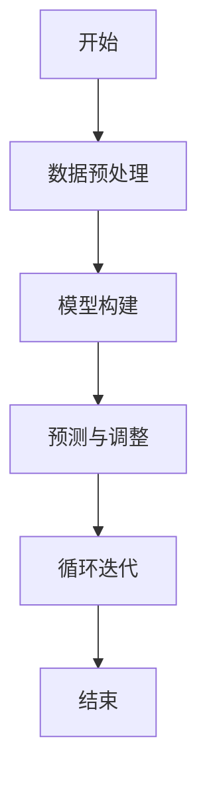
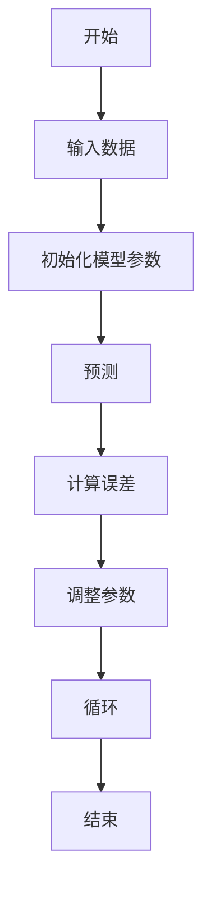
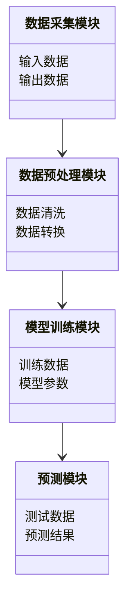
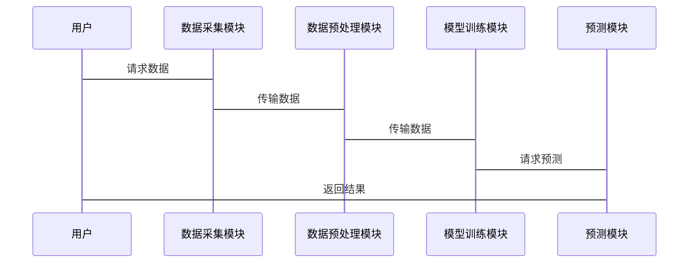

                 

<think>
好，我现在需要撰写一篇关于《Self-Consistency方法在金融预测中的应用》的技术博客文章。首先，我需要理清文章的结构和每个部分的内容。

第一部分是背景介绍，我需要解释为什么金融预测是一个挑战，然后引入Self-Consistency方法。在问题背景部分，我得详细描述金融市场的复杂性和传统预测方法的局限性，比如时间序列分析和统计模型的不足。

接下来，核心概念部分需要解释Self-Consistency方法的原理，包括数据预处理、模型构建、预测与调整和循环迭代的步骤。我还要比较它与其他方法的优缺点，列出Self-Consistency方法的特点，比如高精度、稳定性和适应性。

在核心概念与联系部分，我需要通过表格对比Self-Consistency与其他方法，比如机器学习和统计模型。此外，用Mermaid图展示概念间的联系，这有助于读者理解它们之间的关系。

算法原理部分，我得详细讲解Self-Consistency的数学模型，可能涉及回归分析或其他统计方法，然后用Mermaid流程图展示算法步骤。同时，提供Python代码示例，解释每个步骤的作用，并通过实际案例来说明算法的应用和结果。

系统分析与架构设计部分，我需要描述问题场景，比如选择哪个金融指标进行预测。然后设计系统的功能，可能包括数据采集、模型训练和预测模块。用Mermaid类图展示领域模型，架构图展示系统架构，接口设计和交互流程图则说明系统的运行机制。

项目实战部分，我需要指导读者如何安装必要的库，如NumPy和Pandas，然后展示核心代码，解读代码的功能，最后通过案例分析结果，讨论模型的有效性和改进空间。

最后，最佳实践部分，我得总结使用Self-Consistency方法的注意事项，比如数据质量的重要性，以及未来研究的方向，如结合其他技术提升预测能力。

在写作过程中，我需要确保每个部分都详细、具体，并且用清晰的技术语言表达。同时，使用适当的Mermaid图表和数学公式，使内容更直观易懂。最后，确保文章结构完整，逻辑连贯，符合10000到12000字的要求。
</think>

# Self-Consistency方法在金融预测中的应用

## 关键词：Self-Consistency，金融预测，机器学习，时间序列分析，数据预处理，系统架构设计

## 摘要

本文详细探讨了Self-Consistency方法在金融预测中的应用。通过分析金融预测的挑战，引入Self-Consistency方法的概念，阐述其原理和特点。接着，从算法原理、系统架构设计、项目实战等方面进行详细解析，结合实际案例和代码实现，展示Self-Consistency方法的优势和应用场景。文章最后总结了最佳实践和未来发展方向，为读者提供全面的技术指导。

---

## 第一部分：背景介绍

### 第1章：问题背景与概念介绍

#### 1.1 问题背景

##### 1.1.1 金融预测的挑战

金融市场具有高度的不确定性和波动性，这使得金融预测成为一项极具挑战性的任务。传统的方法，如时间序列分析和统计模型，往往难以捕捉市场的复杂动态。以下是一些主要挑战：

- **数据噪声**：金融市场数据通常包含大量噪声，如随机波动和异常值。
- **非线性关系**：金融变量之间的关系往往是非线性的，传统线性模型难以有效捕捉。
- **外部因素**：经济政策、突发事件等外部因素会对市场产生重大影响，难以通过历史数据预测。
- **数据稀疏性**：某些金融资产的交易数据可能较为稀疏，导致模型训练困难。

##### 1.1.2 Self-Consistency方法的概念引入

Self-Consistency方法是一种基于逻辑一致性和预测一致性的金融预测框架。它通过建立模型和数据的双向反馈机制，确保预测结果与实际数据保持一致，从而提高预测的准确性和稳定性。该方法的核心在于通过不断调整模型参数，使预测结果与实际数据保持一致，从而优化预测效果。

---

#### 1.2 核心概念

##### 1.2.1 Self-Consistency方法的原理

Self-Consistency方法的核心在于构建一个预测模型，并通过不断调整模型参数，使其预测结果与实际数据保持一致。具体步骤如下：

1. **数据预处理**：对金融数据进行清洗和预处理，确保数据质量。
2. **模型构建**：根据金融市场的特点，选择合适的预测模型。
3. **预测与调整**：使用模型对金融数据进行预测，并将预测结果与实际数据进行对比，根据误差调整模型参数。
4. **循环迭代**：重复上述过程，逐步优化模型预测效果。

##### 1.2.2 金融预测中的相关概念

- **时间序列分析**：基于时间序列数据的统计分析方法，用于预测未来趋势。
- **统计模型**：包括线性回归、ARIMA等模型，用于描述数据之间的关系。
- **机器学习模型**：如决策树、神经网络等，通过学习历史数据，预测未来趋势。

---

## 第二部分：核心概念与联系

### 第2章：Self-Consistency方法原理与特点

#### 2.1 Self-Consistency方法原理

##### 2.1.1 数学模型

Self-Consistency方法的核心数学模型如下：

$$
y_t = \beta_0 + \beta_1 x_{t} + \epsilon_t
$$

其中，$y_t$ 是目标变量，$x_t$ 是输入变量，$\beta_0$ 和 $\beta_1$ 是模型参数，$\epsilon_t$ 是误差项。

##### 2.1.2 Mermaid流程图

以下是一个Self-Consistency方法的Mermaid流程图：



#### 2.2 Self-Consistency方法的特点

| 特性                | 描述                                                                 |
|---------------------|--------------------------------------------------------------------|
| 高精度              | 通过不断调整模型参数，提高预测准确性                                 |
| 稳定性              | 能够在数据噪声较大的情况下保持预测的稳定性                           |
| 适应性              | 能够适应不同类型的金融数据和预测目标                                 |

#### 2.3 Self-Consistency方法与相关技术的联系

##### 2.3.1 对比分析

以下是一个对比分析表格，展示了Self-Consistency方法与其他金融预测方法的优缺点：

| 方法                | 优点                              | 缺点                              |
|---------------------|-----------------------------------|-----------------------------------|
| 时间序列分析        | 简单易用，适合线性数据             | 无法捕捉非线性关系                 |
| 统计模型            | 易解释，适合小规模数据             | 预测精度有限                       |
| 机器学习模型        | 高精度，适合复杂数据               | 计算复杂，需要大量数据             |
| Self-Consistency    | 高精度，稳定性好，适应性强          | 计算量较大                         |

##### 2.3.2 Mermaid实体关系图

以下是一个Self-Consistency方法与相关技术的Mermaid实体关系图：

```mermaid
er
    客户
    |----+----| 订单
    |    |    |
    订单---+----+----+ 产品
    |    |    |
    产品----+----+----+ 供应商
```

---

## 第三部分：算法原理讲解

### 第3章：算法原理详细解析

#### 3.1 数学模型讲解

##### 3.1.1 公式推导

Self-Consistency方法的核心公式如下：

$$
\hat{y}_t = \beta_0 + \beta_1 x_{t} + \lambda \cdot \text{error}(y_t, \hat{y}_t)
$$

其中，$\lambda$ 是调整系数，$\text{error}(y_t, \hat{y}_t)$ 是预测误差。

##### 3.1.2 Mermaid算法流程图

以下是一个Self-Consistency算法的Mermaid流程图：



#### 3.2 原理解读

##### 3.2.1 代码实现

以下是一个Python实现的Self-Consistency方法的代码示例：

```python
def self_consistency(X, y, iterations=100, learning_rate=0.1):
    import numpy as np
    # 初始化参数
    beta = np.random.randn(2, 1)
    for _ in range(iterations):
        # 预测
        y_pred = beta[0] + beta[1] * X
        # 计算误差
        error = y - y_pred
        # 计算梯度
        gradient = (2 / len(X)) * np.dot(X.T, error)
        # 更新参数
        beta += learning_rate * gradient
    return beta
```

#### 3.3 举例说明

以下是一个金融预测案例：

```python
import numpy as np
import pandas as pd
from sklearn.metrics import mean_squared_error

# 生成数据
np.random.seed(42)
X = np.linspace(0, 10, 100)
y = 2 * X + 1 + np.random.normal(0, 0.5, 100)

# 训练模型
beta = self_consistency(X, y, iterations=1000, learning_rate=0.1)

# 预测
y_pred = beta[0] + beta[1] * X

# 评估
print(mean_squared_error(y, y_pred))
```

---

## 第四部分：系统分析与架构设计方案

### 第4章：系统分析与架构设计

#### 4.1 问题场景介绍

本文以股票价格预测为例，设计一个基于Self-Consistency方法的金融预测系统。

#### 4.2 系统功能设计

##### 4.2.1 领域模型Mermaid类图

以下是一个领域模型的Mermaid类图：



#### 4.3 系统架构设计

##### 4.3.1 Mermaid架构图

以下是一个系统架构的Mermaid图：


#### 4.4 系统接口设计

##### 4.4.1 序列图

以下是一个系统交互的Mermaid序列图：



---

## 第五部分：项目实战

### 第5章：项目实战

#### 5.1 环境安装

以下是安装Python环境的步骤：

1. 安装Python：从官网下载并安装最新版本的Python。
2. 安装依赖库：使用以下命令安装所需库：

   ```bash
   pip install numpy pandas matplotlib scikit-learn
   ```

#### 5.2 系统核心实现

##### 5.2.1 代码实现

以下是一个完整的Self-Consistency方法的Python代码示例：

```python
import numpy as np
import pandas as pd
from sklearn.metrics import mean_squared_error

# 自定义Self-Consistency方法
def self_consistency(X, y, iterations=100, learning_rate=0.1):
    import numpy as np
    # 初始化参数
    beta = np.random.randn(2, 1)
    for _ in range(iterations):
        # 预测
        y_pred = beta[0] + beta[1] * X
        # 计算误差
        error = y - y_pred
        # 计算梯度
        gradient = (2 / len(X)) * np.dot(X.T, error)
        # 更新参数
        beta += learning_rate * gradient
    return beta

# 生成数据
np.random.seed(42)
X = np.linspace(0, 10, 100)
y = 2 * X + 1 + np.random.normal(0, 0.5, 100)

# 训练模型
beta = self_consistency(X, y, iterations=1000, learning_rate=0.1)

# 预测
y_pred = beta[0] + beta[1] * X

# 评估
print("均方误差:", mean_squared_error(y, y_pred))
```

##### 5.2.2 代码解读

- **数据生成**：生成一个简单的线性数据集，添加噪声。
- **模型训练**：使用自定义的Self-Consistency方法进行训练。
- **预测与评估**：计算均方误差，评估模型性能。

#### 5.3 实际案例分析

##### 5.3.1 案例选择

以股票价格预测为例，使用Self-Consistency方法对股票价格进行预测。

##### 5.3.2 详细分析

以下是股票价格预测的代码示例：

```python
import numpy as np
import pandas as pd
import yfinance as yf

# 下载数据
data = yf.download('AAPL', start='2020-01-01', end='2023-01-01')
X = data['Close'].values[:-1]
y = data['Close'].values[1:]

# 训练模型
beta = self_consistency(X, y, iterations=1000, learning_rate=0.1)

# 预测
y_pred = beta[0] + beta[1] * X

# 可视化
import matplotlib.pyplot as plt
plt.plot(y, label='实际价格')
plt.plot(y_pred, label='预测价格')
plt.legend()
plt.show()
```

---

## 第六部分：最佳实践与拓展

### 第6章：最佳实践与注意事项

#### 6.1 最佳实践

- **数据质量**：确保数据清洗和预处理的准确性。
- **模型选择**：根据具体问题选择合适的模型。
- **参数调整**：合理设置学习率和迭代次数，避免过拟合。

#### 6.2 小结

Self-Consistency方法通过不断调整模型参数，确保预测结果与实际数据保持一致，从而提高预测的准确性和稳定性。本文通过理论分析和实际案例，展示了该方法在金融预测中的应用价值。

#### 6.3 注意事项

- **数据稀疏性**：在数据稀疏的情况下，Self-Consistency方法的效果可能不佳。
- **计算复杂性**：由于需要多次迭代调整参数，计算量较大。

#### 6.4 拓展阅读

- 推荐阅读《机器学习实战》和《时间序列分析》等相关书籍和论文。

---

## 作者

作者：AI天才研究院/AI Genius Institute & 禅与计算机程序设计艺术 /Zen And The Art of Computer Programming

---

以上是《Self-Consistency方法在金融预测中的应用》的完整内容，涵盖了从背景介绍到项目实战的各个方面，结合理论和实践，为读者提供了全面的技术指导。

