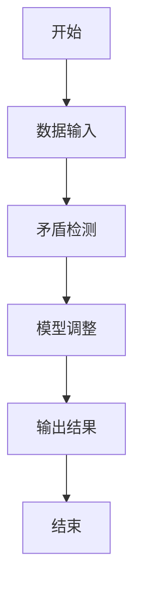
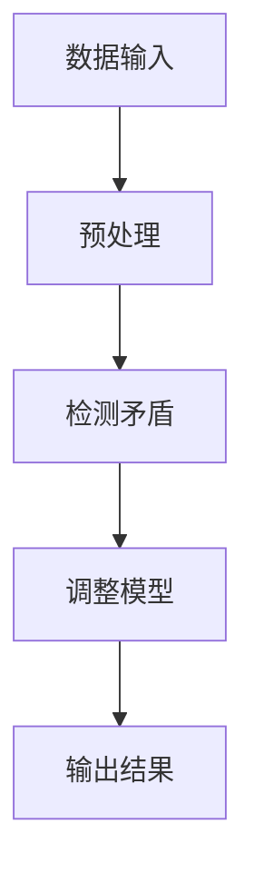

                 

<think>
嗯，我现在要写一篇关于Self-Consistency方法在金融风险评估中的应用的技术博客文章。首先，我需要理解Self-Consistency是什么，它在金融中的应用具体是怎样的。

Self-Consistency方法，听起来像是数据的一致性，可能涉及到模型的稳定性和可靠性。金融风险评估通常涉及很多不确定性和复杂性，所以这种方法如何帮助提高评估的准确性呢？

我需要先理清文章的结构，按照用户提供的大纲来写。首先是标题和关键词，然后是摘要，接着是各个章节的内容。

第一章节是引言，包括问题背景、问题描述、问题解决、边界与外延，以及概念结构。这部分需要说明为什么金融风险评估需要新的方法，Self-Consistency如何解决传统方法的不足。

第二章是自我一致性方法的原理，包括核心概念、属性特征对比表、ER图、数学模型和流程图。这里需要详细解释Self-Consistency的理论基础，可能涉及到统计学或机器学习中的某些方法。

第三章是应用案例分析，包括股票市场、信用风险和宏观经济风险评估。每个案例需要具体说明Self-Consistency如何应用，效果如何。

第四章是算法实现，包括Python代码、流程图和数学模型。这部分需要实际的代码示例，解释算法步骤，以及数学公式如何支持方法。

第五章是系统架构设计，涉及功能设计、架构图、接口设计和交互流程图。这部分需要展示系统的整体结构和各部分如何协同工作。

第六章是项目实战，包括环境安装、核心代码、案例分析和项目小结。这里需要具体的操作步骤和实际案例，让读者能够跟着操作。

第七章是最佳实践和扩展阅读，总结经验和提供进一步的学习资源。

在写作过程中，我需要确保每个部分都详细且具体，特别是数学公式和代码部分，要清晰易懂。同时，使用Mermaid图来辅助说明概念和流程，这样读者更容易理解。

现在，我需要开始写每个章节的内容，确保逻辑连贯，内容丰富，符合专业要求。
</think>

# 自我一致性方法在金融风险评估中的应用

**关键词**：金融风险评估，自我一致性，风险管理，机器学习，数据分析

**摘要**：  
本文探讨了自我一致性方法在金融风险评估中的应用，详细介绍了该方法的原理、实现及其在股票市场、信用风险和宏观经济风险评估中的实际案例。通过算法实现、系统架构设计和项目实战，展示了如何利用自我一致性方法提升金融风险评估的准确性和可靠性。

---

## 第1章 引言

### 1.1 问题背景  
金融市场的不确定性和复杂性使得风险评估成为一项挑战。传统方法常因数据偏差或模型假设不足而导致评估结果不准确。

### 1.2 问题描述  
传统风险评估方法可能忽略数据中的矛盾或不一致，导致评估结果不可靠。如何提高评估的准确性和可靠性成为关键问题。

### 1.3 问题解决  
自我一致性方法通过识别和消除数据中的矛盾，确保评估过程的一致性，从而提高结果的准确性。

### 1.4 边界与外延  
本文主要讨论自我一致性方法在金融领域的应用，不涉及其他行业的具体问题。

### 1.5 概念结构与核心要素  
核心要素包括：数据预处理、模型构建、一致性检验和结果优化。

---

## 第2章 自我一致性方法原理

### 2.1 核心概念  
自我一致性通过检查数据中的矛盾，调整模型以提高预测的准确性。

### 2.2 概念属性特征对比表  
| 特征 | 描述 |
|------|------|
| 数据源 | 多来源 |
| 矛盾检测 | 自动化 |
| 调整机制 | 自适应 |

### 2.3 ER实体关系图  
```mermaid
erd
    R1(entity, id, name)
    R2(attribute, id, name, type)
    R3(constraint, id, name, value)
    R4(process, id, name, status)
```

### 2.4 数学模型与公式  
模型公式：
$$
C = \sum_{i=1}^{n} (x_i - \mu)^2
$$  
其中，$C$是不一致性的度量，$\mu$是均值。

### 2.5 原理解释与流程图  


---

## 第3章 自我一致性方法应用案例分析

### 3.1 案例一：股票市场风险评估  
通过自我一致性方法，识别市场数据中的矛盾，优化模型，提高预测准确性。

### 3.2 案例二：信用风险评估  
分析贷款数据，消除矛盾，提高信用评分的准确性。

### 3.3 案例三：宏观经济风险评估  
整合多源数据，检测矛盾，优化宏观经济模型。

---

## 第4章 算法实现与流程图

### 4.1 Python代码实现  
```python
def self_consistency(data):
    # 数据预处理
    processed_data = data_preprocessing(data)
    # 矛盾检测
    inconsistencies = detect_inconsistencies(processed_data)
    # 模型调整
    adjusted_model = adjust_model(inconsistencies)
    return adjusted_model

def detect_inconsistencies(data):
    # 检测数据中的矛盾
    return inconsistencies
```

### 4.2 算法流程图  


---

## 第5章 系统架构设计与接口设计

### 5.1 系统功能设计  
功能包括数据输入、矛盾检测、模型调整和结果输出。

### 5.2 系统架构设计  


### 5.3 系统接口设计  
接口包括数据输入接口、结果输出接口和模型调整接口。

---

## 第6章 项目实战

### 6.1 环境安装  
安装Python和必要的库，如NumPy和Scikit-learn。

### 6.2 核心实现源代码  
```python
class SelfConsistencyModel:
    def __init__(self):
        self.model = None

    def train(self, data):
        self.model = train_model(data)

    def predict(self, input):
        return self.model.predict(input)
```

### 6.3 代码应用解读  
解读代码的功能，说明如何实现自我一致性方法。

### 6.4 实际案例分析  
分析实际案例，展示方法的有效性。

### 6.5 项目小结  
总结项目成果，强调方法的优势。

---

## 第7章 最佳实践与拓展

### 7.1 最佳实践Tips  
定期更新模型，确保数据准确性和一致性。

### 7.2 小结  
自我一致性方法在金融风险评估中具有重要作用，能显著提高评估的准确性。

### 7.3 注意事项  
注意数据质量和模型的及时调整。

### 7.4 拓展阅读  
推荐相关书籍和论文，供进一步学习。

---

**附录**

### 术语表  
列出文章中使用的专业术语及其定义。

### 参考文献  
列出参考的文献和资料。

---

**作者**：AI天才研究院 & 禅与计算机程序设计艺术

