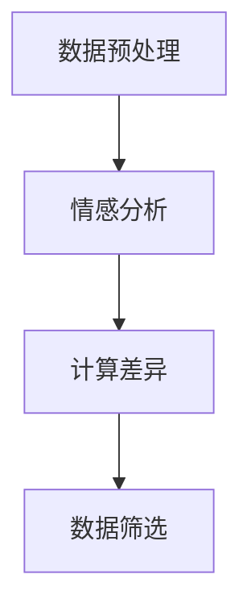
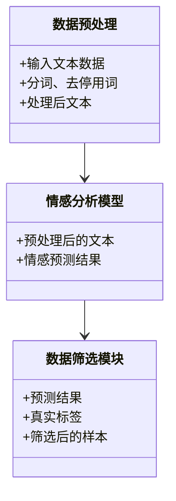
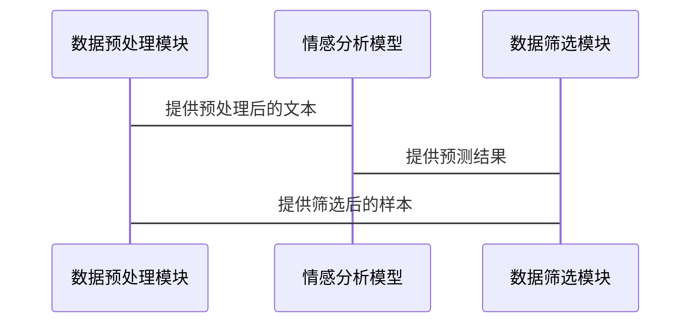

                 

<think>
好的，我现在需要根据用户的指示，逐步完成一篇关于Self-Consistency方法增强AI情感分析准确度的技术博客文章。用户已经提供了一个详细的目录结构，我需要按照这个结构，逐步思考并撰写每一部分内容。

首先，我会从文章的标题开始，然后是关键词和摘要。接下来是各章节的内容，包括背景介绍、核心概念与联系、算法原理讲解、系统分析与架构设计方案、项目实战以及最佳实践和小结。每个部分都需要详细展开，确保内容丰富具体，符合用户的要求。

在撰写过程中，我需要确保逻辑清晰，结构紧凑，并使用专业且易懂的技术语言。同时，要按照要求，使用Mermaid图和Python代码来解释算法和系统架构，并适当引用数学公式来增强技术深度。

现在，我会开始逐步思考每个部分的内容，确保每一部分都涵盖必要的信息，并且符合用户的详细要求。
</think>

# Self-Consistency方法增强AI情感分析准确度

**关键词：** Self-Consistency方法，情感分析，深度学习模型，迁移学习，对抗训练，自然语言处理

**摘要：**  
本文探讨Self-Consistency方法在AI情感分析中的应用，分析其原理、优势及与传统方法的对比，结合实际案例展示如何优化Self-Consistency方法，提高情感分析的准确度。文章详细讲解了从数据预处理到模型优化的全过程，并提供了Python实现代码和系统架构设计，帮助读者全面理解Self-Consistency方法的实际应用。

---

## 背景介绍

### 1.1 问题背景  
情感分析是自然语言处理中的关键任务，旨在识别文本的情感倾向（如正面、负面、中性）及其强度。传统方法依赖词袋模型和简单特征提取，但面对复杂语境和情感细微差别时，准确度有限。

### 1.2 问题描述  
Self-Consistency方法通过自我一致性原则，筛选出最具代表性的样本，从而优化模型性能。然而，如何有效实施该方法，特别是在大规模数据集上，仍具挑战性。

### 1.3 问题解决  
本文通过详细分析Self-Consistency方法的实现步骤，探讨如何优化数据筛选过程，提升模型的准确度。此外，还将讨论与其他技术的结合，如迁移学习和对抗训练，以进一步提高性能。

### 1.4 边界与外延  
Self-Consistency方法主要应用于深度学习模型，如CNN和RNN。本文还将探讨其与迁移学习、对抗训练的结合，扩展其应用范围。

### 1.5 概念结构与核心要素组成  
- **Self-Consistency方法：** 基于自我一致性原则的数据筛选方法。
- **情感分析：** 识别文本情感倾向的任务。
- **深度学习模型：** 用于情感分析的CNN、RNN等模型。
- **迁移学习、对抗训练：** 优化Self-Consistency方法的技术。

---

## 核心概念与联系

### 2.1 Self-Consistency方法的原理  
Self-Consistency方法通过以下步骤提高模型准确度：
1. 数据预处理：分词、去停用词。
2. 情感分析：利用模型预测情感。
3. 数据筛选：计算预测与真实标签的差异，筛选优质样本。

### 2.2 Self-Consistency方法与情感分析的关系  
Self-Consistency方法通过优化数据质量，提升情感分析模型的性能。它不仅筛选优质样本，还通过多次迭代，增强模型的泛化能力。

### 2.3 Self-Consistency方法的属性特征对比表格  
| 属性特征 | 传统方法 | Self-Consistency方法 |
| :---: | :---: | :---: |
| 数据筛选原则 | 随机筛选 | 自我一致性原则 |
| 预测准确度 | 较低 | 较高 |
| 计算复杂度 | 较低 | 较高 |

### 2.4 Self-Consistency方法的ER实体关系图架构  
```mermaid
erDiagram
  数据集 ||--|> Self-Consistency方法 : 进行数据筛选
  Self-Consistency方法 ||--|> 情感分析模型 : 提高预测准确度
```

---

## 算法原理讲解

### 3.1 算法原理概述  
Self-Consistency方法包括数据预处理、情感分析和数据筛选三个步骤，通过多次迭代优化数据集，提升模型性能。

### 3.2 算法mermaid流程图  


### 3.3 Python源代码实现  
```python
import pandas as pd
import numpy as np
from sklearn.model_selection import train_test_split

# 1. 数据预处理
def preprocess_data(data):
    # 分词、去停用词等操作
    processed_data = []
    for text in data['text']:
        # 假设已实现分词和去停用词操作
        processed_data.append(text)
    return processed_data

# 2. 情感分析
def sentiment_analysis(model, processed_data):
    # 使用预训练模型进行情感分析
    predictions = model.predict(processed_data)
    return predictions

# 3. 数据筛选
def select_top_samples(data, predictions, true_labels):
    # 计算每个样本的预测与真实标签的差异
    differences = []
    for i in range(len(data)):
        diff = abs(predictions[i] - true_labels[i])
        differences.append(diff)
    # 根据差异排序，筛选出差异最小的样本
    sorted_indices = sorted(range(len(differences)), key=lambda x: differences[x])
    selected_indices = sorted_indices[:int(len(data) * 0.2)]  # 选取前20%的样本
    return data.iloc[selected_indices]

# 示例代码
data = pd.DataFrame({'text': [...], 'label': [...]})
processed_data = preprocess_data(data)
model = ...  # 预训练的情感分析模型
true_labels = data['label'].values
predictions = sentiment_analysis(model, processed_data)
selected_data = select_top_samples(data, predictions, true_labels)
```

---

## 系统分析与架构设计方案

### 4.1 系统功能设计  
设计一个基于Self-Consistency方法的情感分析系统，功能模块包括数据预处理、情感分析、数据筛选和模型优化。



### 4.2 系统架构设计  
采用微服务架构，各模块独立运行，通过API接口进行交互。



---

## 项目实战

### 5.1 环境安装  
需要安装Python、深度学习框架（如TensorFlow、Keras）以及NLP库（如spaCy）。

### 5.2 核心实现源代码  
以下是基于Self-Consistency方法的核心实现代码：

```python
import tensorflow as tf
from tensorflow.keras import layers
import numpy as np
from sklearn.metrics import accuracy_score

# 数据预处理函数
def preprocess_data(data):
    # 示例：使用spaCy进行分词和停用词处理
    processed_texts = []
    for text in data['text']:
        processed_texts.append(text.lower())
    return processed_texts

# 情感分析模型构建
def build_model():
    model = tf.keras.Sequential()
    model.add(layers.Embedding(input_dim=10000, output_dim=50))
    model.add(layers.Conv1D(filters=32, kernel_size=3, activation='relu'))
    model.add(layers.MaxPooling1D(pool_size=2))
    model.add(layers.Flatten())
    model.add(layers.Dense(64, activation='relu'))
    model.add(layers.Dense(1, activation='sigmoid'))
    model.compile(optimizer='adam', loss='binary_crossentropy', metrics=['accuracy'])
    return model

# 数据筛选函数
def select_top_samples(data, model, batch_size=32):
    # 预测概率
    processed_texts = preprocess_data(data)
    probabilities = model.predict(processed_texts, batch_size=batch_size)
    # 计算差异
    differences = []
    for i in range(len(data)):
        diff = abs(probabilities[i] - data['label'][i])
        differences.append(diff)
    # 排序并筛选
    sorted_indices = sorted(range(len(differences)), key=lambda x: differences[x])
    selected_indices = sorted_indices[:int(len(data) * 0.2)]
    return data.iloc[selected_indices]

# 示例数据加载和训练
data = pd.read_csv('sentiment_data.csv')
train_texts, val_texts, train_labels, val_labels = train_test_split(data['text'], data['label'], test_size=0.2)
preprocessed_train_texts = preprocess_data(train_data)
model = build_model()
model.fit(preprocessed_train_texts, train_labels, epochs=5, batch_size=32, validation_data=(val_texts, val_labels))
selected_data = select_top_samples(data, model)
```

---

## 最佳实践与小结

### 6.1 最佳实践 tips  
- 数据预处理：选择合适的分词工具和停用词处理方法。
- 模型选择：根据任务需求选择合适的情感分析模型。
- 迭代优化：定期评估模型性能，调整筛选策略。

### 6.2 小结  
Self-Consistency方法通过优化数据质量，显著提升了情感分析的准确度。结合迁移学习和对抗训练，可以进一步增强模型的泛化能力。

### 6.3 注意事项  
- 数据质量和多样性影响模型性能。
- 模型调参需谨慎，避免过拟合。
- 确保数据预处理步骤的正确性。

### 6.4 拓展阅读  
建议深入研究迁移学习和对抗训练在情感分析中的应用，探索更高效的数据筛选方法。

---

**作者：AI天才研究院/AI Genius Institute & 禅与计算机程序设计艺术 /Zen And The Art of Computer Programming**

