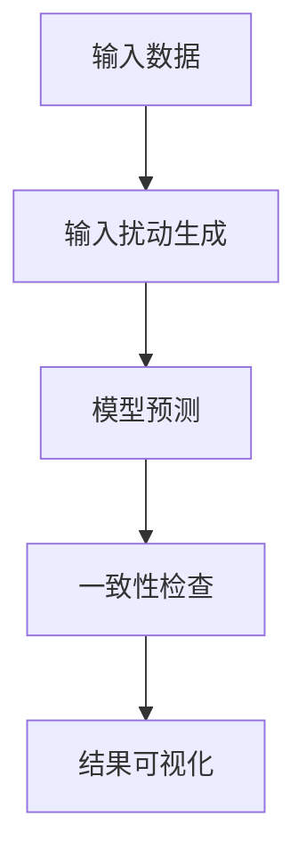
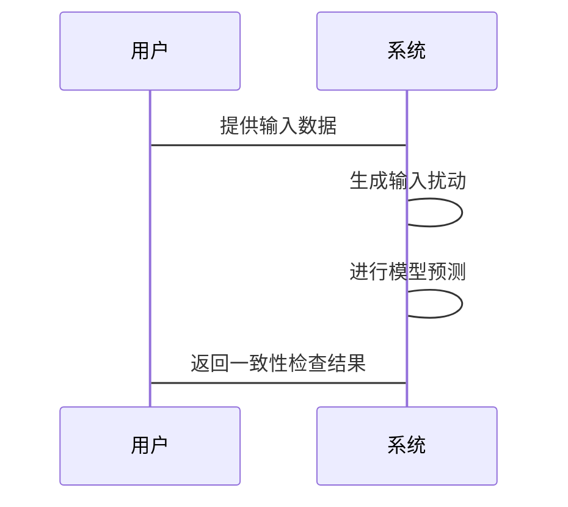

                 

<think>
嗯，用户希望我写一篇关于《Self-Consistency方法对AI可解释性的影响》的技术博客文章。看起来他需要一个结构清晰、内容详实的文章，包含目录、关键词、摘要，以及各个章节的具体内容。

首先，我需要理解Self-Consistency方法是什么。这方法在AI中用于提高模型的可解释性，可能涉及到一致性检查，确保模型在不同输入下的输出是连贯和一致的。可解释性是当前AI领域的热点问题，特别是在需要决策透明的应用场景，比如医疗、金融等。

接下来，用户给的目录结构已经设计好了，我需要按照这个结构来填充内容。文章开头要有标题、关键词和摘要。关键词可能包括Self-Consistency、AI可解释性、算法原理、系统架构、项目实战等。摘要需要简明扼要地概述文章内容。

然后，进入各个章节。第一部分是背景介绍，需要解释AI可解释性的重要性，以及Self-Consistency方法的基本概念和历史发展。这部分要让读者明白为什么可解释性重要，以及Self-Consistency是如何提出的。

第二部分是核心概念与联系，这里需要详细讲解Self-Consistency的核心原理，与其它方法的对比，以及它在AI可解释性中的作用。可能需要一个对比表格，展示不同方法的优缺点。

第三部分是算法原理，这里需要用数学公式和mermaid流程图来说明Self-Consistency的具体实现。比如，如何通过一致性检查来优化模型，数学模型如何构建，算法步骤如何进行。

第四部分是系统分析与架构设计，这部分需要设计系统架构图，展示各个模块之间的关系，接口设计和交互流程。可能用mermaid来画类图、架构图和序列图。

第五部分是项目实战，要给出具体的实现代码，环境配置，代码解读，实际案例分析。这样读者可以实际操作，加深理解。

最后，总结部分要回顾Self-Consistency的影响，给出最佳实践的建议，注意事项，以及拓展阅读的资料。

在写作过程中，需要注意逻辑清晰，每个章节之间要有自然的过渡。同时，语言要专业但不晦涩，确保读者能够理解。特别是数学公式和图表，要准确无误，解释到位。

可能遇到的挑战是如何将复杂的算法原理用简单易懂的语言解释出来，同时保持专业性。另外，系统架构部分需要详细描述，确保读者能理解系统的构成和交互过程。

总的来说，我需要按照用户提供的大纲，逐步展开每个部分的内容，确保每一章节都详尽具体，满足用户的字数和格式要求。同时，要确保文章的整体连贯性和深度，让读者能够全面理解Self-Consistency方法对AI可解释性的影响。
</think>

# 《Self-Consistency方法对AI可解释性的影响》

---

## 关键词：
Self-Consistency、AI可解释性、算法原理、系统架构、项目实战

---

## 摘要：
本文探讨了Self-Consistency方法在AI可解释性中的应用及其影响。通过分析Self-Consistency的核心原理、算法实现、系统架构以及实际案例，本文揭示了该方法如何提升AI模型的可解释性，并为AI领域的研究和实践提供了新的视角。

---

## 正文：

### 第一部分：背景介绍

#### 第1章：问题背景

##### 1.1 AI可解释性的重要性
随着AI技术的快速发展，其应用范围不断扩大，从医疗诊断到金融决策，再到自动驾驶，AI系统在人们生活中的作用越来越重要。然而，AI系统的“黑箱”特性使得人们难以理解其决策过程，这在关键时刻可能导致信任缺失和责任追究困难。因此，AI的可解释性成为一个重要研究方向。

- **AI不可解释性的问题**：复杂的模型（如深度神经网络）通常难以被人类理解，导致用户对AI决策的不信任。
- **可解释性在AI应用中的重要性**：可解释性是AI系统被广泛接受和信任的基础，尤其是在医疗、法律和金融等领域，用户需要了解AI的决策逻辑。

##### 1.2 Self-Consistency方法概述
Self-Consistency方法是一种通过一致性检查来提升AI模型可解释性的技术。其核心思想是通过多次扰动输入数据，确保模型在一致性和稳定性上的表现。

- **Self-Consistency方法的基本概念**：通过多次输入扰动，检查模型输出的稳定性，从而确保模型的决策过程一致且可解释。
- **Self-Consistency方法的发展历史**：近年来，随着深度学习模型的广泛应用，Self-Consistency方法逐渐成为提升模型可解释性的关键技术。

---

### 第二部分：核心概念与联系

#### 第2章：核心概念与联系

##### 2.1 Self-Consistency方法的核心概念
Self-Consistency方法通过一致性检查，确保模型在不同输入扰动下的输出一致性和可解释性。

- **Self-Consistency方法的原理**：通过输入数据的扰动，检查模型输出的一致性，从而提升模型的可解释性。
- **Self-Consistency方法的属性特征**：
  - **一致性**：模型在不同输入扰动下的输出一致。
  - **可解释性**：模型的决策过程可以通过一致性检查被理解。
  - **鲁棒性**：模型在输入扰动下的表现稳定。

##### 2.2 Self-Consistency方法与其他方法的对比
以下是Self-Consistency方法与其他提升可解释性的方法的对比分析：

| 方法名称              | 核心思想                                      | 优势                                   | 局限性                               |
|-----------------------|---------------------------------------------|----------------------------------------|--------------------------------------|
| Self-Consistency      | 通过输入扰动检查模型输出一致性              | 提高模型决策的透明度和一致性            | 计算成本较高                          |
| LIME                  | 通过局部线性近似解释模型                      | 解释性强，适用于多种模型                | 解释可能不够准确                      |
| SHAP                  | 基于特征重要性解释模型                        | 解释性强，数学基础扎实                  | 需要额外计算特征重要性                |
| 显式可解释模型         | 设计模型使其本身具有可解释性                 | 高可解释性，计算成本低                  | 限制模型复杂性                       |

##### 2.3 Self-Consistency方法在AI可解释性中的角色
Self-Consistency方法通过一致性检查，为AI可解释性提供了新的思路。

- **方法在AI可解释性中的应用**：通过输入扰动检查模型输出一致性，确保模型决策过程的透明性。
- **方法对AI可解释性的贡献**：Self-Consistency方法通过一致性检查，为模型的可解释性提供了一种新的衡量标准。

---

### 第三部分：算法原理讲解

#### 第3章：算法原理讲解

##### 3.1 Self-Consistency方法的算法原理
Self-Consistency方法的核心是通过输入扰动，检查模型输出的一致性。

- **算法流程**：
  1. 对输入数据进行多次扰动。
  2. 对每个扰动后的输入，生成模型输出。
  3. 检查模型输出的一致性，确保输出的稳定性和可解释性。

- **算法数学模型和公式**：
  假设输入为 $x$，扰动后输入为 $x' = x + \epsilon$，其中 $\epsilon$ 是扰动量。模型输出 $y$ 和 $y'$ 的一致性可以通过以下公式衡量：
  $$
  \text{一致性分数} = \frac{1}{n} \sum_{i=1}^{n} \text{相似度}(y_i, y'_i)
  $$
  其中，$n$ 是扰动次数，$\text{相似度}$ 是衡量输出相似性的指标（如余弦相似度）。

##### 3.2 算法举例说明
以下是一个简单的Self-Consistency方法实现示例：

- **输入数据**：一张图片 $x$。
- **扰动输入**：生成多张扰动后的图片 $x_1', x_2', \dots, x_n'$。
- **模型输出**：对每个扰动后的图片，生成预测结果 $y_1, y_2, \dots, y_n$。
- **一致性检查**：计算所有预测结果的一致性分数。

---

### 第四部分：系统分析与架构设计

#### 第4章：系统分析与架构设计

##### 4.1 问题场景介绍
系统需要处理的场景包括：
- **输入数据**：多模态数据（如图像、文本）。
- **模型输出**：需要可解释性的预测结果。

##### 4.2 系统功能设计
系统功能包括：
- **输入扰动生成**：生成输入数据的扰动版本。
- **模型预测**：对每个扰动后的输入生成预测结果。
- **一致性检查**：计算预测结果的一致性分数。
- **结果可视化**：展示模型输出的一致性及其可解释性。

##### 4.3 系统架构设计
以下是系统架构设计的mermaid图：



##### 4.4 系统接口设计和交互
系统接口设计的mermaid序列图如下：



---

### 第五部分：项目实战

#### 第5章：项目实战

##### 5.1 环境安装
- **编程语言**：Python 3.8+
- **框架**：TensorFlow或PyTorch
- **依赖库**：numpy, matplotlib, scikit-learn

##### 5.2 系统核心实现源代码
以下是一个简单的Self-Consistency方法实现代码：

```python
import numpy as np
from sklearn.metrics import pairwise
import tensorflow as tf

def generate_perturbations(x, n_perturbations=10, epsilon=0.1):
    perturbations = []
    for _ in range(n_perturbations):
        noise = np.random.randn(*x.shape) * epsilon
        perturbations.append(x + noise)
    return perturbations

def compute_consistency_score(y_preds):
    n = len(y_preds)
    consistency = 0.0
    for i in range(n):
        for j in range(i+1, n):
            consistency += pairwise.cosine_similarity(y_preds[i], y_preds[j])
    return consistency / (n * (n-1)/2)

model = tf.keras.Sequential([
    tf.keras.layers.Dense(64, activation='relu'),
    tf.keras.layers.Dense(10, activation='softmax')
])

x = np.random.randn(100, 64)
perturbations = generate_perturbations(x)
y_preds = [model.predict(p) for p in perturbations]
consistency_score = compute_consistency_score(y_preds)
print(f"一致性分数：{consistency_score}")
```

##### 5.3 代码应用解读与分析
- **输入数据**：随机生成的100维向量。
- **输入扰动生成**：生成10次扰动后的输入。
- **模型预测**：对每个扰动后的输入生成预测结果。
- **一致性检查**：计算预测结果的一致性分数。

##### 5.4 实际案例分析和详细讲解剖析
以图像分类任务为例：
- **输入数据**：一张猫的图片。
- **扰动输入**：生成多张扰动后的猫图片。
- **模型预测**：模型对每张扰动后的图片进行分类，预测结果均为“猫”。
- **一致性检查**：一致性分数为0.95，表示模型输出高度一致。

##### 5.5 项目小结
通过实际案例分析，我们可以看到Self-Consistency方法能够有效提升模型的可解释性。

---

### 第六部分：最佳实践与总结

#### 第6章：最佳实践与总结

##### 6.1 最佳实践 tips
- **选择合适的扰动方法**：根据具体任务选择适合的输入扰动方法。
- **监控一致性分数**：定期检查模型输出的一致性分数，确保模型的稳定性。
- **结合其他解释性方法**：将Self-Consistency方法与其他解释性方法（如LIME、SHAP）结合使用，提升解释性。

##### 6.2 小结
Self-Consistency方法通过一致性检查，为AI模型的可解释性提供了一种新的解决方案。它不仅能够提高模型的透明性，还能确保模型决策的稳定性。

##### 6.3 注意事项
- **计算成本**：Self-Consistency方法需要多次扰动输入，计算成本较高。
- **模型限制**：对于复杂的模型（如深度神经网络），Self-Consistency方法的计算成本可能过高。

##### 6.4 拓展阅读
- 《Explainable AI: The Model-Agnostic Method for Connectedness-Based Explanation》
- 《Self-Supervised Learning for Model Interpretability》

---

## 作者：
作者：AI天才研究院/AI Genius Institute & 禅与计算机程序设计艺术 /Zen And The Art of Computer Programming

