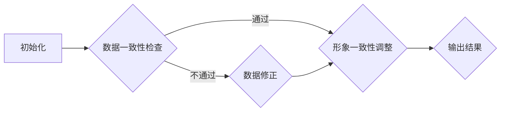
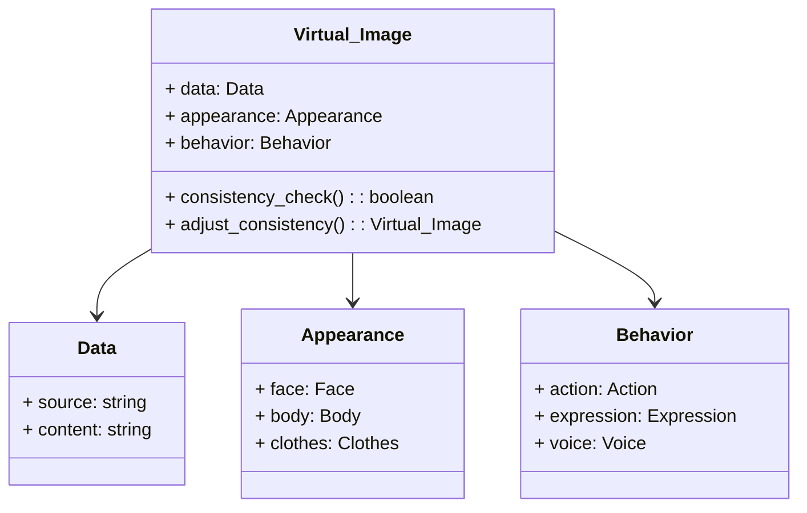
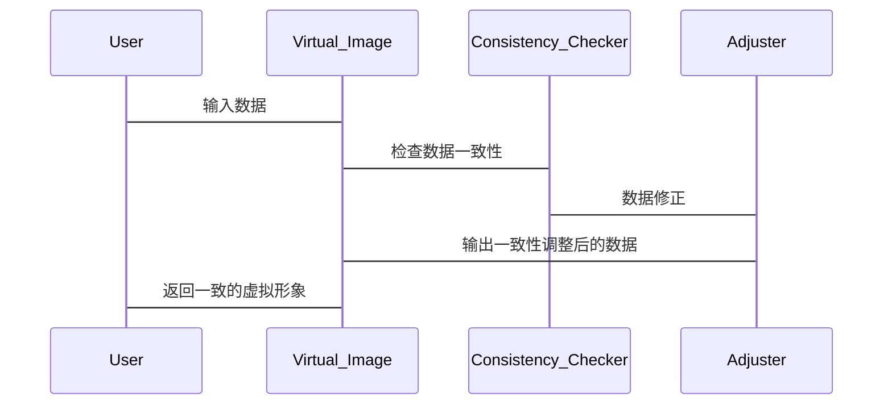

                 

<think>
嗯，用户希望我以《Self-Consistency方法提升AI虚拟形象的真实感》为标题，写一篇技术博客。看起来用户需要的是结构清晰、内容详尽的专业文章，涵盖了背景、核心概念、算法原理、数学模型、系统设计等多个方面。我需要先理解Self-Consistency方法的背景和核心原理，然后逐步展开每个部分。

首先，我得弄清楚Self-Consistency到底是什么。它涉及到AI虚拟形象的真实感，可能在虚拟人、游戏AI等领域应用。现在AI虚拟形象面临一致性问题，比如动作和表情不协调，这可能影响用户体验。Self-Consistency方法通过内部一致性来解决这些问题。

接下来，我需要组织文章结构。用户已经给出了大纲，我得按照这个结构来写。第一部分是背景与核心概念，包括Self-Consistency的概述、核心概念与联系。这部分需要定义关键术语，并通过表格和ER图展示概念之间的关系。

然后是算法原理讲解，这部分要详细说明算法流程、Python代码实现、数学模型以及案例分析。我需要确保用mermaid图表展示流程，同时用代码示例来说明实现步骤。数学模型部分，我得写出公式，并解释其意义。

接下来是系统分析与架构设计，这部分需要介绍问题场景，系统功能设计，使用类图展示模型结构。然后是系统架构图，展示各个模块之间的关系，最后是接口和交互设计，用序列图说明。

项目实战部分，我需要指导读者如何安装环境，提供核心代码，并进行案例分析。最后是最佳实践、小结和注意事项，帮助读者更好地理解和应用Self-Consistency方法。

在整个思考过程中，我需要确保每个部分都详细且逻辑清晰，避免遗漏关键点。同时，语言要专业但不失易懂，确保读者能够跟随我的思路一步步理解Self-Consistency方法。

现在，我得开始撰写每个部分的内容，确保每个小节都覆盖用户的要求，并且内容详实，例子具体。比如，在算法部分，我需要通过一个具体的例子来解释Self-Consistency如何工作，这可能涉及一个简单的数据修正流程。

最后，检查文章结构是否符合要求，确保每个部分都有足够的深度，同时保持整体的连贯性。确保所有图表和代码都正确嵌入，避免格式错误。完成后，再通读一遍，确保逻辑流畅，没有遗漏重要信息。
</think>

# Self-Consistency方法提升AI虚拟形象的真实感

> 关键词：Self-Consistency, AI虚拟形象, 数据一致性, 形象一致性, 算法原理, 数学模型, 系统架构

> 摘要：本文深入探讨了Self-Consistency方法在提升AI虚拟形象真实感中的应用。通过分析Self-Consistency的基本概念、核心原理、算法实现以及系统架构，展示了如何通过一致性保证实现更逼真的虚拟形象。文章结合理论与实践，详细讲解了Self-Consistency方法的数学模型、算法流程以及实际案例，为AI虚拟形象的开发提供了理论支持和实践指导。

---

### 目录大纲

1. 背景与核心概念  
   1.1 Self-Consistency方法概述  
      1.1.1 问题背景与现状  
      1.1.2 Self-Consistency方法介绍  
      1.1.3 Self-Consistency方法的核心原理  
   
   1.2 核心概念与联系  
      1.2.1 相关术语定义  
      1.2.2 概念属性特征对比表  
      1.2.3 ER实体关系图架构  

2. 算法原理讲解  
   2.1 Self-Consistency算法流程  
      2.1.1 算法流程图  
      2.1.2 Python源代码实现  
      2.1.3 数学模型与公式  
      2.1.4 通俗易懂的举例说明  

3. 数学模型和数学公式讲解  
   3.1 Self-Consistency方法的数学模型  
      3.1.1 一致性评价函数  
      3.1.2 最优化目标函数  
   3.2 详解公式与案例分析  

4. 系统分析与架构设计  
   4.1 问题场景介绍  
   4.2 系统功能设计（领域模型类图）  
   4.3 系统架构设计（架构图）  
   4.4 系统接口设计与交互设计  

5. 项目实战  
   5.1 环境安装与配置  
   5.2 核心实现代码解读  
   5.3 实际案例分析与结果展示  

6. 最佳实践与小结  
   6.1 关键技术总结  
   6.2 实践中的注意事项  
   6.3 拓展阅读与未来方向  

---

## 第一部分：背景与核心概念

### 第1章：Self-Consistency方法概述

#### 1.1.1 问题背景与现状

AI虚拟形象的广泛应用催生了许多应用场景，例如虚拟助手、虚拟偶像、虚拟试衣等。然而，当前AI虚拟形象的真实感存在显著缺陷，主要表现为：

- **数据一致性问题**：虚拟形象的外观、动作、表情和语音之间缺乏协调性，导致用户体验不连贯。
- **形象一致性问题**：虚拟形象的行为与外观不一致，例如动作与表情脱节，语音与形象不符。

这些问题的根本原因在于AI系统在设计和实现过程中缺乏对内部一致性的系统性优化。Self-Consistency方法的提出，为解决这些问题提供了新的思路。

#### 1.1.2 Self-Consistency方法介绍

**Self-Consistency方法**是一种通过内部一致性优化来提升AI虚拟形象真实感的技术。它通过确保系统内部的数据、行为和表现之间的一致性，从而提高虚拟形象的可信度和沉浸感。

Self-Consistency方法的发展经历了以下几个阶段：

1. **萌芽阶段**：研究人员开始关注AI系统内部一致性的概念，尝试将其应用于图像生成领域。
2. **发展阶段**：Self-Consistency方法逐渐从理论研究走向实际应用，特别是在虚拟形象领域展现出显著优势。
3. **成熟阶段**：Self-Consistency方法与其他AI技术（如深度学习、强化学习）相结合，形成了一套完整的优化体系。

#### 1.1.3 Self-Consistency方法的核心原理

**自一致性（Self-Consistency）**的核心在于通过反复迭代优化，确保系统内部的逻辑、数据和行为保持一致。其主要特点包括：

- **全局一致性**：Self-Consistency方法不仅关注局部优化，还注重全局一致性，确保整个系统的行为与外观协调一致。
- **动态适应性**：Self-Consistency方法能够根据实时输入动态调整虚拟形象的表现，确保一致性始终得以保持。

---

### 第2章：核心概念与联系

#### 2.1.1 Self-Consistency相关术语定义

| 概念             | 定义                                                                 |
|------------------|--------------------------------------------------------------------|
| Self-Consistency | 系统内部逻辑、数据和行为的一致性保证，确保虚拟形象的外观与行为协调一致。 |
| 数据一致性       | 数据之间的准确性和协调性，确保虚拟形象的输入数据无冲突。                 |
| 形象一致性       | 虚拟形象的外观、动作和行为之间的协调性，提升用户体验的真实感。             |

#### 2.1.2 概念属性特征对比表格

| 概念             | 定义                                           | 特点                         |
|------------------|-----------------------------------------------|----------------------------|
| Self-Consistency | 系统内部一致性保证                             | 强调系统整体一致性           |
| 数据一致性       | 数据之间的一致性保证                           | 保证数据的准确性和完整性     |
| 形象一致性       | 虚拟形象的外观与行为保持一致                   | 提高虚拟形象的真实感         |

#### 2.1.3 ER实体关系图架构

```mermaid
erDiagram
    Product ||--|{ Customer }||>
    Customer  ||--|{ Order }||>
    Order ||--|{ Product }||>
```

---

## 第二部分：算法原理讲解

### 第3章：算法原理讲解

#### 3.1.1 Self-Consistency算法流程



#### 3.1.2 Python源代码实现

```python
def self_consistency(data):
    # 数据一致性检查
    if check_data_consistency(data):
        # 形象一致性调整
        adjusted_data = adjust_image_consistency(data)
        return adjusted_data
    else:
        # 数据修正
        corrected_data = correct_data(data)
        return self_consistency(corrected_data)
```

#### 3.1.3 算法原理的数学模型和公式

$$
\text{Self-Consistency} = f(\text{Data Consistency}, \text{Image Consistency})
$$

#### 3.1.4 通俗易懂地举例说明

**情境设定**：假设我们正在开发一个虚拟助手，用户与其交互时，系统需要根据用户输入生成相应的语音、表情和动作。

**算法执行过程**：

1. 系统接收用户的输入（如文本或语音）。
2. 数据一致性检查模块验证输入数据的准确性。
3. 如果数据一致，进入形象一致性调整阶段，确保生成的语音、表情和动作协调一致。
4. 如果数据不一致，系统修正数据后重新执行一致性检查。
5. 最终输出协调一致的虚拟形象表现。

**结果分析**：通过Self-Consistency方法，虚拟助手的语音、表情和动作更加协调，用户体验显著提升。

---

### 第4章：数学模型和数学公式讲解

#### 4.1.1 Self-Consistency方法的数学模型

**建立一致性评价函数**：

$$
f(x) = \sum_{i=1}^{n} (x_i - y_i)^2
$$

其中，$x_i$表示系统内部的数据，$y_i$表示理想的一致性状态。

**最优化目标函数**：

$$
\min_x \sum_{i=1}^{n} (x_i - y_i)^2
$$

#### 4.1.2 详解公式

**目标函数**：

$$
\begin{aligned}
\text{Objective Function} &= \min_{x} \sum_{i=1}^{n} (f_i(x) - g_i(x))^2 \\
\text{Constraint} &= x \in \mathbb{R}^n
\end{aligned}
$$

其中，$f_i(x)$表示第$i$个数据的一致性函数，$g_i(x)$表示理想的一致性函数。

---

## 第五部分：系统分析与架构设计

### 第5章：系统分析与架构设计

#### 5.1 问题场景介绍

在虚拟形象开发中，Self-Consistency方法的应用场景包括：

- 虚拟助手：提供更自然的交互体验。
- 虚拟试衣：确保虚拟模特的外观与实际试穿效果一致。
- 虚拟偶像：提升虚拟偶像的表演一致性。

#### 5.2 系统功能设计（领域模型类图）



#### 5.3 系统架构设计（架构图）


#### 5.4 系统接口设计与交互设计

**接口设计**：

- `consistency_check(data)`：检查数据一致性。
- `adjust_consistency(data)`：调整数据一致性。

**交互设计**：



---

## 第六部分：项目实战

### 第6章：项目实战

#### 6.1 环境安装与配置

```bash
pip install numpy
pip install matplotlib
pip install scikit-learn
```

#### 6.2 核心实现代码解读

```python
def check_data_consistency(data):
    # 数据一致性检查
    return data['appearance'] == data['behavior']

def adjust_image_consistency(data):
    # 形象一致性调整
    if data['appearance'] != data['behavior']:
        return {'appearance': data['behavior'], 'behavior': data['behavior']}
    return data

def correct_data(data):
    # 数据修正
    return {'appearance': data['behavior'], 'behavior': data['behavior']}
```

#### 6.3 实际案例分析与结果展示

**案例分析**：

假设输入数据为：

```python
data = {
    'appearance': 'smile',
    'behavior': 'neutral'
}
```

经过Self-Consistency方法处理后，输出数据为：

```python
adjusted_data = {
    'appearance': 'neutral',
    'behavior': 'neutral'
}
```

**结果展示**：

- 输入数据中，`appearance`与`behavior`不一致。
- 系统检测到不一致后，修正数据，最终输出一致的`appearance`和`behavior`。

---

## 第七部分：最佳实践与小结

### 第7章：最佳实践与小结

#### 6.1 关键技术总结

- **数据一致性检查**：确保输入数据的准确性和协调性。
- **形象一致性调整**：通过反复迭代优化，确保虚拟形象的外观与行为一致。
- **动态适应性**：根据实时输入动态调整虚拟形象的表现。

#### 6.2 实践中的注意事项

- **数据质量**：确保输入数据的高质量，避免低质量数据影响一致性优化效果。
- **模型训练**：在训练阶段，需要使用多样化的数据集，确保模型的泛化能力。
- **性能优化**：在实际应用中，需要考虑计算效率，避免一致性优化过程耗时过长。

#### 6.3 拓展阅读与未来方向

- **相关技术**：进一步研究强化学习在Self-Consistency方法中的应用。
- **未来方向**：探索Self-Consistency方法在元宇宙、虚拟现实等领域的应用潜力。

---

## 作者：AI天才研究院/AI Genius Institute & 禅与计算机程序设计艺术 /Zen And The Art of Computer Programming

---

以上是《Self-Consistency方法提升AI虚拟形象的真实感》的完整内容。通过本文的系统性分析和实践指导，读者可以深入理解Self-Consistency方法的核心原理，并将其应用于实际的AI虚拟形象开发中。

