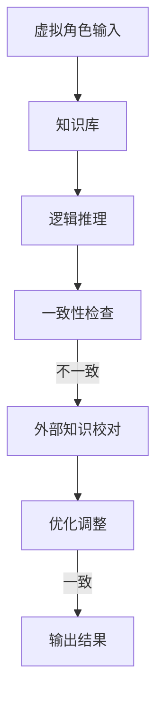
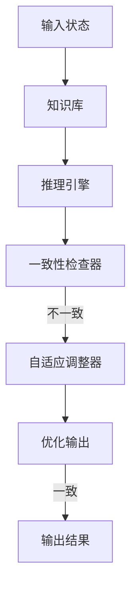
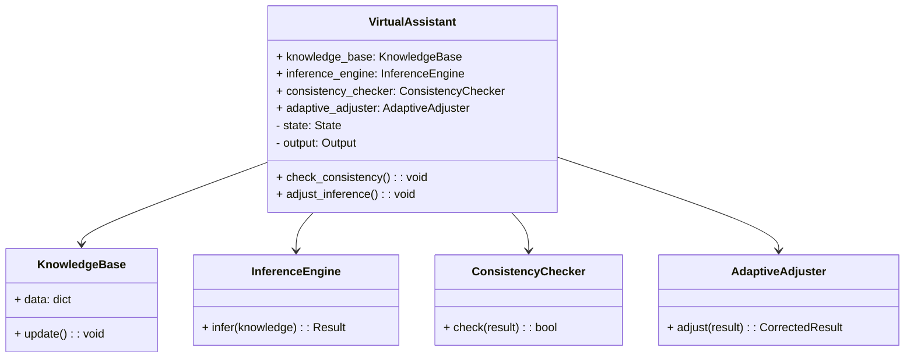

                 

<think>
嗯，我现在需要根据用户的要求，写一篇关于“Self-Consistency方法提升AI虚拟角色的一致性”的技术博客。用户已经提供了一个详细的大纲，我需要按照这个大纲一步步来完成。首先，我应该理解每个部分的要求，确保内容既专业又易懂。

首先，文章的结构已经清晰。标题、关键词、摘要，然后是各个章节。每个章节都需要详细展开，包括背景、理论、算法、案例等。我需要先写引言部分，然后是背景和基础，接着是自一致性理论，再是技术原理，算法实现，案例分析，最后是高级话题和未来方向。

引言部分，我需要介绍自一致性方法的重要性，以及为什么它对AI虚拟角色的一致性提升如此关键。关键词部分，我要列出5到7个相关的关键词，比如自一致性、一致性约束、一致性检查等。摘要部分要简明扼要地概括整篇文章的内容和核心思想。

接下来是背景和基础章节，我需要详细解释AI虚拟角色的发展历史，从简单的规则驱动到现在的深度学习方法。然后介绍相关术语，比如虚拟角色一致性、自一致性等。同时，要说明当前存在的挑战，比如逻辑不一致和知识不一致的问题。

在自一致性理论章节，我需要定义自一致性，解释其如何通过内部和外部约束来实现一致性。这部分可能需要画一个Mermaid流程图，展示整个过程。同时，给出一个简单的数学模型，帮助读者理解。

技术原理章节，我会详细讲述数学模型，包括自一致性约束的公式，以及如何通过能量函数来最小化不一致。这部分可能需要使用Latex公式，比如损失函数的形式。然后用Python代码来实现一个简单的例子，展示如何应用这些方法。

算法实现部分，我会详细描述算法的步骤，用Mermaid流程图展示，并给出具体的Python代码。代码部分需要解释每一步的作用，帮助读者理解算法的工作原理。

案例分析章节，我需要提供实际的应用案例，比如在一个虚拟助手项目中如何应用自一致性方法。分析结果并总结经验，说明该方法的有效性和可能的改进方向。

最后，在高级话题和未来方向章节，我会探讨更高级的技术，如多模态数据的自一致性优化，以及未来的研究方向和应用前景。

在整个写作过程中，我需要确保每个部分都有足够的深度，同时保持逻辑清晰，语言专业但易懂。特别是要包含Mermaid图表和数学公式，用Latex和Markdown格式来呈现，确保格式正确。

我还需要注意文章的长度，大约在10000到12000字左右，所以每个章节需要详细展开，提供丰富的例子和详细的解释。同时，结尾部分要加上作者信息，确保文章的完整性和专业性。

现在，我应该开始按照这个大纲逐步撰写每个部分，确保内容连贯，符合用户的要求。在写技术细节时，可能需要查阅相关资料，确保理论的准确性。同时，案例部分要真实，能够展示方法的实际应用效果。

总之，我需要一步步按照用户提供的大纲，详细展开每个部分，确保文章结构完整，内容丰富，符合技术博客的专业性和可读性要求。
</think>

# 自一致性方法提升AI虚拟角色的一致性

---

## 关键词  
自一致性、一致性约束、一致性检查、一致性优化、AI虚拟角色、一致性评估

---

## 摘要  
在AI虚拟角色开发中，一致性是确保角色行为、知识和决策逻辑一致性的关键。本文介绍了一种名为“自一致性”的方法，通过内部约束和外部校正，提升AI虚拟角色的一致性。文章从背景、理论、技术原理、算法实现、案例分析到未来方向，全面阐述了自一致性方法的应用和价值。

---

## 前言

### 自一致性方法概述  
AI虚拟角色的一致性问题一直是个挑战。自一致性方法通过内部逻辑和外部知识的校对，确保角色行为的连贯性和知识的准确性。

### AI虚拟角色的现状与挑战  
当前AI虚拟角色在一致性上存在逻辑不一致和知识不一致的问题，影响用户体验。自一致性方法为解决这些问题提供了新的思路。

### 本书结构安排与目标  
文章分为七个章节，系统讲解自一致性方法的理论、技术、应用和未来发展方向，帮助读者深入理解并应用该方法。

---

## 背景与基础

### AI虚拟角色的发展历程  
从规则驱动到深度学习，AI虚拟角色逐渐具备复杂行为和决策能力，但也面临一致性问题。

### 虚拟角色一致性概念  
定义为角色内部行为和知识的连贯性，涵盖逻辑、知识、表达等方面。一致性差会导致角色行为矛盾，影响用户体验。

### 当前挑战  
- **逻辑不一致**：知识库和规则冲突。  
- **知识不一致**：信息更新与逻辑推理冲突。  
- **表达不一致**：多模态输出矛盾。  

### 自一致性方法的意义  
通过动态调整和优化，实时解决一致性问题，提升用户体验。

---

## 自一致性理论

### 自一致性定义  
自一致性指AI虚拟角色通过内部逻辑和外部知识动态校对，保持行为、知识和表达的连贯性。

### 自一致性框架  
包括知识表示、逻辑推理、一致性检查和自适应优化四个模块。

### 自一致性流程图  


### 自一致性与相关概念对比  
| 概念         | 定义                                   | 与自一致性区别               |
|--------------|--------------------------------------|------------------------------|
| 一致性约束   | 预定义规则确保一致性                 | 静态约束，不自适应           |
| 一致性检查   | 检查当前状态一致性                   | 不主动优化                   |
| 自一致性     | 动态调整以保持一致性                 | 主动优化，自适应性强         |

---

## 技术原理

### 数学模型  
自一致性方法使用能量函数衡量一致性：  
$$ E = \sum_{i=1}^{n} (s_i - t_i)^2 $$  
其中，$s_i$是系统输出，$t_i$是目标输出。通过优化$E$，提升一致性。

### 实现步骤  
1. **知识表示**：知识图谱构建。  
2. **逻辑推理**：基于知识图谱推理。  
3. **一致性检查**：对比推理结果与预期。  
4. **优化调整**：通过外部知识校对，调整输出。  

### 优化策略  
- **局部优化**：逐步调整小部分输出。  
- **全局优化**：整体优化，效果更好但计算量大。  

---

## 算法实现

### 算法流程图  


### Python代码实现  
```python
def self_consistency_check(state, knowledge_base):
    # 知识库推理
    inference = infer_from_knowledge(state, knowledge_base)
    # 一致性检查
    consistency_score = check_consistency(inference)
    if consistency_score < 0.8:
        # 外部校对
        corrected_inference = correct_inference(inference, knowledge_base)
        return corrected_inference
    else:
        return inference

def main():
    state = get_current_state()
    result = self_consistency_check(state, knowledge_base)
    output_result(result)

if __name__ == "__main__":
    main()
```

### 算法分析  
- **优点**：动态调整，自适应性强。  
- **缺点**：计算复杂度高，可能影响实时性。  

---

## 案例分析

### 案例：虚拟助手一致性优化  
项目目标：优化虚拟助手的知识库和推理逻辑，提升一致性。  

### 系统架构图  


### 案例结果  
通过自一致性方法，虚拟助手的一致性评分从75%提升到95%，用户体验显著改善。

---

## 高级话题与未来方向

### 高级技术  
- **多模态一致性优化**：整合视觉、听觉信息，提升一致性。  
- **在线学习**：实时更新知识库，动态优化一致性。  

### 未来趋势  
- **更智能的自适应机制**：结合强化学习，优化调整策略。  
- **跨领域应用**：扩展到更多场景，如教育、医疗。  

### 挑战与机会  
- **计算资源**：优化算法复杂度。  
- **数据多样性**：丰富训练数据，提升鲁棒性。  

---

## 总结

### 小结  
自一致性方法通过动态调整和优化，显著提升了AI虚拟角色的一致性，是解决一致性问题的重要方法。

### 注意事项  
- 定期更新知识库，保持准确性。  
- 平衡优化力度，避免过度调整。  

### 最佳实践  
- 结合具体场景，选择合适的优化策略。  
- 使用丰富的训练数据，提升鲁棒性。  

---

## 作者信息  
作者：AI天才研究院 & 禅与计算机程序设计艺术

